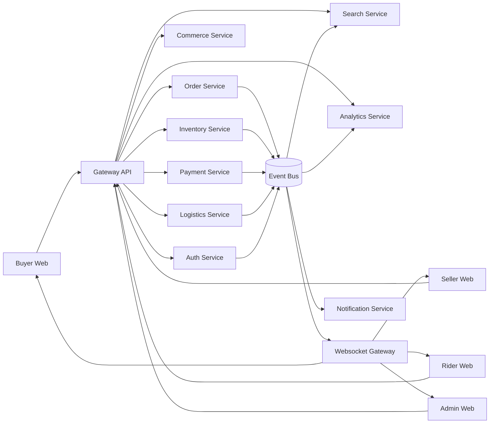
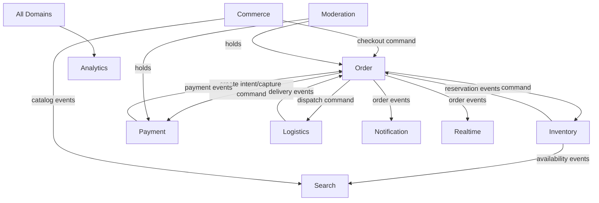
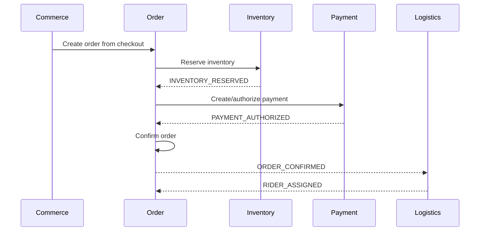
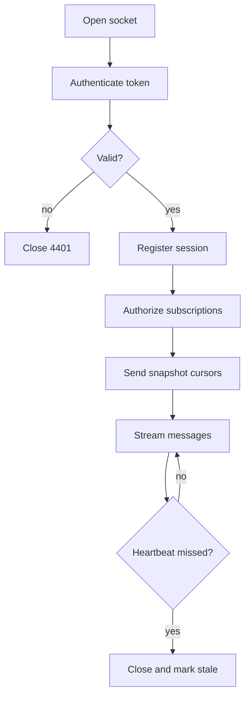
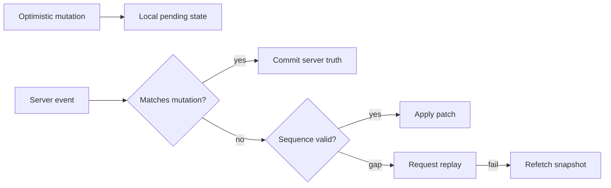
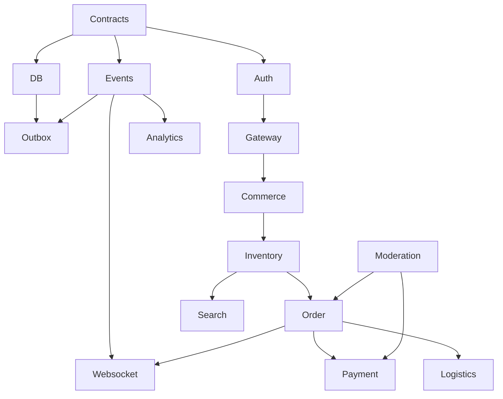

# VENDORHUB Phase 0 System Lock

Internal Architecture Handbook for the Founding Engineering Team

Status: locked baseline for implementation planning  
Scope: architecture, boundaries, contracts, operating model, engineering rules  
Non-goal: implementation code

---

## 0. Executive Lock

VENDORHUB is a realtime hyperlocal multi-vendor commerce orchestration platform. It is not a store builder, catalog website, or dashboard template. It is a distributed coordination system that synchronizes buyer demand, vendor capacity, inventory truth, payment authorization, rider availability, route progress, operational analytics, and trust signals across multiple actors under time pressure.

The primary architectural truth is:

```txt
VENDORHUB coordinates state transitions across independent operational domains.
```

Every system decision follows from that statement.

VENDORHUB must be built as a set of bounded domains with explicit ownership, contract-first APIs, evented state propagation, observable workflows, replayable operational history, and frontend clients that reconcile server truth with optimistic local state.

The platform will begin as a pragmatic modular monorepo with independently deployable backend services. Domains may initially share one Supabase PostgreSQL project for cost and velocity, but ownership remains service-level from day one. No service may directly mutate another service's tables. No frontend app may invent domain types outside shared contracts. No realtime message may exist without an event contract, sequence semantics, and reconciliation path.

---

## 1. Complete System Definition

### 1.1 What Is VENDORHUB?

VENDORHUB is a marketplace operating system for hyperlocal commerce. It connects buyers, vendors, riders, operators, payment rails, inventory systems, fraud workflows, analytics streams, and AI retrieval systems into one realtime coordination layer.

VENDORHUB exists to answer operational questions continuously:

- What can be sold right now, in this location, from this vendor, with this fulfillment promise?
- Which inventory is available, reserved, degraded, or being reconciled?
- Which order should move next, and which domain is currently blocking it?
- Which rider can fulfill the delivery with acceptable ETA, cost, trust, and load?
- Which payment state is financially authoritative?
- Which actor needs to be notified now?
- Which operational exceptions need human intervention?
- Which state must be propagated instantly to buyers, sellers, riders, and admins?

VENDORHUB is different from ecommerce clones because ecommerce clones treat commerce as CRUD over products, carts, and orders. VENDORHUB treats commerce as an operational graph of state machines, constraints, and compensating actions. A product is not merely a row. It is sellable only when vendor status, geofence, inventory, pricing, moderation, payment capability, delivery availability, and operational policy agree at the same time.

VENDORHUB behaves like orchestration infrastructure because its main value is not displaying products. Its value is coordinating distributed work:

- reserving stock without overselling
- capturing payment only when the order can proceed
- assigning riders under location and capacity constraints
- updating every participant as state changes
- recovering from failed payments, expired reservations, rider unavailability, vendor rejection, route exceptions, and fraud holds
- preserving auditability across every transition

### 1.2 Mission

VENDORHUB enables local commerce networks to operate with the responsiveness of realtime infrastructure and the governance of enterprise marketplace systems.

Mission commitments:

- Buyers see accurate availability, price, ETA, and order state.
- Vendors receive actionable demand with inventory and fulfillment clarity.
- Riders receive fair, timely, geographically coherent assignments.
- Operators see the marketplace as a living control surface, not after-the-fact reports.
- Finance teams can reconcile payments, refunds, fees, commissions, and payouts.
- Trust teams can intervene in suspicious behavior without breaking the entire flow.
- Engineering teams can evolve domains independently without drifting into duplicated logic.

### 1.3 Operational Identity

VENDORHUB is an operations-first platform. Its center of gravity is the lifecycle of an order, but the order lifecycle depends on inventory, payments, logistics, identity, trust, and analytics. The system must expose operational state clearly enough that humans can diagnose exceptions and automated workflows can recover safely.

Operational principles:

- Every meaningful transition is explicit.
- Every workflow has a current owner.
- Every irreversible action has an audit record.
- Every retryable action has idempotency.
- Every distributed workflow has a compensation path.
- Every realtime client can restore truth from snapshots and event replay.

### 1.4 Infrastructure Identity

VENDORHUB is infrastructure-like in these ways:

- It defines canonical domain events.
- It propagates state across actor-specific clients.
- It owns workflow orchestration.
- It provides reliable delivery semantics for realtime updates.
- It separates source-of-truth storage from cache and projection layers.
- It treats observability as product functionality.
- It supports future AI systems through clean event, search, and embedding pipelines.

### 1.5 Marketplace Positioning

VENDORHUB is positioned between consumer marketplace UX and operations infrastructure:

- Buyer-facing: fast local discovery, carting, checkout, tracking.
- Vendor-facing: live order workbench, catalog and stock operations, payout visibility.
- Rider-facing: dispatch, route execution, proof of delivery, earnings.
- Admin-facing: marketplace command center, moderation, analytics, incident handling.
- Infrastructure-facing: event backbone, realtime gateway, operational ledgers, search index, audit spine.

### 1.6 Hyperlocal Commerce Positioning

Hyperlocal commerce imposes constraints absent from standard ecommerce:

- Inventory changes rapidly and locally.
- Delivery feasibility changes minute by minute.
- Vendor serviceability depends on geography, time, load, staffing, and catalog.
- ETA is a living value, not static metadata.
- Order acceptance, picking, handoff, and delivery are tightly coupled.
- Small state errors create immediate user-visible failures.

VENDORHUB must model locality as first-class data:

- vendor geofence
- buyer address and H3 cell
- rider location stream
- service zones
- delivery radius
- travel-time estimates
- route assignment constraints
- fulfillment capacity by time window

### 1.7 Philosophies

Operational philosophy:

- Design for exceptions first. Happy paths must be simple, but the platform succeeds by recovering from messy reality.
- Humans and machines share the same state model. Admin screens must reveal state-machine truth, not invented labels.
- Prefer explicit lifecycle transitions over implicit field updates.

Realtime philosophy:

- Realtime is not decoration. Realtime is a consistency surface.
- Websocket messages are projections of domain events or operational commands.
- Clients must reconcile, not blindly trust local optimism.
- Every realtime stream needs sequence numbers, acknowledgments where appropriate, and snapshot recovery.

Systems philosophy:

- Own data by domain.
- Communicate across domains by APIs and events.
- Use transactions only inside a domain boundary.
- Use sagas for cross-domain workflows.
- Make failures observable, replayable, and idempotent.

UX philosophy:

- The UI must feel like a living operations layer.
- Users should understand what is happening, what is blocked, and what is next.
- Buyer UX hides infrastructure complexity while preserving trust.
- Seller, rider, and admin UX expose operational clarity and urgency.

Infrastructure philosophy:

- Start with managed infrastructure, but design boundaries as if scale will require independent services.
- Prefer boring durable systems for authoritative state.
- Use cache and streams for speed, not truth.
- Build observability before complexity.

### 1.8 Core Platform Responsibilities

VENDORHUB owns:

- identity, sessions, roles, permissions
- vendor onboarding and operational status
- catalog and pricing presentation
- inventory availability and reservation orchestration
- cart and checkout workflows
- order lifecycle orchestration
- payment authorization, capture, refund, settlement, payout coordination
- rider dispatch, routing, tracking, delivery proof
- notifications
- realtime state propagation
- search, indexing, recommendations
- analytics events, metrics, experiments
- moderation, fraud, trust, KYC
- audit logs and operational visibility

### 1.9 Platform Mental Model

```txt
Actors -> Commands -> Domain Services -> Transactions -> Outbox Events
       -> Event Bus -> Consumers -> Projections / Realtime / Analytics / Search
       -> Clients -> Reconciliation -> Further Commands
```

VENDORHUB is a state propagation loop with strict command ownership.

### 1.10 Ecosystem Topology



---

## 2. Complete DDD System Map

### 2.1 Bounded Contexts

Canonical bounded contexts:

| Context | Primary Ownership | Authoritative Data | External Interface |
|---|---|---|---|
| Identity | users, roles, sessions, permissions | identity DB schema | auth APIs, auth events |
| Vendor | vendors, outlets, serviceability | vendor DB schema | vendor APIs, vendor events |
| Commerce | product discovery, carts, checkout intent, pricing | commerce DB schema | catalog/cart APIs |
| Inventory | stock, reservations, reconciliation | inventory DB schema + Redis reservation cache | inventory APIs/events |
| Order | order orchestration and lifecycle | order DB schema | order APIs/events |
| Payment | transactions, refunds, settlements, payouts | payment DB schema | payment APIs/events |
| Logistics | dispatch, riders, routing, tracking | logistics DB schema + geo stores | logistics APIs/events |
| Notification | delivery of messages to users | notification DB schema | notification commands/events |
| Analytics | event capture, metrics, experiments | analytics warehouse/schema | analytics APIs/SDK |
| Search | indexing, ranking, embeddings | search schema + vector index | search APIs/events |
| Moderation | fraud, trust, KYC, reviews | moderation DB schema | moderation APIs/events |
| Realtime | websocket sessions, fanout, presence | websocket session store | websocket protocol |
| Audit | immutable operational history | audit schema | append-only audit events |

### 2.2 Separation Rules

- A context owns its tables, migrations, invariants, state machines, events, and validation schemas.
- Other contexts may read public projections or call APIs, but may not directly write owned tables.
- Cross-context workflows use commands plus events.
- Cross-context read models are projections, not ownership transfers.
- Shared packages hold contracts and primitives, not business workflows.

### 2.3 Anti-Corruption Layers

Every integration with an external provider or another bounded context requires an adapter:

- Payment provider adapter normalizes gateway-specific statuses into VENDORHUB payment states.
- Maps/routing adapter normalizes provider distance, ETA, and route polyline formats.
- KYC adapter maps vendor/rider verification statuses to moderation states.
- Search indexing adapter transforms domain events into index documents.
- Analytics adapter transforms domain events into analytics facts.

No provider-specific enum may leak into core domain models.

### 2.4 Commerce Domain

Ownership:

- buyer-facing product browsing
- cart lifecycle
- checkout intent
- pricing calculation
- promotion application
- sellability projection

Entities:

- Product
- ProductVariant
- Category
- Cart
- CartItem
- CheckoutSession
- PriceQuote
- Promotion

Responsibilities:

- expose product and vendor catalog views
- validate cart item eligibility
- calculate price quote from product, variant, vendor, fee, promotion, and delivery estimates
- initiate checkout command to Order domain
- maintain buyer cart state

Transactional boundary:

- Cart changes are local Commerce transactions.
- Checkout creates immutable checkout intent and calls Order service.
- Inventory reservation and payment authorization are not Commerce transactions.

Events published:

- CART_CREATED
- CART_ITEM_ADDED
- CART_ITEM_UPDATED
- CART_ITEM_REMOVED
- CART_ABANDONED
- CHECKOUT_STARTED
- PRICE_QUOTE_CREATED
- CHECKOUT_SUBMITTED

Events consumed:

- PRODUCT_PUBLISHED
- PRODUCT_UNPUBLISHED
- INVENTORY_AVAILABILITY_CHANGED
- VENDOR_SERVICEABILITY_CHANGED
- PROMOTION_UPDATED

Consistency:

- Cart may be eventually consistent with inventory.
- Checkout must revalidate inventory, price, serviceability, and vendor status.

Scaling:

- read-heavy catalog APIs cached at edge where possible
- cart APIs require user/session affinity but can scale horizontally
- price quotes cacheable for short TTL with versioned dependencies

### 2.5 Inventory Domain

Ownership:

- physical stock
- available-to-sell calculations
- reservations
- reservation expiry
- stock reconciliation
- low-stock alerts

Entities:

- StockItem
- InventoryLot
- InventoryReservation
- StockMovement
- ReconciliationRun
- InventorySnapshot

Responsibilities:

- maintain authoritative stock ledger in PostgreSQL
- maintain fast reservation state in Redis
- enforce no oversell invariant
- reserve inventory during checkout/order creation
- commit reservations after payment/order acceptance
- release expired or failed reservations
- publish availability changes

Transactional boundary:

- Stock ledger mutation and outbox event are one local transaction.
- Redis reservation lock is coordinated with Postgres using idempotent reservation ids.

Events published:

- INVENTORY_ADJUSTED
- INVENTORY_RESERVED
- INVENTORY_RESERVATION_FAILED
- INVENTORY_RESERVATION_EXPIRED
- INVENTORY_RELEASED
- INVENTORY_COMMITTED
- INVENTORY_LOW_STOCK_DETECTED
- INVENTORY_RECONCILIATION_STARTED
- INVENTORY_RECONCILIATION_COMPLETED

Events consumed:

- CHECKOUT_SUBMITTED
- ORDER_CANCELLED
- PAYMENT_FAILED
- ORDER_CONFIRMED
- VENDOR_CLOSED

Consistency:

- Reservation path requires strong local consistency per SKU/vendor/location.
- Catalog availability projections are eventually consistent.
- Reconciliation corrects drift and emits compensating events.

Scaling:

- shard hot inventory keys by vendor_id + variant_id
- use Redis Lua scripts for atomic reservation counters
- partition stock movements by month/vendor

### 2.6 Order Domain

Ownership:

- order aggregate
- order lifecycle state machine
- order orchestration saga
- order item state
- cancellation rules
- customer-visible order status

Entities:

- Order
- OrderItem
- OrderTimelineEntry
- OrderSaga
- OrderException

Responsibilities:

- coordinate inventory, payment, vendor acceptance, dispatch, delivery, cancellation, refund triggers
- expose order status to all roles
- own order state transitions
- publish canonical order events

Transactional boundary:

- Order state transition plus outbox append is one local transaction.
- Payment, inventory, and logistics transitions are external effects coordinated by saga.

Events published:

- ORDER_CREATED
- ORDER_VALIDATION_FAILED
- ORDER_PENDING_PAYMENT
- ORDER_CONFIRMED
- ORDER_ACCEPTED_BY_VENDOR
- ORDER_REJECTED_BY_VENDOR
- ORDER_PREPARING
- ORDER_READY_FOR_PICKUP
- ORDER_CANCEL_REQUESTED
- ORDER_CANCELLED
- ORDER_EXPIRED
- ORDER_DELIVERED
- ORDER_COMPLETED
- ORDER_FAILED

Events consumed:

- INVENTORY_RESERVED
- INVENTORY_RESERVATION_FAILED
- PAYMENT_AUTHORIZED
- PAYMENT_CAPTURED
- PAYMENT_FAILED
- RIDER_ASSIGNED
- DELIVERY_STARTED
- DELIVERY_COMPLETED
- REFUND_COMPLETED

Consistency:

- Order aggregate is strongly consistent inside order DB.
- Cross-domain workflow is eventual and saga-driven.

Scaling:

- order writes are moderate but critical
- order reads are high for tracking and dashboards
- use projections for role-specific order views

### 2.7 Payment Domain

Ownership:

- payment intents
- authorizations
- captures
- refunds
- reversals
- marketplace fees
- settlements
- payouts
- financial ledger

Entities:

- PaymentIntent
- Transaction
- LedgerEntry
- Refund
- Payout
- SettlementBatch
- PaymentProviderEvent

Responsibilities:

- integrate payment provider
- maintain idempotent payment commands
- record immutable financial ledger
- manage split payout calculation
- coordinate refunds and reversals
- publish financially authoritative events

Transactional boundary:

- Ledger entries are append-only and local to Payment.
- Provider webhooks are deduplicated by provider event id.
- Order never directly mutates payment status.

Events published:

- PAYMENT_INTENT_CREATED
- PAYMENT_AUTHORIZED
- PAYMENT_AUTHORIZATION_FAILED
- PAYMENT_CAPTURED
- PAYMENT_CAPTURE_FAILED
- PAYMENT_FAILED
- REFUND_INITIATED
- REFUND_COMPLETED
- REFUND_FAILED
- PAYOUT_SCHEDULED
- PAYOUT_PROCESSING
- PAYOUT_COMPLETED
- PAYOUT_FAILED
- SETTLEMENT_CLOSED

Events consumed:

- ORDER_CREATED
- ORDER_CONFIRMED
- ORDER_CANCELLED
- ORDER_DELIVERED
- VENDOR_KYC_APPROVED
- FRAUD_HOLD_PLACED

Consistency:

- Financial ledger must be strongly consistent.
- Provider state and internal state reconcile through webhook + polling.
- Payout projections are eventually consistent but ledger is authoritative.

Scaling:

- write volume tied to order volume
- webhook ingestion must be horizontally scalable and idempotent
- ledger partition by settlement period

### 2.8 Logistics Domain

Ownership:

- rider profile and availability
- dispatch assignment
- route planning
- delivery lifecycle
- tracking stream
- proof of delivery
- geospatial serviceability

Entities:

- Rider
- RiderShift
- Delivery
- DispatchAssignment
- DeliveryRoute
- TrackingPoint
- ServiceZone
- ProofOfDelivery

Responsibilities:

- decide eligible riders
- assign rider to order
- compute ETA and route
- process rider location updates
- track pickup and dropoff states
- publish ETA changes

Transactional boundary:

- Assignment decision and delivery state transition are local Logistics transactions.
- Order consumes logistics events but does not own delivery internals.

Events published:

- RIDER_AVAILABLE
- RIDER_UNAVAILABLE
- DISPATCH_REQUESTED
- RIDER_ASSIGNMENT_OFFERED
- RIDER_ASSIGNED
- RIDER_ASSIGNMENT_DECLINED
- DELIVERY_ROUTE_CREATED
- DELIVERY_STARTED
- RIDER_LOCATION_UPDATED
- ETA_UPDATED
- PICKUP_COMPLETED
- DELIVERY_COMPLETED
- DELIVERY_FAILED

Events consumed:

- ORDER_CONFIRMED
- ORDER_READY_FOR_PICKUP
- ORDER_CANCELLED
- VENDOR_SERVICEABILITY_CHANGED

Consistency:

- Rider location is high-volume eventual stream.
- Assignment must prevent double-assigning capacity through locks or versioned rider availability.

Scaling:

- location ingest must be partitioned by region/H3 cell
- dispatch queries require PostGIS + H3 indexing
- hot operational projections cached in Redis

### 2.9 Identity Domain

Ownership:

- users
- auth credentials delegation
- role assignments
- sessions
- permissions
- organization membership

Entities:

- User
- Role
- Permission
- Session
- VendorMembership
- AdminMembership
- RiderAccount

Events published:

- USER_REGISTERED
- USER_LOGIN_SUCCEEDED
- USER_LOGIN_FAILED
- SESSION_REVOKED
- ROLE_ASSIGNED
- ROLE_REVOKED
- PERMISSION_CHANGED

Consistency:

- auth checks require strong session validation
- permission changes must invalidate caches immediately

### 2.10 Analytics Domain

Ownership:

- product analytics events
- operational metrics
- funnels
- experiments
- derived KPIs

Events consumed:

- all public domain events
- client analytics events

Events published:

- EXPERIMENT_ASSIGNED
- KPI_THRESHOLD_BREACHED
- OPERATIONAL_ANOMALY_DETECTED

Consistency:

- analytics is eventual, append-only, and replayable
- operational alerts may require near-realtime stream processing

### 2.11 Search Domain

Ownership:

- text index
- semantic index
- ranking signals
- embeddings
- query logs
- retrieval APIs

Entities:

- SearchDocument
- EmbeddingRecord
- SearchQueryLog
- RankingSignal

Events consumed:

- PRODUCT_PUBLISHED
- PRODUCT_UPDATED
- PRODUCT_UNPUBLISHED
- INVENTORY_AVAILABILITY_CHANGED
- VENDOR_SERVICEABILITY_CHANGED
- ORDER_COMPLETED
- SEARCH_QUERY_RECORDED

Events published:

- SEARCH_INDEX_UPDATED
- SEARCH_INDEX_FAILED
- EMBEDDING_CREATED
- EMBEDDING_REFRESH_REQUIRED

Consistency:

- search is eventually consistent
- checkout never trusts search availability without Commerce/Inventory validation

### 2.12 Moderation Domain

Ownership:

- fraud holds
- KYC workflows
- vendor/rider trust
- review moderation
- risk decisions

Entities:

- KycCase
- FraudSignal
- TrustScore
- ModerationCase
- ReviewModeration
- RiskHold

Events published:

- KYC_SUBMITTED
- KYC_APPROVED
- KYC_REJECTED
- FRAUD_SIGNAL_DETECTED
- FRAUD_HOLD_PLACED
- FRAUD_HOLD_RELEASED
- REVIEW_FLAGGED
- REVIEW_APPROVED
- REVIEW_REJECTED

Consistency:

- holds must propagate quickly to payment/order/vendor workflows
- trust scoring can be eventual

### 2.13 Domain Interaction Diagram



---

## 3. Final Monorepo and Package Architecture

### 3.1 Technology Lock

- Package manager: pnpm
- Build orchestrator: Turborepo
- Language: TypeScript strict mode
- Frontend: Next.js 15+, React Server Components, Partial Prerendering, Tailwind, shadcn/ui, Framer Motion
- Backend: Node.js TypeScript services
- Validation: Zod
- API contracts: OpenAPI for REST, AsyncAPI-style schemas for events/websocket messages
- Database: PostgreSQL/Supabase, Redis Cloud, pgvector, PostGIS, H3 indexing
- Observability: OpenTelemetry, structured logs, metrics, traces

### 3.2 Repository Structure

```txt
VENDORHUB/
  apps/
    buyer-web/
    seller-web/
    admin-web/
    rider-web/
    gateway-api/
    auth-service/
    commerce-service/
    order-service/
    inventory-service/
    payment-service/
    logistics-service/
    analytics-service/
    notification-service/
    search-service/
    moderation-service/
    websocket-gateway/
  packages/
    ui/
    design-tokens/
    motion/
    types/
    validation/
    auth/
    api-contracts/
    event-contracts/
    websocket-contracts/
    analytics-sdk/
    config/
    logger/
    observability/
    db/
    errors/
    test-utils/
  infra/
    vercel/
    railway/
    supabase/
    redis/
    cloudflare/
    otel/
  scripts/
    codegen/
    migrations/
    seed/
    verify-boundaries/
    replay-events/
  tooling/
    eslint/
    prettier/
    tsconfig/
    tailwind/
    generators/
  docs/
    architecture/
    api/
    events/
    realtime/
    runbooks/
    adr/
```

### 3.3 Dependency Rules

- Apps may import packages.
- Packages may not import apps.
- Domain services may import shared contracts, validation, config, logger, observability, errors, and db helpers.
- Services may not import another service's source.
- Frontend apps may not import backend service internals.
- Shared packages may not contain hidden domain workflows.
- Event contracts are append-only compatible after public release.
- UI packages may depend on design tokens and motion, but not domain services.
- API contracts may depend on validation schemas, but runtime services own implementation.

### 3.4 Apps

buyer-web:

- buyer discovery, cart, checkout, order tracking, profile
- consumes catalog, cart, checkout, order, payment, logistics realtime
- owns buyer route composition only
- no direct DB access

seller-web:

- vendor order queue, catalog management, stock adjustments, payout views, operating hours
- consumes order, inventory, payout, moderation realtime
- no payment ledger mutation

admin-web:

- operations command center, fraud queue, moderation, analytics, incidents, audit viewer
- consumes all operational projections
- privileged APIs only through gateway

rider-web:

- rider onboarding, shift, assignment offers, navigation, proof of delivery, earnings
- consumes logistics dispatch and route realtime
- location publishing through logistics/websocket protocols

gateway-api:

- public API facade
- auth enforcement
- request routing
- rate limiting
- response shaping
- BFF endpoints where composition is needed
- never owns domain state beyond request logs

auth-service:

- users, roles, permissions, sessions
- publishes identity events
- owns permission cache invalidation

commerce-service:

- products, catalog views, carts, checkout sessions, pricing
- owns cart and checkout intent APIs

order-service:

- order aggregate, state machine, saga orchestration
- owns order lifecycle APIs and events

inventory-service:

- stock ledger, reservations, reconciliation, availability projections
- owns inventory APIs and reservation events

payment-service:

- payment intents, transactions, refunds, payouts, ledger
- owns payment provider integration and financial events

logistics-service:

- rider availability, dispatch, routing, deliveries, tracking stream
- owns geospatial dispatch APIs and logistics events

analytics-service:

- event ingestion, metrics, experiments, dashboards data
- owns analytics schemas and derived metrics

notification-service:

- email, SMS, push, in-app notification jobs
- consumes domain events and sends messages

search-service:

- keyword search, vector search, indexing, ranking
- owns pgvector embeddings and search projections

moderation-service:

- KYC, fraud, trust, review moderation
- owns risk holds and moderation workflows

websocket-gateway:

- websocket auth
- connection/session registry
- topic subscriptions
- event fanout
- client acks
- missed event replay from Redis Streams/event store projections

### 3.5 Shared Packages

packages/ui:

- shadcn-based primitives and VENDORHUB-specific composed components
- no domain fetching
- accepts data via props

packages/design-tokens:

- colors, spacing, typography, radii, shadows, z-index, breakpoints
- source for Tailwind config and CSS variables

packages/motion:

- motion durations, easing, transition recipes, realtime-feed animations

packages/types:

- pure TypeScript shared structural types
- no runtime logic

packages/validation:

- Zod schemas used by APIs, forms, events, and tests

packages/auth:

- auth client helpers, permission predicates, role constants
- no UI-specific behavior

packages/api-contracts:

- endpoint definitions, request/response schemas, error schemas

packages/event-contracts:

- canonical event envelope and domain event schemas

packages/websocket-contracts:

- client/server message schemas, topic naming, ack payloads

packages/analytics-sdk:

- frontend and backend analytics capture helpers

packages/config:

- env parsing and config normalization

packages/logger:

- structured logger with correlation ids

packages/observability:

- OpenTelemetry initialization, trace helpers, metric names

packages/db:

- database connection utilities, transaction helpers, outbox helpers
- no domain table ownership

packages/errors:

- common error classes and error serialization

### 3.6 AI-Generated Code Governance

AI-generated code must:

- import contracts from packages instead of recreating types
- use existing components before creating new ones
- add events only in event-contracts first
- add schemas before endpoints
- respect service ownership
- include idempotency for commands that mutate distributed workflows
- include tests for state transitions and event publishing
- never bypass gateway auth patterns

---

## 4. Complete Event-Driven Architecture

### 4.1 Event Backbone

VENDORHUB uses events for cross-domain propagation and operational observability. The initial managed implementation can use PostgreSQL transactional outbox plus worker dispatch into Redis Streams. Future evolution can replace or augment Redis Streams with Kafka/NATS without changing event contracts.

Authoritative event write path:

```txt
Domain transaction -> outbox row -> outbox dispatcher -> stream/topic -> consumers -> inbox table -> handler -> projection/side effect
```

### 4.2 Event Envelope

```ts
type DomainEventEnvelope<T> = {
  eventId: string;
  eventType: string;
  eventVersion: number;
  occurredAt: string;
  producer: string;
  aggregateType: string;
  aggregateId: string;
  tenantId?: string;
  vendorId?: string;
  regionId?: string;
  correlationId: string;
  causationId?: string;
  idempotencyKey?: string;
  sequence: number;
  traceId?: string;
  payload: T;
};
```

Required metadata:

- eventId: globally unique
- eventType: uppercase snake case
- eventVersion: integer
- correlationId: workflow-level id
- causationId: triggering command/event id
- aggregateId: ordering key
- sequence: monotonically increasing per aggregate where ordering matters

### 4.3 Topic Strategy

```txt
domain.identity
domain.vendor
domain.commerce
domain.inventory
domain.order
domain.payment
domain.logistics
domain.moderation
domain.search
domain.analytics
realtime.fanout
notifications.commands
deadletter.<domain>
```

Partitioning:

- order events by order_id
- inventory events by vendor_id + variant_id
- logistics location events by region_id/H3 cell
- payment events by payment_intent_id or transaction_id

### 4.4 Retry Strategy

Default consumer retry:

- attempt 1 immediately
- attempt 2 after 10 seconds
- attempt 3 after 60 seconds
- attempt 4 after 5 minutes
- attempt 5 after 30 minutes
- then dead-letter

Provider-facing retries:

- exponential backoff with jitter
- idempotency key required
- circuit breaker for provider outage

Realtime fanout retries:

- websocket delivery is best effort with ack for critical messages
- missed messages recovered by replay cursor
- no infinite per-socket retry loop

### 4.5 Idempotency and Inbox

Every consumer has an inbox table:

```txt
consumer_name
event_id
event_type
aggregate_id
processed_at
handler_version
status
error
```

Handler rule:

- check inbox before side effect
- process inside local transaction where possible
- write inbox success only after side effect commits
- idempotent external calls use deterministic idempotency keys

### 4.6 Core Event Catalog

Identity events:

| Event | Producer | Consumers | Payload |
|---|---|---|---|
| USER_REGISTERED | auth-service | analytics, notification, moderation | userId, emailHash, roles, occurredAt |
| USER_LOGIN_SUCCEEDED | auth-service | analytics, audit | userId, sessionId, ipHash, deviceId |
| USER_LOGIN_FAILED | auth-service | analytics, moderation | emailHash, ipHash, reason |
| SESSION_REVOKED | auth-service | websocket, gateway | userId, sessionId, reason |
| ROLE_ASSIGNED | auth-service | gateway, websocket, audit | userId, role, scope |
| ROLE_REVOKED | auth-service | gateway, websocket, audit | userId, role, scope |

Vendor and catalog events:

| Event | Producer | Consumers | Payload |
|---|---|---|---|
| VENDOR_CREATED | commerce/vendor | search, analytics, moderation | vendorId, ownerId, regionId |
| VENDOR_OPENED | vendor-service | commerce, logistics, websocket | vendorId, serviceZones |
| VENDOR_CLOSED | vendor-service | commerce, inventory, order, websocket | vendorId, reason |
| PRODUCT_CREATED | commerce-service | search, analytics | productId, vendorId |
| PRODUCT_PUBLISHED | commerce-service | search, websocket | productId, vendorId, categoryIds |
| PRODUCT_UPDATED | commerce-service | search, websocket | productId, changedFields |
| PRODUCT_UNPUBLISHED | commerce-service | search, websocket | productId, reason |
| PRICE_CHANGED | commerce-service | search, websocket, analytics | productId, variantId, price, version |

Cart and checkout events:

| Event | Producer | Consumers | Payload |
|---|---|---|---|
| CART_CREATED | commerce-service | analytics | cartId, buyerId |
| CART_ITEM_ADDED | commerce-service | analytics | cartId, variantId, quantity |
| CART_ITEM_UPDATED | commerce-service | analytics | cartId, cartItemId, quantity |
| CART_ABANDONED | commerce-service | analytics, notification | cartId, buyerId |
| CHECKOUT_STARTED | commerce-service | analytics | checkoutSessionId, cartId |
| CHECKOUT_SUBMITTED | commerce-service | order-service, analytics | checkoutSessionId, buyerId, cartId, quoteId |

Inventory events:

| Event | Producer | Consumers | Payload |
|---|---|---|---|
| INVENTORY_ADJUSTED | inventory-service | commerce, search, analytics, websocket | vendorId, variantId, delta, reason, stockVersion |
| INVENTORY_RESERVED | inventory-service | order-service, websocket | reservationId, orderId, items, expiresAt |
| INVENTORY_RESERVATION_FAILED | inventory-service | order-service, analytics | orderId, failedItems, reason |
| INVENTORY_RESERVATION_EXPIRED | inventory-service | order-service, commerce | reservationId, orderId |
| INVENTORY_RELEASED | inventory-service | commerce, search, websocket | reservationId, items |
| INVENTORY_COMMITTED | inventory-service | order-service, analytics | reservationId, orderId, items |
| INVENTORY_LOW_STOCK_DETECTED | inventory-service | seller-web, notification | vendorId, variantId, availableQty |
| INVENTORY_RECONCILIATION_COMPLETED | inventory-service | admin-web, analytics | runId, deltas, status |

Order events:

| Event | Producer | Consumers | Payload |
|---|---|---|---|
| ORDER_CREATED | order-service | payment, inventory, analytics, websocket | orderId, buyerId, vendorId, items, totals |
| ORDER_PENDING_PAYMENT | order-service | payment, websocket | orderId, paymentIntentId |
| ORDER_CONFIRMED | order-service | inventory, logistics, seller-web, notification | orderId, vendorId, confirmedAt |
| ORDER_ACCEPTED_BY_VENDOR | order-service | buyer, logistics, analytics | orderId, vendorId, prepEta |
| ORDER_REJECTED_BY_VENDOR | order-service | inventory, payment, buyer | orderId, reason |
| ORDER_PREPARING | order-service | buyer, logistics | orderId, prepStartedAt |
| ORDER_READY_FOR_PICKUP | order-service | logistics, buyer, rider | orderId, pickupWindow |
| ORDER_CANCEL_REQUESTED | order-service | payment, inventory, logistics | orderId, requestedBy, reason |
| ORDER_CANCELLED | order-service | payment, inventory, logistics, notification | orderId, reason, compensationRequired |
| ORDER_DELIVERED | order-service | payment, analytics, buyer, seller | orderId, deliveredAt |
| ORDER_COMPLETED | order-service | payment, analytics, search | orderId, completedAt |
| ORDER_FAILED | order-service | admin, analytics, payment, inventory | orderId, failureReason |

Payment events:

| Event | Producer | Consumers | Payload |
|---|---|---|---|
| PAYMENT_INTENT_CREATED | payment-service | order-service, buyer-web | paymentIntentId, orderId, amount |
| PAYMENT_AUTHORIZED | payment-service | order-service, analytics | paymentIntentId, orderId, amount |
| PAYMENT_AUTHORIZATION_FAILED | payment-service | order-service, buyer-web | orderId, reason |
| PAYMENT_CAPTURED | payment-service | order-service, analytics | transactionId, orderId, amount |
| PAYMENT_CAPTURE_FAILED | payment-service | order-service, admin-web | orderId, reason, retryable |
| REFUND_INITIATED | payment-service | order-service, buyer-web | refundId, orderId, amount |
| REFUND_COMPLETED | payment-service | order-service, analytics | refundId, orderId, amount |
| PAYOUT_SCHEDULED | payment-service | seller-web, analytics | payoutId, vendorId, amount |
| PAYOUT_COMPLETED | payment-service | seller-web, analytics | payoutId, vendorId, amount |
| SETTLEMENT_CLOSED | payment-service | admin-web, analytics | settlementId, periodStart, periodEnd |

Logistics events:

| Event | Producer | Consumers | Payload |
|---|---|---|---|
| DISPATCH_REQUESTED | logistics-service | analytics, admin-web | orderId, pickup, dropoff |
| RIDER_ASSIGNMENT_OFFERED | logistics-service | rider-web | assignmentId, riderId, orderId, expiresAt |
| RIDER_ASSIGNED | logistics-service | order-service, buyer-web, seller-web | orderId, riderId, eta |
| RIDER_ASSIGNMENT_DECLINED | logistics-service | analytics, admin-web | assignmentId, riderId, reason |
| DELIVERY_ROUTE_CREATED | logistics-service | rider-web, buyer-web | deliveryId, routeId, eta |
| DELIVERY_STARTED | logistics-service | order-service, buyer-web | deliveryId, orderId, startedAt |
| RIDER_LOCATION_UPDATED | logistics-service | buyer-web, admin-web | riderId, deliveryId, lat, lng, h3, recordedAt |
| ETA_UPDATED | logistics-service | buyer-web, seller-web, admin-web | orderId, eta, confidence |
| PICKUP_COMPLETED | logistics-service | order-service, buyer-web | deliveryId, orderId, pickedUpAt |
| DELIVERY_COMPLETED | logistics-service | order-service, payment-service | deliveryId, orderId, proofId |
| DELIVERY_FAILED | logistics-service | order-service, admin-web | deliveryId, orderId, reason |

Moderation events:

| Event | Producer | Consumers | Payload |
|---|---|---|---|
| KYC_SUBMITTED | moderation-service | admin-web, analytics | caseId, subjectType, subjectId |
| KYC_APPROVED | moderation-service | payment, vendor, logistics | subjectType, subjectId, approvedAt |
| KYC_REJECTED | moderation-service | vendor, logistics, notification | subjectType, subjectId, reason |
| FRAUD_SIGNAL_DETECTED | moderation-service | admin-web, analytics | signalId, subjectId, score |
| FRAUD_HOLD_PLACED | moderation-service | order, payment, websocket | holdId, subjectType, subjectId, reason |
| FRAUD_HOLD_RELEASED | moderation-service | order, payment, websocket | holdId, subjectType, subjectId |

### 4.7 Ordering Guarantees

- Order aggregate events must be processed in sequence per order_id.
- Payment transaction events must be processed in sequence per payment_intent_id.
- Inventory stock events must be ordered per vendor_id + variant_id.
- Rider location updates are ordered per rider_id but clients may drop stale coordinates.
- Analytics does not require strict ordering except session reconstruction.

### 4.8 Saga Orchestration

Order creation saga:



Compensations:

- inventory reservation fails -> order failed -> payment not created
- payment authorization fails -> release inventory -> order failed
- vendor rejects -> release inventory -> void authorization/refund -> order cancelled
- delivery fails after capture -> create operational exception -> refund decision workflow

### 4.9 Replay Strategy

- Outbox events are retained for at least 90 days in operational DB and archived to object storage.
- Consumers store last processed cursor.
- Replays run through versioned handlers.
- Replays can target projections, analytics, search, or websocket missed-event stores.
- Financial events are never replayed into provider side effects without dry-run guard.

---

## 5. Complete Realtime Synchronization Architecture

### 5.1 Realtime Principle

Websocket messages are client-facing projections of authoritative domain state. A websocket message may notify, patch, invalidate, or command client reconciliation. It must not be the only place where state exists.

### 5.2 Transport Choice

Websocket:

- primary for bidirectional updates, rider location, assignment acks, live operations

SSE:

- acceptable future option for read-only admin dashboards or public tracking pages

Polling:

- fallback for degraded clients and recovery

### 5.3 Websocket Gateway Topology

```txt
Client -> Cloudflare -> websocket-gateway instances -> Redis pub/sub/streams
                                          -> session registry
                                          -> auth/session validator
                                          -> event replay store
```

The websocket gateway owns:

- connection authentication
- connection lifecycle
- topic authorization
- fanout subscriptions
- heartbeat
- client ack tracking
- missed event cursor handling
- presence

It does not own domain state.

### 5.4 Topic Naming

```txt
user:{userId}
buyer:{buyerId}:orders
order:{orderId}
vendor:{vendorId}:orders
vendor:{vendorId}:inventory
rider:{riderId}:assignments
rider:{riderId}:route
admin:ops:{regionId}
admin:fraud
admin:moderation
region:{regionId}:dispatch
```

### 5.5 Message Envelope

```ts
type RealtimeMessage<T> = {
  messageId: string;
  type: string;
  topic: string;
  sequence: number;
  serverTime: string;
  correlationId: string;
  requiresAck: boolean;
  replayable: boolean;
  payload: T;
};
```

### 5.6 Client Commands

```txt
AUTHENTICATE
SUBSCRIBE
UNSUBSCRIBE
ACK
PING
PONG
RESUME_FROM_CURSOR
RIDER_LOCATION_PUBLISH
ASSIGNMENT_ACCEPT
ASSIGNMENT_DECLINE
```

### 5.7 Connection Lifecycle



Heartbeat:

- server ping every 25 seconds
- client pong expected within 10 seconds
- close after 2 missed heartbeats

Reconnect:

- immediate first reconnect
- backoff: 1s, 2s, 5s, 10s, 30s with jitter
- send last acknowledged cursor
- server replies with missed messages or snapshot-required

### 5.8 Buyer Realtime Flows

Order tracking:

- ORDER_CREATED -> buyer order timeline update
- ORDER_CONFIRMED -> status patch
- ORDER_ACCEPTED_BY_VENDOR -> prep ETA
- RIDER_ASSIGNED -> rider card
- ETA_UPDATED -> ETA patch
- RIDER_LOCATION_UPDATED -> map update
- DELIVERY_COMPLETED -> completion state

Inventory changes:

- INVENTORY_AVAILABILITY_CHANGED invalidates catalog/product query
- cart receives ITEM_AVAILABILITY_CHANGED when cart item becomes unavailable

ETA changes:

- logistics emits ETA_UPDATED with confidence
- buyer client patches visible ETA and appends timeline marker only when meaningful threshold is crossed

### 5.9 Seller Realtime Flows

- new order appears in live queue
- order countdown starts for vendor acceptance
- stock alerts animate into inventory workbench
- payout updates appear in finance panel
- moderation holds disable affected actions

### 5.10 Admin Realtime Flows

- fraud alerts stream into risk queue
- moderation cases update live
- operational dashboard receives order throughput, dispatch backlog, payment failures
- incident banner appears for service degradation

### 5.11 Rider Realtime Flows

- assignment offer with expiry timer
- route updates
- pickup/dropoff state changes
- dispatch cancellation
- earnings update after completion

### 5.12 Client Reconciliation

Client state layers:

- server-rendered snapshot
- TanStack Query cache
- websocket patch queue
- Zustand ephemeral UI state
- optimistic mutation state

Rules:

- optimistic updates must carry clientMutationId
- server events with matching causationId confirm or reject optimism
- stale event sequence is ignored
- sequence gap triggers replay request
- replay failure triggers query invalidation and snapshot refetch



---

## 6. Complete Database Ownership and Data Architecture

### 6.1 Database Systems

PostgreSQL:

- source of truth for domain state, ledgers, audit, outbox, inbox
- strong consistency inside service transactions
- schemas separated by domain

Redis:

- reservation locks and counters
- websocket session registry
- pub/sub and Redis Streams
- hot operational projections
- rate limiting counters

pgvector:

- product/vendor embeddings
- semantic search
- recommendation retrieval

PostGIS:

- service zones
- rider/vendor/buyer geospatial queries
- route geometry

H3:

- region bucketing
- dispatch partitioning
- analytics aggregation
- serviceability prefiltering

### 6.2 Ownership Map

| Table | Owner |
|---|---|
| users, roles, permissions, sessions | auth-service |
| vendors, vendor_memberships, service_zones | vendor/commerce-service |
| riders, rider_shifts | logistics-service |
| products, variants, carts, cart_items | commerce-service |
| inventory, reservations, stock_movements | inventory-service |
| orders, order_items, order_timeline | order-service |
| transactions, ledger_entries, payouts, refunds | payment-service |
| delivery_routes, deliveries, tracking_streams | logistics-service |
| analytics_events | analytics-service |
| moderation_logs, kyc_cases, fraud_signals | moderation-service |
| audit_logs | audit/each service append |
| websocket_sessions | websocket-gateway |

### 6.3 Core Tables

users:

- columns: id, email, phone, name, status, created_at, updated_at
- indexes: unique email, unique phone, status
- risks: PII handling, account merge

sessions:

- columns: id, user_id, token_hash, device_id, ip_hash, expires_at, revoked_at
- indexes: user_id, token_hash, expires_at
- partition: optional by month

vendors:

- columns: id, owner_user_id, name, status, region_id, h3_cell, address, geo_point, created_at
- indexes: owner_user_id, status, region_id, h3_cell, GIST geo_point

riders:

- columns: id, user_id, status, kyc_status, current_h3, last_location_at, capacity, created_at
- indexes: user_id, status, current_h3, last_location_at

products:

- columns: id, vendor_id, title, description, category_id, status, moderation_status, created_at, updated_at
- indexes: vendor_id, category_id, status, full-text title/description

variants:

- columns: id, product_id, sku, title, price_amount, currency, status, attributes_json, version
- indexes: product_id, sku, status

inventory:

- columns: id, vendor_id, variant_id, on_hand_qty, reserved_qty, available_qty, stock_version, updated_at
- indexes: unique vendor_id+variant_id, available_qty, stock_version
- concurrency: update with stock_version compare-and-swap

reservations:

- columns: id, order_id, vendor_id, status, expires_at, created_at, committed_at, released_at
- indexes: order_id, vendor_id, status, expires_at
- partition: by created_at month

reservation_items:

- columns: id, reservation_id, variant_id, quantity, stock_version
- indexes: reservation_id, variant_id

carts:

- columns: id, buyer_id, status, currency, price_quote_id, created_at, updated_at
- indexes: buyer_id, status

cart_items:

- columns: id, cart_id, vendor_id, product_id, variant_id, quantity, added_at
- indexes: cart_id, vendor_id, variant_id

orders:

- columns: id, buyer_id, vendor_id, status, payment_status, delivery_status, total_amount, currency, version, created_at, updated_at
- indexes: buyer_id+created_at, vendor_id+status, status+created_at, version
- partition: by created_at month after scale threshold

order_items:

- columns: id, order_id, product_id, variant_id, title_snapshot, unit_price, quantity, status
- indexes: order_id, variant_id

transactions:

- columns: id, order_id, payment_intent_id, provider, provider_ref, type, status, amount, currency, idempotency_key, created_at
- indexes: order_id, provider_ref, idempotency_key, status

ledger_entries:

- columns: id, transaction_id, account_type, account_id, direction, amount, currency, settlement_id, created_at
- indexes: transaction_id, account_id, settlement_id, created_at
- invariant: ledger entries are append-only

payouts:

- columns: id, vendor_id, settlement_id, status, amount, currency, scheduled_at, completed_at
- indexes: vendor_id, settlement_id, status

refunds:

- columns: id, order_id, transaction_id, status, amount, reason, provider_ref, created_at
- indexes: order_id, transaction_id, status

deliveries:

- columns: id, order_id, rider_id, status, pickup_geo, dropoff_geo, current_eta, created_at
- indexes: order_id, rider_id, status, GIST pickup_geo, GIST dropoff_geo

delivery_routes:

- columns: id, delivery_id, route_polyline, distance_meters, duration_seconds, provider, created_at
- indexes: delivery_id

tracking_streams:

- columns: id, delivery_id, rider_id, lat, lng, h3_cell, accuracy_meters, recorded_at
- indexes: delivery_id+recorded_at, rider_id+recorded_at, h3_cell
- partition: by day/week due volume

analytics_events:

- columns: id, event_name, actor_id, session_id, properties_json, occurred_at
- indexes: event_name, actor_id, occurred_at
- partition: by day/month

moderation_logs:

- columns: id, case_id, subject_type, subject_id, action, actor_id, reason, created_at
- indexes: case_id, subject_id, created_at

audit_logs:

- columns: id, service, actor_id, action, resource_type, resource_id, before_json, after_json, correlation_id, created_at
- indexes: resource_type+resource_id, actor_id, correlation_id, created_at
- partition: by month

websocket_sessions:

- columns: id, user_id, connection_id, instance_id, status, connected_at, last_seen_at, subscriptions_json
- indexes: user_id, connection_id, instance_id, status

outbox_events:

- columns: id, event_type, aggregate_type, aggregate_id, sequence, payload_json, status, created_at, published_at
- indexes: status+created_at, aggregate_type+aggregate_id+sequence

inbox_events:

- columns: consumer, event_id, status, processed_at, error
- indexes: consumer+event_id unique, status

### 6.4 Inventory Reservation Concurrency

Reservation flow:

```txt
1. Checkout submits order intent.
2. Inventory receives reserve command with idempotency key.
3. Redis Lua script checks available reservation counter for each variant.
4. If all items available, counters are incremented atomically with TTL.
5. Postgres transaction creates reservation rows and updates reserved_qty using stock_version.
6. Outbox publishes INVENTORY_RESERVED.
7. If Postgres fails after Redis success, compensating cleanup releases Redis counters.
8. Expiry worker releases stale reservations.
```

Locking strategy:

- Redis atomic script for fast oversell prevention
- Postgres optimistic lock with stock_version
- row-level locks only for reconciliation or administrative adjustments

Why Redis owns reservation state:

- reservations are latency-sensitive and expire frequently
- atomic counters avoid hot row contention
- TTL supports automatic cleanup

Why Postgres owns ledger state:

- financial and stock ledgers require durability, auditability, and transactional integrity
- Redis is not authoritative for money or permanent stock history

Why pgvector owns embeddings:

- semantic retrieval requires vector similarity indexes close to product/vendor documents

Why PostGIS owns geospatial logic:

- routing, geofencing, distance, and spatial indexes are specialized data operations

### 6.5 Cache Invalidation

- Domain event emits versioned change.
- Projection/cache consumer updates or invalidates cache key.
- Frontend receives websocket invalidation for affected queries.
- Stale cache keys include version suffix where practical.
- Critical checkout always performs server-side revalidation.

---

## 7. Complete State Machine Architecture

### 7.1 Order State Machine

States:

```txt
DRAFT
CREATED
AWAITING_INVENTORY
INVENTORY_RESERVED
AWAITING_PAYMENT
PAYMENT_AUTHORIZED
CONFIRMED
AWAITING_VENDOR_ACCEPTANCE
ACCEPTED_BY_VENDOR
PREPARING
READY_FOR_PICKUP
OUT_FOR_DELIVERY
DELIVERED
COMPLETED
CANCEL_REQUESTED
CANCELLED
FAILED
EXPIRED
ON_HOLD
```

Key transitions:

- CREATED -> AWAITING_INVENTORY on reserve command
- AWAITING_INVENTORY -> INVENTORY_RESERVED on INVENTORY_RESERVED
- AWAITING_INVENTORY -> FAILED on INVENTORY_RESERVATION_FAILED
- INVENTORY_RESERVED -> AWAITING_PAYMENT on payment intent command
- AWAITING_PAYMENT -> PAYMENT_AUTHORIZED on PAYMENT_AUTHORIZED
- PAYMENT_AUTHORIZED -> CONFIRMED on order confirmation
- CONFIRMED -> AWAITING_VENDOR_ACCEPTANCE
- AWAITING_VENDOR_ACCEPTANCE -> ACCEPTED_BY_VENDOR
- ACCEPTED_BY_VENDOR -> PREPARING
- PREPARING -> READY_FOR_PICKUP
- READY_FOR_PICKUP -> OUT_FOR_DELIVERY
- OUT_FOR_DELIVERY -> DELIVERED
- DELIVERED -> COMPLETED after payment capture/settlement trigger
- any pre-delivery cancellable state -> CANCEL_REQUESTED -> CANCELLED
- any risk state -> ON_HOLD

### 7.2 Payment State Machine

States:

```txt
NOT_STARTED
INTENT_CREATED
AUTHORIZING
AUTHORIZED
AUTHORIZATION_FAILED
CAPTURING
CAPTURED
CAPTURE_FAILED
VOIDED
REFUND_PENDING
PARTIALLY_REFUNDED
REFUNDED
FAILED
DISPUTED
```

Compensations:

- payment authorized but order rejected -> void authorization
- payment captured but delivery failed -> refund workflow
- duplicate webhook -> ignore through provider_event_id

### 7.3 Inventory State Machine

States:

```txt
IN_STOCK
LOW_STOCK
OUT_OF_STOCK
RESERVED
COMMITTED
RELEASED
RECONCILING
DISABLED
```

Transitions:

- IN_STOCK -> RESERVED on reservation
- RESERVED -> COMMITTED on order confirmation/fulfillment point
- RESERVED -> RELEASED on expiry/cancel/failure
- any -> RECONCILING during stock count
- RECONCILING -> IN_STOCK/LOW_STOCK/OUT_OF_STOCK after adjustment

### 7.4 Delivery State Machine

States:

```txt
NOT_REQUESTED
DISPATCH_REQUESTED
ASSIGNMENT_OFFERED
ASSIGNED
EN_ROUTE_TO_PICKUP
ARRIVED_AT_PICKUP
PICKED_UP
EN_ROUTE_TO_DROPOFF
ARRIVED_AT_DROPOFF
DELIVERED
FAILED
CANCELLED
REASSIGNING
```

Retries:

- assignment offer timeout -> offer next rider
- rider cancellation -> REASSIGNING
- route provider failure -> fallback ETA estimation

### 7.5 Refund State Machine

States:

```txt
REQUESTED
ELIGIBILITY_REVIEW
APPROVED
REJECTED
PROCESSING
COMPLETED
FAILED
MANUAL_REVIEW
```

### 7.6 Moderation State Machine

States:

```txt
OPEN
TRIAGED
NEEDS_INFO
APPROVED
REJECTED
HOLD_PLACED
HOLD_RELEASED
ESCALATED
CLOSED
```

### 7.7 Payout State Machine

States:

```txt
ACCRUING
SCHEDULED
ON_HOLD
PROCESSING
COMPLETED
FAILED
RETRY_SCHEDULED
CANCELLED
```

### 7.8 Pivot Transactions

A pivot transaction is the point after which compensation replaces rollback.

VENDORHUB pivots:

- payment authorization: before this, order can fail cheaply
- payment capture: after this, refund is required
- rider pickup: after this, delivery failure is operational incident
- payout completion: after this, payout reversal is provider-dependent

---

## 8. Complete Frontend System Architecture

### 8.1 Frontend App Structure

```txt
app/
  (public)/
  (auth)/
  (dashboard)/
  api/
features/
  catalog/
  cart/
  checkout/
  orders/
  inventory/
  logistics/
  payments/
  moderation/
  analytics/
components/
  layout/
  navigation/
  feedback/
  realtime/
lib/
  api/
  auth/
  query/
  realtime/
  analytics/
  permissions/
stores/
  ui-store.ts
  realtime-store.ts
```

### 8.2 Server and Client Boundaries

Server Components:

- initial route data
- static catalog shells
- admin table shells
- auth-aware layout composition
- SEO-visible product pages

Client Components:

- carts
- checkout interactions
- realtime feeds
- maps
- rider location
- optimistic mutations
- dashboards with live filters

Rule:

- If it subscribes to websocket, uses browser APIs, or owns ephemeral interaction state, it is client.
- If it fetches stable initial data and renders a shell, it is server.

### 8.3 State Ownership

TanStack Query:

- server state
- API cache
- optimistic mutations
- invalidation

Zustand:

- UI state
- socket connection status
- selected filters
- transient panels
- local map viewport

URL:

- shareable filters
- pagination
- tab selection when meaningful

Server:

- authority for domain state

### 8.4 Realtime Consistency

Realtime message handlers:

- validate schema
- check sequence
- apply query cache patch if safe
- otherwise invalidate query
- update realtime store for connection status
- reconcile optimistic mutation by clientMutationId

No component may parse raw websocket payloads directly. It must use a feature-level realtime adapter.

### 8.5 Routing Strategy

buyer-web:

```txt
/
/search
/vendors/[vendorId]
/products/[productId]
/cart
/checkout
/orders
/orders/[orderId]
/account
```

seller-web:

```txt
/
/orders
/orders/[orderId]
/catalog
/catalog/products/[productId]
/inventory
/payouts
/settings
```

admin-web:

```txt
/
/operations
/orders
/vendors
/riders
/fraud
/moderation
/analytics
/audit
/incidents
```

rider-web:

```txt
/
/shift
/assignments
/deliveries/[deliveryId]
/earnings
/profile
```

### 8.6 Error and Suspense Architecture

- route-level error boundaries for page failures
- feature-level boundaries for dashboards and maps
- mutation errors surfaced through structured toast/action panels
- Suspense for initial data shells
- never block entire dashboard for one failed widget

### 8.7 Naming Conventions

- components: PascalCase
- hooks: useFeatureThing
- server actions: actionVerbNoun
- query keys: feature.entity.scope
- stores: useFeatureStore
- schemas: FeatureThingSchema
- event handlers: handleEventType

---

## 9. Complete Design System Architecture

### 9.1 Visual Identity

VENDORHUB should feel like realtime infrastructure: precise, active, operational, composed, and trustworthy. The UI should communicate coordination through timelines, topology views, live status pulses, dense but readable tables, map overlays, event feeds, and state transition indicators.

### 9.2 Tokens

Spacing:

```txt
0, 2, 4, 6, 8, 12, 16, 20, 24, 32, 40, 48, 64
```

Radius:

```txt
none: 0
sm: 4
md: 6
lg: 8
full: 9999
```

Typography:

```txt
font-sans: Inter or Geist Sans
font-mono: Geist Mono
display: 32/40 600
h1: 28/36 600
h2: 22/30 600
h3: 18/26 600
body: 14/22 400
small: 12/18 400
label: 12/16 500
```

Semantic colors:

```txt
bg.canvas
bg.surface
bg.subtle
border.default
border.strong
text.primary
text.secondary
text.muted
accent.active
success
warning
danger
info
pending
hold
```

Do not build a one-hue interface. Operational surfaces should balance neutral infrastructure tones with semantic accents.

Motion:

```txt
instant: 80ms
fast: 140ms
base: 200ms
slow: 320ms
realtime-pulse: 900ms
ease-standard: cubic-bezier(0.2, 0, 0, 1)
ease-emphasized: cubic-bezier(0.2, 0, 0, 1.2)
```

Elevation:

```txt
none
raised: subtle border + shadow
overlay: modal/dropdown shadow
critical: alert surface with semantic border
```

### 9.3 Component Inventory

Primitives:

- Button
- IconButton
- Input
- Select
- Combobox
- Checkbox
- Switch
- Slider
- Tabs
- Dialog
- Drawer
- Tooltip
- Table
- Badge
- Progress
- Skeleton

Operational components:

- StateTimeline
- OrderLifecycleStepper
- RealtimeEventFeed
- EntityStatusBadge
- DispatchMap
- RiderTrace
- InventoryLevelBar
- ExceptionQueue
- MetricTile
- TopologyGraph
- AuditDiffViewer
- PayoutLedgerTable
- ModerationCasePanel
- ConnectionStatusIndicator

### 9.4 Interaction Choreography

- New realtime events enter with subtle vertical motion and highlight fade.
- Critical alerts do not rely only on color; include icon and label.
- State transitions animate forward along timelines.
- Maps update smoothly but avoid constant distracting motion.
- Dense admin tables prioritize scanability over decorative cards.

---

## 10. Complete API and Contract Architecture

### 10.1 API Principles

- Public APIs go through gateway-api.
- Internal service APIs are private network only.
- Mutating commands require idempotency keys.
- REST endpoints are resource-oriented; workflow commands are explicit subresources.
- Every endpoint has Zod validation and OpenAPI contract.
- Errors use a shared envelope.

Error envelope:

```ts
type ApiError = {
  code: string;
  message: string;
  details?: unknown;
  correlationId: string;
};
```

### 10.2 Endpoint Catalog

Auth:

```txt
POST /v1/auth/login
POST /v1/auth/logout
POST /v1/auth/refresh
GET  /v1/auth/session
GET  /v1/auth/me
POST /v1/auth/roles/assign
POST /v1/auth/roles/revoke
```

Commerce:

```txt
GET  /v1/catalog/vendors
GET  /v1/catalog/vendors/{vendorId}
GET  /v1/catalog/products
GET  /v1/catalog/products/{productId}
POST /v1/carts
GET  /v1/carts/{cartId}
POST /v1/carts/{cartId}/items
PATCH /v1/carts/{cartId}/items/{itemId}
DELETE /v1/carts/{cartId}/items/{itemId}
POST /v1/checkout/sessions
POST /v1/checkout/sessions/{sessionId}/submit
```

Order:

```txt
GET  /v1/orders
GET  /v1/orders/{orderId}
POST /v1/orders/{orderId}/cancel
POST /v1/orders/{orderId}/vendor-accept
POST /v1/orders/{orderId}/vendor-reject
POST /v1/orders/{orderId}/mark-preparing
POST /v1/orders/{orderId}/mark-ready-for-pickup
```

Inventory:

```txt
GET  /v1/vendors/{vendorId}/inventory
PATCH /v1/vendors/{vendorId}/inventory/{variantId}
POST /v1/inventory/reservations
POST /v1/inventory/reservations/{reservationId}/release
POST /v1/inventory/reconciliation-runs
```

Payment:

```txt
POST /v1/payments/intents
POST /v1/payments/intents/{intentId}/authorize
POST /v1/payments/intents/{intentId}/capture
POST /v1/refunds
GET  /v1/vendors/{vendorId}/payouts
GET  /v1/admin/settlements
POST /v1/webhooks/payment-provider
```

Logistics:

```txt
GET  /v1/riders/me
POST /v1/riders/me/shift/start
POST /v1/riders/me/shift/end
POST /v1/riders/me/location
GET  /v1/riders/me/assignments
POST /v1/assignments/{assignmentId}/accept
POST /v1/assignments/{assignmentId}/decline
POST /v1/deliveries/{deliveryId}/pickup-complete
POST /v1/deliveries/{deliveryId}/delivery-complete
```

Search:

```txt
GET  /v1/search
POST /v1/search/semantic
GET  /v1/search/suggestions
```

Moderation:

```txt
GET  /v1/admin/moderation/cases
POST /v1/admin/moderation/cases/{caseId}/approve
POST /v1/admin/moderation/cases/{caseId}/reject
POST /v1/admin/fraud/holds
POST /v1/admin/fraud/holds/{holdId}/release
```

Analytics:

```txt
POST /v1/analytics/events
GET  /v1/admin/analytics/overview
GET  /v1/admin/analytics/operations
GET  /v1/vendors/{vendorId}/analytics
```

### 10.3 Endpoint Contract Template

Every endpoint must define:

- method and path
- owner service
- request schema
- response schema
- auth roles and scopes
- idempotency requirement
- rate limit
- cache rule
- emitted events
- error codes

Example:

```txt
POST /v1/checkout/sessions/{sessionId}/submit
Owner: commerce-service through gateway
Auth: buyer
Idempotency: required
Request: addressId, paymentMethodId, clientMutationId
Response: orderId, status, paymentIntentClientSecret?
Events: CHECKOUT_SUBMITTED
Errors: CHECKOUT_EXPIRED, CART_EMPTY, ITEM_UNAVAILABLE, PRICE_CHANGED, ADDRESS_UNSERVICEABLE
Rate limit: 10/min/user
Cache: no-store
```

---

## 11. Complete Engineering Conventions

### 11.1 TypeScript

- strict mode required
- no implicit any
- no domain string literals where enums/contracts exist
- no cross-service imports
- use Result-style errors for expected domain failures where appropriate
- validate all external input at boundary

### 11.2 Naming

- files: kebab-case
- React components: PascalCase
- service functions: verbNoun
- database tables: snake_case plural
- events: UPPER_SNAKE_CASE
- env vars: UPPER_SNAKE_CASE
- query keys: array tuples, feature first

### 11.3 Testing

- unit tests for pure domain logic
- state-machine transition tests
- contract tests for APIs
- event schema compatibility tests
- integration tests for outbox/inbox
- e2e tests for critical vertical slices
- visual checks for frontend operational screens

### 11.4 Logging

Every backend log includes:

- timestamp
- level
- service
- correlationId
- traceId
- actorId when available
- aggregateId when relevant
- eventId when relevant

Never log raw PII, full payment details, secrets, or auth tokens.

### 11.5 PR Rules

Every PR must state:

- domain touched
- contracts changed
- migrations added
- events added/changed
- tests added
- observability impact
- rollback notes

### 11.6 Preventing AI Spaghetti

- AI prompts must include the bounded context and ownership rule.
- AI may not create a new shared package without explicit reason.
- AI must search existing packages before adding types/components.
- AI must update contracts before implementation.
- AI must add tests for generated state transitions.
- AI must not duplicate validation schemas in apps.

---

## 12. Complete AI-Assisted Engineering Workflow

### 12.1 Context Strategy

Maintain these living documents:

- `docs/architecture/system-lock.md`
- `docs/events/event-catalog.md`
- `docs/api/openapi.md`
- `docs/realtime/websocket-protocol.md`
- `docs/adr/*.md`
- package READMEs with import rules

Before generating code, provide AI with:

- target bounded context
- exact files allowed
- contracts to use
- state machine section
- testing expectation
- forbidden imports

### 12.2 Service Generation Prompt Template

```txt
You are implementing VENDORHUB <service>.
Bounded context: <context>.
Owned tables: <tables>.
Allowed imports: <packages>.
Forbidden: importing other service internals, inventing event schemas.
Implement <feature>.
Use existing contracts from packages/event-contracts and packages/api-contracts.
Add state-machine tests and outbox event tests.
```

### 12.3 Frontend Prompt Template

```txt
Build <screen> in <app>.
Use shared UI from packages/ui, tokens from packages/design-tokens, contracts from packages/api-contracts.
Server state belongs in TanStack Query.
Ephemeral UI state belongs in Zustand.
Realtime messages must go through feature realtime adapter.
Do not create duplicate domain types.
```

### 12.4 Debugging Prompt Template

```txt
Investigate <symptom>.
Trace correlationId <id> across gateway, service logs, outbox, inbox, websocket gateway.
Identify source-of-truth state, projection state, and client cache state.
Propose minimal fix with tests and observability.
```

### 12.5 Refactoring Workflow

- map current behavior to bounded context
- identify duplicated contracts
- move schema to package
- update imports
- add compatibility tests
- remove duplicate logic

---

## 13. Complete Deployment Topology

### 13.1 Platform Providers

Vercel:

- buyer-web
- seller-web
- admin-web
- rider-web
- edge caching
- preview deployments

Railway:

- backend services
- workers
- websocket-gateway
- scheduled jobs

Supabase:

- PostgreSQL
- auth integration where appropriate
- PostGIS
- pgvector
- backups

Redis Cloud:

- streams
- reservation counters
- websocket sessions
- rate limits

Cloudflare:

- DNS
- WAF
- CDN
- bot protection
- websocket edge routing

### 13.2 Deployment Map

```txt
Vercel:
  buyer-web, seller-web, admin-web, rider-web

Railway:
  gateway-api, auth-service, commerce-service, order-service,
  inventory-service, payment-service, logistics-service,
  analytics-service, notification-service, search-service,
  moderation-service, websocket-gateway, workers

Supabase:
  postgres schemas, pgvector, PostGIS, backups

Redis Cloud:
  streams, sessions, reservations, hot projections

Cloudflare:
  DNS, WAF, CDN, rate protection
```

### 13.3 Environments

```txt
local
preview
staging
production
```

Rules:

- preview uses isolated branch deployments and non-production services
- staging mirrors production topology
- production deploys require migrations checked and rollback plan

### 13.4 CI/CD

Pipeline:

```txt
install -> lint -> typecheck -> test -> contract check -> build -> migration dry run -> deploy preview/staging/prod
```

Production promotion:

- merge to main
- deploy staging
- run smoke tests
- approve production promotion
- deploy services with health checks
- monitor error budget and traces

Rollback:

- frontend: Vercel instant rollback
- backend: Railway previous deployment rollback
- database: forward-only migrations with compensating migrations
- contracts: backward compatible event/API changes required

### 13.5 Observability

Signals:

- traces across gateway and services
- structured logs
- RED metrics: rate, errors, duration
- USE metrics: utilization, saturation, errors
- business metrics: order success rate, payment failures, reservation failures, dispatch latency

Critical alerts:

- checkout error rate spike
- payment authorization failure spike
- inventory reservation dead letters
- websocket reconnect storm
- dispatch backlog threshold
- provider webhook lag
- outbox publishing lag

---

## 14. Complete Build Sequencing

### 14.1 Build Order

1. Monorepo scaffolding, TypeScript, linting, shared config.
2. Shared contracts: errors, validation, API envelope, event envelope.
3. Auth and role model.
4. Database schemas, migrations, outbox/inbox foundation.
5. Commerce catalog and cart minimal slice.
6. Inventory reservation core.
7. Order state machine and order saga.
8. Payment intent mock adapter, then real provider adapter.
9. Websocket gateway protocol and order tracking stream.
10. Seller live order workbench.
11. Logistics dispatch mock, then rider assignment.
12. Buyer checkout to delivery vertical slice.
13. Admin operations dashboard and audit viewer.
14. Search indexing and pgvector semantic retrieval.
15. Moderation and fraud holds.
16. Payouts and settlements.
17. Advanced analytics and experiments.

### 14.2 Must Build First

- contracts
- role model
- state machines
- outbox/inbox
- idempotency middleware
- logging/correlation ids
- order/inventory/payment vertical skeleton

### 14.3 Must Not Build Early

- complex recommendation models
- advanced pricing engines
- multi-warehouse optimization
- sophisticated fraud ML
- full payout automation before ledger correctness
- decorative dashboards without operational state

### 14.4 Can Be Mocked Initially

- payment provider
- route provider
- notification provider
- semantic ranking
- fraud scoring
- payout provider

### 14.5 Requires Production-Grade Immediately

- idempotency
- auth/session validation
- order state machine
- inventory reservation invariants
- payment ledger model
- event envelope
- outbox/inbox
- audit logging for sensitive actions

### 14.6 Roadmaps

24-hour roadmap:

- create monorepo
- set TS strict, lint, formatting
- create shared contracts packages
- define event/API envelopes
- scaffold docs and ADR templates
- create initial DB migration skeleton

72-hour roadmap:

- implement auth skeleton
- implement catalog/cart skeleton
- implement inventory reservation prototype with Redis/Postgres semantics
- implement order state machine tests
- implement outbox dispatcher prototype
- build buyer checkout shell and seller order queue shell

1-week roadmap:

- complete checkout -> order -> inventory -> mock payment vertical slice
- websocket order tracking
- seller accept/reject
- buyer order timeline
- structured logs and traces
- integration tests for saga success/failure

1-month roadmap:

- real payment adapter
- logistics dispatch and rider app
- admin operations console
- search index
- moderation holds
- payout ledger and settlement views
- production staging pipeline
- operational runbooks

### 14.7 Dependency Graph



### 14.8 Priority Matrix

High urgency, high foundation:

- contracts
- auth
- state machines
- outbox/inbox
- inventory reservation
- payment ledger

High urgency, medium foundation:

- buyer checkout
- seller order queue
- websocket order tracking

Medium urgency, high foundation:

- observability
- audit logs
- deployment topology

Medium urgency, medium foundation:

- search
- analytics dashboards
- moderation queues

Low early urgency:

- advanced AI recommendations
- experimentation platform
- sophisticated dispatch optimization

---

## 15. Final Lock Rules

VENDORHUB implementation may begin only when these rules are accepted:

1. Domain ownership is not optional.
2. Events are contracts, not incidental messages.
3. Websocket messages are projections with reconciliation.
4. Postgres owns durable truth.
5. Redis accelerates volatile coordination, not ledgers.
6. Payment and inventory require idempotency from day one.
7. Order is a saga, not a CRUD record.
8. Frontend server state lives in TanStack Query.
9. Ephemeral interaction state lives in Zustand.
10. Shared packages prevent duplicated AI-generated logic.
11. Every cross-domain workflow needs observability.
12. Every provider integration needs an anti-corruption adapter.
13. Every critical state machine needs transition tests.
14. Every migration is forward-only.
15. Every realtime client can recover from missed events.

This document is the Phase 0 constitution. Future implementation should treat deviations as architecture decisions requiring explicit ADRs.
