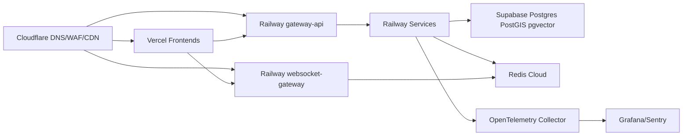
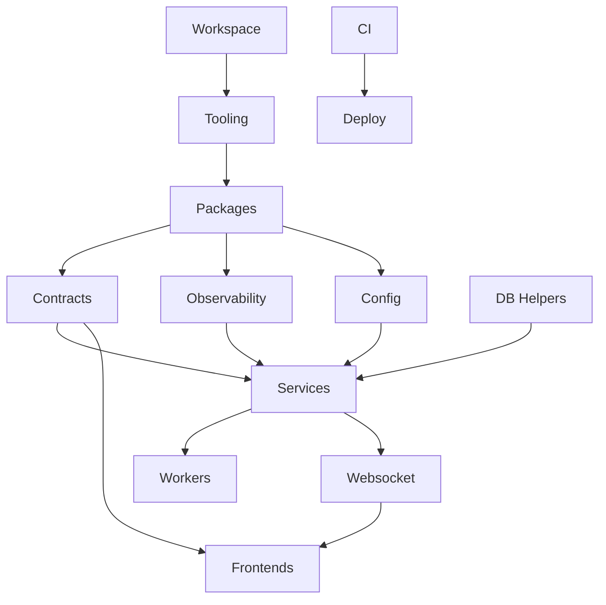

# VENDORHUB Phase 1 Engineering Foundation

Internal Infrastructure and Engineering Foundation Constitution for the VENDORHUB Platform

Status: locked baseline before feature implementation  
Depends on: `docs/VENDORHUB_PHASE_0_SYSTEM_LOCK.md`  
Scope: monorepo, tooling, local development, infrastructure, CI/CD, containers, Redis, realtime, observability, governance  
Non-goal: product feature implementation

---

## 0. Foundation Lock

Phase 1 converts the Phase 0 system architecture into an enforceable engineering substrate. The purpose is not to create screens, endpoints, or business features. The purpose is to make the repository impossible to use casually in ways that violate VENDORHUB's architecture.

VENDORHUB will be developed by humans and AI systems together. That changes the engineering foundation. The repository must make the correct thing the easiest thing:

- shared contracts must be imported, not copied
- service boundaries must be enforced, not remembered
- event names and payloads must be generated from schemas, not invented inline
- frontend and backend validation must come from the same source
- local development must resemble production topology enough to expose distributed failures early
- CI must reject architecture drift before code reaches deployment

This phase locks the infrastructure for consistency.

---

## 1. Complete Engineering Foundation Philosophy

### 1.1 Engineering Philosophy

VENDORHUB is a realtime distributed commerce coordination system. Its engineering foundation must be built like an internal platform, not like a single web app.

The repository is not merely a place to store files. It is the control plane for:

- domain ownership
- API contracts
- event schemas
- websocket protocols
- database migrations
- frontend composition
- service deployment
- queue workers
- observability conventions
- AI-assisted code generation boundaries

The foundation must preserve these truths:

- every domain owns its state
- every shared concept has one canonical package
- every cross-domain interaction is contract-driven
- every service can deploy independently
- every frontend app consumes contracts through typed clients
- every distributed workflow is traceable
- every queue and realtime path has replay and failure handling

### 1.2 Why VENDORHUB Requires a Monorepo

VENDORHUB has many apps and services, but they are not independent products. They are coordinated surfaces over the same marketplace operating system. A monorepo is required because:

- buyer, seller, admin, and rider apps must share UI primitives, design tokens, auth rules, analytics SDKs, websocket contracts, and domain DTOs
- backend services must share event envelopes, error envelopes, validation schemas, tracing helpers, idempotency primitives, and queue conventions
- contract changes must be validated across all consumers in one CI graph
- AI-generated code needs a single searchable context for patterns and boundaries
- dependency versions must be controlled centrally to prevent runtime drift
- feature slices often span gateway, service, event, websocket, UI, and tests

The monorepo does not mean services are coupled. It means contracts, tooling, and governance are centralized while runtime ownership stays modular.

### 1.3 Why VENDORHUB Is Not a Simple Frontend/Backend App

A simple frontend/backend app usually has:

- one API surface
- one database authority
- request/response workflows
- limited async processing
- low consistency complexity

VENDORHUB has:

- multiple role-specific apps
- multiple domain services
- distributed state machines
- inventory reservation concurrency
- payment provider webhooks
- rider location streams
- websocket state propagation
- analytics ingestion
- search indexing
- fraud and moderation holds
- event replay and dead-letter recovery

Therefore the foundation must support services, workers, queues, realtime fanout, migrations, typed contracts, and observability from day one.

### 1.4 Why Shared Contracts Are Mandatory

Shared contracts prevent platform split-brain.

Without shared contracts:

- frontend apps invent incompatible DTOs
- services publish incompatible events
- websocket clients mis-handle payloads
- validation diverges between form, gateway, and service
- AI-generated code duplicates schemas
- breaking changes are discovered at runtime

With shared contracts:

- DTOs are typed and versioned
- Zod schemas validate runtime boundaries
- OpenAPI/AsyncAPI generation is possible
- event compatibility can be tested
- frontend forms, API clients, and backend handlers share validation language

### 1.5 Why Realtime Requires Strict Governance

Realtime systems fail when messages are treated as casual notifications. In VENDORHUB, realtime messages are part of the consistency model.

Realtime governance requires:

- topic naming conventions
- authorization per subscription
- sequence numbers
- replay cursors
- ack rules
- client reconciliation rules
- schema validation
- event-to-message projection ownership
- connection lifecycle observability

No frontend may subscribe to an undocumented topic. No backend may emit an untyped websocket payload.

### 1.6 Why AI-Assisted Development Changes Repo Architecture

AI can accelerate VENDORHUB only if the repository provides strong rails. AI is excellent at continuing local patterns; it is dangerous when patterns are ambiguous.

Therefore:

- packages must have clear README rules
- service templates must encode architecture decisions
- generators must create files in approved locations
- lint rules must block invalid imports
- contract packages must be obvious and ergonomic
- prompts must name the bounded context and allowed dependencies
- CI must catch drift introduced by generated code

### 1.7 Platform Scalability Philosophy

Scale is planned in layers:

1. Codebase scale: clear ownership, typed contracts, strict imports.
2. Team scale: bounded contexts, CODEOWNERS, PR rules.
3. Runtime scale: independently deployable services and workers.
4. Data scale: domain-owned schemas, partitioning paths, Redis for volatile coordination.
5. Operational scale: traces, metrics, logs, replay, runbooks.

The foundation should allow VENDORHUB to begin lean while preserving a path to high-volume operations.

### 1.8 Governance Rules

Foundation rules:

- Services may not import another service's source.
- Apps may not import service internals.
- Shared packages may not depend on apps.
- Contracts change before implementation.
- Events must be declared in `packages/websocket-events` or the future event package before use.
- Runtime input must be validated with shared schemas.
- Migrations are forward-only.
- Queue jobs are named, typed, and owned.
- Every service has health, readiness, metrics, and trace propagation.
- Every mutating external command has idempotency.

---

## 2. Complete Monorepo Architecture

### 2.1 Final Repository Topology

```txt
VENDORHUB/
├── apps/
│   ├── buyer-web/
│   ├── seller-web/
│   ├── admin-web/
│   ├── rider-web/
│   ├── gateway-api/
│   ├── auth-service/
│   ├── order-service/
│   ├── inventory-service/
│   ├── payment-service/
│   ├── logistics-service/
│   ├── search-service/
│   ├── analytics-service/
│   └── websocket-gateway/
├── packages/
│   ├── ui/
│   ├── types/
│   ├── validations/
│   ├── db/
│   ├── auth/
│   ├── analytics/
│   ├── websocket-events/
│   ├── orchestration/
│   ├── observability/
│   ├── motion/
│   ├── configs/
│   └── utils/
├── infra/
│   ├── cloudflare/
│   ├── railway/
│   ├── redis-cloud/
│   ├── supabase/
│   ├── vercel/
│   └── grafana/
├── tooling/
│   ├── eslint/
│   ├── prettier/
│   ├── typescript/
│   ├── tailwind/
│   ├── generators/
│   └── boundary-rules/
├── scripts/
│   ├── bootstrap/
│   ├── codegen/
│   ├── db/
│   ├── events/
│   ├── health/
│   ├── local/
│   └── release/
├── docs/
│   ├── architecture/
│   ├── adr/
│   ├── api/
│   ├── events/
│   ├── infra/
│   ├── runbooks/
│   └── realtime/
├── docker/
│   ├── base/
│   ├── services/
│   ├── workers/
│   └── docker-compose.local.yml
├── .github/
│   ├── workflows/
│   ├── pull_request_template.md
│   └── CODEOWNERS
├── turbo.json
├── pnpm-workspace.yaml
├── package.json
├── tsconfig.base.json
├── eslint.config.mjs
├── prettier.config.mjs
└── README.md
```

### 2.2 Workspace Configuration

`pnpm-workspace.yaml`:

```yaml
packages:
  - "apps/*"
  - "packages/*"
  - "tooling/*"
```

Root `package.json` responsibilities:

- workspace scripts
- dependency version policy
- package manager lock
- Turborepo orchestration
- repo-level lint/typecheck/test commands

Required root scripts:

```json
{
  "scripts": {
    "dev": "turbo dev",
    "build": "turbo build",
    "lint": "turbo lint",
    "typecheck": "turbo typecheck",
    "test": "turbo test",
    "format": "prettier --write .",
    "format:check": "prettier --check .",
    "boundaries": "pnpm exec tsx scripts/health/check-boundaries.ts",
    "contracts": "turbo contracts",
    "db:migrate": "pnpm exec tsx scripts/db/migrate.ts",
    "local:up": "docker compose -f docker/docker-compose.local.yml up",
    "local:down": "docker compose -f docker/docker-compose.local.yml down"
  }
}
```

### 2.3 Turborepo Pipeline

`turbo.json` must model dependency order:

```json
{
  "$schema": "https://turbo.build/schema.json",
  "tasks": {
    "build": {
      "dependsOn": ["^build"],
      "outputs": [".next/**", "dist/**", "!.next/cache/**"]
    },
    "dev": {
      "cache": false,
      "persistent": true
    },
    "lint": {
      "dependsOn": ["^build"]
    },
    "typecheck": {
      "dependsOn": ["^build"]
    },
    "test": {
      "dependsOn": ["^build"],
      "outputs": ["coverage/**"]
    },
    "contracts": {
      "dependsOn": ["^build"],
      "outputs": ["generated/**"]
    }
  }
}
```

### 2.4 Import Boundary Model

Allowed:

```txt
apps/* -> packages/*
packages/ui -> packages/types, packages/motion, packages/utils
packages/auth -> packages/types, packages/validations
packages/db -> packages/observability, packages/utils
packages/orchestration -> packages/types, packages/validations, packages/observability
services -> packages/db, packages/auth, packages/validations, packages/types, packages/observability, packages/orchestration
```

Forbidden:

```txt
apps/* -> apps/* service source
packages/* -> apps/*
packages/types -> packages/ui
packages/validations -> apps/*
services -> other services
frontend apps -> packages/db
frontend apps -> backend-only env helpers
```

### 2.5 Package Isolation

Every package must define:

- `name`
- `version`
- `private`
- `type`
- `exports`
- `files`
- `scripts`
- `dependencies`
- `devDependencies`

No package may expose deep imports unless explicitly declared in `exports`.

---

## 3. Complete Apps Architecture

### 3.1 Frontend Application Baseline

All frontend apps use:

- Next.js 15+ App Router
- React Server Components
- Partial Prerendering where appropriate
- TanStack Query for server state
- Zustand for ephemeral UI/client state
- Tailwind with shared tokens
- shadcn/ui through `packages/ui`
- Framer Motion through `packages/motion`
- typed API client generated from contracts
- websocket client from `packages/websocket-events`

Shared frontend folder shape:

```txt
app/
  layout.tsx
  error.tsx
  loading.tsx
  not-found.tsx
  providers.tsx
  (public)/
  (auth)/
  (app)/
features/
  <feature>/
    api/
    components/
    hooks/
    realtime/
    schemas/
    stores/
    types.ts
components/
  shell/
  navigation/
  feedback/
lib/
  api/
  auth/
  query/
  realtime/
  analytics/
  config/
stores/
  ui-store.ts
tests/
```

Frontend state ownership:

| State | Owner |
|---|---|
| server entities | TanStack Query |
| route params and shareable filters | URL |
| form draft before submit | React Hook Form/local component |
| optimistic mutation state | TanStack Query mutation |
| socket status and cursors | realtime store |
| panels, drawers, selected table rows | Zustand |
| auth session | auth package + server layout |

### 3.2 buyer-web

Purpose:

- customer commerce experience
- realtime order tracking
- recommendations and search
- cart and checkout

Routes:

```txt
app/
  (public)/
    page.tsx
    search/page.tsx
    vendors/[vendorId]/page.tsx
    products/[productId]/page.tsx
  (auth)/
    login/page.tsx
  (app)/
    cart/page.tsx
    checkout/page.tsx
    orders/page.tsx
    orders/[orderId]/page.tsx
    account/page.tsx
```

Feature structure:

```txt
features/
  catalog/
  search/
  recommendations/
  cart/
  checkout/
  orders/
  tracking/
  account/
```

Caching boundaries:

- vendor/product discovery can use RSC + revalidation tags
- cart is authenticated and no-store at server boundary
- checkout is no-store
- order tracking starts from server snapshot and then websocket patches
- recommendations are cacheable by user segment with privacy constraints

Websocket synchronization:

- subscribe to `buyer:{buyerId}:orders`
- subscribe to `order:{orderId}` on tracking page
- maintain last cursor per topic
- apply order timeline patches by sequence
- invalidate order query on sequence gap

Optimistic UI boundaries:

- cart item add/update/remove can be optimistic
- checkout submit shows pending but must wait for authoritative order id
- cancellation request can be optimistic only as `CANCEL_REQUESTED_PENDING`

### 3.3 seller-web

Purpose:

- operational commerce tooling
- live order queue
- inventory management
- fulfillment systems
- seller analytics

Routes:

```txt
app/
  (app)/
    page.tsx
    orders/page.tsx
    orders/[orderId]/page.tsx
    inventory/page.tsx
    catalog/page.tsx
    catalog/products/[productId]/page.tsx
    payouts/page.tsx
    analytics/page.tsx
    settings/page.tsx
```

Operational dashboard architecture:

- persistent left navigation
- command bar for vendor status/open/close
- live queue column
- order detail panel
- inventory alert strip
- payout status widget

Realtime queue architecture:

- subscribe to `vendor:{vendorId}:orders`
- queue items are ordered by SLA deadline
- new orders enter with highlight and audible optional notification
- action buttons use idempotent mutations
- stale queue detected by heartbeat and refetch

Analytics visualization:

- data fetched through analytics-service projections
- charts use shared chart primitives
- high-cardinality raw event data stays out of the browser

Dense UI layout:

- tables default to compact density
- cards are for repeated entities only
- operational controls stay fixed above scrolling data

### 3.4 admin-web

Purpose:

- operational control center
- moderation infrastructure
- fraud visibility
- SLA monitoring

Routes:

```txt
app/
  (app)/
    page.tsx
    operations/page.tsx
    orders/page.tsx
    vendors/page.tsx
    riders/page.tsx
    fraud/page.tsx
    moderation/page.tsx
    analytics/page.tsx
    audit/page.tsx
    incidents/page.tsx
```

Operational dashboard system:

- region selector
- live marketplace health
- order throughput
- dispatch backlog
- payment failures
- inventory reservation failure rate
- websocket session health

Event stream architecture:

- admin event feed subscribes to `admin:ops:{regionId}`
- critical events require ack in UI
- feed supports pause, filter, inspect, and jump-to-entity

Moderation queue:

- cases grouped by SLA and severity
- fraud holds visible across orders/payments/vendors
- admin actions write audit logs

Analytics coordination:

- summary metrics from analytics-service
- operational live counters from websocket projections
- drill-down uses paginated APIs, not raw stream replay

### 3.5 rider-web

Purpose:

- realtime dispatch operations
- navigation
- delivery lifecycle management
- mobile-first workflow

Routes:

```txt
app/
  (auth)/
    login/page.tsx
  (app)/
    page.tsx
    shift/page.tsx
    assignments/page.tsx
    deliveries/[deliveryId]/page.tsx
    earnings/page.tsx
    profile/page.tsx
```

Mobile-first architecture:

- bottom navigation
- large touch targets
- offline banner
- assignment timer always visible during offers
- map and stepper optimized for small screens

Websocket synchronization:

- subscribe to `rider:{riderId}:assignments`
- subscribe to `rider:{riderId}:route`
- assignment accept/decline uses websocket command plus REST fallback

Offline recovery:

- cache active delivery snapshot
- queue location updates locally with timestamp
- on reconnect, discard stale location points beyond policy window
- replay missed assignment/route messages from cursor

Live location streaming:

- publish location at adaptive interval
- high frequency during active delivery
- low frequency during idle shift
- include accuracy, battery-saver mode, and recordedAt

### 3.6 Backend Service Baseline

All backend services use:

```txt
src/
  main.ts
  app.ts
  config/
  http/
    routes/
    middleware/
  domain/
    entities/
    state-machines/
    services/
  application/
    commands/
    queries/
    handlers/
  infrastructure/
    db/
    queues/
    providers/
    repositories/
  events/
    publishers/
    consumers/
  workers/
  observability/
  tests/
```

Every service exposes:

- `GET /health/live`
- `GET /health/ready`
- `GET /metrics`
- OpenTelemetry instrumentation
- structured logger
- config validation at startup

### 3.7 gateway-api

Responsibilities:

- API aggregation
- auth verification
- rate limiting
- request routing
- request correlation
- websocket auth token issuance

Middleware pipeline:

```txt
request id -> trace context -> security headers -> body limit -> auth extraction
-> rate limit -> permission check -> schema validation -> service routing
-> response shaping -> access log
```

Request lifecycle:

- create correlationId if absent
- validate public request
- authenticate session/JWT
- authorize route scope
- call internal service with signed internal headers
- normalize errors
- emit access metrics

Caching:

- public catalog GET responses can be edge-cacheable with vendor/region tags
- authenticated responses are private/no-store unless explicitly safe
- gateway does not own long-lived domain cache

Edge strategy:

- Cloudflare handles WAF, coarse rate limiting, bot filtering
- Vercel serves frontend edge rendering
- gateway performs domain-aware auth and fine-grained limits

### 3.8 auth-service

Responsibilities:

- identity
- sessions
- JWT lifecycle
- RBAC
- OAuth
- device management

Session lifecycle:

```txt
login -> device fingerprint -> session row -> access token -> refresh token
-> rotation on refresh -> revoke old refresh token -> session expiry/revocation
```

Token architecture:

- short-lived access JWT
- long-lived refresh token stored hashed
- rotation on each refresh
- reuse detection revokes session family

Permission architecture:

- roles scoped by platform/vendor/rider/admin context
- permission checks use `resource:action`
- gateway caches permissions with short TTL
- permission change emits invalidation event

### 3.9 order-service

Responsibilities:

- order lifecycle
- orchestration saga
- order state machine
- event publishing

Saga strategy:

- command handler creates order aggregate
- local transaction writes order state and outbox event
- saga worker reacts to events and issues commands to inventory/payment/logistics
- each saga step is idempotent
- saga state records step status and compensation status

Compensation:

- inventory reserved + payment failed -> release inventory
- payment authorized + vendor reject -> void authorization and release inventory
- delivery failed after capture -> incident + refund workflow

Idempotency:

- client commands require idempotency key
- order creation dedupes by checkoutSessionId + clientMutationId
- saga commands dedupe by orderId + stepName

### 3.10 inventory-service

Responsibilities:

- stock ownership
- reservations
- concurrency protection
- reconciliation

Redis reservation architecture:

- key: `reservation:stock:{vendorId}:{variantId}`
- key: `reservation:order:{orderId}`
- atomic Lua script reserves all items or none
- TTL matches reservation expiry plus grace

Locking:

- Redis atomic counter for fast reservation
- Postgres optimistic lock with stock_version
- reconciliation uses controlled row locks

Stale cleanup:

- delayed queue job for reservation expiry
- periodic scanner for expired reservations
- reconciliation job compares Redis and Postgres reservation state

### 3.11 payment-service

Responsibilities:

- payments
- payouts
- refunds
- reconciliation

Stripe Connect topology:

- platform account owns marketplace orchestration
- connected accounts represent vendors where applicable
- payment intents include order correlation metadata
- application fees recorded explicitly
- transfers/payouts mapped to ledger entries

Webhook reliability:

- verify Stripe signature
- store provider event id before processing
- dedupe by provider event id
- process event through inbox-like handler
- emit internal payment events through outbox

Retry architecture:

- provider calls use idempotency key
- failed captures retry with backoff where provider-safe
- reconciliation worker polls provider for uncertain states

### 3.12 logistics-service

Responsibilities:

- dispatch
- routing
- ETA
- rider tracking

H3 topology:

- vendor, rider, buyer, and service zones include H3 cells
- dispatch prefilters riders by neighboring H3 cells
- analytics aggregates delivery health by H3 resolution

Route optimization:

- phase 1 supports single-order dispatch
- future supports batching and multi-stop routing
- route provider responses normalized by adapter

Rider assignment:

- eligible rider set from availability, distance, capacity, trust, shift status
- assignment offer has expiry
- rider capacity locked during offer
- timeout releases capacity and offers next rider

### 3.13 search-service

Responsibilities:

- indexing
- embeddings
- semantic retrieval
- recommendations

pgvector architecture:

- product/vendor embedding tables
- vector index by embedding model/version
- metadata filters for region, vendor status, availability

Hybrid search:

```txt
query -> lexical search -> semantic retrieval -> availability filter
-> ranking signals -> result hydration -> response
```

Indexing workers:

- consume product/vendor/inventory events
- update search document projection
- enqueue embedding refresh when text changes
- dead-letter failed indexing events

### 3.14 analytics-service

Responsibilities:

- event ingestion
- KPI generation
- experimentation
- reporting

Ingestion topology:

- client analytics SDK sends batched events
- backend services emit operational events
- ingestion validates schema and writes append-only store
- aggregation workers build metric projections

Metrics:

- order conversion
- reservation failure rate
- payment authorization failure rate
- dispatch latency
- delivery SLA
- vendor acceptance time
- websocket reconnect rate

Retention:

- raw events partitioned by time
- high-volume client events downsampled or archived
- operational events retained longer for audits

### 3.15 websocket-gateway

Responsibilities:

- realtime propagation
- connection lifecycle
- subscription management
- reconnect recovery

Scaling architecture:

- stateless websocket instances
- Redis stores session registry and pub/sub
- Redis Streams store replayable messages
- sticky sessions optional, not required for correctness

Redis integration:

- pub/sub for low-latency fanout
- streams for replayable topic messages
- hashes/sets for connection subscriptions

Replay:

- client reconnects with last cursor per topic
- gateway reads stream after cursor
- if gap exceeds retention, sends `SNAPSHOT_REQUIRED`

---

## 4. Complete Packages Architecture

### 4.1 Package Governance

Every shared package must have:

- README with purpose and forbidden usage
- explicit exports
- tests for exported logic
- no hidden service coupling
- changelog when contracts change

### 4.2 packages/ui

Ownership:

- frontend platform team

Exports:

- primitives
- composed operational components
- layout primitives
- chart primitives
- realtime visual components

Dependency rules:

- may depend on `types`, `motion`, `utils`
- may not depend on app-specific code
- may not fetch data

Component hierarchy:

```txt
src/
  primitives/
  forms/
  data-display/
  feedback/
  layout/
  operational/
    event-feed/
    state-timeline/
    topology/
    metric-tile/
    exception-queue/
  charts/
  accessibility/
```

Design tokens:

- consumed from Tailwind theme generated by `packages/configs`
- semantic CSS variables exposed at root

Slot architecture:

- complex components expose slots for actions, metadata, status, footer
- components do not assume domain-specific API shapes

Accessibility:

- keyboard navigation for all interactive controls
- ARIA labels on icon buttons
- focus states mandatory
- motion respects reduced-motion preference

### 4.3 packages/types

Ownership:

- platform architecture team

Exports:

- DTOs
- shared enums
- API envelope types
- event envelope types
- state machine type helpers

Rules:

- no runtime dependencies
- no Zod imports
- no UI imports
- no service-specific repository types

DTO strategy:

- request/response DTOs represent contract shapes
- domain internals may differ inside services
- never export database row types as public DTOs

### 4.4 packages/validations

Ownership:

- platform architecture team with domain owners

Exports:

- Zod schemas
- schema-derived TypeScript types where needed
- common validators for ids, money, geo, pagination, date ranges

Rules:

- schema is source of runtime truth
- frontend forms and backend handlers use the same schemas
- breaking schema changes require contract tests

### 4.5 packages/db

Ownership:

- backend platform team

Exports:

- DB connection factory
- transaction helpers
- migration helper types
- outbox write helper
- inbox idempotency helper

Rules:

- no domain table definitions
- no service-specific queries
- no frontend usage

### 4.6 packages/auth

Exports:

- role constants
- permission predicates
- auth client helpers
- token parsing helpers
- middleware utilities

Rules:

- may define permission names
- may not decide domain business policy alone
- permission changes require docs update

### 4.7 packages/analytics

Exports:

- analytics event schemas
- frontend SDK
- backend capture helper
- batching utilities

Rules:

- no raw PII
- event names are namespaced
- analytics failures must not break critical user flows unless explicitly configured

### 4.8 packages/websocket-events

Exports:

- websocket message envelope
- topic builders
- subscription schemas
- ack schemas
- replay cursor schemas
- server-to-client event schemas
- client-to-server command schemas

Topic builders:

```ts
orderTopic(orderId)
vendorOrdersTopic(vendorId)
riderAssignmentsTopic(riderId)
adminOpsTopic(regionId)
```

Ack strategy:

- critical messages require ack
- non-critical telemetry messages do not
- acks include topic, sequence, messageId, receivedAt

Replay formats:

- cursor per topic
- snapshot-required message when replay retention is exceeded

### 4.9 packages/orchestration

Exports:

- saga primitives
- idempotency helpers
- retry policies
- state machine helpers
- outbox event publisher interfaces

Rules:

- contains reusable orchestration mechanics
- does not contain VENDORHUB order-specific business transitions unless generalized helpers only

### 4.10 packages/observability

Exports:

- OpenTelemetry setup
- logger factory
- correlation id utilities
- metric names
- trace context propagation

Rules:

- all services use this package
- log shape is centralized
- metric names are canonical

### 4.11 packages/motion

Exports:

- durations
- easing
- animation recipes
- reduced-motion helpers
- realtime feed transitions

### 4.12 packages/configs

Exports:

- tsconfig presets
- eslint presets
- tailwind preset
- environment schema helpers
- shared package metadata conventions

### 4.13 packages/utils

Exports:

- small pure utilities
- date helpers
- money formatting helpers
- invariant helpers

Rules:

- no domain workflows
- no dumping ground behavior
- additions require clear reuse across at least two packages/apps

---

## 5. Complete Tooling and Governance System

### 5.1 TypeScript Governance

Strict flags:

```json
{
  "strict": true,
  "noImplicitOverride": true,
  "noUncheckedIndexedAccess": true,
  "exactOptionalPropertyTypes": true,
  "noFallthroughCasesInSwitch": true,
  "forceConsistentCasingInFileNames": true,
  "isolatedModules": true
}
```

Shared tsconfig hierarchy:

```txt
tsconfig.base.json
tooling/typescript/tsconfig.next.json
tooling/typescript/tsconfig.node-service.json
tooling/typescript/tsconfig.package.json
```

Path alias strategy:

- app-local aliases use `@/`
- package imports use workspace package names only
- no cross-app aliases

Project references:

- packages build before apps
- service packages reference shared packages
- CI runs `tsc --build` where practical

### 5.2 ESLint and Prettier

Lint categories:

- TypeScript correctness
- React hooks rules
- Next.js rules
- import ordering
- no restricted imports
- architectural boundaries
- no floating promises
- no unsafe any

Restricted imports:

- frontend cannot import `packages/db`
- apps cannot import `apps/*/src`
- services cannot import other service source
- UI cannot import API clients

Formatting:

- Prettier is authoritative for formatting
- no style debates in PRs
- CI checks formatting

### 5.3 Dependency Governance

Rules:

- dependencies added at the narrowest workspace package
- shared dependency versions centralized with pnpm overrides when needed
- no duplicate major versions for critical libraries
- no unmaintained runtime dependency without approval
- backend services avoid frontend-only packages
- packages avoid dependencies unless needed

Dependency review checks:

- license
- bundle impact
- runtime risk
- security advisories
- maintenance health

### 5.4 Git Governance

Branch naming:

```txt
feature/<scope>-<summary>
fix/<scope>-<summary>
infra/<scope>-<summary>
docs/<scope>-<summary>
refactor/<scope>-<summary>
```

Commit convention:

```txt
feat(scope): message
fix(scope): message
infra(scope): message
docs(scope): message
test(scope): message
refactor(scope): message
```

PR requirements:

- problem statement
- domain touched
- contracts changed
- migrations changed
- events changed
- tests
- rollout/rollback
- screenshots for UI
- traces/log notes for distributed workflow changes

Release tags:

```txt
web/buyer-web@x.y.z
service/order-service@x.y.z
platform/contracts@x.y.z
```

---

## 6. Complete Local Development Architecture

### 6.1 Local Topology

Local development must run enough infrastructure to expose distributed behavior:

```txt
developer machine
  pnpm/turbo
  Next.js apps
  Node services
  Docker Postgres
  Docker Redis
  Docker local observability
  websocket-gateway
```

Docker Compose services:

- postgres with PostGIS and pgvector
- redis
- redis commander or equivalent
- local otel collector
- local grafana
- local mail catcher

### 6.2 Service Boot Order

1. Postgres
2. Redis
3. OpenTelemetry collector
4. auth-service
5. gateway-api
6. domain services
7. websocket-gateway
8. frontend apps
9. workers

In local development, services can be booted by profile:

```txt
core: postgres, redis, auth-service, gateway-api
commerce: commerce, inventory, order, payment mock
realtime: websocket-gateway, redis streams
logistics: logistics, rider-web
```

### 6.3 Environment Strategy

Local env files:

```txt
.env.example
.env.local
apps/<app>/.env.local
packages/*/.env.example where needed
```

No secret committed. `.env.example` documents required keys with fake values.

### 6.4 Devcontainer Strategy

Devcontainer provides:

- Node LTS
- pnpm
- Docker CLI
- database clients
- Redis CLI
- recommended VS Code extensions
- consistent shell scripts

### 6.5 Onboarding Workflow

```txt
1. Clone repo
2. Install pnpm
3. pnpm install
4. Copy .env.example to .env.local
5. pnpm local:up
6. pnpm db:migrate
7. pnpm dev --filter core services or app
8. Open buyer/seller/admin/rider URLs
9. Run pnpm health:local
```

### 6.6 Debugging Workflows

Websocket debugging:

- inspect connection registry in Redis
- inspect topic streams
- use local websocket test client
- simulate reconnect with cursor

Event tracing:

- search by correlationId across logs
- inspect outbox rows
- inspect inbox rows
- replay selected event into local consumer

Local analytics:

- analytics events visible in local event viewer
- no production analytics endpoint in development

---

## 7. Complete Infrastructure Topology

### 7.1 Provider Topology



### 7.2 Deployment Ownership

| Platform | Owns |
|---|---|
| Vercel | Next.js frontends, preview deployments, edge rendering |
| Railway | backend services, workers, websocket gateway |
| Supabase | Postgres, PostGIS, pgvector, backups |
| Redis Cloud | cache, queues, streams, websocket registry |
| Cloudflare | DNS, WAF, CDN, coarse rate limiting |
| Grafana/Sentry | metrics, traces, errors, dashboards |

### 7.3 Frontend Infra

CDN:

- static assets served through Vercel/Cloudflare
- immutable hashed assets
- image optimization through Next.js image pipeline

Edge rendering:

- public catalog pages can use edge-friendly rendering
- authenticated operational screens prefer server rendering with private cache/no-store

Cache invalidation:

- tag-based revalidation for catalog
- event-driven invalidation from vendor/product/inventory changes
- critical checkout pages no-store

### 7.4 Backend Infra

Railway deployment:

- each service deploys as independent Railway service
- workers are separate processes where scaling differs
- websocket gateway deploys separately from gateway API

Scaling:

- gateway-api scales horizontally by request load
- websocket-gateway scales by concurrent connections
- workers scale by queue lag
- inventory-service scales carefully around hot keys
- analytics workers scale by ingestion lag

### 7.5 Redis Infra

Topology:

- logical namespaces per environment
- separate key prefixes by service/domain
- separate Redis databases or clusters if provider plan supports isolation

Uses:

- pub/sub: realtime fanout
- streams: replayable messages and event pipelines
- cache: hot projections and rate limits
- reservation: atomic inventory counters
- queues: BullMQ jobs

---

## 8. Complete Environment and Configuration System

### 8.1 Environment Separation

Development:

- local Postgres/Redis
- mock payment provider
- mock notifications
- verbose logs
- local tracing

Staging:

- production-like Railway/Vercel/Supabase/Redis
- Stripe test mode
- real websocket topology
- production-like CI gates
- synthetic data only

Production:

- live secrets
- strict WAF/rate limits
- protected migrations
- monitored deploys
- no debug endpoints exposed

### 8.2 Config Layering

Order:

```txt
default config -> environment config -> secrets provider -> runtime overrides
```

Every service validates config at startup using schema.

Config categories:

- public build-time frontend config
- private runtime backend config
- provider secrets
- feature flags
- operational thresholds

### 8.3 Secrets Management

Rules:

- secrets live in Vercel/Railway/Supabase/Redis provider vaults
- local secrets only in `.env.local`
- no secrets in docs, tests, screenshots, logs, or committed env files
- rotation runbooks required for JWT, Stripe, Supabase, Redis

JWT:

- signing keys rotate with key id
- old keys retained through token TTL
- compromised key triggers session invalidation policy

Stripe:

- separate test/live keys
- webhook secrets per environment
- restricted keys where possible

Supabase:

- service role key backend only
- anon key frontend only where required
- RLS strategy documented per schema

### 8.4 Feature Flags

Flags control:

- rollout of new workflows
- provider adapter changes
- UI experiments
- operational emergency disables

Rules:

- flags have owner and expiry
- flags are not permanent architecture branches
- critical payment/inventory paths default closed on config ambiguity

---

## 9. Complete CI/CD Architecture

### 9.1 Pipeline Topology

GitHub Actions pipelines:

```txt
pull_request:
  install -> lint -> typecheck -> test -> contracts -> build -> boundary checks

main:
  install -> full validation -> build -> deploy staging -> smoke tests

release:
  promote staging artifact -> deploy production -> health checks -> monitor
```

### 9.2 Required Checks

Lint:

- fails on code quality, invalid imports, hook violations, restricted dependencies

Typecheck:

- fails on contract mismatch, unsafe types, package build errors

Tests:

- unit tests
- contract tests
- service integration tests where affected

Build:

- ensures Next.js apps and service bundles compile
- checks package exports

Contracts:

- validates API schemas
- validates websocket schemas
- validates event compatibility

Boundary checks:

- verifies no invalid cross-service import
- verifies packages do not import apps

### 9.3 Deployment Sequencing

Staging:

```txt
database migration dry run -> deploy services -> deploy workers
-> deploy websocket gateway -> deploy frontends -> smoke tests
```

Production:

```txt
confirm migrations backward compatible
deploy services with health checks
deploy workers
deploy websocket gateway
deploy frontends
monitor traces/error rates
```

Failure handling:

- validation failure blocks merge
- deploy failure stops downstream deploys
- smoke failure triggers rollback
- migration failure requires forward fix, not destructive rollback

### 9.4 Preview Deployments

- Vercel preview for frontend PRs
- Railway preview environments for service changes when practical
- preview uses staging-like contracts but isolated data
- comments link to app previews and API health

---

## 10. Complete Containerization Strategy

### 10.1 Docker Standards

Every service image:

- uses multi-stage build
- installs dependencies with frozen lockfile
- runs as non-root user
- exposes health endpoint
- has minimal runtime layer
- includes only required workspace outputs

Service Dockerfile pattern:

```txt
base -> deps -> build -> runtime
```

### 10.2 Worker Containers

Workers use same image as owning service where possible with different command:

```txt
node dist/workers/outbox-dispatcher.js
node dist/workers/reservation-expiry.js
node dist/workers/indexing-worker.js
```

### 10.3 Local Docker Compose

Local compose includes:

- postgres
- redis
- otel-collector
- grafana
- mail catcher
- optional service containers

Startup sequencing:

- healthcheck dependencies for Postgres and Redis
- services wait for migrations
- workers start after service readiness

### 10.4 Health Checks

Liveness:

- process is alive
- event loop responsive

Readiness:

- database reachable
- Redis reachable when service requires Redis
- required provider config valid
- migrations current

---

## 11. Complete Observability Foundation

### 11.1 Observability Stack

- OpenTelemetry for traces and metrics
- Sentry for frontend/backend exceptions
- Grafana for dashboards
- structured JSON logs
- correlation IDs propagated across services, queues, and websocket messages

### 11.2 Trace Propagation

Trace must flow through:

```txt
frontend request -> gateway -> service -> DB transaction -> outbox event
-> queue worker -> consumer service -> websocket fanout -> client ack
```

Required ids:

- traceId
- spanId
- correlationId
- causationId for events
- actorId where available
- aggregateId where relevant

### 11.3 Logging Standards

Log fields:

```txt
timestamp
level
service
environment
correlationId
traceId
actorId
eventId
aggregateId
message
metadata
```

Never log:

- access tokens
- refresh tokens
- payment card data
- raw provider secrets
- full addresses in generic logs
- unnecessary PII

### 11.4 Distributed Debugging

Debug workflow:

1. Start with user-visible symptom and timestamp.
2. Locate correlationId from frontend/gateway logs.
3. Inspect gateway trace.
4. Follow service spans.
5. Check outbox event status.
6. Check inbox processing status.
7. Check queue job attempts.
8. Check websocket fanout and ack.
9. Compare source-of-truth DB state with projection/client state.

---

## 12. Complete Redis and Queue Architecture

### 12.1 Redis Key Governance

Key format:

```txt
{env}:{domain}:{purpose}:{id}
```

Examples:

```txt
prod:inventory:reservation-stock:{vendorId}:{variantId}
prod:ws:session:{connectionId}
prod:rate:user:{userId}
prod:cache:catalog:{regionId}:{vendorId}
```

### 12.2 BullMQ Topology

Queues:

| Queue | Owner | Purpose |
|---|---|---|
| order-saga | order-service | saga steps and compensations |
| inventory-reservations | inventory-service | expiry and reconciliation |
| payment-webhooks | payment-service | provider event processing |
| payment-reconciliation | payment-service | uncertain payment states |
| logistics-dispatch | logistics-service | assignment offers/timeouts |
| search-indexing | search-service | index and embedding jobs |
| analytics-ingestion | analytics-service | event aggregation |
| websocket-replay | websocket-gateway | replay and snapshot jobs |
| notifications | notification-service future | email/SMS/push |

### 12.3 Retry Strategy

Default job retry:

- 5 attempts
- exponential backoff with jitter
- classify retryable vs permanent failures
- permanent validation failures dead-letter immediately

Dead-letter:

- DLQ per owner service
- includes original payload, error, attempts, correlationId
- admin tooling can inspect and replay

### 12.4 Concurrency Guarantees

- inventory reservation jobs serialize per reservation/order where necessary
- payment webhook jobs dedupe by provider event id
- order saga jobs dedupe by orderId + step
- dispatch jobs lock rider assignment capacity
- analytics jobs can run high concurrency because they are append/projection oriented

### 12.5 Event Replay

Replay rules:

- replay projections only by default
- no external provider side effects during replay
- replay jobs require dry-run option
- replay emits audit log
- replay handler version recorded

---

## 13. Complete Realtime Foundation

### 13.1 Namespace Architecture

Namespaces:

```txt
/buyer
/seller
/admin
/rider
/internal
```

Channels:

```txt
order:{orderId}
buyer:{buyerId}:orders
vendor:{vendorId}:orders
vendor:{vendorId}:inventory
rider:{riderId}:assignments
rider:{riderId}:route
admin:ops:{regionId}
admin:fraud
admin:moderation
```

### 13.2 Authentication

Socket auth:

- client requests websocket auth token from gateway
- token includes userId, roles, scopes, expiry
- websocket-gateway validates token
- subscriptions checked against topic authorization
- session revocation event disconnects affected sockets

### 13.3 Connection Lifecycle

```txt
connect -> authenticate -> register -> subscribe -> send snapshot cursors
-> stream messages -> heartbeat -> ack critical messages -> reconnect/replay
```

Heartbeat:

- ping every 25 seconds
- close after two missed pongs

Reconnect:

- exponential backoff with jitter
- send last acknowledged cursor
- replay missed messages
- fallback to snapshot refetch if replay window expired

### 13.4 Scaling Constraints

- websocket-gateway is stateless for connection ownership beyond Redis registry
- pub/sub is used for fanout to connected instances
- streams retain replayable messages
- high-frequency rider location streams are throttled and coalesced for buyers/admins
- admin dashboards receive aggregated operational projections, not every raw event

### 13.5 Client Synchronization

Client rules:

- validate message schema
- ignore stale sequence
- detect sequence gap
- request replay on gap
- invalidate query when patch cannot be safely applied
- reconcile optimistic mutations by clientMutationId/causationId

---

## 14. Complete AI-Assisted Engineering System

### 14.1 AI Governance

AI assistants must be treated as fast contributors operating under repository law.

Rules:

- always name bounded context
- search existing packages before adding code
- use contracts from shared packages
- never create duplicate DTOs
- never bypass validation
- never import service internals across boundaries
- update tests with code
- update docs/ADR for architectural deviation

### 14.2 Repo Context Strategy

Before generation, provide:

- Phase 0 and Phase 1 documents
- target app/service/package README
- relevant contracts
- relevant state machine
- desired tests
- forbidden imports

### 14.3 Frontend Generation Template

```txt
Implement <screen/feature> in apps/<app>.
Use packages/ui for components, packages/types for DTOs, packages/validations for schemas.
Server state must use TanStack Query.
Ephemeral UI state must use Zustand only when needed.
Realtime must go through features/<feature>/realtime adapter.
Do not create duplicate domain types.
Add tests for key interactions and loading/error states.
```

### 14.4 Backend Generation Template

```txt
Implement <command/query/workflow> in apps/<service>.
Bounded context: <context>.
Owned tables: <tables>.
Allowed packages: <packages>.
Use shared validation schemas and event contracts.
Add idempotency for mutations.
Publish events through outbox only.
Add state transition tests and handler tests.
Do not import other service source.
```

### 14.5 Event Generation Template

```txt
Add event <EVENT_NAME>.
Define producer, consumers, payload schema, version, ordering key, retry behavior, DLQ behavior, observability metadata.
Add schema in shared contract package.
Add compatibility test.
Update docs/events catalog.
```

### 14.6 Code Review Prompt

```txt
Review this change for VENDORHUB architecture compliance.
Prioritize service boundary violations, duplicated contracts, invalid imports, missing idempotency, missing validation, missing outbox/inbox use, realtime sequence/replay gaps, and missing observability.
Return findings with file and line references.
```

---

## 15. Complete Engineering Conventions

### 15.1 Naming

Files:

- kebab-case

Directories:

- kebab-case

React components:

- PascalCase

Hooks:

- useThing

DTOs:

- ThingRequestDto
- ThingResponseDto

Zod schemas:

- ThingRequestSchema
- ThingResponseSchema

Events:

- UPPER_SNAKE_CASE

Queues:

- kebab-case domain-purpose

Websocket topics:

- colon-delimited resource identifiers

### 15.2 Import Rules

- imports use package names for shared packages
- relative imports only within local feature/module
- no deep imports outside package exports
- no circular package dependencies
- no `../../..` chains beyond local module threshold

### 15.3 Frontend Conventions

- route components compose feature components
- feature components own feature-specific UI
- shared UI stays domain-neutral
- data fetching in hooks or server components, not random leaf components
- realtime handlers live in `features/<feature>/realtime`

### 15.4 Backend Conventions

- HTTP route handlers validate and delegate
- application handlers orchestrate use cases
- domain layer owns invariants
- infrastructure layer owns DB/provider details
- events published only through outbox
- workers are idempotent

### 15.5 Infra Conventions

- infra changes include rollback notes
- environment variables documented
- dashboards updated for new critical service
- alerts added for new critical queue/workflow

---

## 16. Complete Build Bootstrapping Strategy

### 16.1 Exact Implementation Order After Phase 1

1. Initialize pnpm workspace and Turborepo.
2. Add root TypeScript, ESLint, Prettier, and boundary rules.
3. Create package skeletons with exports and READMEs.
4. Create app skeletons without features.
5. Create Docker Compose local infra.
6. Create config validation package.
7. Create observability package.
8. Create types and validations packages.
9. Create websocket-events package.
10. Create db package with connection/outbox/inbox helpers.
11. Scaffold gateway-api and auth-service health endpoints.
12. Scaffold CI pipeline.
13. Add local health checker.
14. Add initial migrations.
15. Add first vertical slice contracts.

### 16.2 Production-Grade Immediately

- TypeScript strictness
- import boundaries
- config validation
- secrets handling
- health/readiness endpoints
- observability primitives
- idempotency helpers
- outbox/inbox foundation
- event/websocket envelopes

### 16.3 Mock Initially

- Stripe provider calls
- route provider
- notification provider
- advanced analytics warehouse
- AI recommendations

### 16.4 Dependency Graph



---

## 17. Complete Failure and Resilience Foundation

### 17.1 Startup Failures

Failure handling:

- invalid config fails fast
- missing required dependency fails readiness, not liveness
- migrations not current fail readiness
- provider outage may allow degraded startup if service has fallback mode

### 17.2 Redis Downtime

Impact:

- reservations degraded or blocked
- websocket fanout degraded
- queues paused
- rate limiting degraded

Strategy:

- inventory reservation path fails closed
- websocket clients reconnect and fall back to polling snapshots
- workers pause and resume after Redis recovery
- gateway uses conservative in-memory emergency rate limits only as temporary fallback

### 17.3 Websocket Disconnects

Strategy:

- client reconnect with backoff
- replay from cursor
- snapshot refetch when replay unavailable
- UI shows degraded realtime status
- critical actions remain available through REST where appropriate

### 17.4 DB Migration Failures

Rules:

- migrations are forward-only
- deploy code compatible with old and new schema during rolling deploy
- migration dry run in CI/staging
- failed migration blocks deploy
- repair migration is explicit and reviewed

### 17.5 Queue Failures

Strategy:

- retry with backoff
- dead-letter permanent failures
- alert on DLQ depth
- replay tooling for fixed handlers
- idempotency prevents duplicate side effects

### 17.6 Deployment Rollback

Frontend:

- Vercel rollback to previous deployment

Backend:

- Railway rollback to previous image

Database:

- forward fix only
- avoid destructive schema changes
- expand/contract migrations

Contracts:

- additive changes preferred
- breaking changes require versioning

### 17.7 Health and Readiness

Liveness:

- service process healthy
- event loop responsive

Readiness:

- DB reachable
- Redis reachable if required
- config valid
- migrations current
- critical provider adapter initialized if required

### 17.8 Graceful Degradation

Degradation policy:

- checkout blocks when inventory/payment truth is unavailable
- catalog can show cached results with stale indicator
- order tracking falls back to polling
- admin dashboards show partial data with source health
- analytics ingestion buffers where possible
- payment uncertainty triggers reconciliation, not guessed success

---

## 18. Final Phase 1 Lock Rules

1. The monorepo is the engineering control plane.
2. Shared contracts are mandatory for API, event, websocket, and validation surfaces.
3. Package exports define allowed imports.
4. Services are independently deployable and cannot import each other.
5. Frontend apps consume typed clients and shared UI, not backend internals.
6. Redis is operational infrastructure, not durable financial truth.
7. Websocket messages require schemas, sequence, auth, and recovery semantics.
8. CI enforces architecture before deployment.
9. Local development must include Postgres, Redis, websocket, and tracing paths.
10. Containers must be production-shaped and health-checked.
11. Secrets never enter code, docs, logs, or committed env files.
12. AI-generated code must operate inside bounded context and package rules.
13. Observability is part of the foundation, not a later improvement.
14. Resilience behavior must be defined before feature work depends on it.
15. Any deviation requires an ADR.

This document locks the engineering foundation for VENDORHUB Phase 1. Feature development starts only after this substrate exists and passes its own health checks.
