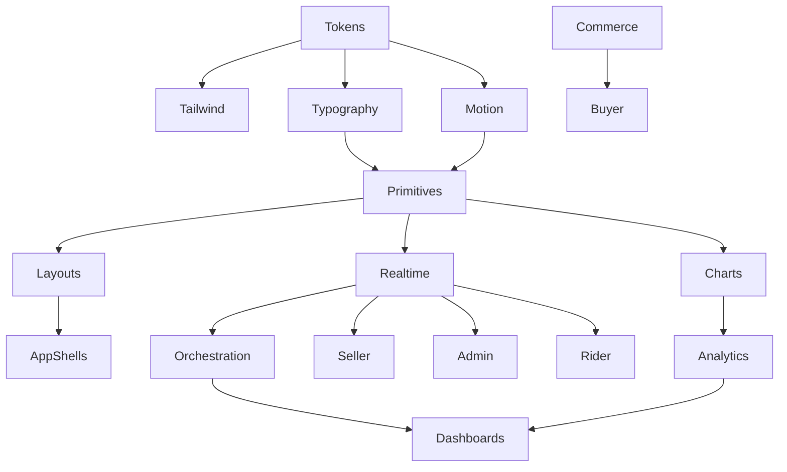

# VENDORHUB Phase 2 Visual Infrastructure

Internal Visual Infrastructure and Design Operating System Constitution for VENDORHUB

Status: locked baseline before UI implementation  
Depends on: `docs/VENDORHUB_PHASE_0_SYSTEM_LOCK.md`, `docs/VENDORHUB_PHASE_1_ENGINEERING_FOUNDATION.md`  
Scope: visual identity, tokens, motion, layout, components, realtime visualization, dashboards, accessibility, UI package governance, AI-assisted UI workflow  
Non-goal: building final screens or marketing pages

---

## 0. Visual Lock

VENDORHUB must look and behave like operational infrastructure for realtime commerce. The design system is not decoration. It is the visual control plane for distributed marketplace state.

The central visual truth:

```txt
VENDORHUB makes distributed commerce coordination visible, trustworthy, and actionable.
```

Every UI pattern must help users understand:

- what is happening now
- what changed recently
- what is blocked
- what needs action
- which subsystem owns the state
- whether the displayed state is live, stale, optimistic, failed, or recovering

VENDORHUB must never drift into a generic ecommerce storefront, generic admin panel, dark SaaS template, crypto-style neon dashboard, or decorative AI interface. It should feel precise, operational, layered, responsive, and alive.

---

## 1. Complete Visual Philosophy of VENDORHUB

### 1.1 What VENDORHUB Should Feel Like

VENDORHUB should feel like:

- a distributed commerce control layer
- a realtime logistics coordination room
- an operational intelligence surface
- a system that is constantly listening, reconciling, and propagating state
- a marketplace operating system with visible infrastructure depth

The buyer experience should feel fast and trustworthy, but not overexposed to infrastructure. The seller experience should feel like a fulfillment workbench. The admin experience should feel like a command center. The rider experience should feel like a movement-first dispatch tool.

All four must share one visual operating language.

### 1.2 Operational Identity

Operational identity means the UI communicates work in progress. VENDORHUB screens should contain visible state transitions, queues, activity indicators, timelines, live metrics, service health, and exception surfaces.

Operational UI is:

- dense enough to support repeated work
- calm enough to reduce cognitive load
- explicit enough to expose state ownership
- fast enough to maintain trust
- resilient enough to show degraded states honestly

### 1.3 Infrastructure Identity

Infrastructure identity means the UI feels like it is backed by serious systems. This is achieved through:

- layered surfaces rather than floating decorative cards everywhere
- subtle grid and topology references
- precise typography
- restrained semantic color
- visible connection states
- traceable timelines
- monotonically ordered event feeds
- status indicators that map to real system states

### 1.4 Orchestration Identity

Orchestration is shown through directional movement, linked entities, transition timelines, dependency panels, and topology views.

VENDORHUB should show that orders, inventory, payments, logistics, and trust are connected. The UI should avoid isolated widgets that feel unrelated. Panels should imply causality:

```txt
Order created -> inventory reserved -> payment authorized -> vendor accepted -> rider assigned -> delivery completed
```

### 1.5 Realtime Identity

Realtime identity is not constant animation. It is credible liveness.

The UI must show:

- active websocket connection
- last update time
- event insertion
- sequence recovery
- reconnect status
- stale data warnings
- optimistic pending states
- confirmed server states

Realtime motion should be subtle, local, and meaningful.

### 1.6 Emotional Tone

VENDORHUB should feel:

- capable
- alert
- composed
- intelligent
- trustworthy
- operationally mature

It should not feel:

- playful in critical workflows
- ornamental
- vague
- overly futuristic
- gamified
- template-driven

### 1.7 Visual Density Philosophy

VENDORHUB must support professional users who scan, compare, and act repeatedly. Density is a feature when organized properly.

Rules:

- Buyer screens can breathe more, especially discovery and checkout.
- Seller and admin screens use compact operational density.
- Rider screens prioritize touch ergonomics over density.
- Tables, queues, and timelines must align to predictable grids.
- Empty space should clarify hierarchy, not create marketing-style emptiness.

### 1.8 Alive System Philosophy

The interface should feel alive because the underlying system is alive:

- event feeds receive new items
- metrics update with small numeric transitions
- nodes pulse when active
- timelines advance as states change
- queue rows shift only when order changes are operationally meaningful
- disconnected states are visible and recoverable

Alive does not mean noisy. Alive means stateful and responsive.

---

## 2. Complete Design Token Architecture

### 2.1 Token Naming

Token format:

```txt
category.role.variant.state
```

Examples:

```txt
color.bg.canvas
color.surface.raised
color.role.buyer.base
color.state.success.fg
space.4
font.size.body
motion.duration.fast
radius.md
z.overlay
```

Token hierarchy:

```txt
base tokens -> semantic tokens -> component tokens -> one-off overrides forbidden
```

Ownership:

- `packages/ui/tokens` owns token definitions
- app-level themes may consume tokens but not redefine semantics
- new tokens require design-system review
- hardcoded hex colors are forbidden outside token source

### 2.2 Color Tokens

Base neutral system:

```txt
color.neutral.0  #ffffff
color.neutral.25 #f8fafc
color.neutral.50 #f1f5f9
color.neutral.100 #e2e8f0
color.neutral.200 #cbd5e1
color.neutral.300 #94a3b8
color.neutral.400 #64748b
color.neutral.500 #475569
color.neutral.600 #334155
color.neutral.700 #1f2937
color.neutral.800 #111827
color.neutral.900 #0b1220
```

Role colors with exact semantics:

```txt
Buyer / Orchestration = Blue
Seller = Teal
Admin = Amber
Logistics = Purple
Success = Green
Error = Red
```

Role tokens:

```txt
color.role.buyer.base      #2563eb
color.role.buyer.soft      #dbeafe
color.role.buyer.fg        #1e40af
color.role.seller.base     #0f766e
color.role.seller.soft     #ccfbf1
color.role.seller.fg       #115e59
color.role.admin.base      #d97706
color.role.admin.soft      #fef3c7
color.role.admin.fg        #92400e
color.role.logistics.base  #7c3aed
color.role.logistics.soft  #ede9fe
color.role.logistics.fg    #5b21b6
```

Operational state tokens:

```txt
color.state.success.base #16a34a
color.state.success.soft #dcfce7
color.state.success.fg   #166534
color.state.warning.base #f59e0b
color.state.warning.soft #fef3c7
color.state.warning.fg   #92400e
color.state.error.base   #dc2626
color.state.error.soft   #fee2e2
color.state.error.fg     #991b1b
color.state.info.base    #0284c7
color.state.info.soft    #e0f2fe
color.state.info.fg      #075985
color.state.pending.base #64748b
color.state.pending.soft #f1f5f9
color.state.pending.fg   #334155
color.state.hold.base    #9333ea
color.state.hold.soft    #f3e8ff
color.state.hold.fg      #6b21a8
```

Surface tokens:

```txt
color.bg.canvas       #f8fafc
color.bg.app          #ffffff
color.surface.base    #ffffff
color.surface.subtle  #f8fafc
color.surface.raised  #ffffff
color.surface.overlay #ffffff
color.border.default  #e2e8f0
color.border.strong   #cbd5e1
color.text.primary    #0f172a
color.text.secondary  #475569
color.text.muted      #64748b
color.text.inverse    #ffffff
```

Realtime tokens:

```txt
color.realtime.connected    #16a34a
color.realtime.syncing      #2563eb
color.realtime.reconnecting #f59e0b
color.realtime.disconnected #dc2626
color.realtime.stale        #64748b
color.realtime.pulse        rgba(37, 99, 235, 0.28)
```

Psychological reasoning:

- Blue anchors buyer/orchestration because it implies reliability, flow, and system coordination.
- Teal identifies seller operations because it feels commercial, constructive, and inventory-oriented without becoming generic green.
- Amber identifies admin because it signals attention, governance, and exception review.
- Purple identifies logistics because it differentiates movement and dispatch while remaining operational.
- Green and red are reserved for success and error only to preserve semantic clarity.

### 2.3 Interaction Color States

Hover:

- surface hover increases contrast by one surface step
- role hover darkens base by 6 to 10 percent
- table row hover uses subtle background, not shadow

Focus:

- focus ring uses role color for role-owned surfaces
- default focus ring uses blue orchestration token
- focus ring must meet visible contrast

Active:

- active controls use base role color with inverse text
- active table row uses soft role background plus border

Disabled:

- opacity does not drop below readability threshold
- disabled text uses `color.text.muted`
- disabled controls show cursor and tooltip where disabled reason matters

Websocket activity:

- connected: small green status
- syncing: blue rotating/sweeping indicator
- reconnecting: amber pulse
- disconnected: red static indicator plus action
- stale: gray timestamp badge

### 2.4 Typography Tokens

Fonts:

```txt
font.family.sans = Inter
font.family.display = Geist
font.family.mono = Geist Mono
```

Scale:

```txt
font.size.display  40px
font.line.display  48px
font.weight.display 650

font.size.h1 32px
font.line.h1 40px
font.weight.h1 650

font.size.h2 24px
font.line.h2 32px
font.weight.h2 620

font.size.h3 20px
font.line.h3 28px
font.weight.h3 600

font.size.body 14px
font.line.body 22px
font.weight.body 400

font.size.compact 13px
font.line.compact 20px

font.size.label 12px
font.line.label 16px
font.weight.label 560

font.size.micro 11px
font.line.micro 14px
font.weight.micro 520

font.size.kpi 28px
font.line.kpi 34px
font.weight.kpi 650
```

Usage:

- Geist Display: page headers, operational section headers, KPI numbers
- Inter: body, controls, tables, forms
- Geist Mono: ids, timestamps, event sequence, trace ids, coordinates, ledger metadata

Readability strategy:

- operational screens default to 14px body with compact variants for metadata
- tables may use 13px but never below 12px for primary values
- timestamps and ids use monospace to support scanning
- headings are restrained; dashboard panels do not use hero typography

### 2.5 Spacing Tokens

Scale:

```txt
space.0  0
space.1  2px
space.2  4px
space.3  6px
space.4  8px
space.5  12px
space.6  16px
space.7  20px
space.8  24px
space.9  32px
space.10 40px
space.11 48px
space.12 64px
```

Layout rhythm:

- controls align to 8px grid
- dense tables use 6px/8px internal rhythm
- dashboard panels use 16px or 20px padding
- page gutters use 24px desktop, 16px tablet, 12px mobile

Density strategy:

- compact mode for admin/seller tables
- comfortable mode for buyer browsing
- touch mode for rider workflows

### 2.6 Radius, Border, Elevation, Opacity, Z-Index

Radius:

```txt
radius.none 0
radius.xs   2px
radius.sm   4px
radius.md   6px
radius.lg   8px
radius.full 9999px
```

Cards and panels must not exceed 8px radius unless circular or pill semantics are required.

Borders:

```txt
border.width.hairline 1px
border.width.strong   2px
border.style.default  solid
```

Elevation:

```txt
shadow.none
shadow.raised 0 1px 2px rgba(15, 23, 42, 0.06)
shadow.overlay 0 12px 32px rgba(15, 23, 42, 0.14)
shadow.critical 0 0 0 1px semantic-border
```

Opacity:

```txt
opacity.disabled 0.55
opacity-muted 0.72
opacity-overlay 0.64
opacity-pulse-start 0.34
opacity-pulse-end 0
```

Z-index:

```txt
z.base 0
z.sticky 20
z.header 30
z.popover 50
z.drawer 70
z.modal 80
z.toast 90
z.command 100
```

Responsive:

```txt
breakpoint.xs 360px
breakpoint.sm 640px
breakpoint.md 768px
breakpoint.lg 1024px
breakpoint.xl 1280px
breakpoint.2xl 1536px
breakpoint.ultra 1920px
```

---

## 3. Complete Motion System Architecture

### 3.1 Motion Philosophy

Motion is proof of orchestration. It should show that the system is receiving, processing, routing, and reconciling state.

Motion must:

- communicate causality
- confirm state changes
- guide attention
- reveal realtime activity
- indicate degraded connectivity
- preserve operational calm

Motion must not:

- decorate static UI without meaning
- loop constantly in dense screens
- hide latency
- distract from urgent work
- make data harder to compare
- violate reduced-motion preferences

### 3.2 Timing Standards

```txt
motion.duration.instant 80ms
motion.duration.fast    140ms
motion.duration.base    200ms
motion.duration.slow    320ms
motion.duration.pulse   900ms
motion.duration.long    1400ms
```

Easing:

```txt
motion.ease.standard cubic-bezier(0.2, 0, 0, 1)
motion.ease.out      cubic-bezier(0.16, 1, 0.3, 1)
motion.ease.in       cubic-bezier(0.7, 0, 0.84, 0)
motion.ease.emphasis cubic-bezier(0.2, 0, 0, 1.15)
```

### 3.3 Motion Primitives

Signal Pulse:

- timing: 900ms loop while active
- easing: standard
- opacity: 0.32 to 0
- scale: 1 to 1.75
- duration: pulse
- usage: live node, active websocket, current rider location
- restraint: max one visible pulse cluster per local region

Event Stream Pulse:

- timing: 200ms insert, 900ms highlight fade
- easing: out
- opacity: row highlight 0.22 to 0
- scale: none
- usage: new order, fraud alert, inventory alert, delivery state event
- restraint: batch insert when more than five events arrive at once

Node Glow:

- timing: 140ms on, 900ms decay
- easing: standard
- opacity: border glow 0.42 to 0.08
- scale: none
- usage: topology node receiving event
- restraint: do not glow inactive decorative nodes

Topology Propagation:

- timing: 320ms per edge
- easing: standard
- opacity: path stroke 0.8 to 0.15
- scale: none
- usage: order event moving from order to payment/inventory/logistics
- restraint: show only relevant path for selected workflow

Realtime Drift:

- timing: 1400ms low-frequency
- easing: standard
- opacity: 0.08 to 0.16
- scale: none
- usage: subtle activity in operational background grids or maps
- restraint: disabled in reduced motion and dense tables

Counter Animation:

- timing: 320ms
- easing: out
- opacity: unchanged
- scale: 1.0 to 1.02 to 1.0 for significant changes only
- usage: KPI updates, queue counts, SLA deltas
- restraint: no rolling casino-style numbers

Queue Activity Indicator:

- timing: 200ms row transition
- easing: standard
- opacity: row highlight fade
- scale: none
- usage: order queue reorder, assignment offer timeout, SLA escalation
- restraint: preserve row identity and avoid disorienting jumps

Loading Skeleton Flow:

- timing: 1400ms shimmer
- easing: linear
- opacity: 0.5 to 0.9
- scale: none
- usage: initial loading only
- restraint: use static skeleton under reduced motion

Dispatch Flow Animation:

- timing: 320ms path draw, 900ms rider pulse
- easing: standard
- opacity: path 0.7
- scale: rider node 1 to 1.12
- usage: rider assignment and route activation
- restraint: do not animate full map continuously

### 3.4 Motion Governance

Motion never used:

- on financial ledger values where animation could imply uncertainty
- on destructive confirmation dialogs
- on dense tables during bulk updates without user control
- when reduced motion is enabled
- to mask failed loading
- for decorative background loops in operational screens

Motion communicates operational state when:

- an event arrived
- a state advanced
- a connection changed
- a queue priority changed
- an SLA moved into warning/error
- a node became active
- a workflow needs attention

Reduced motion:

- replace pulses with static badges
- replace topology propagation with instant path highlight
- replace row insertion motion with static highlight
- disable background drift

---

## 4. Complete Layout System Architecture

### 4.1 Layout Philosophy

VENDORHUB layouts are layered operational surfaces. They should feel cinematic through composition and depth, not through oversized hero sections or decorative gradients.

Layouts must support:

- scanning
- comparison
- monitoring
- intervention
- drill-down
- realtime change awareness

### 4.2 Grid System

Base:

- 12-column desktop grid
- 8-column tablet grid
- 4-column mobile grid
- 24px desktop gutters
- 16px tablet gutters
- 12px mobile gutters

Dashboard grids:

- operational summary row
- primary work area
- secondary context rail
- event feed rail
- drill-down drawer

Avoid equal-width card layouts because:

- operational data has unequal importance
- primary queues and maps need more space
- event feeds need vertical continuity
- dashboards should guide attention, not flatten it

### 4.3 Enterprise Layout Patterns

Command Center:

```txt
top status bar
left navigation rail
primary monitoring grid
right event feed
bottom/side drawer for incident detail
```

Fulfillment Workbench:

```txt
vendor status header
live order queue
selected order detail
inventory alert rail
action footer
```

Buyer Commerce Flow:

```txt
discovery grid
vendor/product detail
cart side panel
checkout stepper
tracking timeline
```

Rider Dispatch Flow:

```txt
mobile status header
map/route area
assignment or step card
primary action zone
bottom navigation
```

### 4.4 Split Panels and Rails

Split panels:

- left: list/queue
- center: selected entity detail
- right: timeline/events/context

Side rails:

- navigation rail fixed
- event rail collapsible
- context rail sticky on desktop
- bottom sheet on mobile

### 4.5 Depth System

Depth levels:

```txt
level 0 canvas
level 1 page band
level 2 operational panel
level 3 raised entity row/card
level 4 sticky header/rail
level 5 drawer/popover
level 6 modal/command palette
```

Layered surfaces:

- use border and subtle shadow
- avoid nested cards inside cards
- page sections are bands or unframed layouts
- repeated entities may be cards

Infrastructure grid overlays:

- allowed only as low-contrast background in topology/operations views
- never behind dense text
- must not dominate the palette

Soft transparency:

- acceptable for overlays and map panels
- text surfaces must preserve contrast

---

## 5. Complete Component Architecture

### 5.1 Core Components

Buttons:

- anatomy: icon, label, loading indicator, optional badge
- variants: primary, secondary, subtle, danger, ghost, icon
- states: default, hover, focus, active, loading, disabled
- motion: 140ms background/border; no bounce
- accessibility: visible focus, aria-label for icon-only
- responsive: labels may collapse to icons only with tooltip
- interaction: destructive actions require confirmation or reversible undo where safe

Inputs:

- anatomy: label, field, helper, error, prefix/suffix
- variants: text, number, currency, search, textarea
- states: default, focused, invalid, disabled, readonly
- motion: focus ring 140ms
- accessibility: label always programmatically associated
- responsive: full width on mobile forms

Cards:

- anatomy: header, metadata, body, actions
- variants: entity, metric, alert, compact
- states: default, selected, hover, stale, disabled
- motion: highlight fade on realtime update
- rule: no cards inside cards
- responsive: stack sections on mobile

Tables:

- anatomy: toolbar, header, rows, cells, pagination, empty state
- variants: compact, standard, analytical
- states: loading, empty, sorted, selected, stale, error
- motion: row highlight only, no layout thrash
- accessibility: keyboard row navigation where interactive
- responsive: transform to list/detail on mobile when needed

Charts:

- anatomy: title, value summary, plot, legend, time range, tooltip
- variants: line, bar, area, heatmap, funnel, topology
- states: loading, partial, stale, no data
- motion: animate initial draw once; update subtly
- accessibility: text summary and table fallback for critical charts

Drawers:

- anatomy: header, content, action footer
- variants: detail, edit, incident, audit
- motion: 200ms slide
- accessibility: focus trap and escape close
- responsive: side drawer desktop, bottom sheet mobile

Dialogs:

- anatomy: title, body, actions
- variants: confirm, destructive, form, alert
- motion: fade/scale 140ms
- accessibility: modal semantics and focus trap
- rule: destructive dialog copy must state consequence clearly

Sheets:

- used for mobile action surfaces and contextual workflows
- drag handle optional
- max height defined
- primary action sticky at bottom

Tooltips:

- explain icons, timestamps, statuses
- no critical information only in tooltip
- delay: 400ms

Dropdowns:

- keyboard navigable
- grouped actions when more than six items
- destructive actions separated visually

Command Palette:

- global search/action surface
- supports entity search, navigation, operational commands
- requires permission filtering
- opens at z.command

Toast System:

- variants: success, error, warning, info, realtime
- critical errors should link to detail/action
- auto-dismiss only for non-critical
- max visible stack: 3

Empty States:

- operational, not cute
- explain absence and next action
- no decorative illustrations required

Skeleton Loaders:

- match final layout dimensions
- avoid shifting on load
- reduced motion disables shimmer

Filters:

- compact chips for active filters
- advanced filters in popover/drawer
- URL-backed when shareable

Search Bars:

- command/search hybrid where global
- local search where table/list scoped
- clear button and keyboard support

### 5.2 Infrastructure Components

Orchestration Graph:

- visual logic: nodes represent domains, edges represent event/command flow
- realtime behavior: selected workflow highlights active edge
- interaction: hover node for metadata, click to inspect events
- density: show primary path first; reveal details progressively

Realtime Event Feed:

- visual logic: ordered stream with timestamp, source, severity, entity
- realtime behavior: new event insertion, pause mode, unread count
- interaction: filter, pin, inspect, jump to entity
- density: compact rows, expandable details

State Transition Timeline:

- visual logic: canonical state machine path
- realtime behavior: current state advances with confirmed events
- interaction: click state for event details
- density: collapsed mobile vertical stepper

SLA Heatmap:

- visual logic: time buckets by severity
- realtime behavior: cells update as orders approach breach
- interaction: drill into bucket
- density: aggregate first, details on click

Inventory Pulse Monitor:

- visual logic: stock level, reserved quantity, low-stock threshold
- realtime behavior: pulse on reservation/adjustment
- interaction: adjust stock, inspect movement log
- density: table plus sparkline

Rider Tracking Stream:

- visual logic: map trace plus delivery stepper
- realtime behavior: coalesced location updates
- interaction: inspect last update, ETA, route deviation
- density: map primary, event list secondary

Dispatch Coordination Panel:

- visual logic: order, eligible riders, assignment status, timeout
- realtime behavior: offers, accepts, declines, reassignment
- interaction: manual override with audit reason
- density: matrix of riders vs constraints

Live Queue Visualization:

- visual logic: priority-ordered work list
- realtime behavior: insert, reorder, SLA escalation
- interaction: accept, reject, inspect, filter
- density: compact rows with strong status encoding

Distributed System Topology Map:

- visual logic: services/domains as nodes and streams as edges
- realtime behavior: activity glow, degraded node status
- interaction: filter by workflow/correlationId
- density: aggregate by domain; expand to service detail

---

## 6. Complete Realtime Visualization System

### 6.1 Realtime Visual Grammar

VENDORHUB uses consistent visual grammar:

```txt
pulse = active live process
highlight fade = newly changed data
static badge = durable state
dashed outline = pending optimistic state
amber sync badge = reconnecting/retrying
gray stale badge = data no longer live
red solid border = blocking failure
sequence marker = ordered event position
```

### 6.2 Synchronization Indicators

Global connection indicator:

- location: app shell top/status area
- states: live, syncing, reconnecting, offline, stale
- includes last successful sync timestamp

Local data indicators:

- table/list stale badges
- chart partial-data badge
- order timeline pending markers
- map location age indicator

### 6.3 Event Insertion Choreography

New event:

1. Insert in correct sequence position.
2. Apply event stream pulse.
3. Update affected entity row with highlight fade.
4. Update related KPI with counter animation if significant.
5. If critical, create toast/alert and require operator acknowledgement.

### 6.4 Operational Confidence

Users trust realtime systems when the UI admits uncertainty:

- show reconnecting instead of pretending live
- show optimistic pending separately from confirmed
- show stale timestamps
- show retry controls
- show source domain for critical state
- show audit trail for admin actions

---

## 7. Complete Dashboard System Architecture

### 7.1 Unified Ecosystem Language

All dashboards share:

- same app shell rhythm
- same status badges
- same event feed grammar
- same timeline visual language
- same typography scale
- role-specific accent color

They differ by density and primary workflow.

### 7.2 Buyer Dashboard

Feeling:

- accessible
- fast
- commerce-first
- subtly orchestration-aware

Discovery:

- search and category navigation
- vendor/serviceability hints
- recommendation rows
- availability indicators

Checkout:

- clear stepper
- price and delivery validation
- optimistic cart changes
- no-store checkout state

Tracking:

- order state timeline
- ETA card
- rider map when assigned
- issue/help action
- realtime connection status

Trust:

- vendor status
- payment security cues
- refund/cancellation clarity

### 7.3 Seller Dashboard

Feeling:

- operational
- analytics-heavy
- fulfillment-focused

Layout:

- vendor status header
- KPI strip
- live orders queue
- selected order panel
- inventory pulse panel
- payout summary

Realtime:

- new order insertion
- SLA countdown
- stock changes
- payout updates
- moderation holds

### 7.4 Admin Dashboard

Feeling:

- control center
- operational intelligence
- moderation infrastructure

Layout:

- region/time controls
- system health band
- operational metrics grid
- exception queues
- topology/event stream
- audit and incident drawers

Fraud/moderation:

- severity queue
- case timeline
- entity graph
- action audit panel

### 7.5 Rider Dashboard

Feeling:

- movement-focused
- dispatch-driven
- realtime logistics

Layout:

- mobile-first shift status
- assignment offer surface
- route/map
- delivery stepper
- primary action zone
- offline/reconnect banner

Realtime:

- assignment offers
- route changes
- pickup/dropoff state
- location publishing status

---

## 8. Complete Operational Data Visualization System

### 8.1 Chart System

Chart types:

- KPI cards
- line trends
- stacked bars
- SLA heatmaps
- funnel charts
- geospatial heatmaps
- topology graphs
- queue aging charts
- delivery latency distributions

Chart color rules:

- role colors identify subsystem
- success/error colors reserved for outcomes
- amber means warning/admin attention
- avoid rainbow palettes
- use texture/shape in addition to color for critical comparison

Chart motion rules:

- initial render may animate once
- realtime updates use subtle highlight or line extension
- no constantly bouncing metrics
- reduced motion disables animated transitions

Chart interaction:

- hover tooltip
- click to drill down
- time range selector
- legend toggles where useful
- accessible data summary

Analytical clarity:

- title states metric
- subtitle states scope/time
- empty state states why
- stale state shows last refreshed
- partial data clearly marked

---

## 9. Complete Responsive System

### 9.1 Breakpoints

```txt
xs: 360
sm: 640
md: 768
lg: 1024
xl: 1280
2xl: 1536
ultra: 1920
```

### 9.2 Desktop

- full command center layouts
- persistent nav rail
- optional right event rail
- split panels
- dense tables

### 9.3 Tablet

- collapsible nav
- two-column panels
- event feed becomes drawer
- touch-friendly controls

### 9.4 Mobile

- bottom navigation for role apps where appropriate
- single primary workflow per screen
- drawers become bottom sheets
- tables become list/detail
- maps and action zones get priority

### 9.5 Ultra-Wide

- do not stretch content endlessly
- add context rails or comparison panels
- keep readable line lengths
- dashboards can show topology + feed + detail simultaneously

### 9.6 Touch Ergonomics

- minimum target 44px for primary mobile actions
- destructive actions separated
- sticky primary action zone on rider flows
- avoid hover-only interactions

---

## 10. Complete Accessibility System

### 10.1 WCAG Strategy

Target:

- WCAG 2.2 AA baseline
- AAA contrast for critical operational text where practical

### 10.2 Keyboard Navigation

- all controls reachable by keyboard
- visible focus state
- command palette keyboard-first
- tables with interactive rows support row focus
- modals/drawers trap focus

### 10.3 Screen Reader Support

- status changes use polite live regions
- critical alerts use assertive live regions sparingly
- charts provide summaries
- icon-only buttons require labels
- realtime feed has pause control to prevent overwhelming announcements

### 10.4 Motion Accessibility

- respect prefers-reduced-motion
- no essential meaning conveyed by animation alone
- provide static equivalent for pulses and propagation

### 10.5 Contrast

- semantic colors tested on surface tokens
- disabled states remain legible
- chart colors pass contrast against background where labels overlay

### 10.6 Governance

- every shared component includes accessibility notes
- Storybook or equivalent includes a11y checks
- PRs with UI require keyboard and screen reader consideration

---

## 11. Complete Frontend State Visualization System

### 11.1 Visual State Hierarchy

Loading:

- skeleton matching final dimensions
- progress text only for long operations

Optimistic:

- dashed outline or pending badge
- local pending action disabled only where duplicate would be harmful

Realtime sync:

- small sync indicator
- local patch highlight

Disconnected:

- global banner or shell indicator
- local stale badges
- REST fallback where available

Failure:

- red semantic border/badge
- clear recovery action
- preserve user input

Retry:

- button with attempt status
- background retry shows subtle indicator

Stale:

- gray stale badge with timestamp
- refetch action for critical surfaces

Syncing:

- blue sync badge
- avoid blocking whole screen unless required

### 11.2 Websocket Reconnect UX

States:

```txt
Live -> Syncing -> Reconnecting -> Offline -> Restoring -> Live
```

UX:

- keep last known data visible
- mark stale surfaces
- disable realtime-only commands
- replay messages if possible
- refetch snapshot after replay failure

### 11.3 Operational Continuity

During failures:

- preserve layout
- preserve context
- show what is unavailable
- show what can still be done
- avoid blank dashboards

---

## 12. Complete Screen Inventory and Information Architecture

### 12.1 Buyer Screens

Home/Discovery:

- purpose: discover local vendors/products
- layout: search header, recommendation bands, vendor/product grids
- hierarchy: search, available nearby, recommendations, categories
- motion: minimal; product availability highlights
- realtime: availability and serviceability invalidations
- states: skeleton grids, no vendors nearby, search failure
- responsive: mobile stacked discovery

Search:

- purpose: query catalog
- layout: filters, result list/grid, map optional
- realtime: stale badge when availability changes
- empty: suggest filter removal

Vendor Detail:

- purpose: browse vendor catalog
- layout: vendor status header, category nav, products, cart rail
- realtime: open/closed and inventory changes
- responsive: cart rail becomes bottom sheet

Product Detail:

- purpose: inspect product and add to cart
- layout: media, details, options, availability
- realtime: variant availability

Cart:

- purpose: review and adjust cart
- layout: items, totals, serviceability warnings
- optimistic: item quantity updates

Checkout:

- purpose: submit order
- layout: stepper, address, payment, summary
- realtime: none required except validation response
- failure: item unavailable, price changed, address unserviceable

Order Tracking:

- purpose: follow order lifecycle
- layout: timeline, ETA, map, support actions
- realtime: order/logistics stream
- disconnected: fallback polling

Account:

- purpose: profile, addresses, payment methods, history
- layout: settings sections

### 12.2 Seller Screens

Dashboard:

- purpose: operational overview
- layout: KPI strip, live queue, inventory alerts, payout summary
- realtime: order/inventory/payout updates

Orders:

- purpose: manage fulfillment queue
- layout: queue, detail panel, timeline
- realtime: new orders, SLA changes
- empty: no active orders

Order Detail:

- purpose: inspect and act on order
- layout: item list, customer notes, state timeline, actions
- motion: state transition highlight

Inventory:

- purpose: manage stock
- layout: table, low-stock rail, movement log
- realtime: reservation pulse, stock adjustment

Catalog:

- purpose: manage products
- layout: product table/grid, filters, status badges

Payouts:

- purpose: view financial settlement
- layout: ledger table, payout status, settlement filters
- motion: no financial number animation beyond status highlight

Analytics:

- purpose: sales and operations insight
- layout: KPI, trends, SLA charts, product performance

Settings:

- purpose: vendor operations config
- layout: forms, service zones, hours

### 12.3 Admin Screens

Operations:

- purpose: marketplace control center
- layout: health band, metrics grid, topology, event feed
- realtime: all operational streams

Orders:

- purpose: inspect and intervene
- layout: filters, table, detail drawer
- realtime: status updates, exceptions

Vendors:

- purpose: monitor vendor status
- layout: vendor table, moderation/health badges

Riders:

- purpose: monitor rider fleet
- layout: map, rider list, availability filters

Fraud:

- purpose: investigate risk
- layout: case queue, entity graph, evidence panel
- realtime: fraud alerts

Moderation:

- purpose: manage KYC/reviews/cases
- layout: SLA queue, case detail, decision actions

Analytics:

- purpose: strategic/operational reporting
- layout: trends, funnels, heatmaps

Audit:

- purpose: trace actions
- layout: event table, diff viewer, correlation search

Incidents:

- purpose: manage operational incidents
- layout: incident list, status, timeline, owners

### 12.4 Rider Screens

Shift:

- purpose: start/end availability
- layout: status card, service zone, shift metrics
- realtime: assignment readiness

Assignments:

- purpose: accept/decline offers
- layout: offer card, timer, map preview, actions
- realtime: offer expiry

Delivery Detail:

- purpose: execute delivery
- layout: route map, stepper, customer/vendor info, primary action
- realtime: route updates, connection/location status

Earnings:

- purpose: see delivery earnings
- layout: payout summary, delivery list

Profile:

- purpose: rider account and KYC
- layout: settings sections

---

## 13. Complete Design System Package Architecture

```txt
packages/ui/
├── tokens/
├── primitives/
├── commerce/
├── orchestration/
├── analytics/
├── motion/
├── realtime/
├── charts/
├── layouts/
├── overlays/
└── hooks/
```

tokens:

- exports CSS variables, Tailwind tokens, token JSON
- no React dependencies

primitives:

- Button, Input, Table, Dialog, Tooltip, Dropdown, Badge, Tabs
- domain-neutral only

commerce:

- ProductCard, VendorStatus, CartSummary, CheckoutStepper
- may depend on primitives and tokens

orchestration:

- StateTimeline, OrchestrationGraph, TopologyMap, DispatchPanel
- may depend on realtime and charts

analytics:

- MetricTile, KPIBand, TrendPanel, SLAHeatmap
- may depend on charts

motion:

- motion primitives and variants
- reduced-motion helpers

realtime:

- ConnectionIndicator, EventFeed, SyncBadge, StaleBadge
- does not open sockets itself; receives state/messages as props

charts:

- chart wrappers, color scales, tooltip primitives
- domain-neutral data contracts

layouts:

- AppShell, CommandCenterLayout, WorkbenchLayout, SplitPanel, Rail

overlays:

- Drawer, Sheet, CommandPalette, ToastViewport

hooks:

- UI-only hooks such as useReducedMotionPreference, usePanelState
- no API fetching hooks

Dependency rules:

- tokens have no dependencies
- primitives depend on tokens/motion only
- domain components depend on primitives
- UI package never imports app APIs
- realtime visual components never own websocket connections

---

## 14. Complete Frontend Engineering Conventions

### 14.1 React Architecture

- Server Components render route shells and initial data.
- Client Components own interactions, realtime visuals, forms, maps, charts.
- Shared UI components are controlled and data-agnostic.
- Feature components adapt domain data to shared UI props.

### 14.2 Naming

```txt
ComponentName.tsx
component-name.test.tsx
use-component-state.ts
component-name.stories.tsx
```

### 14.3 Styling

- Tailwind classes use design tokens
- no arbitrary colors
- no arbitrary spacing except rare reviewed layout fixes
- no negative letter spacing
- no viewport-width font scaling
- stable dimensions for boards, controls, tables, and maps

### 14.4 Motion

- use motion primitives from UI package
- no custom easing per component
- no unbounded loops
- reduced-motion support mandatory

### 14.5 Charts

- use shared chart color scales
- include loading/empty/stale states
- include accessible summary
- do not use role colors for unrelated categories

### 14.6 Preventing UI Inconsistency

- build from tokens upward
- use shared layouts
- review all new components for reuse potential
- PRs include screenshot at desktop and mobile
- AI-generated UI must cite which shared components/tokens it used

---

## 15. Complete AI-Assisted UI Engineering System

### 15.1 Component Generation Prompt

```txt
Create a VENDORHUB UI component named <Component>.
Use packages/ui tokens, primitives, and motion conventions.
Do not hardcode colors, spacing, or custom easing.
Include anatomy, variants, states, accessibility behavior, responsive behavior, and tests.
The component must feel like operational infrastructure, not generic SaaS.
```

### 15.2 Dashboard Generation Prompt

```txt
Build <dashboard> for <role>.
Use the VENDORHUB command/workbench layout system.
Use role color semantics: Buyer/Orchestration blue, Seller teal, Admin amber, Logistics purple.
Use realtime visual grammar for live state.
Avoid equal-width generic card grids unless the metrics truly have equal priority.
Include loading, empty, error, stale, reconnecting, and reduced-motion states.
```

### 15.3 Motion Prompt

```txt
Implement motion using VENDORHUB primitives only.
State which operational event the motion communicates.
Respect reduced motion.
Do not add decorative looping animation.
Use timing and easing from the motion token system.
```

### 15.4 Realtime Visualization Prompt

```txt
Design realtime visualization for <workflow>.
Define source event, affected entity, websocket topic, sequence behavior, visual patch, stale state, replay failure state, and optimistic reconciliation.
Use the VENDORHUB realtime grammar: pulse, highlight fade, static badge, dashed pending, stale badge, blocking border.
```

### 15.5 Frontend Review Prompt

```txt
Review this UI for VENDORHUB design-system compliance.
Prioritize token violations, hardcoded colors, arbitrary spacing, inaccessible controls, missing reduced-motion support, generic dashboard patterns, weak realtime state, missing loading/error/empty states, and role color misuse.
Return findings with file and line references.
```

### 15.6 Anti-Template Rules

AI must not:

- create landing-page hero sections for operational apps
- use decorative gradient blobs
- produce generic card grids for command centers
- invent new color palettes
- animate without state meaning
- create components outside package hierarchy when shared component exists

---

## 16. Complete Implementation Sequencing for UI System

### 16.1 Exact Order

1. Token definitions.
2. Tailwind and CSS variable integration.
3. Typography and spacing utilities.
4. Motion primitives.
5. Layout primitives.
6. Core primitives.
7. Feedback and state components.
8. Realtime visual components.
9. Chart primitives.
10. Infrastructure components.
11. Commerce components.
12. Role app shells.
13. Buyer flows.
14. Seller operational dashboards.
15. Rider mobile workflows.
16. Admin command center.
17. Visual QA automation.

### 16.2 Dependency Graph



### 16.3 Must Exist First

- tokens
- typography scale
- spacing scale
- motion primitives
- AppShell
- Button/Input/Table/Dialog/Badge
- ConnectionIndicator
- StateTimeline
- EventFeed
- loading/empty/error components

---

## 17. Complete Design QA and Visual Governance

### 17.1 Design Review Checklist

- Uses semantic tokens only.
- No hardcoded hex values.
- Spacing aligns to scale.
- Typography matches hierarchy.
- Role colors used correctly.
- Loading, empty, error, stale, and reconnecting states exist.
- Reduced-motion behavior exists.
- Keyboard navigation works.
- Focus states visible.
- Mobile layout checked.
- Dense dashboard remains scannable.
- Realtime motion has operational meaning.
- No nested cards.
- No decorative gradient blobs or unrelated background effects.

### 17.2 Frontend Audit System

Automated:

- lint hardcoded color patterns
- lint forbidden arbitrary Tailwind values where possible
- Storybook accessibility checks
- visual regression snapshots
- responsive screenshot checks
- reduced-motion snapshots

Manual:

- operational scan test
- role identity test
- realtime state comprehension test
- keyboard-only test
- mobile touch target test

### 17.3 Dashboard Density Validation

Questions:

- Can the primary operator see the most urgent item in five seconds?
- Are queues ordered by operational priority?
- Are metrics grouped by decision use?
- Does motion clarify rather than distract?
- Does stale/disconnected state remain obvious?
- Can the user act without losing context?

### 17.4 AI-Assisted Quality Preservation

During rapid AI development:

- require screenshot review per UI PR
- run design-system lint
- reject new visual patterns without token/component proposal
- compare new screen against role dashboard grammar
- require accessibility states from first implementation
- record deviations as ADRs

---

## 18. Final Phase 2 Lock Rules

1. VENDORHUB UI is operational infrastructure, not decoration.
2. Tokens are the source of visual truth.
3. Role colors are fixed: Buyer/Orchestration blue, Seller teal, Admin amber, Logistics purple, Success green, Error red.
4. Motion must communicate state.
5. Realtime visuals must expose live, stale, optimistic, failed, and recovering states.
6. Dashboards must guide operational attention, not flatten information into generic cards.
7. Shared UI components must be data-agnostic and accessible.
8. No hardcoded colors or arbitrary visual systems.
9. No nested cards.
10. Reduced-motion support is mandatory.
11. Critical state is never conveyed by color alone.
12. Mobile rider UX prioritizes touch and continuity.
13. Admin/seller UX prioritizes density and scanability.
14. AI-generated UI must use existing tokens, primitives, layouts, and motion.
15. Design deviations require review and ADR.

This document locks the visual infrastructure foundation for VENDORHUB Phase 2. UI implementation begins only after this design operating system is accepted.
