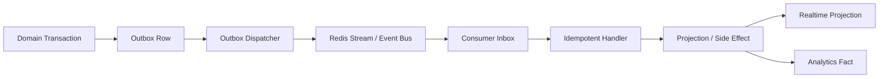
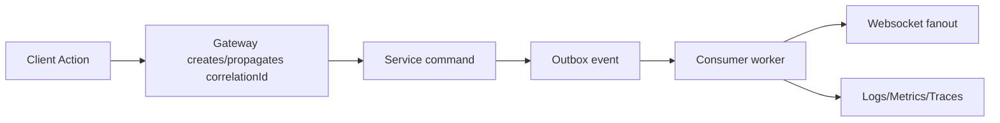
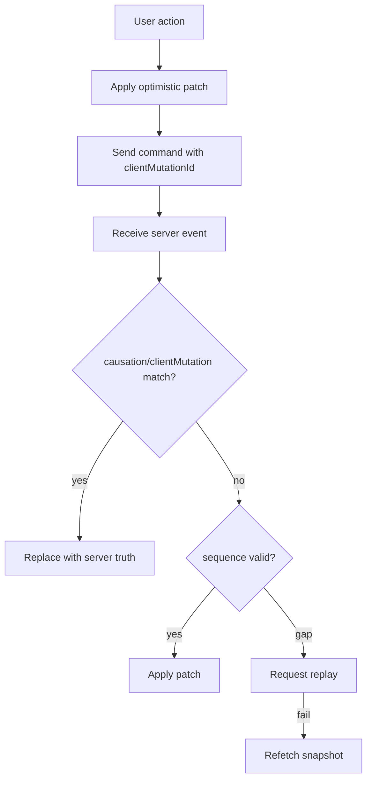
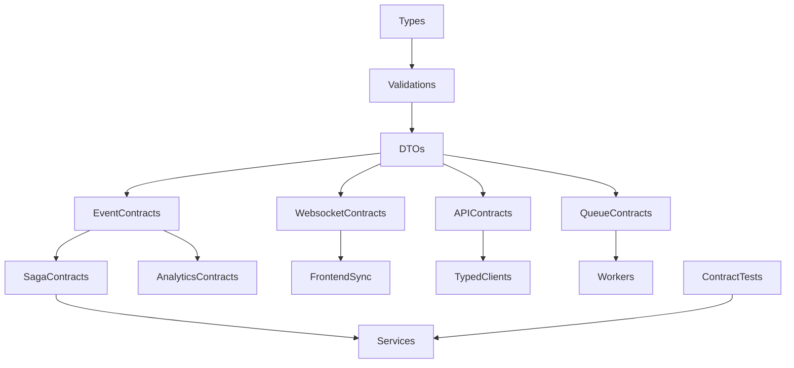

# VENDORHUB Phase 3 Distributed Communication

Internal Distributed Systems Communication and Event Coordination Constitution for VENDORHUB

Status: locked baseline before service implementation  
Depends on: `docs/VENDORHUB_PHASE_0_SYSTEM_LOCK.md`, `docs/VENDORHUB_PHASE_1_ENGINEERING_FOUNDATION.md`, `docs/VENDORHUB_PHASE_2_VISUAL_INFRASTRUCTURE.md`  
Scope: DTOs, validation, API contracts, event contracts, websocket contracts, queues, retries, idempotency, replay, observability, analytics contracts, contract testing, AI-assisted contract workflow  
Non-goal: service implementation

---

## 0. Communication Lock

VENDORHUB is a realtime distributed orchestration platform. Its core product is not only commerce UI, order records, or delivery tracking. Its core product is reliable communication between independent domains under operational pressure.

The central communication truth:

```txt
VENDORHUB state changes must be typed, observable, idempotent, replayable, and owned.
```

Every command, response, event, websocket message, queue job, analytics fact, and saga transition must answer:

- who owns this contract?
- who is allowed to produce it?
- who is allowed to consume it?
- what schema validates it?
- how is it versioned?
- how is it traced?
- how is it retried?
- how is it deduplicated?
- how is it replayed?
- what happens when it fails?

No service may invent private shapes for public communication. No frontend may parse raw payloads outside shared schemas. No event may exist without metadata. No cross-domain mutation may exist without idempotency.

---

## 1. Complete Communication Philosophy of VENDORHUB

### 1.1 How VENDORHUB Communicates Internally

VENDORHUB communicates through four primary mechanisms:

1. Synchronous APIs for direct command/query operations.
2. Domain and integration events for durable cross-service propagation.
3. Queues for retryable asynchronous work and delayed jobs.
4. Websocket messages for client-facing realtime projections and commands.

Each mechanism has a different consistency contract. The platform must not blur them.

Synchronous APIs answer immediate questions or accept commands. Events announce committed facts. Queues execute work. Websocket messages synchronize clients with operational reality.

### 1.2 Why VENDORHUB Is Event-Driven

VENDORHUB is event-driven because order orchestration spans independently owned domains:

- inventory must reserve stock
- payment must authorize and capture money
- logistics must assign riders and update ETA
- notifications must inform actors
- analytics must derive operational signals
- search must update availability projections
- admin dashboards must observe exceptions

No single transaction can safely own all of this. Events let each domain commit local truth, publish facts, and allow downstream systems to react idempotently.

Events are not incidental messages. They are the audit spine of the marketplace.

### 1.3 Why Contract-First Engineering Is Mandatory

In VENDORHUB, contract-first means schemas are created before implementation. This prevents services, frontend apps, websocket gateways, analytics pipelines, and AI-generated code from drifting.

Contract-first rules:

- define DTO/schema first
- define owner and consumers
- define versioning and compatibility
- define validation and error envelope
- define observability metadata
- then implement producer and consumers

### 1.4 Synchronous vs Asynchronous Philosophy

Use synchronous APIs when:

- a user needs immediate response
- a service needs a current read
- latency is bounded and dependency is acceptable
- no durable cross-domain fact is being propagated

Use async events/queues when:

- a domain fact has been committed
- work can be retried
- cross-domain state must propagate
- side effects are provider-dependent
- failure should not block the original transaction

Never use synchronous calls to create distributed transactions across services.

### 1.5 Communication Principles

- Contracts are shared source of truth.
- Domain facts are emitted as events after local commit.
- Commands are idempotent.
- Events are immutable.
- Consumers are idempotent.
- Realtime messages are projections, not durable truth.
- Correlation IDs are mandatory.
- Observability metadata is part of every contract.
- Version changes are backward compatible by default.
- AI-generated code must import, not recreate, contracts.

---

## 2. Complete Shared Contract Architecture

### 2.1 Package Topology

```txt
packages/
├── types/
├── validations/
├── websocket-events/
├── contracts/
├── orchestration/
└── analytics-contracts/
```

### 2.2 packages/types

Purpose:

- pure TypeScript shapes that carry no runtime dependencies

Exports:

- shared DTO interfaces/types
- domain enums
- API envelope types
- event envelope types
- common branded ids
- money, geo, pagination, audit, metadata types

Ownership:

- platform architecture team with domain owner approval

Governance:

- no runtime imports
- no database row types
- no frontend-only or backend-only assumptions
- DTO names are immutable once public

Versioning:

- additive changes minor
- breaking changes require new DTO version

### 2.3 packages/validations

Purpose:

- runtime validation with Zod

Exports:

- request schemas
- response schemas
- event payload schemas
- websocket payload schemas
- queue job schemas
- analytics event schemas
- reusable primitives

Dependency rules:

- may derive types from Zod
- may import primitive types only when safe
- may not import apps or services

Governance:

- every external boundary validates with these schemas
- schema changes require compatibility tests

### 2.4 packages/websocket-events

Purpose:

- websocket protocol contracts

Exports:

- message envelope schema
- topic builders
- subscription schemas
- ack schemas
- replay cursor schemas
- server-to-client message schemas
- client-to-server command schemas

Governance:

- no undocumented topic
- no untyped message
- every critical message defines ack and replay behavior

### 2.5 packages/contracts

Purpose:

- API and event contract registry

Exports:

- REST endpoint definitions
- OpenAPI generation input
- domain event catalog
- integration event catalog
- queue job catalog
- error code catalog

Governance:

- contracts are reviewed before implementation
- public events are append-compatible
- endpoint ownership is explicit

### 2.6 packages/orchestration

Purpose:

- reusable distributed workflow primitives

Exports:

- saga step types
- retry policies
- idempotency helpers
- outbox/inbox interfaces
- command metadata types
- compensation result types

Governance:

- mechanics only, not hidden domain business logic

### 2.7 packages/analytics-contracts

Purpose:

- product, operational, and experimentation analytics schemas

Exports:

- analytics event envelope
- client event schemas
- backend operational event schemas
- KPI fact schemas
- experiment assignment schemas

Governance:

- no raw PII
- schema registry required
- analytics events are append-only and replayable

---

## 3. Complete DTO Architecture

### 3.1 DTO Philosophy

DTOs are immutable communication shapes. They are not database rows and not internal domain models. A service may transform from domain model to DTO, but consumers must depend only on DTO contracts.

DTO categories:

- API DTOs
- websocket DTOs
- event DTOs
- analytics DTOs
- orchestration DTOs
- provider adapter DTOs

### 3.2 Naming Conventions

Use PascalCase with suffix `DTO`.

Examples:

```txt
CreateOrderDTO
OrderSummaryDTO
InventoryReservationDTO
PaymentCaptureDTO
RiderAssignmentDTO
RealtimeTrackingDTO
AnalyticsEventDTO
KycCaseDTO
RefundRequestDTO
```

Request/response convention:

```txt
CreateOrderRequestDTO
CreateOrderResponseDTO
GetOrdersQueryDTO
PaginatedOrdersResponseDTO
```

### 3.3 Core DTO Families

Order DTOs:

- owner: order-service
- lifecycle: draft contract -> reviewed -> implemented -> versioned
- validation: order ids, buyer/vendor ids, monetary totals, status enum
- frontend usage: order lists, tracking, seller/admin order detail
- backend usage: API responses, event payloads, saga commands
- metadata: orderId, version, correlationId where command-related

Inventory DTOs:

- owner: inventory-service
- includes: InventoryItemDTO, InventoryReservationDTO, StockMovementDTO
- validation: non-negative quantities, variant ownership, expiry timestamp
- serialization: integers for quantities, ISO timestamps
- frontend usage: seller inventory, cart availability
- backend usage: reservation commands, availability events

Payment DTOs:

- owner: payment-service
- includes: PaymentIntentDTO, PaymentCaptureDTO, RefundDTO, PayoutDTO, LedgerEntryDTO
- validation: integer minor currency units, ISO currency, provider refs masked
- frontend usage: checkout status, payouts, refunds
- backend usage: provider adapters, ledger events
- rule: no card data in DTOs

Logistics DTOs:

- owner: logistics-service
- includes: RiderAssignmentDTO, DeliveryRouteDTO, RealtimeTrackingDTO, EtaDTO
- validation: lat/lng range, H3 cell, timestamp, accuracy
- serialization: coordinates as numbers, route polyline as string
- frontend usage: rider app, buyer tracking, admin fleet map

Moderation DTOs:

- owner: moderation-service
- includes: KycCaseDTO, FraudSignalDTO, RiskHoldDTO
- validation: severity enum, subject type/id, reason code
- frontend usage: admin moderation/fraud queues
- backend usage: holds consumed by order/payment/vendor workflows

Analytics DTOs:

- owner: analytics-service
- includes: AnalyticsEventDTO, FunnelEventDTO, KpiFactDTO, ExperimentAssignmentDTO
- validation: event name namespace, actor/session ids, properties schema
- serialization: append-only JSON with typed properties

### 3.4 Nested DTO Rules

- nested DTOs must be stable reusable concepts
- do not inline complex repeated shapes in multiple DTOs
- maximum nesting depth should remain shallow for API DTOs
- lists must define ordering semantics
- optional fields must mean truly optional, not unknown due to lazy loading

### 3.5 Enum Governance

- enums live in `packages/types` and matching Zod schemas
- enum values use UPPER_SNAKE_CASE for domain states
- adding enum values is potentially breaking for exhaustive consumers
- frontend must include unknown fallback for server enums where possible

### 3.6 DTO Evolution and Deprecation

Evolution:

- add optional fields
- add new enum values only with consumer review
- never change field meaning
- never change units without new field
- never reuse removed field names

Deprecation:

- mark field deprecated in contract docs
- keep field through at least one release window
- add replacement field
- monitor consumer usage
- remove only after compatibility approval

---

## 4. Complete Zod Validation Architecture

### 4.1 Validation Layers

Frontend:

- form validation
- optimistic mutation payload validation
- websocket message validation before cache patch

Gateway:

- public request validation
- auth metadata validation
- rate-limit key validation

Service:

- command/query validation
- domain invariant validation
- provider webhook validation

Queue:

- job payload validation before processing
- DLQ invalid payloads without retry when permanent

Analytics:

- event schema validation
- properties validation by event name

### 4.2 Schema Architecture

```txt
packages/validations/
  primitives/
    id.schema.ts
    money.schema.ts
    geo.schema.ts
    pagination.schema.ts
    metadata.schema.ts
  api/
  events/
  websocket/
  queues/
  analytics/
```

### 4.3 Validation Error Structure

```ts
type ValidationErrorDTO = {
  code: "VALIDATION_ERROR";
  message: string;
  correlationId: string;
  issues: Array<{
    path: string;
    rule: string;
    message: string;
  }>;
};
```

### 4.4 Governance

- all external input validated at boundary
- internal domain invariants validated separately
- schemas shared between frontend and backend
- no duplicated form-only schema when shared schema exists
- validation failures log code, path, service, correlationId, not raw sensitive payloads

Shared validation prevents AI inconsistency by giving generated code one obvious import path for every boundary shape.

---

## 5. Complete Event-Driven Architecture

### 5.1 Event Types

Domain events:

- facts emitted by a domain after local transaction commit

Integration events:

- public cross-service events derived from domain facts

Realtime events:

- client-facing projections emitted by websocket-gateway

Analytics events:

- behavioral or operational facts for measurement

Orchestration events:

- saga progress and compensation facts

Websocket events:

- typed socket messages sent to clients or accepted as client commands

### 5.2 Event Envelope

```ts
type VENDORHUBEvent<TPayload> = {
  eventId: string;
  eventName: string;
  eventVersion: number;
  timestamp: string;
  traceId: string;
  correlationId: string;
  causationId?: string;
  sourceService: string;
  actorId?: string;
  aggregateType: string;
  aggregateId: string;
  sequence?: number;
  idempotencyKey?: string;
  payload: TPayload;
  metadata: {
    environment: "development" | "staging" | "production";
    regionId?: string;
    vendorId?: string;
    tenantId?: string;
    schemaHash: string;
    producerVersion: string;
  };
};
```

### 5.3 Core Domain Event Catalog

| Event | Producer | Consumers | Ordering | Retry | DLQ | Idempotency | Replay |
|---|---|---|---|---|---|---|---|
| USER_REGISTERED | auth-service | analytics, notification, moderation | per userId | standard | auth DLQ | eventId | projections ok |
| SESSION_REVOKED | auth-service | gateway, websocket | per sessionId | fast | auth DLQ | sessionId+revokedAt | disconnect replay not required |
| VENDOR_OPENED | commerce/vendor | commerce, logistics, search, websocket | per vendorId | standard | vendor DLQ | vendorId+version | projections ok |
| VENDOR_CLOSED | commerce/vendor | commerce, inventory, order, logistics, websocket | per vendorId | standard | vendor DLQ | vendorId+version | projections ok |
| PRODUCT_PUBLISHED | commerce-service | search, analytics, websocket | per productId | standard | commerce DLQ | productId+version | search replay ok |
| PRODUCT_UPDATED | commerce-service | search, analytics, websocket | per productId | standard | commerce DLQ | productId+version | search replay ok |
| PRICE_CHANGED | commerce-service | search, analytics, websocket | per variantId | standard | commerce DLQ | variantId+priceVersion | projections ok |
| CHECKOUT_SUBMITTED | commerce-service | order-service, analytics | per checkoutSessionId | standard | commerce DLQ | checkoutSessionId+clientMutationId | order creation guarded |
| ORDER_CREATED | order-service | inventory, payment, analytics, websocket | per orderId | standard | order DLQ | orderId | saga replay guarded |
| ORDER_CONFIRMED | order-service | seller, logistics, inventory, websocket, analytics | per orderId | standard | order DLQ | orderId+stateVersion | projections ok |
| ORDER_CANCELLED | order-service | inventory, payment, logistics, notification, websocket | per orderId | standard | order DLQ | orderId+stateVersion | compensation guarded |
| INVENTORY_RESERVED | inventory-service | order-service, websocket, analytics | per orderId | standard | inventory DLQ | reservationId | saga replay guarded |
| INVENTORY_RELEASED | inventory-service | commerce, search, websocket | per vendorId+variantId | standard | inventory DLQ | reservationId+releaseReason | projections ok |
| INVENTORY_LOW_STOCK_DETECTED | inventory-service | seller-web, notification, analytics | per variantId | coalesced | inventory DLQ | variantId+thresholdWindow | safe |
| PAYMENT_AUTHORIZED | payment-service | order-service, analytics, websocket | per paymentIntentId | standard | payment DLQ | providerRef | no provider side effect replay |
| PAYMENT_CAPTURED | payment-service | order-service, analytics, settlement | per transactionId | standard | payment DLQ | transactionId | ledger replay read-only |
| PAYMENT_FAILED | payment-service | order-service, analytics, websocket | per paymentIntentId | standard | payment DLQ | paymentIntentId+failureCode | safe |
| REFUND_REQUESTED | payment-service | order-service, analytics | per refundId | standard | payment DLQ | refundId | provider guarded |
| REFUND_COMPLETED | payment-service | order-service, analytics, websocket | per refundId | standard | payment DLQ | providerRefundRef | projections ok |
| PAYOUT_INITIATED | payment-service | seller-web, analytics | per payoutId | standard | payment DLQ | payoutId | provider guarded |
| PAYOUT_COMPLETED | payment-service | seller-web, analytics | per payoutId | standard | payment DLQ | providerPayoutRef | projections ok |
| RIDER_ASSIGNED | logistics-service | order-service, buyer-web, seller-web, analytics | per orderId | standard | logistics DLQ | assignmentId | projections ok |
| DELIVERY_STARTED | logistics-service | order-service, buyer-web, analytics | per deliveryId | standard | logistics DLQ | deliveryId+state | projections ok |
| DELIVERY_COMPLETED | logistics-service | order-service, payment-service, analytics | per deliveryId | standard | logistics DLQ | deliveryId+proofId | settlement guarded |
| DELIVERY_FAILED | logistics-service | order-service, admin-web, analytics | per deliveryId | standard | logistics DLQ | deliveryId+failureCode | compensation guarded |
| KYC_APPROVED | moderation-service | payment, vendor, logistics, analytics | per subjectId | standard | moderation DLQ | caseId+decision | projections ok |
| FRAUD_HOLD_PLACED | moderation-service | order, payment, gateway, websocket | per subjectId | fast | moderation DLQ | holdId | projections ok |
| FRAUD_HOLD_RELEASED | moderation-service | order, payment, gateway, websocket | per subjectId | fast | moderation DLQ | holdId+releasedAt | projections ok |

Payload schemas are owned in `packages/validations/events` and indexed in `packages/contracts/events`.

### 5.4 Event Propagation



### 5.5 Service-Event Relationship

```txt
order-service consumes checkout, inventory, payment, logistics, moderation
order-service produces order lifecycle and saga events

inventory-service consumes checkout/order cancellation/vendor close
inventory-service produces reservation and stock events

payment-service consumes order lifecycle, fraud holds, KYC
payment-service produces payment, refund, payout, settlement events

logistics-service consumes order confirmed/ready/cancelled
logistics-service produces dispatch and delivery events

websocket-gateway consumes projection-ready events
websocket-gateway produces client-facing websocket messages
```

---

## 6. Complete Event Metadata System

### 6.1 Mandatory Metadata

Every event contains:

```ts
eventId
eventName
eventVersion
timestamp
traceId
correlationId
sourceService
actorId
payload
metadata
```

Additional required when applicable:

- causationId
- aggregateType
- aggregateId
- sequence
- idempotencyKey
- regionId
- vendorId
- schemaHash
- producerVersion

### 6.2 Correlation IDs

Correlation IDs connect all work caused by one user action or automated workflow.

Lifecycle:



Rules:

- gateway creates correlationId if absent
- services must propagate correlationId to events and queues
- workers must log correlationId
- websocket messages include correlationId
- frontend error reports include correlationId where available

### 6.3 Tracing

Trace IDs follow execution path through OpenTelemetry. Correlation IDs follow business workflow. Both are required.

Tracing propagation:

- HTTP headers
- queue job metadata
- outbox envelope
- websocket message envelope
- provider webhook handling where possible

---

## 7. Complete Saga Orchestration Architecture

### 7.1 Saga Types

Orchestration saga:

- order-service explicitly coordinates steps
- used for order lifecycle

Choreography saga:

- services react to events without central coordinator
- used for analytics/search/notifications projections

### 7.2 Order Orchestration Flow

```txt
Order Created
↓
Inventory Reserved
↓
Payment Authorized
↓
Dispatch Assigned
↓
Delivery Started
↓
Delivered
↓
Settlement Completed
```

| Step | Trigger | Owner | Retry | Timeout | Compensation | Failure Recovery |
|---|---|---|---|---|---|---|
| Order Created | CHECKOUT_SUBMITTED | order-service | idempotent create | checkout expiry | fail order | release no resources |
| Inventory Reserved | ORDER_CREATED | inventory-service | 5 attempts | reservation TTL | release partial reservation | order failed |
| Payment Authorized | INVENTORY_RESERVED | payment-service | provider-safe backoff | auth window | release inventory | payment retry or fail |
| Dispatch Assigned | ORDER_CONFIRMED | logistics-service | offer next rider | offer expiry | cancel dispatch | manual dispatch/admin alert |
| Delivery Started | RIDER_ASSIGNED + pickup | logistics-service | standard | pickup SLA | reassign/cancel | incident workflow |
| Delivered | DELIVERY_COMPLETED | order/logistics | standard | delivery SLA | refund/incident | admin review |
| Settlement Completed | ORDER_COMPLETED | payment-service | provider-safe | settlement cycle | payout hold | reconciliation |

### 7.3 Compensation Flows

```txt
PAYMENT_FAILED -> RELEASE_INVENTORY -> ORDER_FAILED
RIDER_UNAVAILABLE -> REASSIGN_DISPATCH -> RIDER_ASSIGNED
VENDOR_REJECTED -> VOID_PAYMENT_AUTH -> RELEASE_INVENTORY -> ORDER_CANCELLED
DELIVERY_FAILED -> CREATE_INCIDENT -> REFUND_REVIEW -> REFUND_REQUESTED
FRAUD_HOLD_PLACED -> PAUSE_ORDER_OR_PAYMENT -> ADMIN_REVIEW
```

Pivot transactions:

- inventory reservation is reversible
- payment authorization is reversible through void
- payment capture requires refund
- delivery pickup requires incident handling
- payout completion requires provider-specific reversal path

Saga rollback is not database rollback. It is compensating forward progress.

---

## 8. Complete Websocket Contract Architecture

### 8.1 Namespaces and Channels

Namespaces:

```txt
/buyer
/seller
/admin
/rider
/internal
```

Channels:

```txt
order:{orderId}
buyer:{buyerId}:orders
vendor:{vendorId}:orders
vendor:{vendorId}:inventory
rider:{riderId}:assignments
rider:{riderId}:route
admin:ops:{regionId}
admin:fraud
admin:moderation
analytics:live:{scope}
```

### 8.2 Websocket Envelope

```ts
type WebsocketMessage<TPayload> = {
  messageId: string;
  messageName: string;
  messageVersion: number;
  topic: string;
  sequence: number;
  timestamp: string;
  traceId: string;
  correlationId: string;
  sourceEventId?: string;
  requiresAck: boolean;
  replayable: boolean;
  payload: TPayload;
};
```

### 8.3 Websocket Events

| Event | Publisher | Subscribers | Frequency | Throttle | Batch | Replay |
|---|---|---|---|---|---|---|
| ORDER_STATUS_UPDATED | websocket-gateway | buyer, seller, admin | per state change | none | no | yes |
| ORDER_TIMELINE_APPENDED | websocket-gateway | buyer, seller, admin | per timeline event | none | possible | yes |
| RIDER_LOCATION_UPDATED | logistics/ws | buyer tracking, admin, rider | high | coalesce 2-5s for buyer/admin | yes | limited |
| ETA_UPDATED | websocket-gateway | buyer, seller, admin | medium | threshold-based | yes | yes |
| NEW_SELLER_ORDER | websocket-gateway | seller | per order | none | no | yes |
| LOW_STOCK_ALERT | websocket-gateway | seller | low | coalesce by variant | yes | yes |
| LIVE_GMV_UPDATED | analytics/ws | admin | aggregate interval | 5-10s | yes | no/snapshot |
| FRAUD_ALERT_TRIGGERED | websocket-gateway | admin | per alert | none | no | yes |
| MODERATION_CASE_UPDATED | websocket-gateway | admin | per change | none | yes | yes |
| DISPATCH_OFFER_CREATED | websocket-gateway | rider | per offer | none | no | yes until expiry |
| DISPATCH_OFFER_EXPIRED | websocket-gateway | rider | per expiry | none | no | yes |
| DELIVERY_ROUTE_UPDATED | websocket-gateway | rider, buyer | route change | threshold | no | yes |
| CONNECTION_SNAPSHOT_REQUIRED | websocket-gateway | any client | reconnect | none | no | no |

### 8.4 Subscription Lifecycle

```txt
connect -> authenticate -> subscribe -> authorize topic -> send cursor
-> receive snapshot/catchup -> stream messages -> ack critical messages
-> unsubscribe/disconnect
```

Reconnect:

- client sends last acknowledged cursor per topic
- server replays messages after cursor
- if cursor expired, server sends snapshot-required
- client refetches authoritative snapshot through REST

Redis integration:

- pub/sub for immediate fanout
- streams for replayable topic messages
- session registry for connection ownership

---

## 9. Complete API Architecture

### 9.1 API Governance

Route naming:

```txt
/v1/<resource>
/v1/<resource>/{id}
/v1/<resource>/{id}/<command>
```

Rules:

- nouns for resources
- explicit command subroutes for workflow transitions
- idempotency key required for mutating commands
- gateway is public facade
- internal APIs are private and authenticated service-to-service

Pagination:

- cursor pagination for operational lists
- offset only for small static lists

Filtering:

- query params use snake_case
- complex filters use POST search endpoint only when GET becomes unsafe

Sorting:

- `sort=created_at:desc`

Error envelope:

```ts
type ApiErrorDTO = {
  code: string;
  message: string;
  correlationId: string;
  details?: unknown;
};
```

### 9.2 Endpoint Families

Gateway APIs:

- auth/session
- catalog/cart/checkout
- orders
- seller inventory/orders
- rider assignments/deliveries
- admin operations/moderation

Internal service APIs:

- reserve inventory
- create/authorize/capture payment
- request dispatch
- update search projection
- ingest analytics event

For each endpoint contract must define:

- route
- owner service
- request schema
- response schema
- auth rules
- rate limit
- cache strategy
- retry strategy
- emitted events
- failure states

Example:

```txt
POST /v1/orders/{orderId}/cancel
Owner: order-service
Request: CancelOrderRequestDTO
Response: OrderDTO
Auth: buyer owner, seller scoped, admin override
Rate: 10/min/user
Cache: no-store
Retry: idempotency key required
Events: ORDER_CANCEL_REQUESTED, ORDER_CANCELLED
Failures: ORDER_NOT_FOUND, ORDER_NOT_CANCELLABLE, PAYMENT_COMPENSATION_FAILED
```

---

## 10. Complete Internal Service Communication

### 10.1 Synchronous Allowed

Allowed when:

- gateway calls owning service for command/query
- service reads non-authoritative projection
- internal command requires immediate validation and has idempotency
- latency budget is explicit

### 10.2 Async Mandatory

Mandatory when:

- a committed fact must propagate to other domains
- side effects can retry
- workflow crosses payment/inventory/logistics boundaries
- provider webhooks update state
- projection updates search/analytics/realtime

### 10.3 gRPC Tradeoffs

Phase 1/3 default is REST/internal HTTP plus event bus. gRPC may be introduced later for high-volume internal RPC after:

- contract registry is mature
- service mesh or internal routing exists
- streaming needs justify complexity

### 10.4 Anti-Corruption Layers

- payment provider adapter maps provider statuses to payment contracts
- route provider adapter maps external route model to logistics DTOs
- KYC adapter maps provider results to moderation events
- analytics adapter maps domain facts to analytics event contracts

Provider-specific enums never leak into domain contracts.

---

## 11. Complete Redis Pub/Sub and Queue Contracts

### 11.1 Pub/Sub Channels

```txt
rt.order.{orderId}
rt.vendor.{vendorId}.orders
rt.vendor.{vendorId}.inventory
rt.rider.{riderId}.assignments
rt.admin.ops.{regionId}
rt.admin.fraud
```

### 11.2 BullMQ Queue Contracts

| Queue | Owner | Payload Schema | Dedup Key | DLQ |
|---|---|---|---|---|
| order-saga | order-service | OrderSagaJobSchema | orderId+step | order-saga-dlq |
| inventory-reservations | inventory-service | ReservationJobSchema | reservationId+action | inventory-dlq |
| payment-webhooks | payment-service | PaymentWebhookJobSchema | providerEventId | payment-dlq |
| payment-reconciliation | payment-service | PaymentReconciliationJobSchema | paymentIntentId+window | payment-dlq |
| logistics-dispatch | logistics-service | DispatchJobSchema | orderId+attempt | logistics-dlq |
| search-indexing | search-service | SearchIndexJobSchema | sourceEventId | search-dlq |
| analytics-ingestion | analytics-service | AnalyticsIngestionJobSchema | eventId | analytics-dlq |
| websocket-replay | websocket-gateway | ReplayJobSchema | connectionId+topic+cursor | websocket-dlq |

### 11.3 Guarantees

- queues are at-least-once
- workers are idempotent
- permanent validation failures go to DLQ
- retryable failures use backoff
- replay jobs cannot trigger external provider side effects

---

## 12. Complete Retry and Idempotency Architecture

### 12.1 Retry Rules

Default backoff:

```txt
attempt 1: immediate
attempt 2: 10 seconds
attempt 3: 60 seconds
attempt 4: 5 minutes
attempt 5: 30 minutes
then DLQ
```

Provider retries:

- exponential backoff with jitter
- circuit breaker
- provider idempotency key
- reconciliation job for uncertain states

Websocket reconnect:

- 1s, 2s, 5s, 10s, 30s with jitter
- replay from cursor
- snapshot fallback

### 12.2 Idempotency Key Strategy

API:

```txt
Idempotency-Key: userId:operation:clientMutationId
```

Order:

- checkoutSessionId + clientMutationId

Payment:

- orderId + payment operation + attempt
- provider idempotency key stored with transaction

Queue:

- job-specific deterministic dedup key

Event:

- eventId for consumer inbox
- aggregateId + sequence for ordered streams

Distributed systems require idempotency because retries, replays, reconnects, and provider webhooks create duplicate delivery by design.

---

## 13. Complete Event Versioning Strategy

### 13.1 Versioning Rules

DTO:

- additive optional fields allowed
- breaking changes require new DTO or API version

Event:

- eventVersion integer
- producers may emit latest version only after consumers support it
- consumers must tolerate unknown optional fields

Websocket:

- messageVersion integer
- client compatibility matrix maintained

API:

- URI major version `/v1`
- additive response fields allowed
- breaking changes require `/v2` or endpoint-specific migration

### 13.2 Compatibility Rules

Backward compatible:

- add optional field
- add new event type
- add enum value only if consumers handle unknown

Breaking:

- rename field
- remove field
- change type
- change units
- change meaning
- alter ordering guarantees

Deprecation workflow:

```txt
announce -> add replacement -> dual publish/respond -> monitor consumers
-> mark deprecated -> remove after approved window
```

---

## 14. Complete Observability Contract Architecture

### 14.1 Structured Logs

Every communication log includes:

```txt
timestamp
level
service
environment
correlationId
traceId
actorId
eventId/messageId/jobId
aggregateId
contractName
contractVersion
result
durationMs
```

### 14.2 Error Propagation

- API errors include correlationId
- events include failure metadata only in failure events
- queue failures include jobId and original correlationId
- websocket errors include messageId and topic

### 14.3 Debugging Distributed Workflows

Debug order failure:

```txt
correlationId -> gateway log -> order command -> outbox event
-> inventory inbox/job -> inventory event -> payment inbox/job
-> websocket fanout -> client ack
```

If any hop lacks metadata, the contract is incomplete.

---

## 15. Complete Frontend-Backend Synchronization Strategy

### 15.1 State Layers

```txt
server source of truth
REST snapshot
TanStack Query cache
websocket patch stream
optimistic mutation layer
Zustand ephemeral UI state
```

### 15.2 Optimistic Flow



Rollback:

- revert optimistic patch
- show structured error
- keep user context
- refetch affected query if state uncertain

Cache invalidation:

- event patches when safe
- invalidation when patch cannot be proven safe
- snapshot restore after reconnect gap

Offline:

- rider location queues locally within policy
- buyer/seller/admin primarily read stale snapshots and retry commands when online

---

## 16. Complete Analytics Event Architecture

### 16.1 Analytics Envelope

```ts
type AnalyticsEvent<T> = {
  analyticsEventId: string;
  eventName: string;
  eventVersion: number;
  occurredAt: string;
  actorId?: string;
  sessionId?: string;
  role?: "buyer" | "seller" | "admin" | "rider";
  correlationId?: string;
  source: "client" | "service" | "worker";
  properties: T;
};
```

### 16.2 Event Families

Buyer:

- PRODUCT_VIEWED
- SEARCH_PERFORMED
- CART_ITEM_ADDED
- CHECKOUT_STARTED
- CHECKOUT_SUBMITTED
- ORDER_TRACKING_VIEWED

Seller:

- SELLER_ORDER_ACCEPTED
- SELLER_ORDER_REJECTED
- INVENTORY_ADJUSTED_BY_SELLER
- PAYOUT_VIEWED

Admin:

- FRAUD_CASE_OPENED
- MODERATION_DECISION_SUBMITTED
- INCIDENT_ACKNOWLEDGED
- AUDIT_SEARCH_PERFORMED

Logistics:

- RIDER_SHIFT_STARTED
- ASSIGNMENT_ACCEPTED
- ASSIGNMENT_DECLINED
- PICKUP_CONFIRMED
- DELIVERY_CONFIRMED

Operational KPI:

- ORDER_CONVERSION_FACT
- RESERVATION_FAILURE_FACT
- PAYMENT_FAILURE_FACT
- DISPATCH_LATENCY_FACT
- DELIVERY_SLA_FACT

Experimentation:

- EXPERIMENT_ASSIGNED
- EXPERIMENT_EXPOSED
- EXPERIMENT_CONVERTED

### 16.3 Ingestion Strategy

- client SDK batches and validates
- backend emits operational analytics from domain events
- analytics pipeline is append-only
- replay from domain events rebuilds facts
- no raw PII in analytics properties

---

## 17. Complete Contract Testing Strategy

### 17.1 Test Types

DTO tests:

- compile-time type checks
- serialization snapshots

Schema tests:

- valid fixtures pass
- invalid fixtures fail
- error structure stable

Event contract tests:

- producer emits schema-valid event
- consumer fixtures support current and previous versions
- event compatibility snapshot

Websocket tests:

- message schema validation
- topic authorization fixture
- replay cursor behavior
- sequence gap handling

API compatibility:

- OpenAPI generation check
- request/response fixture tests
- consumer-driven contract tests for frontend clients

Replay tests:

- replay events into projection in dry-run mode
- assert idempotent results

### 17.2 CI Enforcement

CI fails when:

- contract schema changes without version/fixture update
- event payload breaks consumer fixture
- endpoint response removes required field
- websocket message changes without compatibility note
- package exports allow invalid deep imports

---

## 18. Complete Engineering Governance Rules

### 18.1 Naming

Events:

- UPPER_SNAKE_CASE past tense for facts: `ORDER_CREATED`
- command-like events are forbidden unless they represent an accepted command fact

DTOs:

- PascalCase + DTO suffix

Websocket messages:

- UPPER_SNAKE_CASE client-facing state/update names

Queues:

- kebab-case domain-purpose

API:

- `/v1/resource/{id}/command`

### 18.2 Ownership Rules

- domain owner owns DTOs/events for its aggregate
- websocket-gateway owns socket envelope and topic contract
- producing service owns payload correctness
- consuming service owns idempotent handling
- contracts package owns registry

### 18.3 Import Rules

- services import contracts from packages only
- no service imports another service source
- frontends import DTOs/schemas, not service internals
- analytics contracts cannot import UI or service code

---

## 19. Complete AI-Assisted Contract Engineering Workflow

### 19.1 DTO Prompt

```txt
Create DTO contract for <workflow>.
Owner service: <service>.
Consumers: <apps/services>.
Define DTO name, fields, validation schema, serialization rules, metadata, versioning impact, and fixtures.
Do not use database row types.
```

### 19.2 Event Prompt

```txt
Create event <EVENT_NAME>.
Define producer, consumers, payload schema, ordering key, retry behavior, DLQ behavior, idempotency key, replay behavior, and observability metadata.
Add contract registry entry and compatibility fixtures.
```

### 19.3 Websocket Prompt

```txt
Create websocket message <MESSAGE_NAME>.
Define topic, publisher, subscribers, payload, sequence behavior, ack requirement, replay behavior, throttling, batching, and frontend reconciliation rule.
```

### 19.4 API Prompt

```txt
Define API endpoint <METHOD PATH>.
Owner service: <service>.
Define request/response schemas, auth, rate limit, cache policy, idempotency, emitted events, errors, and tests.
```

### 19.5 Review Prompt

```txt
Review these contract changes for VENDORHUB distributed communication compliance.
Find duplicated DTOs, schema drift, missing metadata, missing idempotency, missing replay behavior, invalid event naming, missing consumer compatibility, and observability gaps.
Return findings with file and line references.
```

AI must never generate a service handler before the contract exists.

---

## 20. Complete Implementation Sequencing

### 20.1 Exact Build Order

1. Create `packages/types` ids, money, geo, pagination, metadata primitives.
2. Create `packages/validations` primitive schemas.
3. Create API, event, websocket, queue, analytics envelopes.
4. Create contract registry in `packages/contracts`.
5. Create core DTOs for identity, commerce, inventory, order, payment, logistics, moderation.
6. Create event payload schemas and fixtures.
7. Create websocket topic builders and message schemas.
8. Create queue job schemas.
9. Create API endpoint contract definitions.
10. Create orchestration saga types and retry/idempotency helpers.
11. Create contract tests and compatibility snapshots.
12. Create code generation for typed clients/docs.
13. Only then scaffold service handlers.

### 20.2 Dependency Graph



### 20.3 Must Exist Before Service Implementation

- shared primitive types
- validation schemas
- API envelopes
- event envelopes
- websocket envelopes
- error envelopes
- idempotency metadata
- correlation/trace metadata
- core event catalog
- queue job schemas
- contract test harness

---

## 21. Final Phase 3 Lock Rules

1. Contracts precede implementation.
2. DTOs are communication shapes, not database rows.
3. Zod schemas validate every boundary.
4. Events are immutable facts.
5. Every event has metadata, ownership, retry, idempotency, DLQ, and replay rules.
6. Websocket messages are typed projections with sequence and recovery semantics.
7. Queues are at-least-once; handlers are idempotent.
8. Provider side effects are never replayed without explicit guard.
9. Correlation IDs and trace IDs are mandatory.
10. API changes are versioned and tested against consumers.
11. Analytics events are schema-governed and PII-safe.
12. AI-generated code must import existing contracts and may not invent shapes.
13. Contract tests block breaking changes.
14. Breaking communication changes require ADR and migration plan.
15. Service implementation cannot begin before the communication foundation exists.

This document locks the distributed communication foundation for VENDORHUB Phase 3.
