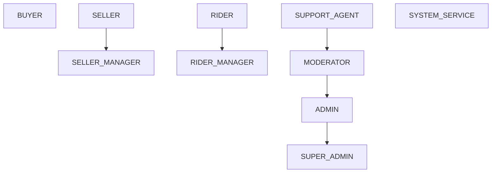
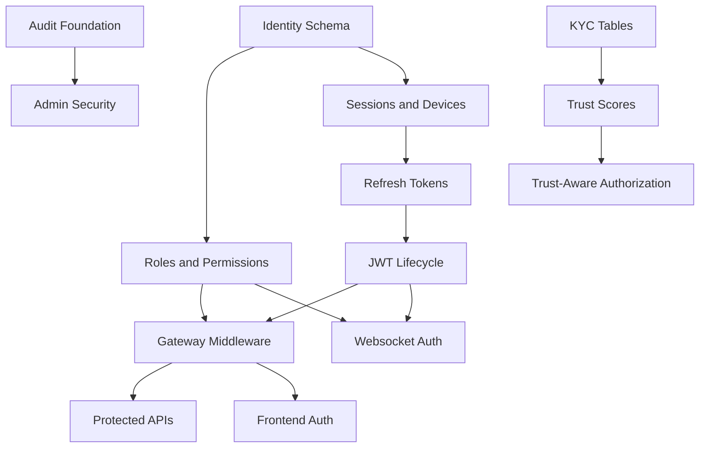

# VENDORHUB Phase 4 Identity, Trust, and Security

Internal Identity, Authorization, and Trust Infrastructure Constitution for VENDORHUB

Status: locked baseline before protected APIs and realtime channels are implemented  
Depends on: `docs/VENDORHUB_PHASE_0_SYSTEM_LOCK.md`, `docs/VENDORHUB_PHASE_1_ENGINEERING_FOUNDATION.md`, `docs/VENDORHUB_PHASE_3_DISTRIBUTED_COMMUNICATION.md`  
Scope: authentication, identity lifecycle, sessions, JWTs, RBAC, authorization, websocket security, admin security, KYC/trust, audit, abuse protection, service auth, frontend auth, auth testing, AI-assisted auth workflow  
Non-goal: implementation code

---

## 0. Identity Lock

VENDORHUB identity is operational authority. A user identity does not merely prove who someone is. It defines what they can see, which workflows they can influence, which realtime channels they can subscribe to, which financial operations they can trigger, and which audit trail records their actions.

The central identity truth:

```txt
VENDORHUB access is scoped, observable, revocable, and trust-aware.
```

Every authenticated action must answer:

- who is acting?
- through which session and device?
- under which role and scope?
- against which resource?
- with which permission?
- with which trust or verification status?
- through which enforcement point?
- with what audit record?
- how can access be revoked immediately?

Authentication proves identity. Authorization governs action. Trust determines marketplace risk. Auditability preserves accountability.

---

## 1. Complete Identity Philosophy of VENDORHUB

### 1.1 What Identity Means

In VENDORHUB, identity is a composite of:

- account identity: user, credentials, OAuth accounts, verified contact methods
- operational identity: role, permission, vendor/rider/admin scope
- session identity: device, refresh token family, session status
- trust identity: KYC status, risk score, fraud holds, verification history
- realtime identity: socket session, topic authorization, visibility rules
- audit identity: actor, action, resource, correlation id, trace id

Authentication alone is insufficient because VENDORHUB has high-impact workflows:

- sellers can accept/reject orders and change stock
- riders can accept delivery assignments and publish location
- admins can suspend sellers, review fraud, and trigger payout-related actions
- support agents can inspect user/order information
- services can publish events and execute compensations

### 1.2 Trust Philosophy

Trust is earned, scoped, and continuously evaluated. VENDORHUB should not treat every authenticated user as equally trusted.

Trust signals:

- verified email/phone
- device history
- KYC state
- seller business verification
- bank verification
- rider identity verification
- login anomaly score
- fraud signals
- order/payment history
- admin review outcomes

Trust gates actions. A seller may browse the seller dashboard before full KYC, but cannot receive payouts until verification. A rider may complete profile onboarding before dispatch eligibility, but cannot receive assignments until verification.

### 1.3 Authorization Philosophy

Authorization is infrastructure. It is enforced at:

- frontend navigation
- gateway route middleware
- service command handlers
- websocket subscription checks
- queue worker service identity checks
- admin elevated action guards
- database row-level policy where applicable

Frontend guards improve UX. Backend and websocket guards enforce security.

### 1.4 Auditability Philosophy

Every sensitive action must be reconstructable:

- actor
- role
- session
- device
- resource
- before/after state where safe
- reason
- approval/elevation context
- correlationId and traceId

Audit logs are immutable operational evidence, not analytics.

---

## 2. Complete Role System Architecture

### 2.1 Roles

Canonical roles:

```txt
BUYER
SELLER
SELLER_MANAGER
RIDER
RIDER_MANAGER
SUPPORT_AGENT
MODERATOR
ADMIN
SUPER_ADMIN
SYSTEM_SERVICE
```

### 2.2 Role Definitions

BUYER:

- permissions: catalog.read, cart.write, checkout.submit, orders.own.read, orders.own.cancel, profile.own.write
- scope: own buyer account
- systems: buyer-web, buyer APIs, own order realtime channels
- realtime visibility: own orders, own tracking
- restricted: seller/admin/rider systems, payout actions, moderation actions
- escalation: support request only

SELLER:

- permissions: seller.orders.read, seller.orders.act, inventory.read, inventory.write, catalog.write, seller.analytics.read, payouts.read
- scope: assigned vendor/outlet
- systems: seller-web
- realtime visibility: vendor order queue, vendor inventory, payout status
- restricted: refund issuance, payout mutation, admin moderation, other vendors
- escalation: seller manager/admin support

SELLER_MANAGER:

- inherits SELLER
- permissions: seller.users.manage, seller.settings.write, vendor.hours.write, vendor.serviceability.write
- scope: vendor organization
- restricted: platform admin, direct payout execution
- escalation: can manage seller team within vendor

RIDER:

- permissions: rider.shift.write, rider.assignments.read, rider.assignments.act, delivery.update, location.publish, earnings.read
- scope: own rider account and active assignments
- systems: rider-web
- realtime visibility: own assignments, route, dispatch messages
- restricted: admin data, other riders, payout modification
- escalation: rider support

RIDER_MANAGER:

- inherits limited rider fleet visibility
- permissions: riders.read.scoped, dispatch.monitor, dispatch.override.scoped
- scope: region/fleet
- restricted: financial admin, fraud decisions unless separately granted

SUPPORT_AGENT:

- permissions: support.orders.read, support.users.read.masked, support.tickets.write, refunds.request
- scope: assigned region/support queue
- realtime visibility: support queues, selected order status
- restricted: payout approval, role assignment, irreversible admin actions
- escalation: moderator/admin

MODERATOR:

- permissions: moderation.cases.read, moderation.cases.act, kyc.review, fraud.signals.read, holds.place.scoped, holds.release.scoped
- scope: moderation queue/region
- realtime visibility: fraud and moderation streams
- restricted: system settings, super admin actions, direct payout execution

ADMIN:

- permissions: admin.operations.read, vendors.suspend, riders.suspend, disputes.manage, refunds.approve, payouts.review, incidents.manage
- scope: platform or assigned region
- realtime visibility: admin ops, fraud, moderation, SLA dashboards
- restricted: super admin role grant, secrets, destructive global config
- escalation: elevated verification for sensitive actions

SUPER_ADMIN:

- permissions: all platform permissions except raw secrets access
- scope: global
- realtime visibility: global operational streams
- restricted: still subject to MFA, audit, dual control for extreme actions
- escalation: emergency procedures

SYSTEM_SERVICE:

- permissions: service-scoped actions only
- scope: service identity and allowed internal APIs/events
- systems: backend services/workers
- realtime visibility: internal fanout only where needed
- restricted: user-facing session actions unless delegated by service contract

### 2.3 Inheritance



Inheritance is not automatic global power. Every inherited permission remains scoped by resource.

### 2.4 Least Privilege

- users receive the narrowest role needed
- admin privileges are separated from support privileges
- payout, refund, KYC, role assignment, and suspension actions require explicit permissions
- support sees masked PII unless elevated
- role changes emit audit and invalidation events

---

## 3. Complete Authentication Architecture

### 3.1 Authentication Methods

Supported:

- email/password
- email OTP
- SMS OTP
- Google OAuth

Future:

- passkeys/WebAuthn for admin and high-risk roles

### 3.2 Email/Password

Signup lifecycle:

```txt
submit email/password -> validate -> create pending user -> send verification
-> verify email -> create session -> assign BUYER default role
```

Login lifecycle:

```txt
submit credentials -> rate-limit -> fetch credential hash
-> verify password -> risk check -> create session/device entry
-> issue access token + refresh token
```

Password hashing:

- Argon2id preferred
- bcrypt acceptable fallback only if platform constraints demand it
- per-password salt
- server-side pepper stored in secrets manager

Argon2id is preferred because it is memory-hard and more resistant to GPU cracking. bcrypt is mature but less memory-hard.

Password requirements:

- minimum 12 characters
- block common breached passwords
- no arbitrary composition rules that reduce usability
- password reset invalidates existing refresh token family by default for high-risk roles

Brute-force protection:

- per email hash
- per IP / subnet
- per device fingerprint
- progressive cooldown
- suspicious login event after threshold

Password reset:

```txt
request reset -> send single-use token -> verify token -> set new password
-> revoke active sessions depending risk -> audit event
```

### 3.3 OTP Authentication

OTP generation:

- cryptographically secure random 6 digits or equivalent
- stored hashed
- bound to purpose, user/contact, device, and nonce

Expiration:

- 5 minutes default
- max attempts: 5
- resend cooldown: 30-60 seconds
- daily cap by contact and IP

Delivery:

- email OTP primary for email flows
- SMS OTP for phone verification and rider flows where phone is operationally important
- fallback to email if SMS provider degraded and account has verified email

Replay protection:

- OTP marked consumed on success
- nonce required
- old OTP invalidated on new OTP for same purpose

Abuse prevention:

- rate-limit sends and verifies separately
- detect OTP spraying
- block premium-rate or suspicious numbers where provider supports it
- alert on high OTP failure velocity

### 3.4 Google OAuth

Lifecycle:

```txt
start OAuth -> state + PKCE -> provider consent -> callback
-> verify state/nonce -> exchange code -> fetch profile
-> link or create account -> risk check -> issue session
```

Trust model:

- Google verifies provider identity, not marketplace eligibility
- OAuth does not replace KYC
- OAuth email must be verified by provider before trusted as contact

Account linking:

- link by verified email only after user confirmation when existing account exists
- prevent silent merge of accounts with different verified phone/payment/vendor ownership
- high-risk merge requires OTP confirmation

---

## 4. Complete Session Management Architecture

### 4.1 Session Lifecycle

```txt
login -> create device -> create session -> create refresh token family
-> issue access JWT -> rotate refresh on use -> expire/revoke
```

Session states:

```txt
ACTIVE
EXPIRED
REVOKED
SUSPICIOUS
LOCKED
```

### 4.2 Token Lifetimes

Access token:

- 10-15 minutes
- short-lived to limit stolen-token window

Refresh token:

- 30 days buyer/seller/rider
- 12 hours to 7 days admin depending risk
- rotated on every refresh

Websocket auth token:

- 1-5 minutes to initiate connection
- socket bound to session after validation

### 4.3 Refresh Rotation

Rules:

- refresh token is opaque, random, and stored hashed
- every refresh issues new refresh token
- old token becomes consumed
- reuse of consumed token revokes the token family
- refresh includes device/session validation

Replay prevention:

- bind refresh token to session and device
- reuse detection
- IP/device anomaly scoring

### 4.4 Storage

Postgres:

- durable sessions, devices, refresh token metadata, audit

Redis:

- hot session cache
- token revocation cache
- permission cache
- websocket session binding

Distributed consistency:

- auth-service is source of truth
- gateway caches short-lived permission/session data
- SESSION_REVOKED and PERMISSION_CHANGED invalidate gateway/websocket caches

---

## 5. Complete JWT Architecture

### 5.1 Token Types

Access token:

- signed JWT
- short-lived
- used for API requests

Refresh token:

- opaque random token
- not JWT
- stored hashed server-side

Service token:

- signed JWT or mTLS-bound token for internal service calls
- short-lived
- includes service identity and scopes

Websocket auth token:

- signed short-lived token
- used only for socket handshake

### 5.2 Access JWT Claims

```json
{
  "sub": "user_id",
  "role": "SELLER",
  "permissions": [],
  "sessionId": "",
  "deviceId": "",
  "scope": {
    "vendorIds": [],
    "regionIds": []
  },
  "traceId": "",
  "iat": "",
  "exp": "",
  "iss": "VENDORHUB-auth-service",
  "aud": "VENDORHUB-api",
  "kid": "signing_key_id"
}
```

### 5.3 Signing Strategy

- asymmetric signing preferred for access/service/websocket tokens
- key id included in header
- keys rotate with overlap period
- old keys retained until all tokens expire
- compromised key triggers forced revocation policy

### 5.4 Secure Cookie Strategy

Browser refresh token:

- HttpOnly
- Secure
- SameSite=Lax or Strict depending flow
- path-scoped to refresh endpoint where practical

Access token:

- ideally memory-held by frontend session layer or delivered through server session pattern
- never stored in localStorage

### 5.5 Revocation

Revocation layers:

- session status in Postgres
- Redis revocation cache by sessionId/token family
- gateway permission cache invalidation
- websocket disconnect on SESSION_REVOKED

Blacklist:

- access-token blacklist only for high-risk revocations due short TTL
- session-level revocation preferred

---

## 6. Complete RBAC and Permission Architecture

### 6.1 Permission Naming

Format:

```txt
resource.action[.scope]
```

Examples:

```txt
orders.read
orders.write
orders.cancel.own
inventory.reserve
inventory.adjust.vendor
payments.refund
payouts.review
admin.moderate
seller.analytics.read
websocket.subscribe.vendor_orders
```

### 6.2 Permission Matrix

| Permission | Scope | Owner | Enforcement Points |
|---|---|---|---|
| orders.read.own | buyer own orders | order-service | gateway, order-service |
| orders.read.vendor | vendor orders | order-service | gateway, seller-web, websocket |
| orders.cancel.own | pre-delivery own order | order-service | gateway, order-service |
| seller.orders.act | accept/reject/ready | order-service | gateway, order-service |
| inventory.adjust.vendor | vendor stock | inventory-service | gateway, inventory-service |
| inventory.reserve | service-only reservation | inventory-service | internal service auth |
| payments.refund.request | support/admin request | payment-service | gateway, payment-service |
| payments.refund.approve | admin approval | payment-service | elevated admin |
| payouts.review | seller/admin payout read | payment-service | gateway, payment-service |
| payouts.release | admin/system only | payment-service | elevated admin/service |
| rider.location.publish | own active shift | logistics-service | websocket, logistics |
| dispatch.override.scoped | regional override | logistics-service | admin/rider-manager |
| moderation.cases.act | assigned cases | moderation-service | gateway, moderation |
| fraud.holds.place | risk hold | moderation-service | elevated moderator/admin |
| roles.assign | role assignment | auth-service | super admin/elevated |
| websocket.subscribe.order | order topic | websocket-gateway | socket auth |

### 6.3 RBAC plus ABAC

RBAC grants capability. ABAC constrains resource access.

Examples:

- SELLER can read orders only where vendorId is assigned.
- RIDER can update only active delivery assigned to riderId.
- SUPPORT_AGENT can read masked user data only for assigned ticket/order.
- ADMIN may need region scope.

ABAC conditions:

- resource owner
- vendor membership
- region assignment
- KYC status
- trust score threshold
- session risk
- admin elevation age

---

## 7. Complete Authorization Middleware Architecture

### 7.1 Middleware Order

```txt
request id -> trace -> security headers -> rate limit precheck
-> authentication -> session validation -> permission resolution
-> resource scope loading -> authorization decision
-> schema validation -> handler -> audit
```

### 7.2 Auth Context

```ts
type AuthContext = {
  userId: string;
  sessionId: string;
  deviceId?: string;
  roles: string[];
  permissions: string[];
  scopes: {
    vendorIds?: string[];
    regionIds?: string[];
    riderId?: string;
  };
  trust: {
    kycStatus?: string;
    riskLevel?: string;
  };
  correlationId: string;
};
```

### 7.3 Enforcement

Frontend:

- hides unavailable routes/actions
- never considered security authority

Gateway:

- authenticates and enforces coarse permission/scope

Service:

- enforces domain-specific authorization and invariants

Websocket:

- enforces namespace/topic/message permissions

Queue:

- validates SYSTEM_SERVICE identity and job ownership

Access denied:

- return 401 for unauthenticated
- return 403 for authenticated but unauthorized
- audit sensitive denied attempts
- escalate repeated suspicious denied attempts

---

## 8. Complete Websocket Authorization System

### 8.1 Handshake

```txt
client obtains websocket token from gateway
-> websocket-gateway validates signature/session
-> binds connectionId to sessionId/userId/deviceId
-> registers connection in Redis
```

### 8.2 Room-Level Authorization

Topic authorization examples:

| Topic | Required Permission | Scope Check |
|---|---|---|
| order:{orderId} | websocket.subscribe.order | buyer owns order OR vendor owns order OR assigned rider OR admin |
| buyer:{buyerId}:orders | websocket.subscribe.buyer_orders | userId maps to buyerId |
| vendor:{vendorId}:orders | websocket.subscribe.vendor_orders | vendor membership |
| vendor:{vendorId}:inventory | websocket.subscribe.vendor_inventory | vendor membership |
| rider:{riderId}:assignments | websocket.subscribe.rider_assignments | own riderId |
| admin:ops:{regionId} | websocket.subscribe.admin_ops | admin region scope |
| admin:fraud | websocket.subscribe.fraud | moderator/admin |

### 8.3 Event-Level Authorization

Even after topic subscription, payload projection must be role-filtered:

- buyer tracking hides rider phone and internal dispatch scoring
- seller order stream hides payment provider details
- support sees masked PII unless elevated
- admin visibility depends on permission and region

### 8.4 Reconnect and Replay

- reconnect token/session revalidated
- cursor replay checks topic permission again
- revoked session disconnects sockets
- role change invalidates subscriptions
- replay cannot leak old data after permission revocation

### 8.5 Pub/Sub Security

- services publish to internal Redis channels only through trusted server credentials
- websocket-gateway performs final subscriber authorization before delivery
- clients never name Redis channels directly

---

## 9. Complete Admin Security Architecture

### 9.1 Admin Zero Trust

Admins are high-risk identities. Admin access is not trusted merely because a session is authenticated.

Controls:

- mandatory MFA
- shorter session lifetime
- device trust review
- elevated action re-verification
- IP/risk anomaly detection
- detailed audit logs
- dual approval for extreme actions

### 9.2 Admin Permission Hierarchy

SUPPORT_AGENT:

- masked read and support workflows

MODERATOR:

- KYC/fraud/moderation cases

ADMIN:

- operational control, suspensions, refunds approvals

SUPER_ADMIN:

- role management, global settings, emergency controls

### 9.3 Sensitive Action Verification

Require step-up verification for:

- role assignment
- seller suspension
- rider suspension
- fraud hold release
- refund approval above threshold
- payout release or hold override
- admin impersonation
- exporting sensitive data

Step-up methods:

- TOTP/WebAuthn future
- password re-entry fallback
- OTP only as secondary fallback, not ideal for super admin

### 9.4 Impersonation Rules

- only support/admin with explicit permission
- requires reason and ticket/case id
- read-only by default
- visible banner during impersonation
- all actions audited as admin acting on behalf of user
- never allow payout/role/security changes while impersonating

### 9.5 Emergency Lockout

- SUPER_ADMIN can revoke all sessions for user/vendor/rider/admin
- compromised admin triggers global admin session review
- emergency action requires incident id
- post-incident audit required

---

## 10. Complete Seller and Rider Verification System

### 10.1 Verification States

```txt
NOT_STARTED
SUBMITTED
IN_REVIEW
NEEDS_INFO
APPROVED
REJECTED
EXPIRED
SUSPENDED
```

### 10.2 Seller Verification

Checks:

- identity / business owner KYC
- GST/PAN where applicable
- business address
- bank account
- payout eligibility
- fraud screening

Lifecycle:

```txt
seller signup -> profile -> document submission -> automated checks
-> moderation review -> approved/rejected/needs info -> periodic review
```

### 10.3 Rider Verification

Checks:

- identity verification
- phone verification
- address verification
- eligibility documents where required
- bank account for earnings
- fraud/risk screening

Dispatch eligibility requires approved rider verification.

### 10.4 Trust Scores

Trust score inputs:

- verification status
- login anomalies
- operational history
- cancellation/rejection patterns
- dispute/fraud signals
- admin moderation outcomes

Trust score outputs:

- onboarding friction
- payout holds
- dispatch eligibility
- manual review priority
- admin alerting

Trust score changes are auditable and explainable at a category level.

### 10.5 KYC Events

```txt
KYC_SUBMITTED
KYC_REVIEW_STARTED
KYC_NEEDS_INFO
KYC_APPROVED
KYC_REJECTED
KYC_EXPIRED
TRUST_SCORE_UPDATED
VERIFICATION_HOLD_PLACED
```

---

## 11. Complete Audit Logging Architecture

### 11.1 Audit Events

Audit categories:

- auth events
- session events
- permission/role changes
- admin actions
- seller/rider verification actions
- payout/refund actions
- moderation/fraud actions
- websocket authorization denials
- service credential use

### 11.2 Audit Schema

```ts
type AuditLog = {
  id: string;
  timestamp: string;
  actorType: "USER" | "SYSTEM_SERVICE";
  actorId: string;
  sessionId?: string;
  deviceId?: string;
  role?: string;
  action: string;
  resourceType: string;
  resourceId: string;
  reason?: string;
  before?: unknown;
  after?: unknown;
  ipHash?: string;
  userAgentHash?: string;
  correlationId: string;
  traceId?: string;
  outcome: "SUCCESS" | "DENIED" | "FAILED";
};
```

### 11.3 Retention

- auth/session logs: at least 1 year
- admin/payout/moderation audit: at least 7 years or legal requirement
- websocket denial logs: aggregate 1 year, critical retained longer
- raw sensitive before/after data minimized and encrypted where needed

Audit logs are append-only. Corrections are new audit entries.

---

## 12. Complete Security Observability System

### 12.1 Signals

- failed login rate by account/IP/device
- OTP request/verify failure rate
- refresh token reuse
- impossible travel
- new device login
- admin sensitive action rate
- websocket unauthorized subscription attempts
- permission denied spikes
- role change events
- KYC rejection/fraud hold trends

### 12.2 Dashboards

Auth dashboard:

- login success/failure
- password reset volume
- token refresh failures
- session revocations

Trust dashboard:

- KYC queue
- verification aging
- trust score distribution
- fraud holds

Realtime security dashboard:

- websocket connections
- rejected subscriptions
- reconnect anomalies
- session revocation disconnects

### 12.3 Alerts

- refresh token reuse detected
- admin login from new high-risk device
- surge in OTP requests
- repeated unauthorized admin endpoint access
- websocket topic probing
- service token validation failures

---

## 13. Complete Secrets and Key Management

### 13.1 Secret Classes

- JWT signing keys
- refresh token pepper
- OAuth client secrets
- Stripe secrets
- Supabase service keys
- Redis credentials
- encryption keys
- service-to-service signing keys

### 13.2 Storage

- provider-managed secrets in Railway/Vercel/Supabase/Redis Cloud
- local only in `.env.local`
- no secrets in source, docs, logs, screenshots, or tests

### 13.3 Rotation

JWT keys:

- key id in token header
- overlap old/new keys until TTL expiry
- emergency rotation invalidates sessions if compromise suspected

OAuth/Stripe:

- rotate per provider runbook
- staging and production secrets separated

Encryption keys:

- envelope encryption where possible
- key rotation plan with re-encryption jobs

Zero-trust handling:

- services receive only secrets required for their role
- frontend receives only public-safe keys
- logs redact secret-like patterns

---

## 14. Complete Frontend Auth Architecture

### 14.1 Next.js Auth Model

Server:

- route layouts validate session for protected areas
- server components fetch role-aware initial data
- private pages use no-store or private caching

Client:

- auth provider tracks session status
- role-aware navigation
- permission-aware action rendering
- refresh flow handled centrally

Middleware:

- redirects unauthenticated users from protected route groups
- does not replace backend authorization

### 14.2 Route Groups

```txt
(public)
(auth)
(buyer)
(seller)
(admin)
(rider)
```

### 14.3 Hydration Consistency

- server session snapshot passed to client provider
- client validates freshness on visibility change
- session revoked event logs out user
- role changes refetch navigation/permission state

### 14.4 Cookie Handling

- refresh token in HttpOnly secure cookie
- CSRF protection for cookie-auth refresh/mutations where applicable
- access token never persisted in localStorage

---

## 15. Complete Database Architecture for Identity

### 15.1 Tables

users:

- columns: id, email, email_verified_at, phone, phone_verified_at, password_hash, status, created_at, updated_at
- indexes: unique email, unique phone, status
- retention: active plus legal retention after deletion/anonymization policy

sessions:

- columns: id, user_id, device_id, status, created_at, expires_at, revoked_at, revoked_reason, last_seen_at
- indexes: user_id, device_id, status, expires_at
- query: active sessions by user/session validation

devices:

- columns: id, user_id, fingerprint_hash, name, platform, first_seen_at, last_seen_at, trusted_at, risk_level
- indexes: user_id, fingerprint_hash, risk_level

refresh_tokens:

- columns: id, session_id, token_hash, family_id, status, issued_at, consumed_at, expires_at, reused_at
- indexes: session_id, family_id, token_hash, status
- retention: expired tokens retained for replay detection window

oauth_accounts:

- columns: id, user_id, provider, provider_user_id, email, email_verified, linked_at, last_used_at
- indexes: provider+provider_user_id unique, user_id

roles:

- columns: id, name, description, is_system, created_at
- indexes: unique name

permissions:

- columns: id, name, resource, action, description, owner_service
- indexes: unique name, owner_service

role_permissions:

- columns: role_id, permission_id, created_at
- indexes: role_id, permission_id unique

user_roles:

- columns: id, user_id, role_id, scope_type, scope_id, granted_by, granted_at, revoked_at
- indexes: user_id, role_id, scope_type+scope_id

audit_logs:

- columns: id, actor_id, action, resource_type, resource_id, outcome, correlation_id, trace_id, created_at, metadata_json
- indexes: actor_id, resource_type+resource_id, correlation_id, created_at
- partition: monthly

verification_requests:

- columns: id, subject_type, subject_id, verification_type, status, provider, submitted_at, reviewed_at, reviewer_id, reason
- indexes: subject_type+subject_id, status, verification_type

trust_scores:

- columns: id, subject_type, subject_id, score, risk_level, factors_json, version, updated_at
- indexes: subject_type+subject_id unique, risk_level

### 15.2 Optimization

- cache session and permission lookups in Redis
- invalidate cache on SESSION_REVOKED, ROLE_ASSIGNED, ROLE_REVOKED, PERMISSION_CHANGED
- use scoped role indexes for vendor/rider/admin checks

---

## 16. Complete Rate Limiting and Abuse Protection

### 16.1 Redis Rate Limiters

Keys:

```txt
rl:login:email_hash:{hash}
rl:login:ip:{ipHash}
rl:otp:send:{contactHash}
rl:otp:verify:{contactHash}
rl:api:user:{userId}
rl:ws:subscribe:{sessionId}
rl:admin:action:{userId}:{action}
```

### 16.2 Limits

- login: progressive by email/IP/device
- OTP send: short cooldown plus hourly/daily caps
- OTP verify: max attempts per OTP
- API: role and endpoint-sensitive
- websocket subscribe: prevent topic probing
- admin sensitive actions: throttle and require step-up

### 16.3 Abuse Scoring

Signals:

- repeated failed login
- multiple accounts from same device
- OTP request velocity
- new device + high-risk action
- websocket unauthorized topic enumeration
- impossible travel
- suspicious payout/bank changes

High abuse score can trigger:

- CAPTCHA/challenge
- OTP requirement
- session lock
- manual review
- fraud hold

---

## 17. Complete Service-to-Service Authentication

### 17.1 Service Identity

Each service has:

- service name
- service token signing/verification configuration
- allowed internal scopes
- deployment environment
- rotation lifecycle

Service token claims:

```json
{
  "sub": "service:order-service",
  "aud": "inventory-service",
  "scopes": ["inventory.reserve"],
  "iat": "",
  "exp": "",
  "kid": ""
}
```

### 17.2 Internal Validation

- verify service token
- verify audience
- verify scope
- verify environment
- propagate correlationId
- audit sensitive service actions

mTLS:

- useful future hardening for internal service mesh
- not required for initial Railway topology
- token-based zero-trust boundaries still required

Compromised service isolation:

- revoke service key
- disable service scopes
- inspect audit logs
- rotate dependent secrets

---

## 18. Complete Error and Failure Handling

Token expiration:

- frontend refreshes once
- if refresh fails, log out and preserve intended route

Refresh failure:

- consumed/reused token revokes family
- suspicious event emitted

OAuth failure:

- user returned to auth page with safe error
- provider details logged server-side only

Websocket auth failure:

- close with auth-specific code
- client requests new token if session still valid
- repeated failures escalate anomaly score

Session invalidation failure:

- Postgres remains source of truth
- Redis invalidation retried
- gateway checks source for high-risk operations

Graceful degradation:

- public catalog remains available
- protected actions fail closed
- admin sensitive actions fail closed
- realtime falls back to authenticated polling if socket auth unavailable

---

## 19. Complete Testing Strategy

### 19.1 Test Matrix

Unit:

- password hash verification
- token signing/verification
- permission predicates
- rate-limit key builders

Integration:

- signup/login/refresh/logout
- refresh token rotation and reuse detection
- session revocation propagation
- role assignment invalidation

RBAC:

- every endpoint mapped to permission
- allow/deny tests for each role
- scoped vendor/rider/admin access tests

Websocket:

- handshake auth
- topic allow/deny
- reconnect after role change
- replay blocked after permission revoked

Security simulations:

- brute-force login
- OTP spraying
- stolen refresh token reuse
- expired access token
- admin step-up expiry
- service token audience mismatch

Penetration testing:

- auth bypass
- IDOR/resource scope
- CSRF where cookies used
- websocket topic probing
- privilege escalation
- session fixation

---

## 20. Complete Engineering Governance

### 20.1 Naming

Permissions:

- `resource.action.scope`

Middleware:

- `requireAuth`
- `requirePermission`
- `requireResourceScope`
- `requireStepUp`

Audit actions:

- UPPER_SNAKE_CASE, past tense or attempted action:
- `ROLE_ASSIGNED`, `PAYOUT_RELEASE_APPROVED`, `WEBSOCKET_SUBSCRIBE_DENIED`

### 20.2 Standards

Frontend:

- never assume hidden button equals authorization
- use shared permission predicates
- display denied states safely

Backend:

- validate auth context before command handling
- re-check resource ownership in service
- audit sensitive actions

Websocket:

- authorize every subscription
- revalidate on reconnect/replay
- disconnect revoked sessions

AI-generated auth code:

- must use shared auth package
- must not create ad hoc permission strings
- must add RBAC tests
- must add audit for sensitive actions

---

## 21. Complete AI-Assisted Auth Engineering Workflow

### 21.1 Auth Feature Prompt

```txt
Implement auth feature <feature>.
Use VENDORHUB auth-service ownership, shared permission constants, session lifecycle, and audit logging.
Do not create ad hoc JWT claims, permission strings, or localStorage token storage.
Add unit, integration, and abuse-case tests.
```

### 21.2 RBAC Prompt

```txt
Add permission <permission>.
Define role eligibility, resource scope, owner service, frontend visibility, gateway enforcement, service enforcement, websocket impact, audit events, and tests.
```

### 21.3 Websocket Auth Prompt

```txt
Secure websocket topic <topic>.
Define required permission, scope checks, reconnect behavior, replay authorization, revocation handling, and unauthorized audit logging.
```

### 21.4 Security Review Prompt

```txt
Review this auth change for VENDORHUB security compliance.
Find token misuse, missing session validation, missing scope checks, weak RBAC, missing audit logs, websocket leaks, insecure refresh handling, missing rate limits, and AI-created duplicate auth logic.
Return findings with file and line references.
```

### 21.5 Penetration Review Prompt

```txt
Threat model this identity flow.
Test for replay, privilege escalation, IDOR, CSRF, session fixation, token theft impact, websocket topic probing, brute force, OTP abuse, and audit gaps.
```

---

## 22. Complete Implementation Sequencing

### 22.1 Exact Order

1. Identity database schema.
2. Permission and role seed data.
3. Password hashing and credential storage.
4. Session and device tables.
5. Refresh token family model.
6. JWT signing/verification with key ids.
7. Auth-service login/refresh/logout.
8. Redis session/permission cache.
9. Gateway auth middleware.
10. Service-level permission helpers.
11. Audit logging foundation.
12. Frontend auth provider and protected route shells.
13. Websocket auth token issuance.
14. Websocket subscription authorization.
15. OTP flows.
16. Google OAuth.
17. Admin MFA/step-up.
18. Seller/rider verification workflows.
19. Trust score model.
20. Abuse detection dashboards and alerts.

### 22.2 Dependency Graph



### 22.3 Must Exist Before Protected APIs

- users
- sessions
- devices
- refresh_tokens
- roles
- permissions
- role_permissions
- user_roles
- JWT verification
- permission predicates
- gateway auth middleware
- service auth context
- audit log writer
- rate limiter primitives

---

## 23. Final Phase 4 Lock Rules

1. Identity is operational authority, not just login.
2. Authentication, authorization, trust, and audit are separate but connected systems.
3. Refresh tokens are opaque, hashed, rotated, and replay-detected.
4. Access JWTs are short-lived.
5. Permissions are centralized and resource-scoped.
6. Frontend guards are UX only; backend and websocket guards enforce security.
7. Every websocket subscription is authorized and revalidated on reconnect/replay.
8. Admin actions require MFA/step-up, audit, and blast-radius controls.
9. Seller/rider operational authority depends on verification and trust state.
10. Sensitive actions emit immutable audit logs.
11. Secrets never appear in code, docs, logs, tests, or screenshots.
12. Service-to-service calls require service identity and scoped authorization.
13. Abuse protection is mandatory for login, OTP, API, websocket, and admin actions.
14. AI-generated auth code must use shared auth rules and tests.
15. Protected API implementation cannot begin before identity foundation exists.

This document locks the identity, authorization, and trust infrastructure for VENDORHUB Phase 4.
