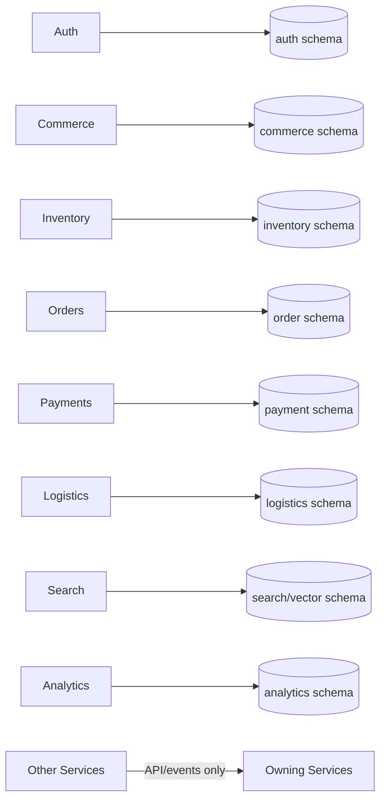
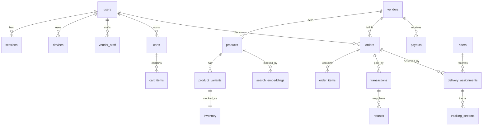
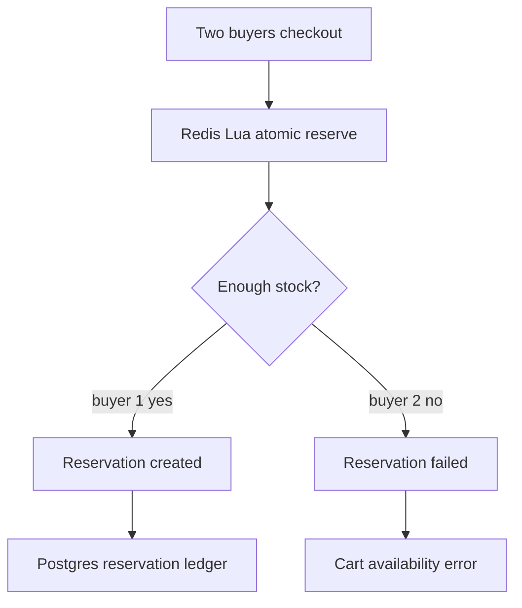
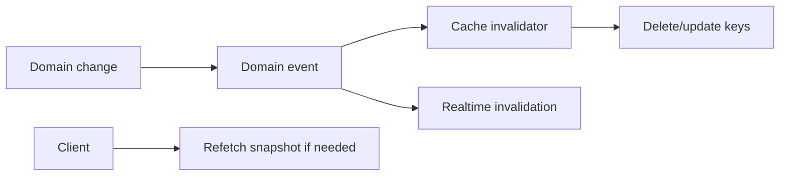
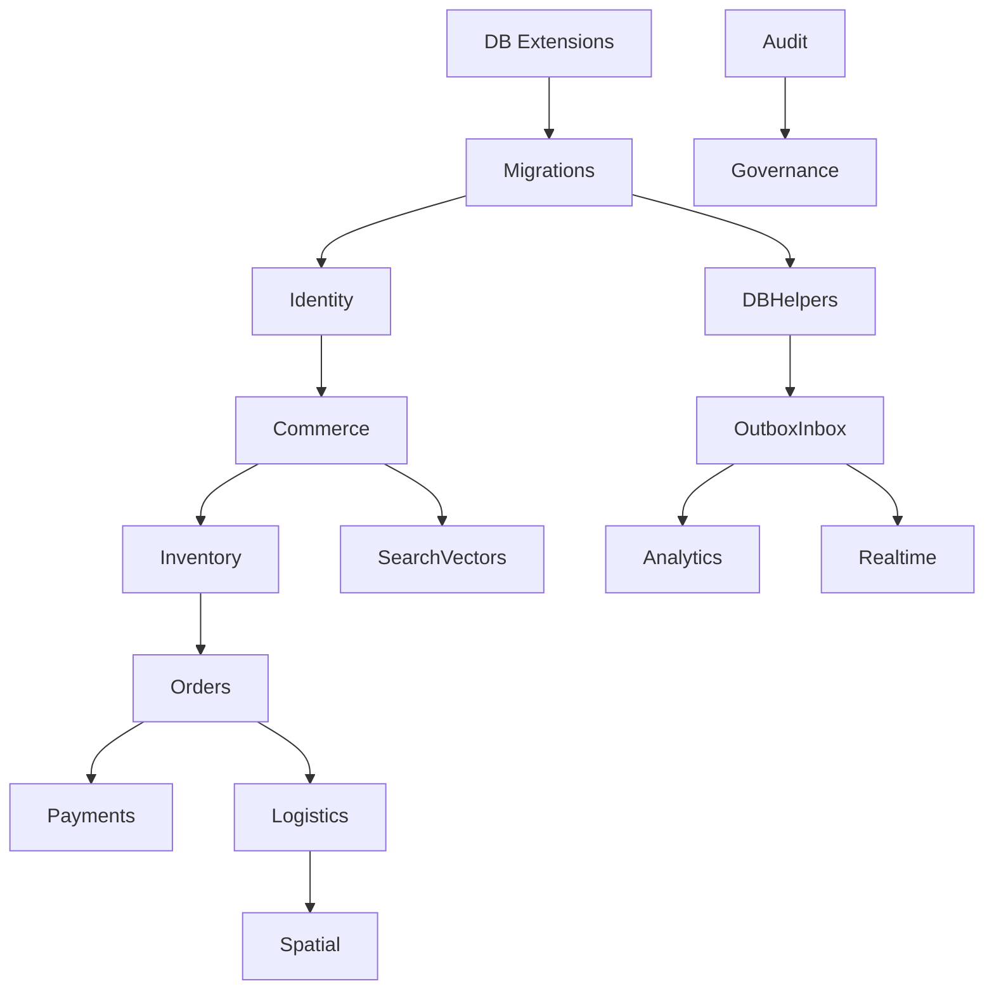

# VENDORHUB Phase 5 Data Infrastructure, Spatial Intelligence, and Distributed Consistency

Internal Data Infrastructure, Spatial Intelligence, and Distributed Consistency Constitution for VENDORHUB

Status: locked baseline before schema implementation  
Depends on: Phase 0-4 constitutions  
Scope: PostgreSQL, Redis, pgvector, PostGIS, H3, object/analytics storage, ownership, ERD, indexes, partitioning, reservations, consistency, cache, spatial intelligence, backups, migrations, observability, data testing, AI-assisted schema workflow  
Non-goal: ORM implementation or migration code

---

## 0. Data Lock

VENDORHUB is a realtime distributed commerce orchestration platform. Its data layer is not passive storage. It is the coordination substrate for inventory truth, order state, financial integrity, rider movement, operational analytics, search retrieval, realtime replay, fraud review, and auditability.

The central data truth:

```txt
VENDORHUB durable truth lives in owned transactional stores; volatile coordination lives in Redis; derived intelligence lives in projections.
```

Every table, index, cache key, vector record, spatial cell, event row, and migration must answer:

- which service owns this data?
- who may write it?
- who may read it directly?
- what is the consistency contract?
- what is the indexing and partitioning strategy?
- how does it scale?
- how is it invalidated, replayed, backed up, restored, and audited?

No service may mutate another service's owned tables. No cache is authoritative for money, orders, or durable stock history. No AI-generated schema may bypass ownership review.

---

## 1. Complete Data Philosophy of VENDORHUB

### 1.1 Role of Data

VENDORHUB is a data-coordination platform because every marketplace action is a data transition:

- buyer intent becomes cart and checkout data
- checkout becomes order saga data
- inventory availability becomes reservation data
- payment intent becomes ledger data
- rider movement becomes spatial stream data
- fraud signals become trust data
- domain events become realtime projections and analytics facts

Realtime systems require strict data ownership because duplicated writes create divergent truth. Hyperlocal commerce requires spatial intelligence because availability and dispatch are location-dependent. Marketplaces require immutable ledgers because finance, trust, and disputes must be reconstructable.

### 1.2 Storage Philosophy

- PostgreSQL owns durable domain truth.
- Redis owns volatile coordination, cache, rate limits, queues, websocket sessions, and reservation fast paths.
- pgvector owns semantic retrieval indexes and recommendation vectors.
- PostGIS owns precise spatial geometry.
- H3 owns fast locality bucketing and regional aggregation.
- Object storage owns large immutable artifacts and archives.
- Analytics storage owns append-only measurement and aggregate projections.

### 1.3 Consistency Philosophy

Consistency is layered:

- strong consistency inside a service transaction
- optimistic concurrency for hot business rows
- atomic Redis operations for volatile reservation counters
- transactional outbox for event persistence
- inbox for idempotent consumption
- eventual consistency for projections, search, analytics, and realtime clients
- compensating actions for distributed workflow failure

### 1.4 Governance Principles

- One table has one service owner.
- Durable financial and audit data is append-only.
- Every cross-domain write happens through API/command/event, not direct SQL.
- Every high-volume table has a partitioning plan before scale pain.
- Every query pattern must map to an index.
- Every cache has an owner, TTL, invalidation trigger, and recovery path.
- Every migration is forward-compatible and reviewed.

---

## 2. Complete Multi-Database Architecture

### 2.1 Storage Topology

```txt
PostgreSQL/Supabase
  domain schemas, ledgers, outbox/inbox, audit, relational truth

Redis Cloud
  reservations, queues, cache, websocket sessions, pub/sub, replay buffers

pgvector
  embeddings, semantic search, recommendation vectors

PostGIS
  geofences, service zones, routes, proximity, polygons

H3
  locality cells, dispatch buckets, analytics aggregation, cache keys

Object Storage
  archived events, exported reports, document artifacts, proofs of delivery media

Analytics Storage
  append-only events, rollups, funnels, experiments
```

### 2.2 PostgreSQL Responsibilities

Responsibilities:

- relational integrity
- ACID transactions inside service boundaries
- order history
- inventory ledger
- financial ledger
- audit logs
- outbox/inbox
- operational truth

Boundaries:

- schemas separated by service
- service owns migrations for its schema
- public cross-service reads use projections or APIs

Tradeoffs:

- strong consistency and relational power
- requires careful indexing and connection pooling
- hot rows must be managed through OCC or Redis coordination

### 2.3 Redis Responsibilities

Responsibilities:

- inventory reservation counters and locks
- websocket sessions and subscription registry
- BullMQ queues and delayed jobs
- rate limiting
- low-latency caches
- Redis Streams replay buffers

Consistency:

- volatile and fast
- not authoritative for ledgers
- reservation state is coordinated with Postgres through deterministic reservation ids and reconciliation

Failure behavior:

- inventory reservation fails closed
- websocket falls back to polling and replay
- workers pause/resume
- cache misses degrade to source-of-truth reads

### 2.4 pgvector Responsibilities

Responsibilities:

- product embeddings
- vendor embeddings
- query/search embeddings
- recommendation vectors
- personalization vectors

Lifecycle:

- domain event changes source text/signals
- indexing worker updates search document
- embedding job creates vector with model version
- vector index refreshed

Consistency:

- eventually consistent
- checkout never trusts vector/search availability

### 2.5 PostGIS and H3 Responsibilities

PostGIS:

- exact geospatial operations
- polygon containment
- nearest-neighbor queries
- route geometry
- service zone boundaries

H3:

- fast hierarchical bucketing
- k-ring proximity candidate selection
- dispatch clustering
- cache partitioning
- analytics heatmaps

H3 is used because hyperlocal operations need stable grid cells for fast filtering, aggregation, and sharding before exact PostGIS checks.

---

## 3. Complete Database Ownership Architecture

### 3.1 Ownership Map

| Service | Owns |
|---|---|
| Auth | users, sessions, devices, refresh_tokens, oauth_accounts, roles, permissions, user_roles |
| Commerce | vendors, vendor_staff, products, product_variants, categories, carts, cart_items |
| Orders | orders, order_items, order_timeline, order_sagas |
| Inventory | inventory, inventory_reservations, reservation_items, stock_movements |
| Payments | transactions, ledger_entries, refunds, payouts, settlements |
| Logistics | riders, delivery_assignments, delivery_routes, tracking_streams, service_zones |
| Notifications | notifications, notification_deliveries |
| Analytics | analytics_events, experiments, funnels, kpi_rollups |
| Search | search_embeddings, recommendation_vectors, search_documents |
| Moderation | moderation_logs, fraud_flags, verification_requests, trust_scores |
| Realtime | websocket_sessions, replay_cursors where durable snapshot needed |
| Platform | outbox_events, inbox_events helpers per schema, audit_logs append interface |

### 3.2 Rules

Write authority:

- only owner service writes owned tables
- shared outbox/inbox helpers write within owner schema

Read authority:

- owner service reads directly
- other services read via API, event projection, or read model
- analytics/search consume events, not raw domain writes

Cache ownership:

- cache key owner matches data owner
- consumers may cache API responses but must obey owner invalidation events

Event ownership:

- table owner produces events for durable state changes



---

## 4. Complete ERD and Relational Architecture

### 4.1 Relationship Diagram



### 4.2 Core Tables

users:

- columns: id uuid pk, email citext unique, phone text unique nullable, name text, status text, created_at timestamptz, updated_at timestamptz
- indexes: unique email, unique phone, status
- constraints: status enum
- retention: anonymize PII on legal deletion while preserving audit references
- queries: by email/phone/id/session

sessions:

- columns: id uuid pk, user_id fk, device_id fk, status text, expires_at timestamptz, revoked_at timestamptz, last_seen_at timestamptz
- indexes: user_id+status, expires_at, device_id
- retention: 1 year operational, archive security events

devices:

- columns: id uuid pk, user_id fk, fingerprint_hash text, platform text, trusted_at timestamptz, risk_level text
- indexes: user_id, fingerprint_hash

vendors:

- columns: id uuid pk, owner_user_id fk, name text, status text, region_id text, h3_cell text, address_json jsonb, geo_point geography(Point,4326), created_at
- indexes: owner_user_id, status, region_id, h3_cell, GIST geo_point
- query: nearby open vendors, vendor admin lookup

vendor_staff:

- columns: id uuid pk, vendor_id fk, user_id fk, role text, status text, created_at
- indexes: vendor_id+status, user_id

riders:

- columns: id uuid pk, user_id fk, status text, kyc_status text, current_h3 text, current_geo geography(Point,4326), last_location_at timestamptz, capacity int
- indexes: user_id unique, status+current_h3, GIST current_geo

products:

- columns: id uuid pk, vendor_id fk, category_id fk, title text, description text, status text, moderation_status text, search_text tsvector, created_at, updated_at
- indexes: vendor_id+status, category_id, GIN search_text

product_variants:

- columns: id uuid pk, product_id fk, sku text, title text, price_amount int, currency char(3), status text, attributes_json jsonb, version int
- indexes: product_id, unique product_id+sku, status

categories:

- columns: id uuid pk, parent_id fk nullable, name text, slug text unique, sort_order int
- indexes: parent_id, slug

inventory:

- columns: id uuid pk, vendor_id fk, variant_id fk, on_hand_qty int, reserved_qty int, available_qty int, stock_version int, status text, updated_at
- indexes: unique vendor_id+variant_id, vendor_id+available_qty, variant_id, stock_version
- constraints: quantities >= 0, available_qty = on_hand_qty - reserved_qty where enforced by service

inventory_reservations:

- columns: id uuid pk, order_id uuid, vendor_id uuid, status text, expires_at timestamptz, idempotency_key text, created_at, committed_at, released_at
- indexes: order_id, vendor_id+status, expires_at where status='RESERVED', unique idempotency_key
- partition: monthly by created_at

carts:

- columns: id uuid pk, buyer_id fk, status text, currency char(3), created_at, updated_at
- indexes: buyer_id+status

cart_items:

- columns: id uuid pk, cart_id fk, vendor_id fk, product_id fk, variant_id fk, quantity int, price_snapshot int, added_at
- indexes: cart_id, vendor_id, variant_id

orders:

- columns: id uuid pk, buyer_id fk, vendor_id fk, status text, payment_status text, delivery_status text, total_amount int, currency char(3), version int, created_at, updated_at
- indexes: buyer_id+created_at desc, vendor_id+status+created_at, status+created_at, version
- partition: monthly after volume threshold

order_items:

- columns: id uuid pk, order_id fk, product_id, variant_id, title_snapshot text, unit_price int, quantity int, status text
- indexes: order_id, variant_id

transactions:

- columns: id uuid pk, order_id fk, payment_intent_id text, provider text, provider_ref text, type text, status text, amount int, currency char(3), idempotency_key text, created_at
- indexes: order_id, provider+provider_ref, unique idempotency_key, status+created_at

refunds:

- columns: id uuid pk, order_id fk, transaction_id fk, status text, amount int, reason text, provider_ref text, created_at
- indexes: order_id, transaction_id, status

payouts:

- columns: id uuid pk, vendor_id fk, settlement_id uuid, status text, amount int, currency char(3), scheduled_at, completed_at
- indexes: vendor_id+status, settlement_id

delivery_assignments:

- columns: id uuid pk, order_id fk, rider_id fk, status text, pickup_geo geography(Point,4326), dropoff_geo geography(Point,4326), pickup_h3 text, dropoff_h3 text, offered_at, accepted_at, expires_at
- indexes: order_id, rider_id+status, pickup_h3, dropoff_h3, GIST pickup_geo, GIST dropoff_geo

delivery_routes:

- columns: id uuid pk, assignment_id fk, route_polyline text, route_geom geography(LineString,4326), distance_meters int, duration_seconds int, provider text, created_at
- indexes: assignment_id, GIST route_geom

tracking_streams:

- columns: id bigserial pk, assignment_id fk, rider_id fk, lat double precision, lng double precision, geo geography(Point,4326), h3_cell text, accuracy_meters int, recorded_at timestamptz
- indexes: assignment_id+recorded_at desc, rider_id+recorded_at desc, h3_cell+recorded_at, GIST geo
- partition: daily/weekly by recorded_at
- retention: hot 30-90 days, archive aggregates

notifications:

- columns: id uuid pk, user_id fk, channel text, template text, status text, payload_json jsonb, created_at, sent_at
- indexes: user_id+created_at, status+created_at

analytics_events:

- columns: id uuid pk, event_name text, actor_id uuid, session_id uuid, role text, properties_json jsonb, occurred_at timestamptz
- indexes: event_name+occurred_at, actor_id+occurred_at, GIN properties_json
- partition: daily/monthly by occurred_at

experiments:

- columns: id uuid pk, key text unique, status text, variants_json jsonb, started_at, ended_at
- indexes: key, status

moderation_logs:

- columns: id uuid pk, case_id uuid, subject_type text, subject_id uuid, action text, actor_id uuid, reason text, created_at
- indexes: case_id, subject_type+subject_id, created_at

fraud_flags:

- columns: id uuid pk, subject_type text, subject_id uuid, signal text, severity text, status text, score numeric, created_at
- indexes: subject_type+subject_id, severity+status, created_at

audit_logs:

- columns: id uuid pk, actor_id uuid, actor_type text, action text, resource_type text, resource_id uuid, outcome text, correlation_id text, trace_id text, metadata_json jsonb, created_at
- indexes: actor_id+created_at, resource_type+resource_id, correlation_id, created_at
- partition: monthly

websocket_sessions:

- columns: id uuid pk, user_id uuid, session_id uuid, connection_id text, instance_id text, status text, subscriptions_json jsonb, connected_at, last_seen_at
- indexes: user_id, session_id, connection_id unique, instance_id, status
- durable table optional; Redis is hot source

search_embeddings:

- columns: id uuid pk, entity_type text, entity_id uuid, embedding vector, model text, model_version text, metadata_json jsonb, updated_at
- indexes: entity_type+entity_id unique, HNSW vector index, GIN metadata_json

recommendation_vectors:

- columns: id uuid pk, subject_type text, subject_id uuid, vector vector, model text, version text, updated_at
- indexes: subject_type+subject_id unique, HNSW vector index

---

## 5. Complete Indexing Strategy

### 5.1 Index Types

- B-tree: ids, foreign keys, statuses, timestamps, equality/range
- Composite: common filtered operational queries
- Partial: active sessions, reserved inventory, open orders, pending payouts
- GIN: jsonb properties, tsvector search
- GiST/SP-GiST: PostGIS geography/geometry
- HNSW/IVFFlat: pgvector similarity

### 5.2 Governance

- every foreign key gets an index unless proven unnecessary
- every dashboard query must have an explicit index plan
- partial indexes preferred for hot operational subsets
- index names: `idx_<table>_<columns>[_where]`
- unique names: `uniq_<table>_<columns>`
- measure write amplification before adding broad indexes

High-cardinality strategy:

- use composite indexes with leading selective columns
- avoid indexing low-cardinality status alone unless partial/composite
- partition high-volume time-series before indexes become unmanageable

---

## 6. Complete Partitioning and Scaling Strategy

Partition by time:

- orders monthly after threshold
- transactions/ledger_entries by settlement/month
- tracking_streams daily/weekly
- analytics_events daily/monthly
- audit_logs monthly
- outbox_events monthly/archive

Partition by locality:

- logistics hot projections by region/H3 prefix where needed
- Redis keys include region/vendor/cell

Hot/cold strategy:

- hot operational data in primary tables
- warm historical data in partitions
- cold archives in object storage
- analytics aggregates retained longer than raw high-volume streams

Archival:

- outbox/archive after replay retention
- tracking raw points downsampled
- audit retained per compliance
- analytics raw events compressed/archived

---

## 7. Complete Inventory Reservation and Concurrency Architecture

### 7.1 Inventory States

AVAILABLE:

- sellable quantity exists
- transition to RESERVED on checkout reservation

RESERVED:

- Redis counter and Postgres reservation exist
- expires at reservation TTL
- transition to CONFIRMED, EXPIRED, or released compensation

CONFIRMED:

- reservation committed to order fulfillment
- stock movement recorded

EXPIRED:

- TTL elapsed
- Redis released and Postgres marked expired

RECONCILING:

- stock under audit/count
- reservations may be blocked or limited

### 7.2 Redis Reservation Engine

Key patterns:

```txt
inventory:stock:{vendorId}:{variantId}
inventory:reservation:{reservationId}
inventory:order:{orderId}
```

Lifecycle:

```txt
reserve command -> Lua checks all variants -> all-or-none increment
-> write Postgres reservation -> emit INVENTORY_RESERVED
-> commit/release/expire -> decrement Redis -> update Postgres -> emit event
```

Lua requirements:

- atomic multi-item availability check
- idempotency key detection
- TTL assignment
- no partial success

TTL:

- 10-15 minutes default checkout reservation
- configurable by vendor/category
- grace window for worker cleanup

Why Redis owns reservation fast state:

- checkout needs low-latency atomic counters
- hot inventory rows would otherwise contend heavily
- TTL expiration is native operational fit

Why Postgres owns ledger:

- stock movement history must be durable and auditable
- reconciliation requires permanent facts
- Redis cannot be financial/stock ledger truth

### 7.3 Concurrency Strategy

Optimistic concurrency:

- `stock_version` on inventory rows
- compare-and-swap updates
- retry bounded times

Pessimistic locking:

- used for reconciliation and administrative stock correction
- avoid in hot checkout path when possible

Duplicate checkout prevention:

- checkoutSessionId + clientMutationId
- reservation idempotency key
- order idempotency key

Oversell prevention:

- Redis all-or-none reserve
- Postgres reservation write
- reconciliation worker detects divergence
- checkout revalidates price/serviceability/inventory



---

## 8. Complete Transaction and Consistency Model

ACID boundaries:

- one service schema transaction
- domain state + outbox write atomic
- ledger entries append-only in payment transaction

Distributed consistency:

- order saga coordinates inventory/payment/logistics
- events propagate committed facts
- consumers use inbox idempotency
- failures use compensation

Outbox:

- written inside same transaction as state change
- dispatcher publishes to stream
- status tracked
- retained then archived

Consistency lifecycles:

Order:

- order row is authoritative for order status
- projections/realtime eventually catch up

Payment:

- ledger and transaction rows are authoritative
- provider state reconciled by webhook/polling

Inventory:

- Redis reservation fast state plus Postgres reservation ledger
- reconciliation restores alignment

---

## 9. Complete Cache Architecture

Cache families:

- product/catalog cache
- recommendation cache
- inventory availability cache
- analytics dashboard cache
- session/permission cache
- websocket subscription/session cache

Ownership:

- cache owner equals data owner
- cache key includes environment and scope

TTL:

- catalog: 1-10 minutes plus event invalidation
- recommendations: 5-30 minutes
- inventory availability: short TTL 15-60 seconds plus events
- analytics: 10-60 seconds depending dashboard
- sessions/permissions: short TTL plus invalidation event

Invalidation:



Rule:

- checkout never trusts cache
- payment never trusts cache
- admin critical action reads source truth

---

## 10. Complete Spatial and Hyperlocal Architecture

### 10.1 Spatial Concepts

- vendor location
- buyer address
- rider current location
- service zone polygon
- pickup/dropoff point
- route geometry
- H3 cell hierarchy
- dispatch region

### 10.2 H3 Strategy

Resolution:

- coarse region: lower resolution for analytics/ops
- dispatch candidate bucket: mid resolution
- precise proximity prefilter: higher resolution around active rider/order

Usage:

- store h3_cell on vendor, rider, address, tracking point
- k-ring traversal finds nearby riders/vendors
- H3 prefilter reduces PostGIS exact distance workload
- cache keys include H3 for locality

Dispatch:

```txt
dropoff/pickup H3 -> k-ring candidate riders -> filter availability/trust/capacity
-> exact PostGIS distance/time -> rank -> offer assignment
```

### 10.3 PostGIS Strategy

Queries:

- ST_DWithin for radius/proximity
- ST_Contains for service zone polygon
- nearest-neighbor ordering with spatial index
- route geometry intersection/deviation

Indexes:

- GIST on geography point columns
- GIST on polygons/routes
- H3 B-tree alongside PostGIS for prefilter

Optimization:

- H3 prefilter first
- exact spatial check second
- avoid unbounded distance scans
- cache serviceability results by address/vendor/time window

---

## 11. Complete Search and Vector Storage Architecture

Embedding entities:

- products
- vendors
- categories
- query history aggregates
- user/session personalization vectors

Vector lifecycle:

```txt
domain event -> search document update -> embedding job
-> vector stored with model/version -> index updated -> search available
```

Indexes:

- HNSW for low-latency approximate nearest neighbor
- IVFFlat considered for larger batch-oriented datasets

Hybrid retrieval:

```txt
query text -> lexical candidate set + semantic candidate set
-> region/serviceability/availability filters
-> ranking signals
-> hydrated product/vendor DTOs
```

Reindexing:

- model version stored per vector
- background re-embed by version
- dual-read/compare during migration
- search events emit index failures to DLQ

---

## 12. Complete Analytics Storage Architecture

Schemas:

- analytics_events append-only
- funnel_steps
- kpi_rollups
- experiment_assignments
- experiment_exposures
- operational_facts

Partitioning:

- raw events by occurred_at
- rollups by period and scope

Consistency:

- analytics is eventually consistent
- operational alerts may use near-realtime streams
- raw events immutable
- rollups rebuildable from raw events/domain events

Retention:

- raw client events retained by cost/privacy policy
- operational facts retained longer
- aggregates retained indefinitely where useful

---

## 13. Complete Audit and Event Persistence Architecture

Audit:

- append-only
- partitioned by month
- immutable corrections
- encrypted sensitive metadata when required

Event persistence:

- outbox per owning schema
- inbox per consumer
- event archive to object storage
- replay tooling targets projections only by default

Retention:

- outbox hot 90 days
- archived events longer for reconstruction
- financial/audit records per compliance requirements

Replay:

- dry-run mode required
- provider side effects disabled
- replay emits audit log

---

## 14. Complete Websocket Session Storage

Redis:

- hot connection registry
- connectionId -> user/session/instance
- topic -> connection set
- replay streams per topic or topic family
- cursor tracking

Postgres:

- optional durable websocket_sessions table for diagnostics/history
- not hot path authority

Lifecycle:

```txt
connect -> Redis session -> subscriptions -> heartbeats
-> disconnect/revoke/stale cleanup -> optional durable record update
```

Stale cleanup:

- heartbeat timeout
- instance failure cleanup
- session revocation disconnect
- subscription cleanup on role change

Replay:

- Redis Streams retain recent messages
- expired cursor triggers snapshot refetch

---

## 15. Complete Backup and Recovery Strategy

Postgres:

- point-in-time recovery
- daily snapshots
- tested restore procedure
- migration backups before high-risk deploys

Redis:

- persistence configured where provider supports it
- queues/reservation recovery depends on reconciliation
- cache loss acceptable
- session loss forces reauth/reconnect if needed

Vectors:

- pgvector in Postgres backup
- embeddings rebuildable from source documents and model version

Object storage:

- versioning enabled for archives/artifacts

RPO/RTO:

- financial/order/audit: lowest RPO possible
- cache/realtime: tolerate loss with recovery
- vectors/analytics: rebuildable, longer RTO acceptable

Recovery sequence:

```txt
Postgres -> Redis -> services -> workers -> websocket -> frontends
-> reconciliation jobs -> analytics/search rebuild if needed
```

---

## 16. Complete Migration and Schema Governance

Migration rules:

- forward-only
- expand/contract for breaking changes
- schema owner writes migration
- migration includes rollback/repair note
- CI dry run
- staging deploy before production

Naming:

```txt
YYYYMMDDHHMM_<service>_<change>.sql
```

ORM governance:

- Prisma/Drizzle may be used only with service-owned schema boundaries
- generated clients are service-local
- no global ORM model that implies cross-service writes

Backward compatibility:

- add nullable column
- backfill
- dual-write/read if required
- switch consumers
- enforce not-null/remove old only after migration window

AI drift prevention:

- AI must name owning service and table
- AI must not add columns to another service schema
- AI must propose indexes for query patterns
- AI must include migration and test plan

---

## 17. Complete Observability and Database Monitoring

Metrics:

- slow queries
- query p95/p99
- connection pool saturation
- lock waits
- deadlocks
- index hit ratio
- table bloat
- replication lag
- Redis memory/evictions
- Redis command latency
- queue lag
- cache hit/miss
- reservation failure rate
- outbox lag
- inbox failures

Dashboards:

- Postgres health
- Redis health
- inventory reservation health
- payment ledger health
- spatial query latency
- vector search latency
- analytics ingestion lag
- websocket session/replay health

Alerts:

- outbox lag threshold
- reservation Redis errors
- DB connection saturation
- slow checkout queries
- deadlock spike
- low index hit ratio
- queue DLQ growth
- backup failure

---

## 18. Complete Performance Optimization Strategy

Rules:

- cursor pagination for high-volume lists
- no unbounded queries
- no N+1 service/database fetches
- batch load by ids
- select only required columns
- use read replicas for non-critical reads when available
- precompute operational dashboards
- use materialized views/projections for expensive analytics

Connection pooling:

- PgBouncer or managed pooling
- service pool budgets
- worker concurrency tied to DB capacity

Optimization tradeoffs:

- indexes speed reads but slow writes
- cache speeds reads but adds invalidation complexity
- denormalized projections speed dashboards but require replay
- spatial precision costs CPU; H3 prefilter reduces load

---

## 19. Complete Testing Strategy

Tests:

- schema ownership tests
- migration apply/dry-run tests
- foreign key and constraint tests
- index existence tests for critical queries
- concurrency tests
- reservation oversell simulations
- stale reservation cleanup tests
- cache invalidation tests
- event replay tests
- spatial query correctness tests
- vector retrieval smoke tests
- backup restore drills

Oversell simulation:

- concurrent checkouts exceed stock
- assert only available quantity reserves
- assert failures produce correct events
- assert reconciliation detects no durable drift

Spatial simulation:

- riders in neighboring H3 cells
- service zone boundary cases
- nearest rider query under load

---

## 20. Complete Engineering Governance

Naming:

- tables: snake_case plural
- columns: snake_case
- primary keys: id uuid unless high-volume stream needs bigserial
- foreign keys: `<entity>_id`
- indexes: `idx_<table>_<columns>`
- constraints: `chk_<table>_<rule>`, `fk_<table>_<ref>`

Review checklist:

- owner service named
- read/write authority clear
- query patterns documented
- indexes match query patterns
- partitioning plan for high volume
- migration is forward-compatible
- cache invalidation defined
- events/outbox impact defined
- observability impact defined

Query governance:

- no raw SQL without review in hot paths
- explain plan for critical queries
- no cross-service joins in application code
- analytics queries do not hit operational hot tables directly at scale

---

## 21. Complete AI-Assisted Database Engineering Workflow

Schema prompt:

```txt
Design schema change for VENDORHUB <service>.
Owner service: <service>.
Tables affected: <tables>.
Define columns, types, constraints, indexes, query patterns, partitioning, migration plan, rollback/repair plan, cache/event impact, tests.
Do not modify tables owned by other services.
```

Indexing prompt:

```txt
Review query <query/workflow>.
Identify access pattern, cardinality, current indexes, proposed index, write amplification, and explain-plan validation.
```

Spatial prompt:

```txt
Design spatial query for <workflow>.
Use H3 prefilter and PostGIS exact validation.
Define resolution, k-ring, indexes, fallback, and performance tests.
```

Concurrency prompt:

```txt
Threat model this data workflow for races.
Identify hot rows, OCC/version fields, Redis atomic operations, idempotency keys, retry limits, reconciliation, and tests.
```

Review prompt:

```txt
Review this schema/migration for VENDORHUB data governance.
Find ownership violations, missing indexes, unsafe migrations, weak constraints, cache invalidation gaps, replay issues, audit gaps, and AI-created schema drift.
Return findings with file and line references.
```

---

## 22. Complete Implementation Sequencing

### 22.1 Exact Order

1. PostgreSQL schemas and extension baseline: uuid, citext, pgcrypto, PostGIS, pgvector.
2. Migration framework and ownership rules.
3. Shared DB helpers, connection pooling, transaction helpers.
4. Outbox/inbox base tables.
5. Identity schema.
6. Commerce/vendor/product/category/cart schema.
7. Inventory schema and reservation ledger.
8. Redis reservation key design and Lua scripts.
9. Order schema and saga tables.
10. Payment transaction, ledger, refund, payout schema.
11. Logistics rider, assignment, route, tracking, H3/PostGIS schema.
12. Websocket session/replay persistence.
13. Analytics event and rollup schema.
14. Search embeddings and recommendation vectors.
15. Moderation/fraud/trust/audit schema.
16. Backup/restore automation.
17. Observability dashboards and alerts.
18. Concurrency and replay test harness.

### 22.2 Dependency Graph



### 22.3 Must Exist Before Realtime

- source-of-truth domain tables
- outbox/inbox
- Redis Streams/key governance
- websocket session keys
- replay buffer strategy
- cache invalidation events
- correlation ids in event persistence

---

## 23. Final Phase 5 Lock Rules

1. PostgreSQL owns durable truth.
2. Redis owns volatile coordination, not financial or permanent stock truth.
3. Service-owned schemas are mandatory.
4. Cross-service writes are forbidden.
5. Inventory reservations use Redis atomic coordination plus Postgres durable reservation ledger.
6. Payment ledgers are append-only.
7. Events and audit records are replayable and immutable.
8. H3 prefilters hyperlocal workloads; PostGIS validates exact geometry.
9. pgvector is eventually consistent and never checkout-authoritative.
10. Every hot query needs an index strategy.
11. Every high-volume table needs a partitioning and retention plan.
12. Every cache needs owner, TTL, invalidation, and fallback.
13. Migrations are forward-compatible and reviewed by schema owner.
14. Database observability is required before production workflows.
15. AI-generated schema changes must follow ownership, indexing, migration, and test rules.

This document locks the data infrastructure, spatial intelligence, and distributed consistency foundation for VENDORHUB Phase 5.
