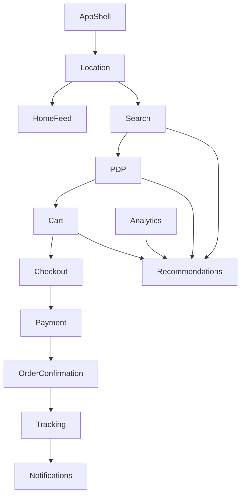

# VENDORHUB Phase 6 Buyer Commerce, Discovery, and Operational Experience

Internal Buyer Commerce, Discovery, and Operational Experience Constitution for VENDORHUB

Status: locked baseline before buyer-web feature implementation  
Depends on: Phase 0-5 constitutions  
Scope: buyer experience, discovery, search, PDP, cart, checkout, payment UX, realtime tracking, personalization, trust, mobile UX, state orchestration, notifications, failure UX, analytics, accessibility, AI-assisted buyer engineering  
Non-goal: implementation code or marketing landing pages

---

## 0. Buyer Commerce Lock

VENDORHUB buyer experience is commerce orchestration made understandable. The buyer should not see the entire distributed system, but they must feel its intelligence through accurate availability, delivery confidence, trust signals, responsive checkout, and live order tracking.

The central buyer truth:

```txt
VENDORHUB buying feels fast because the system is coordinated, and trustworthy because coordination is visible when it matters.
```

Buyer UX must never become a generic ecommerce template. It must communicate hyperlocal availability, realtime inventory, delivery feasibility, seller reliability, and order progress without overwhelming the customer.

---

## 1. Complete Buyer Experience Philosophy

### 1.1 What Buying Should Feel Like

Buying in VENDORHUB should feel:

- local and immediate
- operationally reliable
- intelligently personalized
- transparent about delivery
- safe during payment
- alive after checkout
- calm during failures

The buyer should feel connected to an ecosystem: vendors are nearby, inventory is current, delivery is being orchestrated, and order state is moving through real operational stages.

### 1.2 Why Buyer UX Is Operational UX

VENDORHUB buyer UX is operational because user trust depends on operational accuracy:

- "Available" must mean actually reservable.
- "Arrives by" must reflect logistics feasibility.
- "Order confirmed" must mean inventory/payment/order state aligned.
- "Out for delivery" must represent rider state, not a decorative label.

The buyer interface hides internal mechanics but reveals enough evidence to build confidence.

### 1.3 Commerce Psychology

Buyer confidence is shaped by:

- perceived speed
- clear availability
- predictable total cost
- delivery confidence
- payment safety
- seller credibility
- recovery from failures

Conversion improves when uncertainty is reduced before checkout and failures are handled with specific next steps.

### 1.4 Buyer Journey

Emotional journey:

```txt
curious -> oriented -> interested -> confident -> committed -> reassured -> satisfied -> retained
```

Operational journey:

```txt
location/context -> discovery -> evaluation -> cart validation
-> checkout orchestration -> payment -> order tracking -> delivery -> feedback/reorder
```

Realtime UX philosophy:

- realtime should confirm that VENDORHUB is actively coordinating
- stale states must be visible
- optimistic states must be distinguishable from confirmed server truth
- recovery should preserve context

---

## 2. Complete Buyer Information Architecture

### 2.1 Flow

```txt
Onboarding
→ Discovery
→ Search
→ Product Evaluation
→ Cart
→ Checkout
→ Payment
→ Tracking
→ Delivery
→ Post-Purchase
→ Retention
```

### 2.2 Route Architecture

```txt
/
/search
/vendors/[vendorId]
/products/[productId]
/cart
/checkout
/orders
/orders/[orderId]
/account
/account/addresses
/account/payments
/support
```

### 2.3 Navigation Hierarchy

Primary:

- Home
- Search
- Cart
- Orders
- Account

Contextual:

- vendor category tabs
- product recommendations
- cart bottom sheet
- checkout stepper
- order timeline

Mobile:

- bottom navigation
- sticky cart affordance
- search dominant
- order tracking shortcut when active delivery exists

Information density:

- discovery: medium, visual scanning
- PDP: focused, trust and delivery details
- cart/checkout: precise, low distraction
- tracking: timeline/map/ETA priority

---

## 3. Complete Home Feed Architecture

### 3.1 Home Feed Intent

The home feed is the buyer's live commerce radar. It should show nearby relevance, not static merchandising.

Inputs:

- location/H3 cell
- time of day
- vendor availability
- inventory availability
- buyer history
- session behavior
- trending local searches/products
- delivery feasibility

### 3.2 Hero System

The hero should communicate operational sophistication through:

- location-aware promise
- live availability count
- subtle topology-inspired commerce signal flow
- search as primary action
- delivery confidence cue

Hero must not be a generic marketing block. It should be the first operational signal: "VENDORHUB knows where you are, what is nearby, and what can actually reach you."

Motion:

- subtle signal pulses
- no decorative blobs
- reduced-motion static status

### 3.3 Feed System

Sections:

- "Available near you"
- "Fastest to deliver"
- "Recommended for this session"
- "Trending in your area"
- "Fresh inventory"
- "Previously ordered"
- "Verified sellers nearby"

Ranking:

```txt
serviceability -> availability -> delivery ETA -> trust score
-> personalization -> price/promo -> freshness -> diversity
```

Session-aware discovery:

- adapt to searches, product views, cart additions
- avoid repeating ignored products too aggressively
- show cold-start popular local categories

Realtime:

- availability invalidations update badges
- vendor closed/opened changes feed eligibility
- active order tracking surfaces above feed when relevant

---

## 4. Complete Search and Discovery Architecture

### 4.1 Search Principles

Search should feel intelligent because it understands:

- local availability
- intent synonyms
- semantic meaning
- delivery feasibility
- seller trust
- recent behavior
- operational constraints

Search results are discovery projections, not checkout truth.

### 4.2 Search Flow

```txt
focus search -> recent/trending suggestions
-> typeahead/autocomplete -> semantic suggestions
-> results with filters -> refine -> product/vendor/PDP
```

Autocomplete priority:

1. exact local product/category match
2. recent searches
3. trending nearby
4. semantic suggestion
5. vendor match

Zero-result recovery:

- show related categories
- expand distance/serviceability if possible
- suggest corrected spelling
- show "not available nearby right now" with alternatives

### 4.3 Filtering

Filters:

- category
- vendor
- delivery ETA
- price range
- rating/trust
- available now
- offers

Mobile ergonomics:

- filter chips for common filters
- bottom sheet for advanced filters
- sticky apply button
- active filter count visible

Operational constraints:

- unavailable products can appear only when useful, clearly marked
- checkout always revalidates

---

## 5. Complete Product Detail Experience

### 5.1 PDP Architecture

PDP zones:

- product media
- title, price, variant selection
- availability and stock confidence
- delivery ETA and serviceability
- seller trust panel
- add-to-cart action
- reviews/ratings
- related recommendations
- operational metadata where useful

### 5.2 Product Trust System

Signals:

- verified seller
- delivery reliability
- recent fulfillment success
- inventory confidence
- refund/return clarity
- rating/review summary

Hierarchy:

1. Can I get this?
2. When will it arrive?
3. Is the seller reliable?
4. What happens if there is a problem?

Operational metadata matters because hyperlocal buyers are buying a fulfillment promise, not just a product.

### 5.3 Delivery UX

ETA display:

- estimated arrival window
- confidence indicator
- fee clarity
- "available now" vs "limited stock"

Nearby rider visibility:

- aggregate confidence only before order
- no rider-specific details before assignment

Inventory:

- clear low-stock state
- realtime invalidation if item becomes unavailable
- variant-level availability

---

## 6. Complete Cart Orchestration System

### 6.1 Cart Philosophy

The cart is not a bag of items. It is a pre-checkout orchestration surface that must align vendor grouping, inventory availability, delivery feasibility, fees, coupons, taxes, and checkout readiness.

### 6.2 Multi-Vendor Cart

Grouping:

- group by vendor
- show vendor status and delivery promise per group
- show group subtotal, delivery fee estimate, availability warnings

Split orchestration:

- each vendor group may become separate order/fulfillment unit
- UI explains split deliveries only when necessary
- payment summary stays unified unless payment rails require explicit split

Operational complexity visibility:

- show "arrives separately" or "vendor unavailable" clearly
- avoid exposing internal saga terms

### 6.3 Realtime Cart Synchronization

Optimistic updates:

- add item
- update quantity
- remove item

Server reconciliation:

- confirm quantity and price
- patch cart from server response
- handle stock conflict with inline resolution

Inventory drift:

- item unavailable -> mark item, suggest remove/replace
- quantity reduced -> show available max
- price changed -> show delta before checkout

Cart subscriptions:

- product/vendor inventory invalidation where items are in cart
- no noisy updates for unrelated catalog changes

---

## 7. Complete Checkout Orchestration

### 7.1 Checkout States

```txt
ADDRESS_VALIDATION
↓
DELIVERY_VALIDATION
↓
INVENTORY_CONFIRMATION
↓
PAYMENT_INITIATION
↓
ORDER_CONFIRMATION
↓
TRACKING_INITIALIZATION
```

ADDRESS_VALIDATION:

- frontend: validate address form and geocode/serviceability hint
- backend: address ownership and geofence validation
- events: analytics checkout address step
- failure: choose/edit address

DELIVERY_VALIDATION:

- frontend: display ETA/fee promise
- backend: logistics/serviceability estimate
- failure: address unserviceable, vendor closed, delivery unavailable

INVENTORY_CONFIRMATION:

- frontend: show "checking availability"
- backend: inventory reservation command
- events: INVENTORY_RESERVED or failure
- failure: item-level recovery

PAYMENT_INITIATION:

- frontend: secure payment UI
- backend: payment intent/authorization
- events: PAYMENT_AUTHORIZED/FAILED
- failure: retry/change method

ORDER_CONFIRMATION:

- frontend: order confirmed screen
- backend: order saga advances
- events: ORDER_CONFIRMED
- failure: compensation and clear explanation

TRACKING_INITIALIZATION:

- frontend: subscribe to order topic
- backend: websocket/realtime projection
- failure: fallback to polling

### 7.2 Checkout UX

Principles:

- minimize steps but show progress during backend orchestration
- never hide inventory/payment validation delay behind vague spinner
- preserve user input on failure
- make recovery actions local and specific

Progress visualization:

- compact state checklist
- no overdramatic animation
- confirmed states become durable checkmarks
- pending states use syncing indicator

Conversion optimization:

- final total always visible
- delivery promise visible before payment
- trust/security cues near payment
- failure copy explains fix, not blame

---

## 8. Complete Payment Experience Architecture

### 8.1 Payment UX

Payment methods:

- cards/UPI/wallets through provider where available
- COD only when vendor/region/risk policy allows
- saved methods if supported

States:

- ready
- authorizing
- authorized
- failed
- retrying
- refunded/voided where applicable

Trust indicators:

- secure payment copy
- provider-backed confirmation
- no raw provider jargon
- clear refund/cancellation policy

Failure recovery:

- retry same method
- choose another method
- preserve reservation where TTL allows
- release reservation if checkout expires

Split-payment awareness:

- buyer sees one checkout total
- split payouts stay operationally hidden unless split delivery affects UX

---

## 9. Complete Realtime Tracking Experience

### 9.1 Tracking Flow

```txt
ORDER_CONFIRMED
↓
PACKING
↓
READY_FOR_PICKUP
↓
RIDER_ASSIGNED
↓
OUT_FOR_DELIVERY
↓
ARRIVING
↓
DELIVERED
```

ORDER_CONFIRMED:

- visual: confirmed timeline start
- motion: brief highlight
- realtime: order topic subscribed
- reassurance: "Your order is confirmed"

PACKING:

- visual: vendor preparation state
- realtime: ORDER_PREPARING/ACCEPTED
- reassurance: prep ETA

READY_FOR_PICKUP:

- visual: handoff-ready marker
- realtime: ORDER_READY_FOR_PICKUP
- reassurance: delivery assignment pending/active

RIDER_ASSIGNED:

- visual: rider card and ETA
- realtime: RIDER_ASSIGNED
- reassurance: "A rider is on the way"

OUT_FOR_DELIVERY:

- visual: live map primary
- motion: coalesced location movement
- realtime: RIDER_LOCATION_UPDATED, ETA_UPDATED
- reassurance: updated ETA and route progress

ARRIVING:

- visual: arrival proximity emphasis
- realtime: ETA threshold/location
- reassurance: prepare for handoff

DELIVERED:

- visual: completion state
- realtime: DELIVERY_COMPLETED/ORDER_DELIVERED
- reassurance: receipt, support, reorder

### 9.2 Live Tracking UX

Map:

- only after rider assignment
- stable viewport with route and rider position
- location age indicator
- fallback timeline if map fails

Event feed:

- buyer-friendly timeline, not raw event names
- expandable details only when useful

ETA recalculation:

- update when meaningful threshold changes
- avoid noisy minute-by-minute churn
- show "updated just now"

Disconnected:

- keep last known state
- show reconnecting/stale badge
- fallback polling

---

## 10. Complete Personalization and Recommendation UX

### 10.1 Recommendation Zones

- home feed rows
- search zero-result alternatives
- PDP related items
- cart add-ons
- checkout non-blocking suggestions before payment only
- post-purchase reorder

### 10.2 Recommendation Sources

- collaborative filtering
- content similarity
- session intent
- local trending
- vendor reliability
- availability and ETA
- promotions

Ranking must respect operational eligibility before personalization.

### 10.3 Transparency

Labels:

- "Popular near you"
- "Fast delivery"
- "Based on your recent search"
- "Frequently reordered"

Do not over-explain model logic. Provide enough context to feel relevant.

Cold-start:

- location/category trends
- time-of-day defaults
- verified vendors
- fast-delivery products

---

## 11. Complete Trust and Safety UX

Trust hierarchy:

1. verified seller
2. available inventory
3. delivery confidence
4. secure payment
5. refund/support visibility

Trust badges:

- verified seller
- reliable delivery
- secure payment
- easy support
- low-stock/availability

Dispute/refund UX:

- visible in order detail
- status timeline
- support entry point
- no vague "contact us" dead ends

Fraud reassurance:

- avoid alarming language
- show secure payment and verified seller signals
- if an order is held/reviewed, explain next step clearly

---

## 12. Complete Mobile-First Commerce UX

Mobile is primary for hyperlocal commerce.

Rules:

- search reachable within thumb zone
- cart sticky when non-empty
- add-to-cart primary action fixed on PDP
- checkout primary action sticky
- bottom sheets for filters/cart/details
- one-handed interactions prioritized
- active order shortcut visible

Density:

- product cards compact but readable
- cart items grouped by vendor
- tracking timeline vertical
- map balanced with bottom action/status sheet

Gestures:

- swipe not required for critical actions
- pull-to-refresh supported where useful
- bottom sheets draggable but controls remain explicit

---

## 13. Complete Frontend State Orchestration

### 13.1 Ownership

TanStack Query:

- catalog results
- product/vendor details
- cart snapshot
- checkout session
- order tracking snapshot
- recommendations

Zustand:

- cart drawer open state
- search overlay state
- filter sheet state
- realtime connection state
- tracking map viewport

URL:

- search query
- filters
- category
- sort

### 13.2 Reconciliation

Websocket messages:

- validate schema
- check topic/sequence
- patch query cache when safe
- invalidate when uncertain
- request replay on gap
- refetch snapshot when replay unavailable

Optimistic rollback:

- cart mutation fails -> revert item/quantity
- checkout failure -> preserve form and show recovery
- cancel order failure -> revert pending state

Loading orchestration:

- route skeletons match final layout
- checkout shows state-specific progress
- tracking shows last known state during reconnect

---

## 14. Complete Buyer Notification System

Notification priorities:

Critical:

- payment failed
- order cancelled
- delivery arriving
- refund update

High:

- order confirmed
- rider assigned
- delayed delivery

Medium:

- restock/cart item available
- recommendation based on interest

Low:

- promotions/trending

Channels:

- in-app realtime
- push
- email for receipts/support
- SMS only for critical delivery/payment where justified

Choreography:

- in-app first when active
- push when backgrounded
- avoid duplicate notification storm
- group related updates

Retention:

- reorder reminders
- back-in-stock
- personalized offers
- post-delivery feedback

---

## 15. Complete Empty States and Failure UX

Empty feed:

- ask for location or show popular categories
- explain serviceability if unavailable

Empty search:

- spelling suggestions
- nearby alternatives
- broaden filters
- trending local categories

Payment failure:

- preserve cart/reservation if possible
- specific reason where safe
- retry/change method

Inventory failure:

- item-level explanation
- reduce quantity/remove/replace

Delivery delay:

- updated ETA
- reason category if available
- support action if threshold exceeded

Websocket disconnect:

- stale badge
- reconnecting indicator
- polling fallback

Operational confidence is preserved by keeping context, showing source of failure, and offering the next action.

---

## 16. Complete Analytics and Conversion Architecture

Buyer analytics:

- PRODUCT_VIEWED
- SEARCH_PERFORMED
- SEARCH_RESULT_CLICKED
- AUTOCOMPLETE_SELECTED
- CART_ITEM_ADDED
- CART_ITEM_REMOVED
- CHECKOUT_STARTED
- CHECKOUT_STEP_COMPLETED
- PAYMENT_FAILED
- ORDER_CONFIRMED_VIEWED
- ORDER_TRACKING_VIEWED
- REORDER_CLICKED

Funnels:

- discovery -> PDP -> cart
- cart -> checkout -> payment -> order confirmed
- order delivered -> reorder/feedback

Dropoff tracking:

- search zero results
- PDP add-to-cart abandon
- cart conflict
- checkout validation fail
- payment fail

Feedback loops:

- search ranking
- recommendations
- delivery promise accuracy
- cart conflict reduction
- checkout copy/layout improvements

Privacy:

- no raw payment data
- minimize PII
- event schemas governed by analytics contracts

---

## 17. Complete Accessibility and Inclusivity Architecture

Accessibility principles:

- buying must work with keyboard and screen reader
- delivery state changes announced politely
- payment failures announced clearly
- motion has reduced-motion fallback
- color is never the only trust/state cue
- touch targets at least 44px on mobile
- text remains readable in dense product cards

Inclusive commerce:

- clear language
- no dark patterns
- transparent fees
- support access visible
- failure recovery understandable

Accessibility increases trust because buyers can complete critical commerce flows without hidden friction.

---

## 18. Complete Engineering Governance

Buyer app rules:

- feature logic under `features/<feature>`
- shared UI from `packages/ui`
- contracts from shared packages
- no ad hoc DTOs
- no direct websocket parsing inside components
- no checkout from stale cart without revalidation
- no search availability trusted for checkout

Naming:

- `useBuyerCart`
- `useCheckoutSession`
- `useOrderTracking`
- `CartVendorGroup`
- `CheckoutProgress`
- `OrderTrackingTimeline`

Realtime rules:

- tracking page subscribes to order topic
- cart listens only to relevant inventory invalidations
- sequence gaps trigger replay/refetch
- stale state visually marked

Recommendation rules:

- show only operationally eligible recommendations
- label recommendation source where helpful
- track impressions/clicks

---

## 19. Complete AI-Assisted Buyer Engineering Workflow

Feed prompt:

```txt
Build buyer home feed for VENDORHUB.
Use operational commerce identity, location-aware sections, realtime availability states, shared UI tokens, and recommendation zones.
Do not create generic ecommerce hero/card grids.
Include loading, empty, stale, and mobile states.
```

Checkout prompt:

```txt
Build checkout orchestration UX.
Use states ADDRESS_VALIDATION, DELIVERY_VALIDATION, INVENTORY_CONFIRMATION, PAYMENT_INITIATION, ORDER_CONFIRMATION, TRACKING_INITIALIZATION.
Show backend coordination progress, failure recovery, and idempotent submit behavior.
```

Tracking prompt:

```txt
Build realtime order tracking UX.
Use shared websocket contracts, sequence reconciliation, ETA updates, rider location coalescing, stale/reconnect states, timeline and map fallback.
```

Recommendation prompt:

```txt
Design recommendation zone.
Define source, ranking constraints, operational eligibility, label, analytics events, empty fallback, and mobile layout.
```

Review prompt:

```txt
Review this buyer UX for VENDORHUB compliance.
Find generic ecommerce patterns, stale inventory risks, weak trust signals, missing realtime recovery, checkout ambiguity, inaccessible controls, missing analytics, and contract drift.
Return findings with file and line references.
```

---

## 20. Complete Implementation Sequencing

### 20.1 Exact Order

1. Buyer app shell and auth/session hydration.
2. Location/address context.
3. Home feed skeleton with static contract-backed data.
4. Search/autocomplete.
5. Vendor and product detail pages.
6. Cart snapshot and optimistic cart mutations.
7. Cart inventory invalidation and conflict UX.
8. Checkout session and validation steps.
9. Inventory reservation and payment initiation UX.
10. Order confirmation.
11. Realtime order tracking timeline.
12. Rider map and ETA updates.
13. Recommendation zones.
14. Personalization feedback loops.
15. Notifications.
16. Conversion analytics dashboards.

### 20.2 Dependency Graph



### 20.3 Must Exist Before Realtime Delivery UX

- order snapshot endpoint
- websocket order topic
- ORDER_STATUS_UPDATED contract
- ETA_UPDATED contract
- rider location coalescing
- stale/reconnect UI states
- fallback polling
- tracking timeline component

Rollout:

- launch buyer discovery with clear availability caveats
- enable cart and checkout only after inventory revalidation is production-grade
- enable live tracking only after websocket replay/reconnect works
- enable personalization after baseline analytics and privacy controls

---

## 21. Final Phase 6 Lock Rules

1. Buyer UX is commerce orchestration, not generic ecommerce.
2. Discovery is location-aware and operationally constrained.
3. Search is intelligent but never checkout-authoritative.
4. Product detail must show availability, ETA, and trust clearly.
5. Cart is a multi-vendor orchestration surface.
6. Checkout must revalidate address, delivery, inventory, price, and payment.
7. Payment UX must preserve confidence and recovery.
8. Tracking must be realtime, reconcilable, and honest about stale state.
9. Recommendations must respect availability, serviceability, and trust.
10. Mobile is the primary hyperlocal commerce surface.
11. State ownership follows TanStack Query, Zustand, URL, and websocket adapter rules.
12. Notifications must be prioritized and non-spammy.
13. Failure UX must preserve context and offer concrete recovery.
14. Buyer analytics must close the loop for conversion and relevance.
15. AI-generated buyer UI must preserve VENDORHUB's operational identity.

This document locks the buyer commerce, discovery, and operational experience foundation for VENDORHUB Phase 6.
