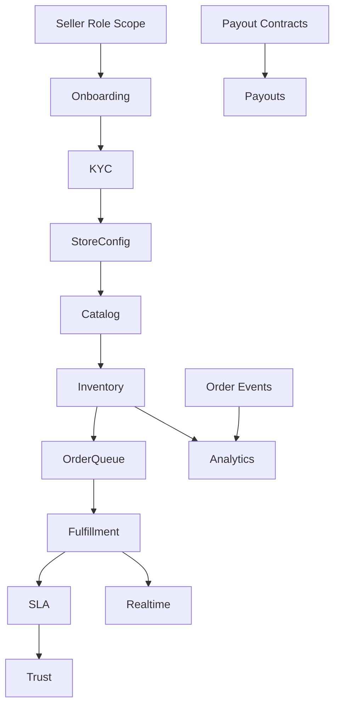

# VENDORHUB Phase 7 Seller Commerce Operations and Marketplace Infrastructure

Internal Seller Commerce Operations and Marketplace Infrastructure Constitution for VENDORHUB

Status: locked baseline before seller-web implementation  
Depends on: Phase 0-6 constitutions  
Scope: seller ecosystem, onboarding, KYC, dashboard, catalog, inventory, fulfillment, pricing, analytics, payouts, hyperlocal operations, trust, realtime sync, notifications, mobile UX, recovery, testing, AI-assisted seller engineering  
Non-goal: implementation code or generic dashboard templates

---

## 0. Seller Operations Lock

VENDORHUB sellers are not passive merchants inside a storefront. They are operational partners in a realtime commerce network. Their tools must help them keep inventory truthful, fulfill orders under SLA pressure, understand economics, maintain trust, and coordinate with dispatch.

The central seller truth:

```txt
VENDORHUB seller UX is a realtime fulfillment operating layer, not a dashboard.
```

Every seller surface must answer:

- what needs action now?
- what inventory is at risk?
- which order is approaching SLA breach?
- what is live, stale, syncing, or failed?
- what money has been earned, withheld, settled, or paid out?
- what trust or verification issue blocks operations?

---

## 1. Complete Seller Ecosystem Philosophy

### 1.1 What Selling Should Feel Like

Selling in VENDORHUB should feel:

- operationally clear
- fast under pressure
- financially transparent
- fair and accountable
- connected to buyer demand
- supported by realtime alerts
- protected against avoidable mistakes

Sellers need confidence that VENDORHUB will not surprise them with hidden payout logic, stale stock, invisible SLA rules, or unclear moderation decisions.

### 1.2 Seller Psychology

Seller trust depends on:

- accurate stock representation
- predictable fulfillment flow
- visible order priority
- clear payout timelines
- actionable analytics
- fast recovery from operational failures
- perceived fairness in platform quality rules

Seller retention improves when the system reduces operational uncertainty and turns marketplace complexity into clear next actions.

### 1.3 Operational Lifecycle

```txt
onboard -> verify -> configure store -> create catalog
-> seed inventory -> activate operations -> fulfill orders
-> monitor analytics -> receive payouts -> improve reliability
```

Marketplace participation philosophy:

- sellers should see how their operational behavior affects ranking, trust, buyer experience, and payouts
- VENDORHUB should reward accuracy and reliability
- VENDORHUB should intervene before failures become buyer-facing

---

## 2. Complete Seller Onboarding Architecture

### 2.1 Onboarding Flow

```txt
Account Creation
↓
Business Verification
↓
KYC Submission
↓
Bank Verification
↓
Store Configuration
↓
Inventory Setup
↓
Operational Activation
```

Account Creation:

- UX: create account, choose seller role, verify email/phone
- backend: auth user, vendor draft, role scope
- requirements: verified contact
- failure: retry verification, support path

Business Verification:

- UX: business name, category, address, registration details
- backend: validate business identifiers where available
- requirements: unique vendor profile, serviceable address
- escalation: suspicious duplicate or high-risk category to moderation

KYC Submission:

- UX: document upload, status tracker, required fields checklist
- backend: moderation/KYC case, provider adapter, fraud screening
- requirements: owner identity, business documents
- failure: needs-info state with exact missing requirement

Bank Verification:

- UX: bank details, payout eligibility status
- backend: payment provider/bank validation, ledger account setup
- requirements: verified bank before payouts
- failure: payout disabled, seller operations may remain limited

Store Configuration:

- UX: hours, service zones, prep capacity, delivery settings
- backend: vendor serviceability and logistics projection
- requirements: operational hours and address

Inventory Setup:

- UX: first products, variants, starting stock
- backend: catalog and inventory rows, search projection
- requirements: at least one published product with stock

Operational Activation:

- UX: readiness checklist and activation button
- backend: KYC/trust/status checks, VENDOR_OPENED event
- requirements: verification threshold, catalog, inventory, hours

### 2.2 KYC System

States:

```txt
NOT_STARTED
SUBMITTED
IN_REVIEW
NEEDS_INFO
APPROVED
REJECTED
EXPIRED
SUSPENDED
```

Fraud signals:

- duplicate bank account
- repeated rejected documents
- suspicious business address
- mismatched identity/business data
- high-risk category

Trust integration:

- KYC approval unlocks payout eligibility
- trust score affects review priority and marketplace visibility
- serious risk can place vendor hold

---

## 3. Complete Seller Dashboard Architecture

### 3.1 Dashboard Intent

The seller dashboard is a realtime commerce command center. It must prioritize action over decoration.

Primary zones:

- vendor status/header
- KPI strip
- live order queue
- selected order detail panel
- inventory risk panel
- payout summary
- operational feed

### 3.2 Layout

```txt
status header
KPI strip
left: live queue
center: selected order / workbench
right: alerts, stock risk, payout status
bottom/drawer: detail and audit timeline
```

Scanning hierarchy:

1. critical alerts and SLA breaches
2. new/active orders
3. low stock and unavailable products
4. payout/settlement notices
5. analytics insights

Dense-but-readable:

- compact rows
- strong status badges
- timestamps and countdowns
- no generic equal card grid

### 3.3 Realtime Feeds

Live order feeds:

- NEW_SELLER_ORDER
- ORDER_STATUS_UPDATED
- ORDER_CANCELLED

Inventory feeds:

- LOW_STOCK_ALERT
- INVENTORY_RESERVED
- INVENTORY_RELEASED
- INVENTORY_ADJUSTED

Dispatch feeds:

- RIDER_ASSIGNED
- PICKUP_COMPLETED
- ETA_UPDATED

Payout feeds:

- PAYOUT_SCHEDULED
- PAYOUT_PROCESSING
- PAYOUT_COMPLETED
- PAYOUT_FAILED

Priority:

- blocking operational actions first
- SLA warnings above informational updates
- payout failures above payout views

---

## 4. Complete Product Catalog Architecture

### 4.1 Catalog Management

Functions:

- create product
- edit product
- manage category
- create variants
- assign SKU
- upload media
- publish/unpublish
- bulk import/export
- moderation status visibility

### 4.2 Product Modeling

Product:

- vendor-owned sellable concept
- title, description, category, media, moderation status

Variant:

- purchasable unit
- SKU, price, attributes, status
- links to inventory row

SKU:

- seller-visible identifier
- unique per vendor/product where possible
- required for bulk inventory operations

Metadata:

- attributes for filtering/search
- preparation constraints where relevant
- compliance/moderation fields

Search integration:

- PRODUCT_CREATED/UPDATED/PUBLISHED events update search document
- title/description/category/media metadata support ranking
- availability projection comes from inventory events

### 4.3 Media System

Upload workflow:

- select media
- validate file type/size/dimensions
- upload to object storage
- generate optimized variants
- attach to product
- publish after moderation where required

Governance:

- no broken media in published product
- CDN-optimized variants
- alt text encouraged/required where practical
- media changes emit catalog update events

---

## 5. Complete Inventory Management System

### 5.1 Inventory Lifecycle

```txt
AVAILABLE
↓
RESERVED
↓
CONFIRMED
↓
FULFILLED
↓
RECONCILED
```

AVAILABLE:

- seller visibility: sellable stock
- impact: appears in catalog/search
- realtime: availability projections update

RESERVED:

- seller visibility: reserved count
- impact: stock held for checkout/order
- realtime: reservation events patch inventory workbench

CONFIRMED:

- seller visibility: committed to order
- impact: active fulfillment demand
- realtime: order queue reflects committed items

FULFILLED:

- seller visibility: picked/handed off
- impact: stock consumed
- realtime: order status advances

RECONCILED:

- seller visibility: corrected by count/audit
- impact: stock ledger adjusted
- realtime: adjustment event and audit trail

### 5.2 Stock Operations

Operations:

- increment stock
- decrement stock
- set absolute quantity
- bulk CSV adjustment
- mark item unavailable
- reconcile stock count

Concurrency:

- stock_version optimistic concurrency
- Redis reservation state considered during updates
- conflicting updates show latest server truth

Multi-device:

- all active seller sessions receive inventory patches
- stale editor warning if version changed
- bulk operations create audit trail

### 5.3 Low-Stock Intelligence

Thresholds:

- seller-defined
- category defaults
- velocity-based predicted depletion

Alerts:

- low stock
- stockout risk
- high reservation failure
- unusual adjustment pattern

Reorder intelligence:

- forecast from sales velocity
- highlight products with demand but low availability
- identify revenue lost to stockouts

---

## 6. Complete Order Fulfillment Architecture

### 6.1 Fulfillment Flow

```txt
ORDER_RECEIVED
↓
ACCEPTED
↓
PACKING
↓
READY_FOR_PICKUP
↓
HANDOFF_COMPLETED
```

ORDER_RECEIVED:

- responsibility: review order quickly
- realtime: NEW_SELLER_ORDER
- SLA: acceptance countdown starts
- recovery: reject with reason, timeout escalation

ACCEPTED:

- responsibility: commit to preparation
- realtime: ORDER_ACCEPTED_BY_VENDOR
- SLA: packing timer starts

PACKING:

- responsibility: prepare items
- realtime: ORDER_PREPARING
- SLA: prep estimate visible

READY_FOR_PICKUP:

- responsibility: package ready for rider
- realtime: ORDER_READY_FOR_PICKUP
- SLA: dispatch/handoff timer begins

HANDOFF_COMPLETED:

- responsibility: confirm rider handoff
- realtime: PICKUP_COMPLETED
- SLA: seller fulfillment segment complete

### 6.2 SLA System

SLA types:

- acceptance SLA
- packing SLA
- ready-for-pickup SLA
- handoff SLA
- cancellation/rejection quality

Penalty model:

- warnings before penalties
- reliability score affected by repeated breaches
- admin review for chronic failures
- ranking/search visibility may be affected

SLA visibility:

- countdown per order
- breach risk badge
- daily/weekly reliability KPI

---

## 7. Complete Pricing and Discount Architecture

Pricing:

- base product price
- variant price
- promotional price
- flash sale
- coupon eligibility
- delivery fee coordination

Update workflow:

- edit price
- validate min/max policy
- preview buyer-facing price
- publish price version
- emit PRICE_CHANGED
- search/cache/realtime invalidation

Conflict prevention:

- price version included in checkout quote
- checkout revalidates price
- seller sees active promotions and conflicts

Dynamic pricing tradeoffs:

- improves competitiveness
- can confuse buyers/sellers if opaque
- requires audit and versioning

---

## 8. Complete Seller Analytics Architecture

### 8.1 KPI System

Revenue:

- GMV
- net earnings
- average order value
- payout pending

Operational:

- orders accepted
- acceptance time
- packing time
- SLA breach rate
- cancellation rate

Inventory:

- stockout rate
- low-stock count
- reservation failures
- top depleted items

Delivery:

- ready-to-pickup timeliness
- pickup delays
- delivery SLA influence

Trust:

- reliability score
- dispute rate
- refund rate
- moderation status

### 8.2 Visualization

Charts:

- trend lines
- KPI tiles
- inventory heatmaps
- SLA timelines
- product performance tables
- search visibility panels

Actionable analytics:

- every insight should imply a next action
- avoid vanity-only metrics
- distinguish marketplace factors from seller-controlled factors

---

## 9. Complete Payout and Commission Architecture

### 9.1 Payout States

```txt
EARNED
↓
PROCESSING
↓
SETTLED
↓
PAID_OUT
```

EARNED:

- visible after eligible completed order
- meaning: revenue recognized but not settled
- failure: may be held by refund/dispute/fraud

PROCESSING:

- payment-service settlement running
- expected payout date shown
- failure: provider delay or verification hold

SETTLED:

- ledger settlement complete
- payout scheduled/ready
- failure: bank/payout issue

PAID_OUT:

- payout completed
- receipt/reference available
- failure: reversal/dispute workflow

### 9.2 Economic Transparency

Seller sees:

- gross order amount
- commission/fees
- refund deductions
- dispute holds
- tax lines where applicable
- net payout
- settlement timeline

Rules:

- payment ledger is authoritative
- seller cannot mutate payout
- payout failures show next action

---

## 10. Complete Hyperlocal Inventory and Delivery Coordination

Seller controls:

- delivery radius/service zone
- operating hours
- prep capacity
- temporary pause
- product availability by time

Availability zoning:

- vendor location and service zone define eligibility
- H3 cells power local ranking and dispatch grouping
- product availability combines stock + serviceability + operating status

Readiness indicators:

- store open/closed
- accepting orders
- prep capacity normal/high load
- rider pickup health
- low-stock risk

Delivery optimization visibility:

- seller sees pickup readiness and rider assignment status
- buyer-facing ETA depends on seller prep accuracy
- chronic readiness delays affect trust/SLA

---

## 11. Complete Seller Trust and Reputation System

Inputs:

- KYC status
- acceptance rate
- SLA adherence
- cancellation/rejection rate
- stock accuracy
- dispute/refund rate
- buyer ratings
- moderation outcomes

Visibility:

- seller-facing reliability score
- factor breakdown
- improvement recommendations
- warning thresholds

Escalation:

- low reliability warning
- ranking dampening
- operational review
- temporary suspension
- payout hold in severe cases

Trust psychology:

- sellers need to understand what affects trust
- trust should feel governed, not arbitrary
- improvement path must be visible

---

## 12. Complete Realtime Synchronization Architecture

Topics:

```txt
vendor:{vendorId}:orders
vendor:{vendorId}:inventory
vendor:{vendorId}:payouts
vendor:{vendorId}:alerts
```

Messages:

- NEW_SELLER_ORDER
- ORDER_STATUS_UPDATED
- LOW_STOCK_ALERT
- INVENTORY_ADJUSTED
- PAYOUT_STATUS_UPDATED
- SLA_WARNING
- VENDOR_HOLD_PLACED

Reconnect:

- replay from cursor
- snapshot refetch on replay gap
- stale badge on dashboard panels
- pause destructive operations if state uncertain

Operational reconciliation:

- inventory panel compares local optimistic state to server version
- order queue refetches on sequence gap
- payout panel always refetches source truth after reconnect

---

## 13. Complete Seller Notification System

Urgency:

Critical:

- new order
- SLA breach imminent
- store suspended/hold
- payout failed

High:

- low stock
- rider arrived/failed pickup
- order cancelled

Medium:

- payout settled
- analytics insight
- product moderation update

Low:

- tips, recommendations, non-urgent reports

Choreography:

- in-app realtime alert
- push if seller inactive
- email for payout/moderation summary
- avoid duplicating every order state across all channels

---

## 14. Complete Mobile Seller Experience

Mobile priorities:

- accept/reject order
- mark packing/ready
- quick stock adjustment
- view low-stock alerts
- pause store
- see payout status

Ergonomics:

- large primary actions
- sticky order action footer
- compact queue cards
- bottom sheets for order detail
- quick increment/decrement controls
- confirmation for destructive stock/order actions

Dashboard transformation:

- KPI strip collapses to scrollable row
- queue becomes primary screen
- detail opens as sheet
- alerts appear as top priority stack

---

## 15. Complete Failure and Recovery UX

Stale inventory:

- show stale badge
- refetch latest
- merge/retry seller adjustment

Dispatch failure:

- show rider assignment issue
- keep seller action state stable
- admin/logistics handles reassignment

Payout delay:

- show state and expected next check
- include support/escalation path

Websocket disconnect:

- dashboard stale indicator
- fallback polling
- disable actions requiring live state only when necessary

Fulfillment SLA failure:

- show breached state
- suggest next action
- record reason if seller-caused

Maintaining trust:

- explain what happened
- preserve seller context
- show system recovery progress

---

## 16. Complete Frontend State Orchestration

TanStack Query:

- orders queue
- order detail
- inventory table
- catalog products
- payout summaries
- analytics panels

Zustand:

- selected order
- dashboard layout state
- drawer/sheet state
- realtime connection status
- bulk edit draft state

Optimistic:

- stock adjustment with version check
- order accept/mark-ready with pending state

No optimism:

- payout state
- moderation/KYC state
- financial ledger values

Cache invalidation:

- order events patch queue/detail
- inventory events patch inventory rows
- payout events invalidate/refetch payout summary
- sequence gaps trigger replay/refetch

---

## 17. Complete Engineering Governance

Seller app rules:

- no generic dashboard components when operational components exist
- all order actions require idempotency keys
- inventory mutations use versioned server truth
- payout data is read-only and source-truth fetched
- realtime handlers live in feature realtime adapters
- no direct parsing of raw websocket payloads in components

Naming:

- `SellerOrderQueue`
- `InventoryWorkbench`
- `PayoutLedgerSummary`
- `FulfillmentActionPanel`
- `SlaCountdownBadge`
- `VendorOperationalStatus`

Operational UI:

- SLA and alerts above vanity metrics
- dense tables with stable dimensions
- critical actions audited

---

## 18. Complete Testing Strategy

Inventory:

- concurrent stock adjustments
- reservation conflicts
- version mismatch recovery
- low-stock alert generation

Fulfillment:

- accept/reject flows
- packing/ready transitions
- SLA warning/breach simulations
- duplicate action idempotency

Payout:

- settlement state display
- refund deduction visibility
- payout failure recovery
- no mutation from seller UI

Realtime:

- new order insertion
- reconnect replay
- sequence gap refetch
- multi-device inventory sync

Operational recovery:

- websocket down
- stale inventory
- dispatch delay
- moderation hold

---

## 19. Complete AI-Assisted Seller Engineering Workflow

Inventory prompt:

```txt
Build seller inventory workflow.
Use inventory-service contracts, stock_version optimistic concurrency, realtime inventory topic, low-stock states, stale recovery, and audit-aware adjustment UX.
Do not create generic CRUD table behavior.
```

Dashboard prompt:

```txt
Build seller operational dashboard.
Prioritize live order queue, SLA warnings, inventory risk, payout summary, and operational alerts.
Use VENDORHUB operational layout and realtime visual grammar.
Avoid generic equal card grids.
```

Fulfillment prompt:

```txt
Implement seller fulfillment flow ORDER_RECEIVED -> ACCEPTED -> PACKING -> READY_FOR_PICKUP -> HANDOFF_COMPLETED.
Define actions, idempotency, realtime events, SLA states, failure recovery, and tests.
```

Payout prompt:

```txt
Build payout visibility UI.
Use payment-service read contracts only.
Show gross, fees, refunds, holds, settlement state, expected payout, and failure recovery.
Do not allow seller-side payout mutation.
```

Review prompt:

```txt
Review this seller feature for VENDORHUB operational compliance.
Find stale inventory risks, missing idempotency, weak SLA visibility, payout ambiguity, generic dashboard patterns, missing websocket recovery, missing audit, and contract drift.
Return findings with file and line references.
```

---

## 20. Complete Implementation Sequencing

### 20.1 Exact Order

1. Seller auth role/scoped vendor membership.
2. Seller onboarding shell.
3. KYC and verification status surfaces.
4. Store configuration and operating status.
5. Catalog product/variant creation.
6. Inventory workbench with source-truth reads.
7. Inventory mutations with version checks.
8. Low-stock alerts.
9. Live order queue snapshot.
10. Fulfillment actions and SLA timers.
11. Seller websocket topics and replay.
12. Payout read-only summary.
13. Seller analytics panels.
14. Trust/reliability score surfaces.
15. Mobile seller operational flows.

### 20.2 Dependency Graph



### 20.3 Before Realtime Fulfillment

Must exist:

- vendor membership authorization
- order queue snapshot endpoint
- fulfillment state machine
- idempotent order action APIs
- websocket vendor order topic
- replay/reconnect support
- SLA timer source of truth
- audit logging for seller actions

Rollout:

- enable onboarding/catalog first
- enable inventory only with versioning/reconciliation
- enable live fulfillment only after queue snapshot and websocket recovery work
- enable payouts after payment ledger read models are trustworthy
- enable trust scoring after reliable operational metrics exist

---

## 21. Final Phase 7 Lock Rules

1. Seller UX is an operational workbench, not a dashboard template.
2. Seller onboarding must expose verification, payout, and activation readiness clearly.
3. Catalog changes must connect to search, inventory, and moderation.
4. Inventory is source-truth, versioned, and realtime-synchronized.
5. Order fulfillment must expose SLA pressure and next actions.
6. Payouts are transparent, read-only, and ledger-backed.
7. Seller analytics must be actionable and operational.
8. Hyperlocal availability depends on stock, hours, service zone, and capacity.
9. Seller trust scoring must be explainable and improvement-oriented.
10. Realtime seller surfaces require replay, stale state, and recovery UX.
11. Mobile seller UX prioritizes rapid order and stock operations.
12. Failure UX must preserve seller trust and operational continuity.
13. AI-generated seller UI must preserve marketplace infrastructure identity.
14. Realtime fulfillment cannot launch before idempotent actions, SLA source truth, audit, and replay are ready.

This document locks the seller commerce operations and marketplace infrastructure foundation for VENDORHUB Phase 7.
