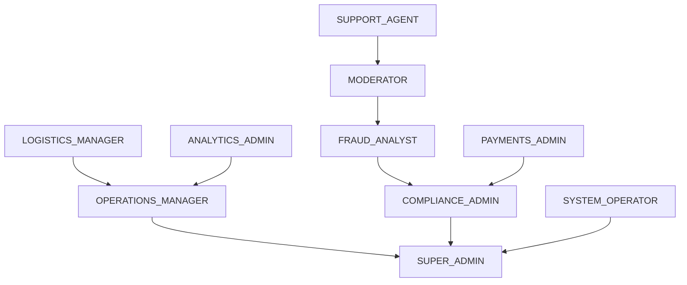
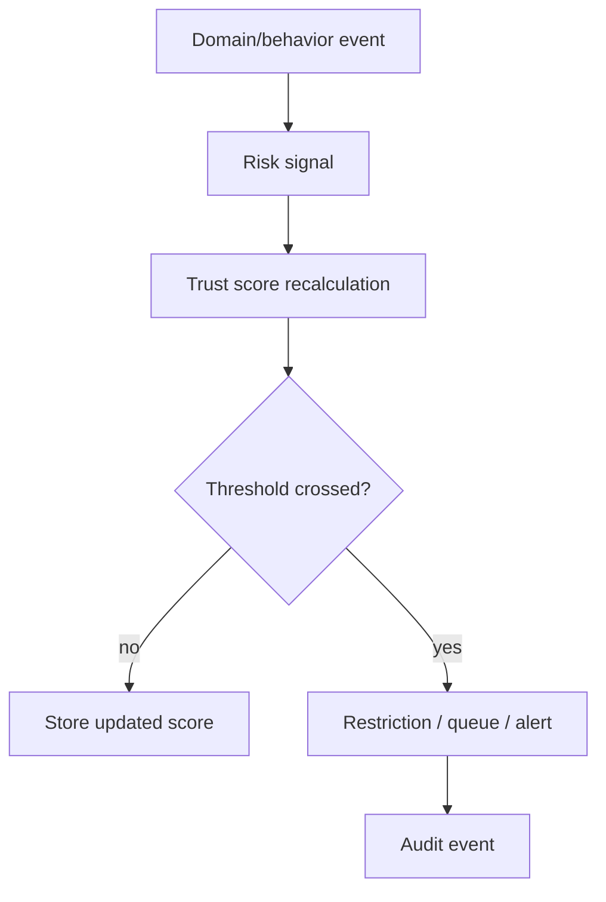
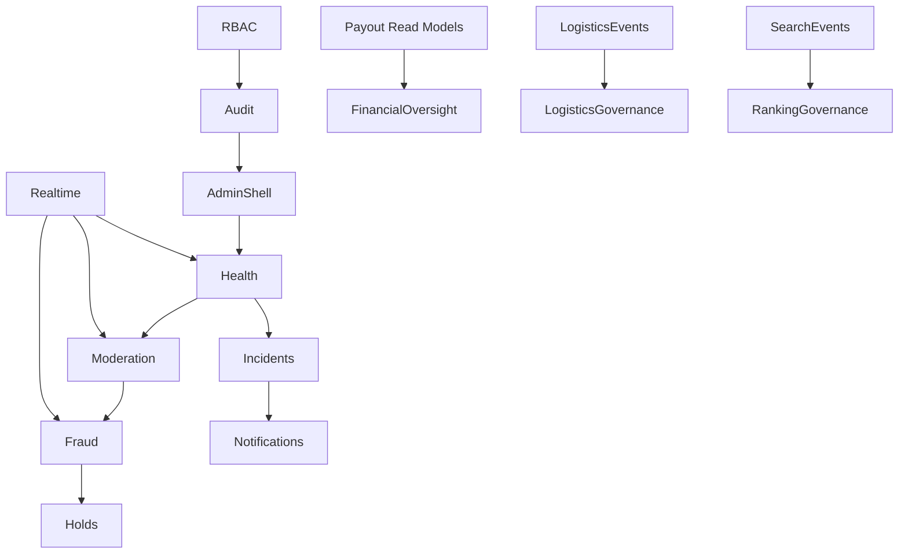

# VENDORHUB Phase 8 Governance, Trust, Fraud, and Marketplace Operations

Internal Governance, Trust, Fraud, and Marketplace Operations Constitution for VENDORHUB

Status: locked baseline before admin-web implementation  
Depends on: Phase 0-7 constitutions  
Scope: admin control center, admin RBAC, trust and safety, moderation, fraud, disputes, ecosystem health, logistics governance, payout oversight, search/recommendation governance, incidents, analytics, audit, notifications, realtime sync, recovery, mobile operations, testing, AI-assisted admin engineering  
Non-goal: implementation code or generic admin dashboards

---

## 0. Governance Lock

VENDORHUB governance is the operational nervous system of the marketplace. The admin platform is not a set of management panels. It is the control layer that preserves trust, detects abuse, coordinates incidents, enforces marketplace quality, and makes distributed operational state visible.

The central governance truth:

```txt
VENDORHUB governance turns marketplace risk into visible, auditable, prioritized operational work.
```

Every governance surface must answer:

- what is happening across the ecosystem?
- what is risky, delayed, anomalous, or unfair?
- who owns the next action?
- what evidence supports the decision?
- what is the blast radius?
- what was changed, by whom, and why?
- what is live, stale, replaying, or degraded?

---

## 1. Complete Governance Philosophy of VENDORHUB

### 1.1 What Governance Means

VENDORHUB is a marketplace ecosystem. Buyers, sellers, riders, payment systems, logistics flows, search ranking, recommendations, and support workflows interact continuously. Governance is the infrastructure that keeps that ecosystem fair, safe, operationally healthy, and economically trustworthy.

Governance includes:

- trust scoring
- fraud detection
- moderation
- payout oversight
- dispute resolution
- SLA enforcement
- incident response
- audit and traceability
- recommendation/search fairness
- operational analytics

### 1.2 Principles

- Trust is operational visibility plus accountable action.
- Moderation is a workflow, not a one-off decision.
- Fraud prevention must be proactive and evidence-driven.
- Admin power must be least-privilege and auditable.
- Ecosystem quality must be measured continuously.
- Escalation paths must be explicit.
- Realtime signals require stale-state honesty.
- Platform neutrality requires measurable governance of ranking, exposure, and enforcement.

### 1.3 Governance Psychology

Admins need calm urgency. The system must surface severe issues without turning every anomaly into a crisis. Moderators need evidence and consistency. Fraud analysts need patterns and confidence scores. Operations managers need throughput and SLA visibility. Finance admins need ledger-backed truth.

---

## 2. Complete Admin Role Hierarchy

### 2.1 Roles

```txt
SUPPORT_AGENT
MODERATOR
FRAUD_ANALYST
OPERATIONS_MANAGER
LOGISTICS_MANAGER
PAYMENTS_ADMIN
COMPLIANCE_ADMIN
ANALYTICS_ADMIN
SUPER_ADMIN
SYSTEM_OPERATOR
```

### 2.2 Role Definitions

SUPPORT_AGENT:

- permissions: support.orders.read, support.users.read.masked, support.tickets.write, refunds.request
- visibility: assigned tickets, selected order status, masked buyer/seller data
- restricted: payouts, role changes, fraud hold release, raw PII export
- escalation: moderator, payments admin, operations manager
- audit sensitivity: medium
- realtime scope: support queues and selected order streams

MODERATOR:

- permissions: moderation.cases.read, moderation.cases.act, kyc.review, reviews.moderate
- visibility: moderation/KYC/review queues
- restricted: payout execution, global settings, role assignment
- escalation: compliance admin, super admin
- audit sensitivity: high
- realtime scope: moderation and KYC streams

FRAUD_ANALYST:

- permissions: fraud.signals.read, fraud.holds.place, fraud.holds.release.scoped, risk.review
- visibility: fraud anomaly streams, risk entities, evidence graphs
- restricted: payout release without payments admin, role changes
- escalation: compliance admin, payments admin, super admin
- audit sensitivity: high
- realtime scope: fraud and abuse streams

OPERATIONS_MANAGER:

- permissions: admin.operations.read, incidents.manage, vendors.suspend.scoped, sla.manage
- visibility: ecosystem health, order throughput, seller health, incidents
- restricted: financial release, compliance exports
- escalation: super admin
- audit sensitivity: high
- realtime scope: regional/global ops streams by scope

LOGISTICS_MANAGER:

- permissions: logistics.monitor, dispatch.override.scoped, riders.suspend.scoped, delivery.incidents.manage
- visibility: dispatch heatmaps, rider health, route anomalies
- restricted: payments, moderation decisions outside rider ops
- escalation: operations manager
- audit sensitivity: high
- realtime scope: logistics region streams

PAYMENTS_ADMIN:

- permissions: payouts.review, payouts.hold, refunds.approve, settlements.review
- visibility: settlement, payout, refund, reconciliation dashboards
- restricted: seller moderation unless fraud/compliance linked
- escalation: compliance admin, super admin
- audit sensitivity: critical
- realtime scope: financial anomaly and payout streams

COMPLIANCE_ADMIN:

- permissions: compliance.review, audit.export.scoped, kyc.override, fraud.policy.manage
- visibility: audit, KYC, fraud, policy compliance
- restricted: operational override without paired role
- escalation: super admin
- audit sensitivity: critical
- realtime scope: compliance and high-risk streams

ANALYTICS_ADMIN:

- permissions: analytics.read.admin, experiments.review, ranking.monitor
- visibility: ecosystem analytics, recommendation/search quality, KPI rollups
- restricted: operational enforcement and financial mutation
- escalation: operations manager or super admin
- audit sensitivity: medium
- realtime scope: analytics projections

SUPER_ADMIN:

- permissions: global admin, role management, emergency controls
- visibility: all scoped streams
- restricted: still requires MFA/step-up/dual control for critical actions
- escalation: incident process and postmortem
- audit sensitivity: critical
- realtime scope: global

SYSTEM_OPERATOR:

- permissions: service operations, incident mitigation, feature flag emergency actions
- visibility: infrastructure health, queues, deployments
- restricted: user-level moderation/payment decisions unless explicitly delegated
- escalation: super admin/incident commander
- audit sensitivity: critical
- realtime scope: system/infrastructure streams

### 2.3 Hierarchy



Least privilege:

- roles are scoped by region, queue, policy area, or resource
- critical financial and role-management actions require step-up
- dual control required for extreme payout, compliance, or global enforcement actions

---

## 3. Complete Admin Control Center Architecture

### 3.1 Control Center Intent

The admin platform is a realtime marketplace command center. It must prioritize exceptions, health, and action ownership.

Core zones:

- global health band
- incident/alert stack
- live operations topology
- moderation/fraud queues
- SLA and logistics heatmaps
- payout/reconciliation watchlist
- search/recommendation health
- audit/correlation search

### 3.2 Layout

```txt
top: environment, region, live/stale status, incident severity
left: navigation and queue counts
center: operational topology / selected dashboard
right: realtime event feed and alert stack
drawer: entity detail, evidence, audit trail, action panel
```

Critical-event priority:

1. active incidents and fraud spikes
2. payment/payout anomalies
3. dispatch/SLA breaches
4. moderation/KYC queues approaching SLA
5. seller/rider ecosystem degradation
6. recommendation/search quality anomalies

### 3.3 Realtime Monitoring

Streams:

- live GMV
- live order throughput
- payment failures
- dispatch backlog
- rider availability
- seller health
- fraud signals
- moderation queue depth
- websocket health

Operational confidence comes from seeing both activity and uncertainty: stale badges, last update time, replay status, and projection source are mandatory.

---

## 4. Complete Trust and Safety Architecture

### 4.1 Trust Scoring Engine

Subjects:

- buyers
- sellers
- riders
- products
- orders
- payment instruments

Inputs:

- verification state
- login/device risk
- fulfillment SLA history
- cancellation/refund/dispute ratio
- suspicious payment behavior
- coupon/refund abuse patterns
- fake review signals
- inventory accuracy
- rider location consistency
- moderation outcomes

Outputs:

- risk level
- manual review priority
- payout hold recommendations
- dispatch eligibility
- seller ranking dampening
- buyer friction/challenge
- automated restrictions

### 4.2 Lifecycle



### 4.3 Safety Signals

Behavioral:

- repeated failed payment attempts
- rapid account creation
- unusual refund velocity
- review bursts

Transactional:

- chargeback/refund anomalies
- payout bank changes before payout
- coupon stacking abuse

Operational:

- seller high cancellation
- fake inventory/stockout pattern
- rider GPS inconsistency
- SLA manipulation

---

## 5. Complete Moderation Workflow System

### 5.1 Pipeline

```txt
FLAGGED
↓
TRIAGED
↓
UNDER_REVIEW
↓
ACTION_TAKEN
↓
ESCALATED
↓
RESOLVED
```

FLAGGED:

- visibility: queue item created with source signal
- audit: source event, flag reason
- SLA: immediate classification for high severity

TRIAGED:

- visibility: severity, owner, queue assignment
- audit: triage actor/automation
- escalation: high risk to fraud/compliance

UNDER_REVIEW:

- visibility: evidence panel, history, linked entities
- audit: all reviewer actions
- SLA: timer visible

ACTION_TAKEN:

- visibility: decision, restriction, user-facing status
- audit: reason, policy, before/after

ESCALATED:

- visibility: escalation chain and required authority
- audit: escalation reason

RESOLVED:

- visibility: final decision and appeal eligibility
- audit: immutable resolution

### 5.2 Queues

Queues:

- seller KYC
- rider KYC
- product moderation
- review moderation
- fraud holds
- payout review
- disputes and appeals

Prioritization:

- severity
- financial exposure
- buyer impact
- SLA remaining
- trust score
- linked incident

Assignment:

- role eligibility
- region/language/category
- workload
- conflict-of-interest avoidance where needed

---

## 6. Complete Fraud Detection Architecture

### 6.1 Fraud Pipeline

```txt
event ingestion -> feature extraction -> rule engine
-> anomaly score -> action threshold -> queue/hold/escalation
-> analyst decision -> feedback loop
```

Fraud domains:

- payment fraud
- refund fraud
- seller abuse
- fake inventory
- bot activity
- location spoofing
- coupon abuse
- fake reviews

Rule engine:

- deterministic high-confidence rules
- velocity rules
- device/account graph rules
- payment/refund thresholds
- geospatial inconsistency rules

AI-assisted anomaly detection:

- used as a signal, not sole enforcement authority
- explanations and contributing factors required
- false positive tracking mandatory

### 6.2 Intervention

Actions:

- step-up authentication
- temporary hold
- payout hold
- manual review queue
- order pause
- coupon restriction
- seller/rider suspension

False-positive minimization:

- graduated interventions
- manual review for severe penalties
- appeal path for impacted actors
- feedback from analyst decisions

---

## 7. Complete Dispute Resolution System

### 7.1 States

```txt
OPENED
↓
UNDER_REVIEW
↓
EVIDENCE_REQUESTED
↓
DECISION_PENDING
↓
RESOLVED
↓
APPEALED
```

OPENED:

- responsibilities: create case, categorize issue
- visibility: user sees case id/status
- escalation: high-value/high-risk to specialist

UNDER_REVIEW:

- responsibilities: inspect order, payment, delivery, messages, proof
- visibility: expected response time

EVIDENCE_REQUESTED:

- responsibilities: request buyer/seller/rider/admin evidence
- visibility: clear deadline

DECISION_PENDING:

- responsibilities: apply policy and financial impact review
- visibility: decision pending

RESOLVED:

- responsibilities: execute refund/hold/release/support outcome
- visibility: outcome and reason summary

APPEALED:

- responsibilities: second-level review
- visibility: appeal state and SLA

### 7.2 Fairness

- evidence must be structured and traceable
- decisions cite policy category
- financial actions reconcile with payment ledger
- appeals are separated from original reviewer when possible

---

## 8. Complete Ecosystem Health Monitoring

KPIs:

- order creation rate
- checkout success rate
- payment authorization failure rate
- inventory reservation failure rate
- dispatch latency
- rider availability
- delivery SLA
- seller cancellation rate
- refund/dispute rate
- moderation backlog
- fraud hold rate
- search zero-result rate
- recommendation CTR/conversion
- websocket reconnect rate

Dashboards:

- ecosystem overview
- regional health
- seller cohort health
- rider fleet health
- payment health
- search/recommendation quality

Anomaly heatmaps:

- H3 region cells
- time buckets
- seller clusters
- rider clusters
- payment provider/rail

---

## 9. Complete Logistics Governance Architecture

Oversight:

- dispatch backlog
- assignment offer success
- rider acceptance/decline patterns
- pickup delay
- route deviation
- ETA drift
- location spoofing
- delivery failure clusters

Visuals:

- regional heatmap
- rider availability map
- dispatch queue
- route anomaly feed
- SLA timeline

Interventions:

- manual reassignment
- rider hold
- dispatch policy adjustment
- incident creation
- buyer/seller notification

---

## 10. Complete Payout and Financial Oversight Architecture

Visibility:

- settlement batches
- payout states
- refund deductions
- commission calculation
- dispute holds
- provider reconciliation
- failed payouts

Anomaly detection:

- payout amount spike
- bank account changes before payout
- high refund seller
- duplicate payout attempts
- settlement mismatch
- provider webhook lag

Escalation:

- payments admin review
- compliance review for suspicious payouts
- payout hold
- ledger reconciliation job
- provider support case

Financial trust:

- ledger is authoritative
- admin mutation requires step-up and audit
- payout decisions require reason codes

---

## 11. Complete Recommendation and Search Governance

Governance goals:

- relevance
- fairness
- spam suppression
- seller exposure health
- marketplace neutrality
- abuse resistance

Monitoring:

- search zero-result rate
- query reformulation rate
- result click distribution
- seller exposure distribution
- recommendation CTR/conversion
- low-quality product exposure
- promoted/organic separation

Controls:

- suppress fraudulent/spam sellers
- demote unreliable inventory
- flag ranking anomalies
- review exposure fairness by region/category
- track model/version changes

Recommendation governance must never override checkout truth: inventory/serviceability/payment constraints remain authoritative.

---

## 12. Complete Realtime Alerting and Incident Management

### 12.1 Incident Flow

```txt
DETECTED
↓
CLASSIFIED
↓
ESCALATED
↓
ASSIGNED
↓
MITIGATED
↓
RESOLVED
↓
POSTMORTEM
```

DETECTED:

- owner: alerting system or admin
- observability: signal, threshold, correlation ids

CLASSIFIED:

- owner: operations manager/system operator
- severity and affected domain assigned

ESCALATED:

- owner: on-call/role route
- rules by severity and domain

ASSIGNED:

- owner: incident commander
- timeline and comms channel created

MITIGATED:

- owner: domain operator
- feature flag, rollback, queue pause, provider fallback, policy hold

RESOLVED:

- owner: incident commander
- confirmation metrics stable

POSTMORTEM:

- owner: incident commander
- root cause, remediation, follow-up

### 12.2 Severity

SEV0:

- marketplace-wide payment/order outage, active data integrity threat

SEV1:

- major region/critical workflow degraded

SEV2:

- significant feature or queue degraded

SEV3:

- localized issue with workaround

Alert fatigue prevention:

- deduplicate related alerts
- group by incident/correlation
- suppress flapping with cooldown
- require owner and action

---

## 13. Complete Admin Analytics and Intelligence Architecture

Analytics domains:

- GMV and order flow
- retention and cohorts
- fraud and risk
- logistics and SLA
- moderation throughput
- seller/rider health
- recommendation/search quality
- payments and payouts

Dashboards:

- realtime operations
- executive health
- regional health
- trust and safety
- financial operations
- ranking quality

Forecasting:

- order volume
- dispatch backlog
- inventory stockout risk
- fraud spikes
- moderation backlog

Decision-making:

- metrics must connect to actions
- raw event drill-down available through governed access
- stale/partial data clearly marked

---

## 14. Complete Audit and Traceability System

Audited actions:

- admin login and step-up
- role/permission changes
- moderation decisions
- fraud holds/releases
- payout holds/releases
- refunds approvals
- seller/rider suspensions
- incident state changes
- trust score overrides
- recommendation/search policy changes

Traceability:

- correlationId and traceId on every case/action
- evidence linked to immutable events
- before/after state where safe
- reason codes required for enforcement actions

Replay visibility:

- event timeline per entity
- audit timeline per admin
- incident timeline per event cluster

Accountability:

- audit logs are append-only
- corrections are new audit records
- sensitive exports are logged

---

## 15. Complete Admin Notification System

Priorities:

Critical:

- fraud spike
- payout anomaly
- SEV0/SEV1 incident
- role/security anomaly

High:

- moderation SLA breach
- logistics region degraded
- payment provider warning

Medium:

- queue backlog
- search/recommendation anomaly
- seller health degradation

Low:

- reports and summaries

Routing:

- by role
- by region
- by severity
- by on-call schedule

Choreography:

- in-app alert first
- push/page for critical
- email summary for non-urgent
- incident channel for SEV

---

## 16. Complete Realtime Synchronization Architecture

Admin topics:

```txt
admin:ops:{regionId}
admin:fraud
admin:moderation
admin:payments
admin:logistics:{regionId}
admin:incidents
analytics:live:{scope}
```

Realtime rules:

- all messages schema-validated
- sequence gaps request replay
- replay failure triggers snapshot refetch
- critical alerts require acknowledgement
- stale dashboards show source and last update
- high-volume streams are aggregated before UI

Consistency:

- admin actions must refetch source truth before sensitive mutation
- financial panels do not rely solely on websocket patches
- moderation queues reconcile after reconnect

---

## 17. Complete Failure and Recovery Workflows

Moderation failure:

- queue falls back to snapshot API
- actions fail closed
- cases remain assigned but stale-marked

Payout failure:

- payout actions fail closed
- ledger source truth refetched
- reconciliation job triggered

Analytics outage:

- operational source systems remain usable
- dashboard marks partial/stale
- raw operational queues still visible

Websocket outage:

- admin falls back to polling
- critical actions require fresh snapshot
- reconnect/replay when restored

Escalation failure:

- route to backup owner
- create incident automatically after timeout

---

## 18. Complete Mobile Admin and Operations UX

Mobile admin is for urgent intervention, not full analysis.

Supported:

- acknowledge incidents
- view critical alerts
- assign/escalate cases
- approve/deny limited moderation actions
- view SLA health
- trigger emergency lockout where authorized

Transformations:

- control center becomes alert stack
- queues become priority cards
- evidence panels become bottom sheets
- critical actions require step-up

Rapid escalation:

- one-tap assign/escalate
- callout to owner/on-call
- incident status updates

---

## 19. Complete Engineering Governance

Rules:

- admin UI must expose state-machine truth
- every sensitive action requires permission, reason, audit
- moderation/fraud actions use shared case components
- financial actions read ledger-backed contracts
- realtime handlers live in feature adapters
- no raw websocket parsing in components
- admin dashboards mark stale/partial data
- no admin action depends only on cached data

Naming:

- `FraudSignalQueue`
- `ModerationCasePanel`
- `PayoutOversightTable`
- `IncidentCommandPanel`
- `EcosystemHealthMap`
- `AuditTimeline`

Governance workflow:

- define role permission
- define action contract
- define audit event
- define escalation path
- define tests

---

## 20. Complete Testing Strategy

Fraud:

- payment anomaly simulation
- coupon abuse simulation
- fake review burst
- location spoofing
- false-positive review flow

Moderation:

- queue assignment
- SLA breach
- escalation
- decision audit
- appeal flow

Payout:

- duplicate payout anomaly
- settlement mismatch
- payout hold/release audit

Realtime:

- fraud alert insertion
- queue replay
- stale dashboard recovery
- critical ack requirement

Chaos drills:

- websocket outage
- analytics lag
- payment provider webhook lag
- moderation backlog surge
- dispatch region degradation

Incident drills:

- SEV classification
- escalation timeout
- mitigation logging
- postmortem creation

---

## 21. Complete AI-Assisted Admin Engineering Workflow

Moderation prompt:

```txt
Build admin moderation workflow for <case type>.
Define queue priority, evidence model, role permissions, audit events, escalation path, SLA states, realtime updates, and failure recovery.
Do not create generic CRUD panels.
```

Fraud prompt:

```txt
Design fraud operation surface for <signal>.
Define signal source, risk score, false-positive controls, intervention actions, escalation, audit, and analytics feedback loop.
```

Incident prompt:

```txt
Build incident management flow.
Use DETECTED -> CLASSIFIED -> ESCALATED -> ASSIGNED -> MITIGATED -> RESOLVED -> POSTMORTEM.
Define owner, severity, notifications, audit, and realtime synchronization.
```

Governance review prompt:

```txt
Review this admin feature for VENDORHUB governance compliance.
Find missing RBAC, missing audit, weak escalation, financial trust gaps, stale realtime handling, generic dashboard patterns, missing evidence, and inconsistent moderation logic.
Return findings with file and line references.
```

Trust review prompt:

```txt
Threat model this trust/fraud workflow.
Check false positives, abuse bypass, privilege escalation, missing evidence, missing appeal, audit gaps, and unfair marketplace impact.
```

---

## 22. Complete Implementation Sequencing

### 22.1 Exact Order

1. Admin RBAC and step-up enforcement.
2. Audit timeline foundation.
3. Admin app shell and control center layout.
4. Ecosystem health snapshot dashboards.
5. Moderation case model and queues.
6. KYC/product/review moderation workflows.
7. Fraud signal ingestion and queue.
8. Fraud hold/release workflows.
9. Dispute resolution cases.
10. Payout oversight read models.
11. Logistics governance heatmaps.
12. Search/recommendation quality dashboards.
13. Incident management.
14. Realtime admin topics and replay.
15. Mobile urgent operations.
16. Forecasting and advanced analytics.

### 22.2 Dependency Graph



### 22.3 Before Realtime Governance

Must exist:

- admin RBAC and step-up
- audit writer
- moderation/fraud case schemas
- source snapshot APIs
- realtime topic authorization
- replay/reconnect support
- incident severity model
- notification routing

Rollout:

- launch read-only health and audit first
- add moderation queues with manual decisions
- add fraud signals as advisory before automated holds
- add payout oversight read-only before admin mutation
- enable realtime after replay/stale-state recovery is proven

---

## 23. Final Phase 8 Lock Rules

1. Admin is governance infrastructure, not a dashboard template.
2. Admin privileges are least-privilege, scoped, step-up protected, and audited.
3. Trust scoring is evidence-based, explainable, and appeal-aware.
4. Moderation is queue-based, SLA-governed, and auditable.
5. Fraud intervention is risk-based with false-positive controls.
6. Disputes require structured evidence and traceable decisions.
7. Ecosystem health must show live, stale, partial, and degraded states.
8. Financial oversight must be ledger-backed and fail closed.
9. Recommendation/search governance must protect relevance, fairness, and neutrality.
10. Incidents require severity, owner, mitigation, resolution, and postmortem.
11. Admin realtime streams require replay, ack, stale-state recovery, and authorization.
12. Sensitive admin actions never rely only on cached or websocket state.
13. Mobile admin supports urgent intervention, not full operational analysis.
14. AI-generated admin systems must preserve governance consistency and auditability.
15. Realtime governance orchestration cannot launch before RBAC, audit, source snapshots, and replay are ready.

This document locks the governance, trust, fraud, and marketplace operations foundation for VENDORHUB Phase 8.
