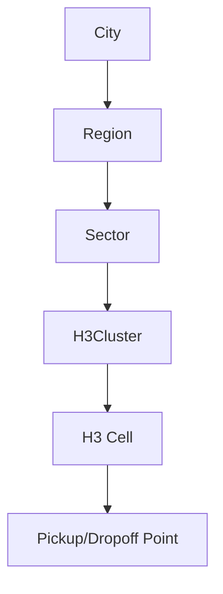
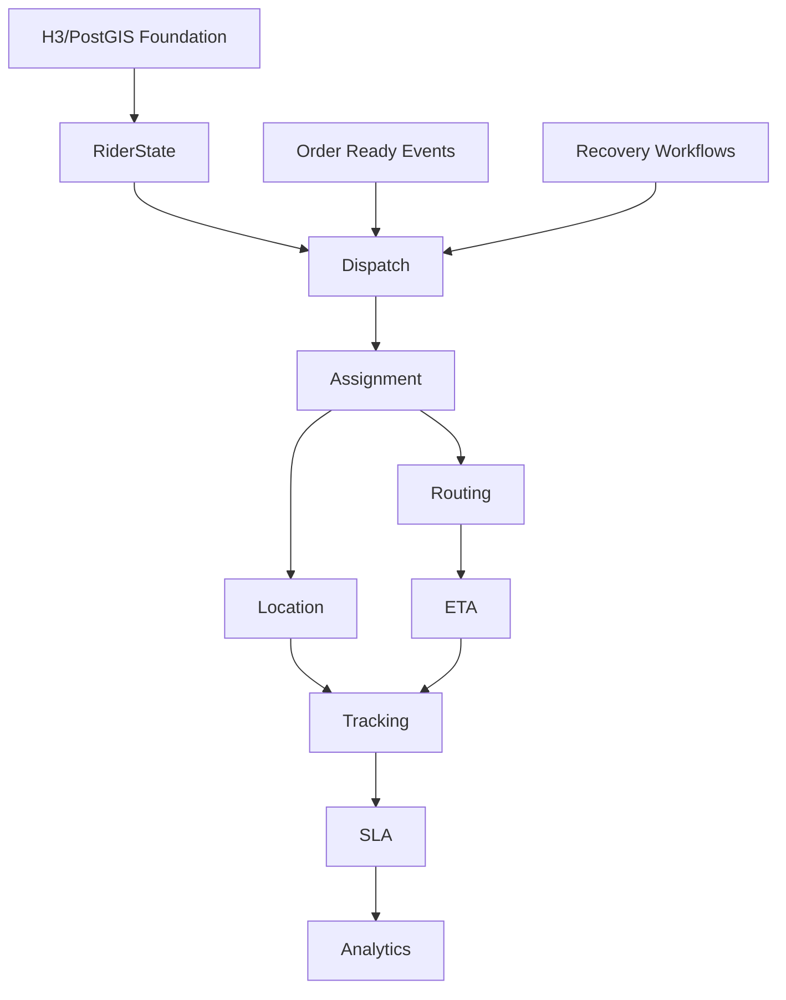

# VENDORHUB Phase 9 Hyperlocal Logistics, Dispatch, and Delivery Intelligence

Internal Hyperlocal Logistics, Dispatch, and Delivery Intelligence Constitution for VENDORHUB

Status: locked baseline before logistics-service and rider-web implementation  
Depends on: Phase 0-8 constitutions  
Scope: hyperlocal topology, rider ecosystem, dispatch engine, routing, ETA, realtime location streaming, buyer tracking, dark-store coordination, SLA governance, failure recovery, rider trust, logistics analytics, notifications, rider mobile UX, observability, testing, AI-assisted logistics workflow  
Non-goal: implementation code or generic map tracking

---

## 0. Logistics Lock

VENDORHUB logistics is a realtime control system for local movement. It does not merely show where a rider is. It decides who should move, when, through which route, under which promise, with what confidence, and how to recover when reality changes.

The central logistics truth:

```txt
VENDORHUB delivery is coordinated movement under uncertainty.
```

Every logistics decision must account for:

- seller readiness
- inventory/order state
- rider availability and capacity
- geospatial proximity
- route duration and congestion
- ETA confidence
- SLA risk
- rider trust and fairness
- buyer/seller visibility
- failure recovery

---

## 1. Complete Logistics Philosophy of VENDORHUB

### 1.1 What Delivery Should Feel Like

Delivery should feel:

- live
- predictable
- fair to riders
- transparent to buyers
- actionable for sellers
- governable for admins
- resilient when plans fail

Logistics is orchestration infrastructure because it translates distributed state into coordinated motion.

### 1.2 Principles

- ETA is a living estimate with confidence, not static text.
- Dispatch is a controlled assignment, not nearest-rider guesswork.
- Rider location is high-volume eventual data and may be stale.
- Buyer tracking must be reassuring, not noisy.
- Seller readiness directly affects delivery accuracy.
- Admins need regional health, not raw coordinate floods.
- Every dispatch decision must be explainable enough for operations.

### 1.3 Delivery Psychology

Buyer trust increases when the system shows progress and admits uncertainty. Rider trust increases when assignment logic is fair and not overload-prone. Seller trust increases when pickup timing is clear. Marketplace trust increases when SLA problems are detected before they cascade.

---

## 2. Complete Hyperlocal Topology Architecture

### 2.1 Topology Layers

Layers:

- country/region
- city
- operating region
- dispatch sector
- H3 cell cluster
- service zone polygon
- pickup/dropoff point



### 2.2 H3 Spatial Architecture

Usage:

- coarse H3: regional dashboards and heatmaps
- mid H3: dispatch candidate buckets
- fine H3: proximity filtering and cache keys

Operations:

- k-ring traversal for nearby rider/vendor discovery
- cluster balancing to prevent rider oversupply/undersupply
- H3 prefix used in Redis keys and analytics aggregation

Why H3:

- stable hierarchical grid
- efficient neighbor lookup
- simple locality bucketing
- works well with streaming location data
- reduces PostGIS exact-distance load

### 2.3 Geofencing

Delivery boundaries:

- vendor service zone polygon
- platform operating region
- dynamic delivery radius
- restricted/no-service zones

Dynamic constraints:

- congestion
- weather
- rider supply
- store capacity
- time of day
- incident state

Serviceability logic:

```txt
buyer address H3 -> region enabled? -> vendor zone contains address?
-> rider supply sufficient? -> route feasible? -> delivery promise available
```

PostGIS performs exact containment/distance after H3 prefilter.

---

## 3. Complete Rider Ecosystem Architecture

### 3.1 Rider Lifecycle

```txt
onboard -> verify -> activate -> shift start -> available
-> assigned -> pickup -> delivery -> complete -> earnings
```

Rider requirements:

- verified identity
- approved operational status
- active shift
- location permission
- service zone
- capacity availability

### 3.2 Rider States

```txt
OFFLINE
↓
AVAILABLE
↓
ASSIGNED
↓
EN_ROUTE_PICKUP
↓
PICKED_UP
↓
DELIVERING
↓
COMPLETED
```

OFFLINE:

- visibility: not eligible
- realtime: no active location requirement
- recovery: start shift

AVAILABLE:

- visibility: dispatch candidate
- realtime: low-frequency location updates
- SLA: rider supply metric

ASSIGNED:

- visibility: reserved for assignment
- realtime: assignment offer/acceptance
- SLA: offer expiry timer
- recovery: timeout/decline -> release capacity

EN_ROUTE_PICKUP:

- visibility: seller/admin/buyer after appropriate stage
- realtime: route and ETA updates
- recovery: reroute/reassign if severe issue

PICKED_UP:

- visibility: delivery in rider custody
- realtime: buyer map active
- SLA: delivery timer

DELIVERING:

- visibility: live tracking
- realtime: high-frequency location, coalesced downstream
- recovery: route failure, delay, support

COMPLETED:

- visibility: proof and earnings
- realtime: DELIVERY_COMPLETED
- recovery: dispute/proof issue

### 3.3 Availability Engine

Inputs:

- shift status
- current H3
- capacity
- active assignment count
- trust score
- battery/location quality
- recent declines
- vehicle type

Optimization:

- prevent overload
- balance idle riders across sectors
- protect SLA-critical orders
- avoid unfair assignment concentration

---

## 4. Complete Dispatch Engine Architecture

### 4.1 Dispatch Flow

```txt
ORDER_READY
↓
RIDER_MATCHING
↓
ASSIGNMENT_PROPOSED
↓
RIDER_ACCEPTED
↓
PICKUP_CONFIRMED
↓
DELIVERY_STARTED
```

ORDER_READY:

- trigger: ORDER_CONFIRMED or ORDER_READY_FOR_PICKUP depending model
- sync: seller/buyer/admin state update
- timeout: dispatch SLA starts

RIDER_MATCHING:

- trigger: dispatch job
- sync: admin ops metrics
- retry: candidate expansion by k-ring
- fallback: manual dispatch/queued state

ASSIGNMENT_PROPOSED:

- trigger: eligible rider selected
- sync: rider offer websocket
- timeout: 20-45 seconds configurable
- fallback: next rider

RIDER_ACCEPTED:

- trigger: rider accepts
- sync: RIDER_ASSIGNED
- retry: none for same offer
- fallback: reassignment if rider later cancels

PICKUP_CONFIRMED:

- trigger: rider/seller proof/action
- sync: PICKUP_COMPLETED
- failure: pickup failed incident

DELIVERY_STARTED:

- trigger: pickup confirmation
- sync: DELIVERY_STARTED and buyer tracking

### 4.2 Matching Algorithm

Candidate prefilter:

```txt
active riders in pickup H3 k-ring
-> status AVAILABLE
-> capacity available
-> trust eligible
-> vehicle/service constraints
-> exact ETA/distance
```

Score:

```txt
score =
  distanceWeight * normalizedPickupDistance
+ etaWeight * normalizedPickupEta
+ slaWeight * orderSlaRisk
+ trustWeight * riderReliability
+ fairnessWeight * assignmentBalance
+ congestionWeight * routeCongestionPenalty
+ batchingWeight * batchCompatibility
```

Lower score wins where penalties are positive. The system must log scoring components for operational explainability.

Priority matrix:

- high SLA risk outranks low-value convenience
- rider safety/trust constraints override distance
- batching allowed only if ETA confidence remains acceptable
- manual override requires audit reason

### 4.3 Batching

Initial phase:

- single-order dispatch

Future:

- same vendor or nearby pickup
- compatible dropoff direction
- strict ETA cap
- rider capacity and vehicle constraints

Batching must never silently degrade buyer delivery promise.

---

## 5. Complete Routing and ETA Intelligence Architecture

### 5.1 Routing

Sources:

- provider route API
- cached route estimates
- historical travel times
- congestion signals
- H3 corridor performance

Routing modes:

- pickup route
- delivery route
- reroute
- multi-stop future route

Route records:

- polyline
- distance
- duration
- provider
- confidence
- generated_at

### 5.2 ETA Engine

Inputs:

- route distance/duration
- rider current location
- seller prep readiness
- pickup wait time
- traffic/congestion
- weather
- rider historical speed
- time of day
- location freshness
- route confidence

ETA confidence:

```txt
HIGH: fresh location, route provider healthy, normal congestion
MEDIUM: mild stale data or variable congestion
LOW: stale location, provider degraded, severe congestion/weather
```

Recalculation:

- meaningful location movement
- route deviation
- seller readiness change
- congestion update
- rider delay
- manual incident

Buyer communication:

- show arrival window
- update only on meaningful threshold
- mark "updated just now"
- avoid noisy churn

---

## 6. Complete Realtime Location Streaming Architecture

### 6.1 Location Streaming

Intervals:

- offline: none
- available idle: 30-60s
- assigned/en route pickup: 5-10s
- delivering: 2-5s
- low battery/degraded: adaptive lower frequency

Payload:

- riderId
- assignmentId
- lat/lng
- H3 cell
- accuracy
- speed/heading if available
- recordedAt
- battery/network hints where available

Smoothing:

- discard impossible jumps
- interpolate for buyer map
- coalesce high-frequency updates for buyer/admin
- preserve raw points for operational debugging within retention

Battery/bandwidth:

- adaptive interval
- batch when offline and safe
- drop stale points after policy window

### 6.2 Synchronization

Channels:

```txt
rider:{riderId}:route
order:{orderId}
admin:logistics:{regionId}
region:{regionId}:dispatch
```

Redis:

- pub/sub for live fanout
- streams for recent replay
- session registry for rider connection

Stale detection:

- location age threshold per state
- stale badge for buyer/admin
- rider app prompts location recovery
- dispatch avoids stale candidates

---

## 7. Complete Delivery Tracking Experience

### 7.1 Tracking Flow

```txt
RIDER_ASSIGNED
↓
MOVING_TO_PICKUP
↓
PICKUP_CONFIRMED
↓
EN_ROUTE
↓
ARRIVING
↓
DELIVERED
```

RIDER_ASSIGNED:

- visual: rider/ETA card
- realtime: RIDER_ASSIGNED
- reassurance: rider is assigned
- fallback: timeline without map if route unavailable

MOVING_TO_PICKUP:

- visual: pickup progress
- realtime: location/ETA to seller
- reassurance: order pickup is moving

PICKUP_CONFIRMED:

- visual: state transition and route to buyer
- realtime: PICKUP_COMPLETED
- reassurance: order is on the way

EN_ROUTE:

- visual: map route and ETA
- realtime: coalesced rider movement
- fallback: stale badge and polling

ARRIVING:

- visual: arrival emphasis
- realtime: ETA/location threshold
- reassurance: prepare for handoff

DELIVERED:

- visual: completion and proof/receipt
- realtime: DELIVERY_COMPLETED
- fallback: support if discrepancy

### 7.2 Map Choreography

- stable viewport
- smooth rider movement
- route overlay
- ETA pulse only when updated
- location age indicator
- no raw coordinate noise

---

## 8. Complete Dark-Store and Inventory Routing Architecture

Dark-store/store selection inputs:

- inventory availability
- distance to buyer
- delivery zone
- seller/store capacity
- prep time
- rider supply
- trust/reliability
- stockout risk

Selection algorithm:

```txt
eligible stores with stock
-> service zone contains buyer
-> prep capacity available
-> route estimate feasible
-> rider supply sufficient
-> rank by ETA + reliability + inventory health
```

Multi-store future:

- split fulfillment only when buyer promise remains clear
- avoid multi-pickup complexity early
- admin/seller visibility required

Locality optimization:

- H3 cell scoring
- cache availability by cell
- prioritize stores that reduce delivery cost without harming trust

---

## 9. Complete Delivery SLA Architecture

### 9.1 SLA States

```txt
ON_TRACK
↓
AT_RISK
↓
BREACHED
↓
ESCALATED
↓
RECOVERED
```

ON_TRACK:

- action: monitor
- buyer: normal ETA

AT_RISK:

- action: dispatch/reroute/reassign consideration
- buyer: updated ETA if meaningful

BREACHED:

- action: incident or escalation
- buyer: delay explanation/support

ESCALATED:

- action: operations/logistics manager
- buyer: proactive communication

RECOVERED:

- action: record recovery and update ETA
- buyer: reassurance if delayed

### 9.2 SLA Types

- dispatch SLA
- rider acceptance SLA
- pickup SLA
- handoff SLA
- delivery SLA
- location freshness SLA

Dashboards:

- region heatmap
- order SLA queue
- rider SLA performance
- seller pickup readiness impact

---

## 10. Complete Failure and Recovery Architecture

Rider cancellation:

- release rider capacity
- requeue dispatch
- notify buyer/seller if material delay
- audit reason

Failed pickup:

- seller/rider incident
- reassign or cancel depending inventory/order state
- admin visibility

Delivery delay:

- recalculate ETA
- classify cause
- notify buyer if threshold crossed

Route failure:

- fallback route provider/cache
- manual support path if severe

Websocket disconnect:

- rider app queues safe updates
- buyer/admin stale markers
- fallback polling

GPS failure:

- prompt rider
- lower ETA confidence
- avoid new assignments if persistent

---

## 11. Complete Rider Trust and Performance System

Inputs:

- acceptance rate
- completion rate
- cancellation rate
- pickup punctuality
- delivery punctuality
- location quality
- proof quality
- dispute rate
- safety/compliance events

Outputs:

- dispatch eligibility
- assignment ranking
- manual review
- incentives
- training prompts
- suspension threshold

Visibility:

- rider sees performance summary
- admins see factor breakdown
- severe penalties require review and audit

Motivation:

- fair assignment distribution
- transparent earnings
- clear improvement paths
- avoid punitive black-box scoring

---

## 12. Complete Logistics Analytics Architecture

KPIs:

- dispatch latency
- rider utilization
- assignment acceptance rate
- ETA accuracy
- pickup delay
- delivery delay
- route deviation
- location freshness
- SLA breach rate
- cost per delivery

Visuals:

- H3 heatmaps
- route deviation maps
- ETA accuracy trends
- rider cohort performance
- dispatch backlog timeline
- congestion overlays

Optimization:

- identify undersupplied zones
- detect seller prep bottlenecks
- tune dispatch scoring
- improve ETA confidence models

---

## 13. Complete Notification and Alerting Architecture

Rider:

- assignment offer
- route update
- pickup reminder
- SLA risk
- support/admin message

Buyer:

- rider assigned
- pickup confirmed
- delay
- arriving
- delivered

Seller:

- rider assigned
- rider arriving
- pickup issue

Admin:

- dispatch backlog
- SLA breach cluster
- rider location anomaly
- route provider failure

Priority:

- safety/assignment > SLA risk > route update > informational

---

## 14. Complete Mobile Rider Experience

Primary screens:

- shift status
- assignment offer
- active delivery
- navigation
- proof of delivery
- earnings

Ergonomics:

- one-handed primary actions
- large accept/decline buttons
- clear timer
- sticky next action
- offline banner
- location permission health

Offline-first:

- cache active assignment
- queue location points within policy
- allow proof capture offline when safe
- sync on reconnect

Workflow:

```txt
start shift -> receive offer -> accept -> navigate pickup
-> confirm pickup -> navigate dropoff -> confirm delivery -> earnings update
```

---

## 15. Complete Frontend State Orchestration

State ownership:

- TanStack Query: delivery snapshot, route, earnings
- Zustand: map viewport, socket status, active step, offline queue state
- websocket adapter: assignment, route, ETA, location patches
- local storage: short-lived offline active delivery cache only

Rules:

- validate websocket payloads
- ignore stale location updates
- sequence gaps trigger replay
- replay failure triggers snapshot refetch
- rider commands use idempotency keys

Map reconciliation:

- latest valid coordinate wins
- interpolate only for display
- source-of-truth remains logistics snapshot/events

---

## 16. Complete Observability and Incident Management

Signals:

- dispatch queue lag
- assignment timeout rate
- rider reconnect rate
- stale GPS rate
- ETA error
- route provider latency/errors
- SLA breach clusters
- location spoofing signals
- websocket fanout lag

Incidents:

- route provider outage
- dispatch backlog spike
- region rider shortage
- GPS provider/device issue
- websocket degradation
- severe congestion/weather event

Escalation:

- logistics manager for regional ops
- system operator for infrastructure
- admin incident command for severe marketplace impact

---

## 17. Complete Engineering Governance

Rules:

- H3 prefilter before expensive PostGIS proximity at scale
- dispatch scoring components logged
- rider assignment commands idempotent
- no double-assign capacity
- location streams coalesced for non-rider clients
- buyer map never exposes unnecessary rider PII
- ETA updates include confidence
- route provider data normalized through adapter
- realtime handlers live in feature adapters

Naming:

- `DispatchAssignment`
- `RiderAvailability`
- `EtaEstimate`
- `RouteSnapshot`
- `TrackingPoint`
- `LocationFreshness`

Spatial queries:

- bounded by region/H3
- exact distance after prefilter
- explain plan required for hot dispatch queries

---

## 18. Complete Testing Strategy

Dispatch simulations:

- multiple orders same sector
- rider scarcity
- rider overload prevention
- assignment timeout/retry
- trust-ineligible rider

Congestion:

- ETA drift under congestion
- reroute behavior
- regional delivery slowdown

Realtime:

- location streaming
- stale coordinate rejection
- websocket replay
- buyer map coalescing
- rider reconnect

Failure:

- GPS unavailable
- rider cancels
- route provider fails
- pickup failed
- delivery SLA breach

Chaos drills:

- Redis pub/sub degradation
- region rider shortage
- websocket outage
- route provider timeout spike

---

## 19. Complete AI-Assisted Logistics Engineering Workflow

Dispatch prompt:

```txt
Design logistics dispatch workflow for <case>.
Define trigger event, candidate filters, H3/PostGIS query, scoring formula, timeout, idempotency, capacity lock, events, realtime messages, failure recovery, and tests.
```

ETA prompt:

```txt
Design ETA calculation for <workflow>.
Define inputs, confidence model, stale-location handling, route provider fallback, recalculation thresholds, buyer/seller/admin visibility, and analytics.
```

Location prompt:

```txt
Implement realtime location flow.
Define update interval, payload schema, validation, smoothing, coalescing, Redis/pubsub stream, replay behavior, stale detection, and privacy constraints.
```

Review prompt:

```txt
Review this logistics change for VENDORHUB operational compliance.
Find double-assignment risk, unbounded spatial queries, missing idempotency, stale GPS handling gaps, weak ETA confidence, websocket recovery gaps, missing SLA visibility, and missing observability.
Return findings with file and line references.
```

---

## 20. Complete Implementation Sequencing

### 20.1 Exact Order

1. Geospatial schema: riders, service zones, assignments, routes, tracking.
2. H3 utility package and PostGIS query helpers.
3. Rider onboarding/verification status integration.
4. Rider availability and shift state.
5. Dispatch job contract and queue.
6. Single-order dispatch matching.
7. Assignment offer websocket flow.
8. Rider accept/decline commands.
9. Route provider adapter.
10. ETA estimate model.
11. Location streaming ingest.
12. Buyer/seller/admin realtime projections.
13. SLA monitoring.
14. Failure recovery/reassignment.
15. Rider trust/performance scoring.
16. Logistics analytics and heatmaps.
17. Batching/multi-stop future work.

### 20.2 Dependency Graph



### 20.3 Before Realtime Delivery Orchestration

Must exist:

- rider identity and verification
- rider availability state
- bounded spatial queries
- dispatch idempotency and capacity locks
- assignment timeout/retry
- websocket rider/buyer topics
- route/ETA snapshot
- stale location handling
- fallback polling
- SLA source of truth

Rollout:

- start with single-order dispatch
- enable realtime rider assignment
- enable buyer live tracking after replay/reconnect is proven
- enable SLA governance before scaling regions
- add batching only after baseline ETA accuracy is measured

---

## 21. Final Phase 9 Lock Rules

1. Logistics is realtime movement orchestration, not map tracking.
2. H3 prefilters locality; PostGIS validates exact geography.
3. Dispatch must be idempotent, capacity-safe, and explainable.
4. ETA must include confidence and update only on meaningful change.
5. Rider location is high-volume eventual data and must handle staleness.
6. Buyer tracking must reassure without exposing unnecessary rider data.
7. Seller readiness affects delivery promise and SLA.
8. Admin logistics governance requires heatmaps, anomaly streams, and escalation.
9. Failure recovery is part of the dispatch system, not an afterthought.
10. Rider trust scoring must be transparent and fair.
11. Realtime delivery orchestration cannot launch before replay, stale recovery, and fallback polling exist.
12. AI-generated logistics code must preserve spatial bounds, idempotency, and realtime consistency.

This document locks the hyperlocal logistics, dispatch, and delivery intelligence foundation for VENDORHUB Phase 9.
