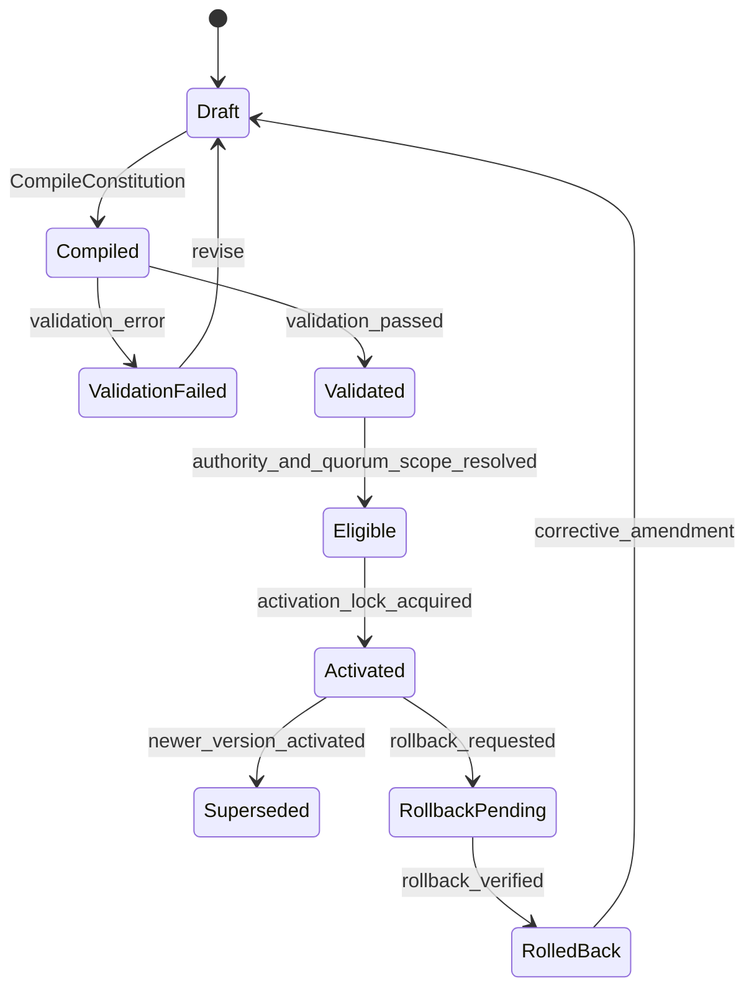
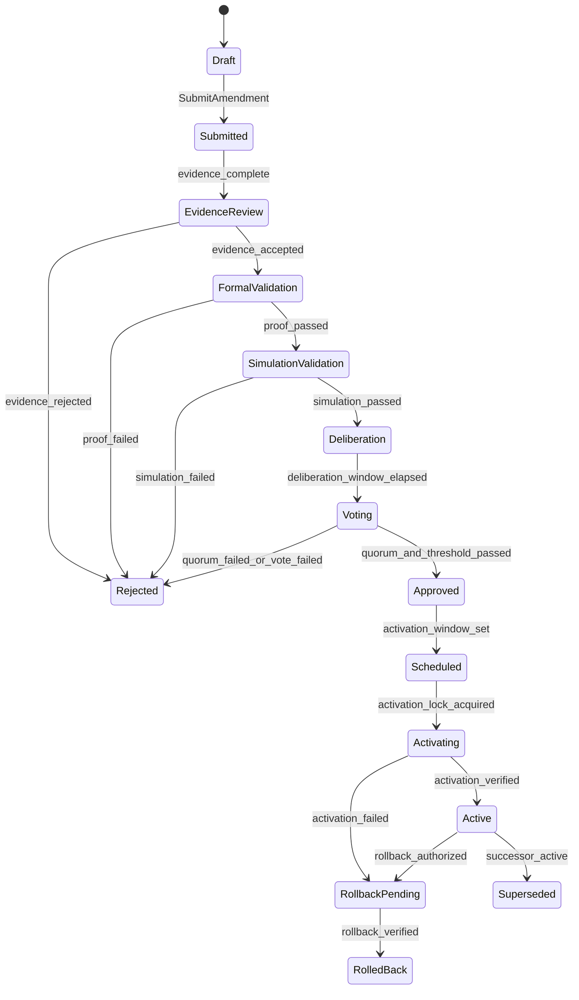

# Constitutional DSL

File extension: `.constitution`

Compiler package: `/packages/dsl`

Runtime services:

- `constitutional-compiler`
- `constitutional-validator`
- `constitutional-state-service`
- `amendment-orchestrator`

## EBNF Grammar

```ebnf
document        = header, { import }, { declaration } ;
header          = "constitution", identifier, "version", semver, "{" , metadata, "}" ;
import          = "import", string, "as", identifier, ";" ;
declaration     = principle | actor | role | domain | rule | invariant | metric | workflow | amendment ;
metadata        = { metadata_pair } ;
metadata_pair   = identifier, ":", literal, ";" ;

principle       = "principle", identifier, "{", text_field, scope_field, priority_field, "}" ;
actor           = "actor", identifier, "{", did_field, controller_field, authority_field, "}" ;
role            = "role", identifier, "{", grants_field, inherits_field, constraints_field, "}" ;
domain          = "domain", identifier, "{", owner_field, datastore_field, event_field, "}" ;

rule            = "rule", identifier, "{",
                  rule_scope, rule_trigger, rule_condition, rule_effect,
                  proof_field, rollback_field, audit_field,
                  "}" ;

invariant       = "invariant", identifier, "{",
                  invariant_scope, invariant_formula, severity_field,
                  verifier_field, rollback_field,
                  "}" ;

metric          = "metric", identifier, "{",
                  formula_field, input_field, cadence_field, threshold_field,
                  "}" ;

workflow        = "workflow", identifier, "{",
                  states_field, transitions_field, timeout_field, compensations_field,
                  "}" ;

amendment       = "amendment", identifier, "{",
                  target_field, change_field, rationale_field, evidence_field,
                  quorum_field, simulation_field, proof_field, activation_field,
                  rollback_field,
                  "}" ;

rule_scope      = "scope", "=", scope, ";" ;
rule_trigger    = "when", expression, ";" ;
rule_condition  = "require", expression, ";" ;
rule_effect     = "effect", effect, ";" ;
invariant_scope = "scope", "=", scope, ";" ;
invariant_formula = "formula", "=", temporal_formula, ";" ;

text_field      = "text", "=", string, ";" ;
scope_field     = "scope", "=", scope, ";" ;
priority_field  = "priority", "=", integer, ";" ;
did_field       = "did", "=", did, ";" ;
controller_field = "controllers", "=", list, ";" ;
authority_field = "authority", "=", authority_set, ";" ;
grants_field    = "grants", "=", authority_set, ";" ;
inherits_field  = "inherits", "=", list, ";" ;
constraints_field = "constraints", "=", list, ";" ;
owner_field     = "owner", "=", identifier, ";" ;
datastore_field = "datastores", "=", list, ";" ;
event_field     = "events", "=", list, ";" ;
proof_field     = "proof", "=", proof_spec, ";" ;
rollback_field  = "rollback", "=", rollback_spec, ";" ;
audit_field     = "audit", "=", audit_spec, ";" ;
severity_field  = "severity", "=", severity, ";" ;
verifier_field  = "verifier", "=", verifier_spec, ";" ;
formula_field   = "formula", "=", expression, ";" ;
input_field     = "inputs", "=", list, ";" ;
cadence_field   = "cadence", "=", duration, ";" ;
threshold_field = "thresholds", "=", threshold_map, ";" ;
states_field    = "states", "=", list, ";" ;
transitions_field = "transitions", "=", transition_list, ";" ;
timeout_field   = "timeouts", "=", threshold_map, ";" ;
compensations_field = "compensations", "=", transition_list, ";" ;
target_field    = "target", "=", identifier, ";" ;
change_field    = "change", "=", change_set, ";" ;
rationale_field = "rationale", "=", string, ";" ;
evidence_field  = "evidence", "=", list, ";" ;
quorum_field    = "quorum", "=", quorum_spec, ";" ;
simulation_field = "simulation", "=", simulation_spec, ";" ;
activation_field = "activation", "=", activation_spec, ";" ;

expression      = disjunction ;
disjunction     = conjunction, { "or", conjunction } ;
conjunction     = comparison, { "and", comparison } ;
comparison      = operand, comparator, operand | "not", comparison | "(", expression, ")" ;
temporal_formula = "always", expression | "eventually", expression | "leads_to", "(", expression, ",", expression, ")" ;
effect          = "allow" | "deny" | "emit", identifier | "command", identifier ;
scope           = identifier, { ".", identifier } ;
literal         = string | integer | decimal | boolean | list | map ;
operand         = identifier | literal | function_call ;
function_call   = identifier, "(", [ expression, { ",", expression } ], ")" ;
comparator      = "==" | "!=" | "<" | "<=" | ">" | ">=" | "in" | "contains" ;
severity        = "INFO" | "WARN" | "BLOCKING" | "CIVILIZATIONAL" ;
identifier      = letter, { letter | digit | "_" | "-" } ;
semver          = digit, { digit }, ".", digit, { digit }, ".", digit, { digit } ;
did             = "did:", identifier, ":", identifier ;
duration        = integer, ("s" | "m" | "h" | "d") ;
string          = '"', { character }, '"' ;
integer         = digit, { digit } ;
decimal         = integer, ".", integer ;
boolean         = "true" | "false" ;
list            = "[", [ literal, { ",", literal } ], "]" ;
map             = "{", [ metadata_pair, { metadata_pair } ], "}" ;
```

## AST

```ts
type ConstitutionDocument = {
  kind: "ConstitutionDocument";
  name: string;
  version: string;
  metadata: Record<string, Literal>;
  imports: ImportDecl[];
  declarations: Declaration[];
  sourceHash: string;
};

type Declaration =
  | PrincipleDecl
  | ActorDecl
  | RoleDecl
  | DomainDecl
  | RuleDecl
  | InvariantDecl
  | MetricDecl
  | WorkflowDecl
  | AmendmentDecl;

type RuleDecl = {
  kind: "RuleDecl";
  id: string;
  scope: string;
  trigger: Expression;
  requirement: Expression;
  effect: Effect;
  proof: ProofSpec;
  rollback: RollbackSpec;
  audit: AuditSpec;
  sourceSpan: SourceSpan;
};

type InvariantDecl = {
  kind: "InvariantDecl";
  id: string;
  scope: string;
  formula: TemporalFormula;
  severity: "INFO" | "WARN" | "BLOCKING" | "CIVILIZATIONAL";
  verifier: VerifierSpec;
  rollback: RollbackSpec;
  sourceSpan: SourceSpan;
};

type AmendmentDecl = {
  kind: "AmendmentDecl";
  id: string;
  target: string;
  change: ChangeSet;
  rationale: string;
  evidence: EvidenceRef[];
  quorum: QuorumSpec;
  simulation: SimulationSpec;
  proof: ProofSpec;
  activation: ActivationSpec;
  rollback: RollbackSpec;
  sourceSpan: SourceSpan;
};
```

## Compiler Pipeline

1. `LexSource`: tokenize UTF-8 source, reject non-canonical line endings, compute SHA-256 source hash.
2. `ParseDocument`: build CST, preserve source spans.
3. `BuildAST`: normalize identifiers, attach stable declaration IDs, resolve imports.
4. `TypeCheck`: validate expression types, authority types, metric dimensions, transition states.
5. `BuildIR`: emit canonical intermediate representation with sorted declarations and normalized literals.
6. `GenerateArtifacts`: emit policy graph, SQL constraints, Kafka ACLs, Temporal workflow guards, OPA/Rego policies, TLA modules, JSON Schema, protobuf option bindings.
7. `HashArtifacts`: compute Merkle root over generated outputs.
8. `EmitBundle`: write immutable bundle to object storage and `constitutional_artifacts`.

## Validation Pipeline

| Gate | Service | Blocking condition |
| --- | --- | --- |
| Source validation | `constitutional-compiler` | Parse error, duplicate ID, unresolved import |
| Type validation | `constitutional-compiler` | Type mismatch, undefined role, invalid metric unit |
| Static invariant validation | `constitutional-validator` | Missing rollback, missing proof, invalid quorum formula |
| Formal validation | `constitutional-validator` | TLC/Apalache/TLAPS failure, counterexample present |
| Simulation validation | `simulation-runner` | Capture, instability, rollback, or alignment drift threshold breach |
| Identity validation | `identity-graph-service` | proposer lacks authority, quorum electorate invalid |
| Economic validation | `economic-coordinator` | resource floor or budget invariant breach |
| Epistemic validation | `knowledge-integrity-service` | evidence trust score below threshold or contradiction unresolved |
| Activation validation | `constitutional-state-service` | activation lock unavailable or active version mismatch |

## State Transition Model



## Example Constitutional Rules

```text
rule mutation_requires_reversibility {
  scope = constitution.amendment;
  when proposal.impact in ["HIGH", "CIVILIZATIONAL"];
  require rollback.coverage == 1.0 and proof.status == "PASSED" and simulation.capture_probability < 0.05;
  effect deny;
  proof = tla("KMOSConstitution", ["TypeOK", "Safety", "RollbackAvailable"]);
  rollback = manifest("rollback.constitution.v1");
  audit = append_only("constitutional_audit_log");
}
```

```text
invariant capture_threshold {
  scope = identity.power;
  formula = always max_control_share(actor_or_coalition) < theta_capture;
  severity = CIVILIZATIONAL;
  verifier = service("power-distribution-service.ComputePower");
  rollback = manifest("identity_power_recompute.v1");
}
```

## Upgrade Process

1. Create amendment bundle with target constitution version and source hash.
2. Compile bundle and generate artifacts.
3. Run validation pipeline.
4. Open governance proposal with validation evidence.
5. Run deliberation and vote.
6. Acquire activation lock.
7. Apply generated migrations in dependency order: Postgres, Neo4j, policy graph, Temporal guards, Kafka ACLs, service configs.
8. Publish `AmendmentActivated`.
9. Materialize active constitution read model.
10. Run post-activation invariant verification.

## Rollback Process

1. Trigger from incident, failed post-activation check, emergency override, or successful rollback vote.
2. Freeze affected workflows and command endpoints.
3. Select checkpoint and rollback manifest.
4. Verify target source hash, artifact Merkle root, and checkpoint fixity.
5. Execute inverse migrations and compensating commands.
6. Restore active rule bundle pointer.
7. Replay events into read models from checkpoint.
8. Publish rollback completion and verification report.

# Self-Amendment Engine

## Proposal State Machine



## Approval Workflow

| Stage | Required approvals | Rule |
| --- | --- | --- |
| Evidence review | Knowledge Council majority | `trusted_evidence_ratio >= 0.8` |
| Formal validation | Formal Methods Guild quorum certificate | `all_blocking_obligations == PASSED` |
| Simulation validation | Simulation Council majority | `min_confidence >= 0.95` |
| Constitutional vote | Eligible constitutional authority | `yes_power / participating_power >= 0.67` and `participating_power / eligible_power >= 0.6` |
| Emergency activation | Emergency Council and Constitutional Core Council | `independent_controller_quorum >= 0.75` and max duration enforced |

## Quorum Calculation

```text
eligible_power = sum(power(actor, scope) for actor in electorate if actor.active)
participating_power = sum(power(ballot.actor, scope) for valid ballot)
yes_power = sum(power(ballot.actor, scope) for valid ballot where ballot.choice == YES)
quorum_pass = participating_power / eligible_power >= quorum.minimum_participation
threshold_pass = yes_power / participating_power >= quorum.approval_threshold
capture_pass = max_coalition_share(valid_ballots) < theta_capture
```

## PostgreSQL Schemas

```sql
create table kmos_constitution_versions (
  id uuid primary key,
  version text not null unique,
  source_hash text not null,
  artifact_merkle_root text not null,
  status text not null check (status in ('DRAFT','COMPILED','VALIDATED','ACTIVE','SUPERSEDED','ROLLED_BACK')),
  activated_by_amendment_id uuid,
  activated_at timestamptz,
  created_at timestamptz not null default now()
);

create table kmos_amendments (
  id uuid primary key,
  amendment_key text not null unique,
  target_version text not null,
  proposer_did text not null,
  state text not null check (state in ('DRAFT','SUBMITTED','EVIDENCE_REVIEW','FORMAL_VALIDATION','SIMULATION_VALIDATION','DELIBERATION','VOTING','APPROVED','SCHEDULED','ACTIVATING','ACTIVE','REJECTED','ROLLBACK_PENDING','ROLLED_BACK','SUPERSEDED')),
  source_hash text not null,
  artifact_merkle_root text,
  quorum jsonb not null,
  rollback_manifest jsonb not null,
  created_at timestamptz not null default now(),
  updated_at timestamptz not null default now()
);

create table kmos_validation_runs (
  id uuid primary key,
  amendment_id uuid not null references kmos_amendments(id),
  validator text not null,
  status text not null check (status in ('PASSED','FAILED','CANCELLED')),
  proof_obligations jsonb not null,
  counterexamples jsonb not null default '[]',
  artifact_uri text not null,
  completed_at timestamptz not null
);

create table kmos_votes (
  id uuid primary key,
  amendment_id uuid not null references kmos_amendments(id),
  voter_did text not null,
  authority_scope text not null,
  choice text not null check (choice in ('YES','NO','ABSTAIN','CHALLENGE')),
  voting_power numeric(38,18) not null check (voting_power >= 0),
  signature text not null,
  cast_at timestamptz not null default now(),
  unique (amendment_id, voter_did, authority_scope)
);
```

## Events

| Event | Topic | Key | Producer | Consumers |
| --- | --- | --- | --- | --- |
| `AmendmentSubmitted` | `kmos.governance.amendment.events.v1` | `amendment_id` | `amendment-orchestrator` | validator, knowledge, simulation |
| `AmendmentValidated` | `kmos.governance.amendment.events.v1` | `amendment_id` | `constitutional-validator` | voting, console |
| `VoteFinalized` | `kmos.governance.vote.events.v1` | `proposal_id` | `voting-service` | amendment orchestrator |
| `AmendmentActivated` | `kmos.constitution.events.v1` | `constitution_version` | `constitutional-state-service` | all services |
| `AmendmentRolledBack` | `kmos.constitution.events.v1` | `constitution_version` | `rollback-engine` | all services |

## API Contracts

```http
POST /v1/constitutional/amendments
Content-Type: application/json
Idempotency-Key: <uuid>
```

Request:

```json
{
  "amendmentKey": "amendment.capture-threshold.2026-05-29",
  "targetVersion": "9.0.1",
  "proposerDid": "did:kmos:constitutional-council",
  "sourceHash": "sha256:7a16e6aa4b8bd9a3c2a7a4f9d0a7199d6c6fa7f6bfc7a960bd8a31d8dcd41340",
  "quorum": {
    "minimumParticipation": 0.6,
    "approvalThreshold": 0.67,
    "captureThreshold": 0.33
  },
  "rollbackManifest": {
    "coverage": 1,
    "checkpointPolicy": "PRE_ACTIVATION_REQUIRED",
    "inverseMigrationBundle": "s3://kmos-constitution/rollback/capture-threshold-20260529.json"
  }
}
```

Response:

```json
{
  "amendmentId": "018fd9b0-6d18-7b2a-8f99-9cba1cdb0001",
  "state": "SUBMITTED",
  "workflowId": "amendment-018fd9b0-6d18-7b2a-8f99-9cba1cdb0001"
}
```

