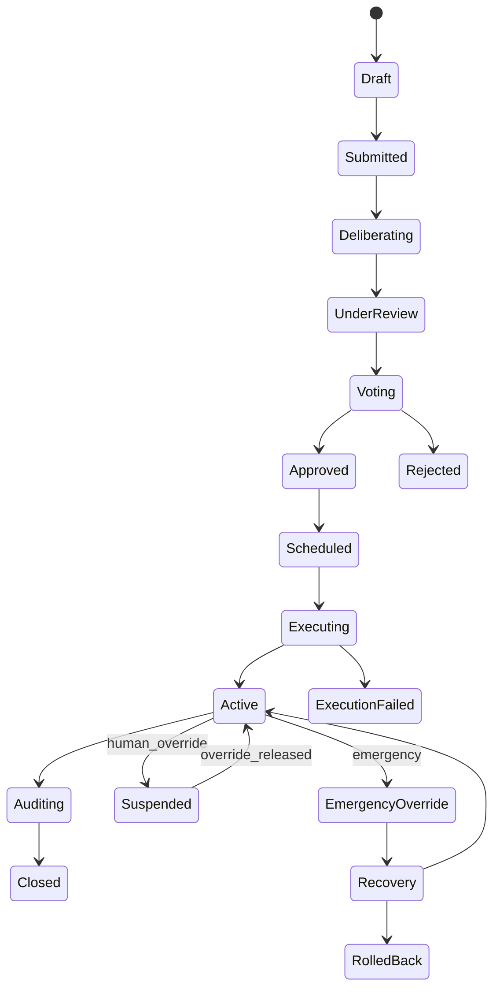
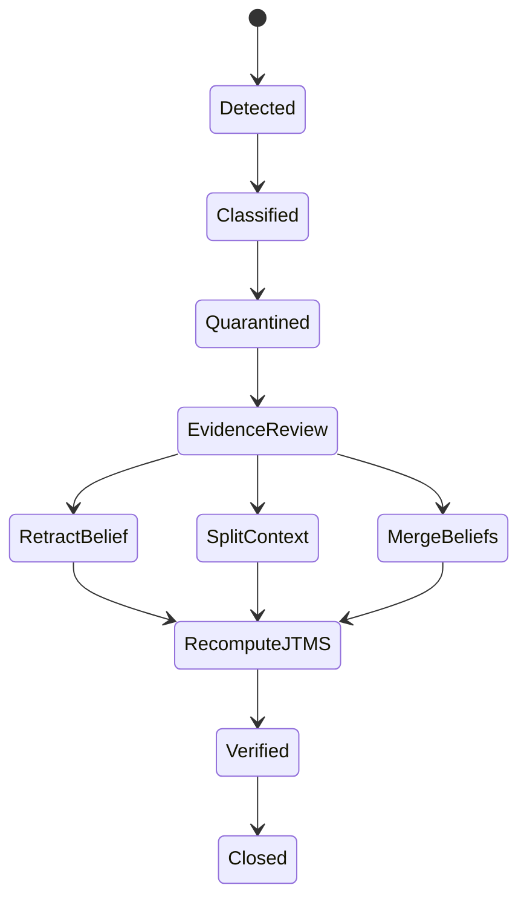

# Identity Engine

## DID Schema

```json
{
  "id": "did:kmos:actor-018fd9b0",
  "controller": ["did:kmos:controller-root-001"],
  "verificationMethod": [
    {
      "id": "did:kmos:actor-018fd9b0#ed25519-20260529",
      "type": "Ed25519VerificationKey2020",
      "controller": "did:kmos:actor-018fd9b0",
      "publicKeyMultibase": "z6MknK9eQVrYkmozYF5y5vB7R2fN7R2s1L1R3"
    }
  ],
  "authentication": ["did:kmos:actor-018fd9b0#ed25519-20260529"],
  "assertionMethod": ["did:kmos:actor-018fd9b0#ed25519-20260529"],
  "capabilityDelegation": ["did:kmos:actor-018fd9b0#ed25519-20260529"],
  "service": [
    {
      "id": "did:kmos:actor-018fd9b0#governance-inbox",
      "type": "GovernanceInbox",
      "serviceEndpoint": "https://api.kmos.internal/v1/governance/inbox/did:kmos:actor-018fd9b0"
    }
  ]
}
```

## PostgreSQL

```sql
create table kmos_dids (
  did text primary key,
  did_method text not null,
  document jsonb not null,
  document_hash text not null,
  status text not null check (status in ('ACTIVE','SUSPENDED','REVOKED','RECOVERY')),
  created_at timestamptz not null default now(),
  updated_at timestamptz not null default now()
);

create table kmos_did_controllers (
  id uuid primary key,
  did text not null references kmos_dids(did),
  controller_did text not null references kmos_dids(did),
  controller_key_id text not null,
  status text not null check (status in ('ACTIVE','ROTATED','REVOKED')),
  valid_from timestamptz not null,
  valid_until timestamptz,
  unique (did, controller_key_id)
);

create table kmos_delegations (
  id uuid primary key,
  delegator_did text not null references kmos_dids(did),
  delegate_did text not null references kmos_dids(did),
  capability text not null,
  scope text not null,
  depth integer not null check (depth between 0 and 3),
  constraints jsonb not null,
  status text not null check (status in ('ACTIVE','REVOKED','EXPIRED')),
  valid_from timestamptz not null,
  valid_until timestamptz not null,
  signature text not null
);

create table kmos_reputation_events (
  id uuid primary key,
  subject_did text not null references kmos_dids(did),
  event_type text not null,
  score_delta numeric(12,6) not null,
  evidence_uri text not null,
  source_event_id text not null,
  created_at timestamptz not null default now()
);

create table kmos_power_snapshots (
  id uuid primary key,
  scope text not null,
  snapshot_hash text not null unique,
  actor_power jsonb not null,
  coalition_power jsonb not null,
  theta_capture numeric(12,6) not null,
  capture_pass boolean not null,
  computed_at timestamptz not null default now()
);
```

Indexes:

```sql
create index kmos_delegations_delegate_scope_idx on kmos_delegations(delegate_did, scope) where status = 'ACTIVE';
create index kmos_delegations_delegator_scope_idx on kmos_delegations(delegator_did, scope) where status = 'ACTIVE';
create index kmos_reputation_subject_created_idx on kmos_reputation_events(subject_did, created_at desc);
create index kmos_power_snapshots_scope_time_idx on kmos_power_snapshots(scope, computed_at desc);
```

## Neo4j

```cypher
CREATE CONSTRAINT kmos_did IF NOT EXISTS FOR (d:DID) REQUIRE d.id IS UNIQUE;
CREATE CONSTRAINT kmos_role IF NOT EXISTS FOR (r:Role) REQUIRE r.id IS UNIQUE;
CREATE INDEX kmos_capability IF NOT EXISTS FOR (c:Capability) ON (c.name);

MERGE (a:DID {id:$delegator})
MERGE (b:DID {id:$delegate})
MERGE (cap:Capability {name:$capability})
MERGE (a)-[:DELEGATES {
  delegation_id:$delegation_id,
  scope:$scope,
  valid_from:$valid_from,
  valid_until:$valid_until,
  status:'ACTIVE'
}]->(b)
MERGE (b)-[:HAS_CAPABILITY {scope:$scope, inherited:true}]->(cap);
```

## Role Resolution Algorithm

```text
resolve_roles(did, scope, at_time):
  direct_roles = graph.roles_assigned_to(did, scope, at_time)
  delegated_roles = bfs_delegations(
    start=did,
    direction=inbound,
    max_depth=3,
    predicates=[
      edge.status == ACTIVE,
      edge.scope covers scope,
      edge.valid_from <= at_time < edge.valid_until,
      constraints_satisfied(edge.constraints)
    ]
  )
  inherited_roles = transitive_closure(role.INHERITS, direct_roles union delegated_roles)
  effective_capabilities = union(role.grants for role in inherited_roles)
  denied_capabilities = union(active_constraints.denies)
  return effective_capabilities - denied_capabilities with explanation_path
```

## Delegation Algorithm

```text
create_delegation(delegator, delegate, capability, scope, constraints):
  require did_status(delegator) == ACTIVE
  require did_status(delegate) == ACTIVE
  require capability in resolve_roles(delegator, scope, now)
  require delegation_depth(delegator, scope) < 3
  require not creates_cycle(delegator, delegate, capability, scope)
  require projected_power(delegate, scope) < theta_capture
  persist delegation
  publish DelegationGranted
  recompute affected roles
```

# Governance Engine

## Policy Lifecycle State Machine



## Governance Tables

```sql
create table kmos_proposals (
  id uuid primary key,
  proposal_key text not null unique,
  proposal_type text not null check (proposal_type in ('POLICY','CONSTITUTIONAL_AMENDMENT','BUDGET','RESOURCE_ALLOCATION','RECOVERY','EVOLUTION')),
  title text not null,
  body text not null,
  proposer_did text not null,
  state text not null,
  impact text not null check (impact in ('LOW','MEDIUM','HIGH','CIVILIZATIONAL')),
  evidence_bundle_uri text not null,
  created_at timestamptz not null default now(),
  updated_at timestamptz not null default now()
);

create table kmos_deliberation_arguments (
  id uuid primary key,
  proposal_id uuid not null references kmos_proposals(id),
  author_did text not null,
  argument_type text not null check (argument_type in ('SUPPORT','OPPOSE','QUESTION','RISK','MITIGATION','EVIDENCE')),
  content text not null,
  evidence_refs jsonb not null default '[]',
  created_at timestamptz not null default now()
);

create table kmos_policy_executions (
  id uuid primary key,
  proposal_id uuid not null references kmos_proposals(id),
  workflow_id text not null unique,
  execution_state text not null check (execution_state in ('SCHEDULED','RUNNING','COMPLETED','FAILED','COMPENSATING','ROLLED_BACK')),
  command_bundle jsonb not null,
  compensation_bundle jsonb not null,
  audit_hash text,
  created_at timestamptz not null default now()
);

create table kmos_human_overrides (
  id uuid primary key,
  target_type text not null,
  target_id text not null,
  requester_did text not null,
  approver_quorum jsonb not null,
  reason text not null,
  status text not null check (status in ('REQUESTED','APPROVED','ACTIVE','RELEASED','EXPIRED','REJECTED')),
  expires_at timestamptz not null,
  created_at timestamptz not null default now()
);
```

Verification procedures:

| Procedure | Inputs | Pass condition |
| --- | --- | --- |
| `verifyProposalAuthority` | proposer DID, proposal scope | capability exists and capture threshold passes |
| `verifyEvidenceCompleteness` | evidence bundle | required evidence classes present and trust score `>= 0.8` |
| `verifyVoteIntegrity` | ballot set | unique signed ballots, valid power snapshot, no expired delegation |
| `verifyExecutionAudit` | command bundle, events | every command has completion or compensation event |
| `verifyOverrideExpiry` | override record | active override has unexpired bounded duration |

# Economic Coordination Engine

## Optimization Architecture

```text
resource-catalog-service -> resource snapshot
shadow-price-service -> price vector
allocation-optimizer -> LP/MILP model
constitutional-validator -> constraint gate
economic-audit-service -> immutable audit record
```

## LP Solver Interface

```ts
type AllocationProblem = {
  problemId: string;
  resourceSnapshotHash: string;
  objective:
    | { kind: "MAXIMIZE_WELFARE"; weights: Record<string, number> }
    | { kind: "MINIMIZE_SCARCITY"; scarcityPenalty: Record<string, number> }
    | { kind: "MAXIMIZE_CONSTITUTIONAL_FITNESS"; metricWeights: Record<string, number> };
  variables: AllocationVariable[];
  constraints: AllocationConstraint[];
  constitutionalConstraints: ConstitutionalConstraintRef[];
};

type AllocationSolution = {
  problemId: string;
  solver: "HIGHS" | "ORTOOLS" | "CBC";
  status: "OPTIMAL" | "FEASIBLE" | "INFEASIBLE" | "UNBOUNDED";
  objectiveValue: number;
  assignments: Record<string, number>;
  duals: Record<string, number>;
  shadowPrices: Record<string, number>;
  proofDigest: string;
};
```

## Allocation Tables

```sql
create table kmos_resources (
  id uuid primary key,
  resource_key text not null unique,
  resource_class text not null check (resource_class in ('COMPUTE','STORAGE','BANDWIDTH','BUDGET','HUMAN_ATTENTION','GOVERNANCE_TIME','ENERGY','DATASET','MODEL_CAPACITY')),
  unit text not null,
  constitutional_floor numeric(38,12) not null default 0,
  physical_ceiling numeric(38,12),
  metadata jsonb not null default '{}'
);

create table kmos_resource_snapshots (
  id uuid primary key,
  snapshot_hash text not null unique,
  resource_state jsonb not null,
  scarcity_state jsonb not null,
  captured_at timestamptz not null default now()
);

create table kmos_allocation_plans (
  id uuid primary key,
  plan_key text not null unique,
  problem jsonb not null,
  solution jsonb not null,
  status text not null check (status in ('SOLVED','VALIDATED','COMMITTED','REJECTED','ROLLED_BACK')),
  constitution_version text not null,
  created_at timestamptz not null default now()
);

create table kmos_economic_ledger (
  id uuid primary key,
  ledger_key text not null unique,
  plan_id uuid references kmos_allocation_plans(id),
  account text not null,
  debit numeric(38,12) not null default 0,
  credit numeric(38,12) not null default 0,
  currency_or_unit text not null,
  lineage_ref text not null,
  created_at timestamptz not null default now(),
  check (debit >= 0 and credit >= 0),
  check (not (debit > 0 and credit > 0))
);
```

Constitutional constraints:

- `sum(allocation[resource]) >= constitutional_floor[resource]`
- `sum(controlled_capacity[actor]) / total_capacity < theta_capture`
- `budget.debits == budget.credits`
- `lineage_ref is not null`
- `shadow_price_vector.snapshot_hash == resource_snapshot.snapshot_hash`

# Knowledge Engine

## Neo4j Ontology

Node labels:

- `Observer`
- `Situation`
- `Belief`
- `Evidence`
- `Justification`
- `Contradiction`
- `RepairCase`
- `OntologyEntity`
- `Invariant`
- `SourceDocument`

Relationships:

- `(Observer)-[:OBSERVES]->(Situation)`
- `(Situation)-[:REFINES]->(Situation)`
- `(Situation)-[:JOINED_WITH]->(Situation)`
- `(Situation)-[:MEET_WITH]->(Situation)`
- `(Belief)-[:ASSERTED_IN]->(Situation)`
- `(Belief)-[:SUPPORTED_BY]->(Justification)`
- `(Justification)-[:USES_EVIDENCE]->(Evidence)`
- `(Belief)-[:CONTRADICTS]->(Belief)`
- `(Contradiction)-[:OPENED_REPAIR]->(RepairCase)`
- `(Belief)-[:DERIVED_FROM]->(SourceDocument)`

Constraints:

```cypher
CREATE CONSTRAINT kmos_belief_id IF NOT EXISTS FOR (b:Belief) REQUIRE b.id IS UNIQUE;
CREATE CONSTRAINT kmos_evidence_id IF NOT EXISTS FOR (e:Evidence) REQUIRE e.id IS UNIQUE;
CREATE CONSTRAINT kmos_situation_id IF NOT EXISTS FOR (s:Situation) REQUIRE s.id IS UNIQUE;
CREATE INDEX kmos_belief_status IF NOT EXISTS FOR (b:Belief) ON (b.status);
CREATE INDEX kmos_evidence_trust IF NOT EXISTS FOR (e:Evidence) ON (e.trust_score);
```

## Belief Node

```json
{
  "id": "belief.price-signal-integrity.018fd9",
  "claim": "Shadow price vector references a valid resource snapshot hash.",
  "status": "ACTIVE",
  "truth_label": "IN",
  "trust_score": 0.94,
  "confidence": 0.91,
  "scope": "economics.shadow_pricing",
  "provenance_chain": ["doc:kmos-tier9", "event:ShadowPriceComputed"],
  "created_at": "2026-05-29T00:00:00Z"
}
```

## Consistency Repair Workflow



## MCC Execution Engine

Machine-checkable claim execution:

```text
execute_mcc(claim, context):
  parse claim into typed predicate
  bind predicate to evidence graph
  verify provenance and trust thresholds
  execute deterministic checker
  emit MCCExecuted with PASS, FAIL, or INDETERMINATE
  update belief truth_label through JTMS
```

## RBP Execution Engine

Recursive belief propagation:

```text
execute_rbp(seed_beliefs, propagation_policy):
  enqueue seed beliefs
  while queue not empty:
    belief = dequeue()
    for dependent in graph.outgoing(belief, SUPPORTS|CONTRADICTS|REFINES):
      recompute dependent truth_label
      if truth_label changed:
        append belief_delta
        enqueue dependent
  publish BeliefPropagationCompleted
```

## Knowledge APIs

```http
POST /v1/knowledge/beliefs
GET /v1/knowledge/beliefs/{beliefId}
POST /v1/knowledge/contradictions/detect
POST /v1/knowledge/repair-cases/{caseId}/execute
POST /v1/knowledge/mcc/execute
POST /v1/knowledge/rbp/execute
GET /v1/knowledge/ontology/traverse?entityId=ent-constitutional-mutation-engine&depth=3
```

