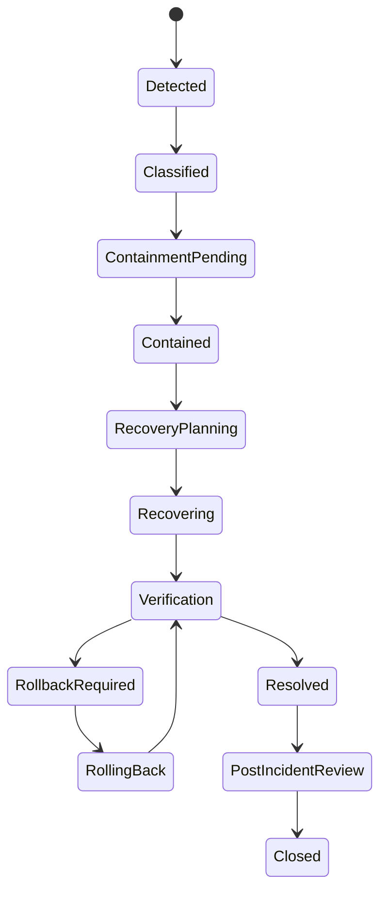
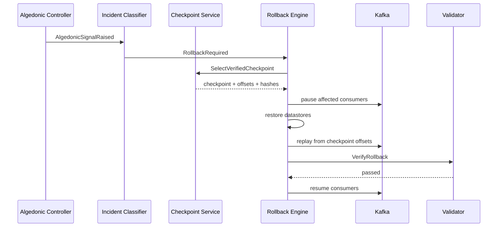
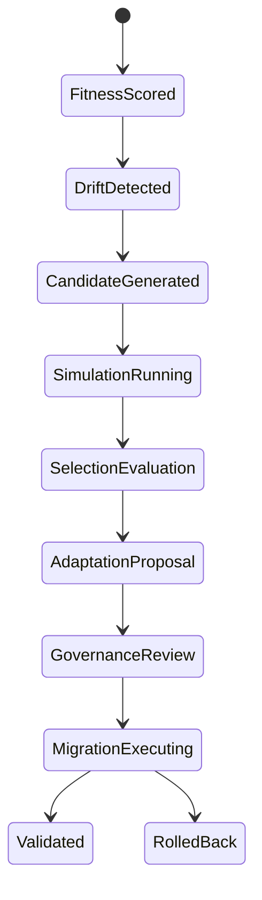

# Simulation Engine

## Architecture

```text
scenario-service
  -> scenario validation
  -> input snapshot freezer
  -> simulation-runner
  -> monte-carlo-service
  -> result-certifier
  -> governance evidence bundle
```

Execution backends:

- Deterministic simulations: single-runner container with fixed seed.
- Monte Carlo simulations: Ray cluster with reproducible seed partitions.
- Event replay simulations: Kafka replay consumer with read-only state stores.
- Long-horizon simulations: batch workers with checkpointed state every `1000` steps.

## Agent Definitions

```ts
type SimulationAgent = {
  agentId: string;
  agentClass:
    | "CITIZEN"
    | "INSTITUTION"
    | "GOVERNANCE_BODY"
    | "MARKET_PARTICIPANT"
    | "AI_AGENT"
    | "ADVERSARY"
    | "OBSERVER";
  objectiveVector: Record<string, number>;
  resourceEndowment: Record<string, number>;
  strategyDistribution: Record<string, number>;
  trustLinks: Record<string, number>;
  decisionPolicy: "UTILITY_MAX" | "RULE_BOUND" | "IMITATION" | "REPLICATOR_MUTATOR" | "ADVERSARIAL";
};
```

## State Definitions

```ts
type CivilizationalState = {
  tick: number;
  constitutionVersion: string;
  governanceState: "STABLE" | "CONTESTED" | "CAPTURE_RISK" | "EMERGENCY" | "ROLLBACK" | "RECONSTITUTION";
  economicState: {
    resourceCapacity: Record<string, number>;
    allocation: Record<string, number>;
    shadowPrices: Record<string, number>;
    budgetBalances: Record<string, number>;
  };
  knowledgeState: {
    activeBeliefs: number;
    contradictionRate: number;
    epistemicTrustMean: number;
    quarantinedClaims: number;
  };
  identityState: {
    activeActors: number;
    maxControlShare: number;
    delegationDepthP95: number;
    sybilRiskScore: number;
  };
  resilienceState: {
    openIncidents: number;
    rollbackCoverage: number;
    checkpointFreshnessSeconds: number;
    consensusHealth: number;
  };
};
```

## Interaction Contracts

| Interaction | Inputs | Transition | Outputs |
| --- | --- | --- | --- |
| `cast_vote` | agent, proposal, power snapshot | ballot appended if authority valid | `BallotCast` |
| `allocate_resource` | demand vector, capacity, constraints | solve LP and commit feasible allocation | `AllocationCommitted` |
| `assert_belief` | claim, evidence, observer context | JTMS label update | `BeliefAsserted` |
| `form_coalition` | agents, incentive graph | coalition edge update | `CoalitionDetected` |
| `trigger_incident` | metric breach, failure rule | incident state transition | `IncidentOpened` |
| `run_rollback` | checkpoint, rollback manifest | restore state and replay | `RollbackVerified` |

## Scenario Execution

```text
create_scenario(definition):
  validate schema and required model parameters
  freeze input snapshots: constitution, identity graph, policy graph, resource state, knowledge graph
  compute scenario_hash
  persist immutable scenario

run_scenario(scenario_hash, seed):
  load frozen inputs
  initialize agents and state
  for tick in horizon:
    collect observations
    execute agent decisions
    apply governance/economic/knowledge/resilience transitions
    evaluate invariants
    checkpoint state
  certify result digest
```

Monte Carlo layer:

```text
sample_count = max(1000, ceil((z_0.975^2 * p * (1-p)) / margin_error^2))
seed_partition = sha256(scenario_hash || partition_index)
confidence_interval = percentile(result_metric, [2.5, 97.5])
certification_pass = all(blocking_metric.upper_bound <= threshold)
```

Event replay:

```text
replay(topic_set, from_offsets, to_offsets, state_snapshot):
  restore snapshot
  consume ordered events by partition and timestamp
  apply deterministic reducers
  compare final digest against production digest
  emit ReplayCompleted
```

# Meta-Measurement Engine

## Metric Contracts

| Metric | Formula | Inputs | Aggregation | Storage | Cadence | Alerts | Dashboard |
| --- | --- | --- | --- | --- | --- | --- | --- |
| CHI | `0.3*constitutional_integrity + 0.25*rollback_coverage + 0.25*legitimacy_score + 0.2*proof_pass_rate` | active rules, rollback manifests, votes, proof runs | weighted mean by constitutional domain | Postgres `kmos_metric_points`, Prometheus `kmos_chi` | 5m | warn `<0.85`, critical `<0.75` | Constitutional Health |
| EII | `0.35*provenance_completeness + 0.25*belief_consistency + 0.2*trust_mean + 0.2*repair_timeliness` | belief graph, evidence graph, repair cases | weighted mean by knowledge domain | Postgres, Prometheus `kmos_eii` | 5m | warn `<0.82`, critical `<0.70` | Epistemic Integrity |
| GEI | `0.25*proposal_throughput + 0.25*participation_quality + 0.2*execution_success + 0.15*audit_completeness + 0.15*override_boundedness` | proposal states, ballots, executions, overrides | rolling 7d score | Lakehouse, Prometheus `kmos_gei` | 15m | warn `<0.78`, critical `<0.65` | Governance Efficiency |
| CTI | `1 - max_control_share(actor_or_coalition)` | power snapshots, coalition graph | minimum over active scopes | Postgres, Prometheus `kmos_cti` | 1m | warn `<0.72`, critical `<0.67` | Capture Threat |
| IVI | `0.3*invariant_pass_rate + 0.25*slo_compliance + 0.2*simulation_certification + 0.15*incident_recovery + 0.1*lineage_completeness` | invariants, SLOs, simulations, incidents, lineage | weighted mean by layer | Lakehouse, Prometheus `kmos_ivi` | 5m | warn `<0.84`, critical `<0.73` | Institutional Viability |

Metric table:

```sql
create table kmos_metric_points (
  id uuid primary key,
  metric_key text not null,
  scope text not null,
  value numeric(18,9) not null check (value >= 0 and value <= 1),
  inputs jsonb not null,
  aggregation_window tstzrange not null,
  constitution_version text not null,
  computed_at timestamptz not null default now()
);

create index kmos_metric_points_lookup_idx on kmos_metric_points(metric_key, scope, computed_at desc);
```

# Failure Taxonomy Engine

## Failure Catalog

| Failure | Detection | Containment | Recovery | Rollback | Escalation | Verification |
| --- | --- | --- | --- | --- | --- | --- |
| Governance failure | GEI critical, proposal deadlock, invalid vote, override breach | freeze affected proposal/execution endpoints | replay audit, recompute ballots, restart workflow | policy compensation bundle | Governance Council and Audit Council | `verifyVoteIntegrity`, `verifyExecutionAudit` |
| Knowledge failure | EII critical, contradiction spike, ontology poisoning detector | quarantine claims and stop dependent decisions | repair case, JTMS recompute, evidence review | belief retraction manifest | Knowledge Council and Epistemic Security Board | `verifyEvidence`, graph consistency scan |
| Alignment failure | objective distance `> epsilon_align`, unsafe AI output | block AI route and revoke output | model/prompt rollback, explanation review | output invalidation and embedding purge | Intelligence Council and Safety Review Board | alignment score replay |
| Economic failure | infeasible allocation, budget imbalance, resource floor breach | halt allocation commits and freeze price vector | solve fallback allocation, ledger reconciliation | reverse allocation events | Economic Council | double-entry balance and floor check |
| Coordination failure | workflow timeout, event lag, service dependency deadlock | shed noncritical load and activate degraded mode | Temporal reset, Kafka replay, route repair | checkpoint restore | Platform SRE | workflow completion and lag SLO |
| Security failure | DID compromise, signature failure, suspicious delegation graph | revoke keys, disable delegations, isolate actor | controller rotation, authority recompute | identity rollback manifest | Security Council | cryptographic verification and power recompute |

## Incident State Machine



Incident tables:

```sql
create table kmos_incidents (
  id uuid primary key,
  incident_key text not null unique,
  failure_class text not null,
  severity text not null check (severity in ('SEV4','SEV3','SEV2','SEV1','CIVILIZATIONAL')),
  state text not null,
  detected_by text not null,
  affected_layers text[] not null,
  containment_plan jsonb not null,
  recovery_plan jsonb not null,
  rollback_plan jsonb,
  opened_at timestamptz not null default now(),
  closed_at timestamptz
);

create table kmos_incident_events (
  id uuid primary key,
  incident_id uuid not null references kmos_incidents(id),
  event_type text not null,
  actor_did text,
  payload jsonb not null,
  created_at timestamptz not null default now()
);
```

Runbook contract:

```yaml
runbook_id: RB-KMOS-KNOWLEDGE-POISONING
failure_class: KNOWLEDGE_FAILURE
detection:
  metric: kmos_eii
  critical_threshold: 0.70
containment:
  actions:
    - quarantine_claims_by_source
    - block_dependent_policy_execution
recovery:
  actions:
    - open_repair_cases
    - recompute_jtms_labels
    - replay_belief_propagation
verification:
  checks:
    - active_beliefs_have_provenance
    - contradiction_rate_below_0_02
rollback:
  manifest: belief_retraction.v1
```

# Resilience Engine

## Algedonic Loops

```text
signal = {
  layer,
  source_service,
  metric_key,
  value,
  threshold,
  direction: PAIN|PLEASURE,
  severity,
  causal_event_ids
}

loop:
  ingest signal
  classify failure class
  select containment plan
  execute Temporal workflow
  verify metric recovers within budget
  close or escalate
```

## Checkpointing

Checkpoint types:

- `CONSTITUTION_BUNDLE`: DSL, artifacts, proofs, activation manifest.
- `POSTGRES_SERIALIZABLE`: logical dump plus WAL range.
- `NEO4J_GRAPH`: store snapshot plus transaction ID.
- `KAFKA_OFFSETS`: topic partition offsets.
- `TEMPORAL_HISTORY`: workflow histories and search attributes.
- `OBJECT_FIXITY`: object URIs and SHA-256 digests.
- `VECTOR_INDEX`: collection snapshot and embedding model hash.

Schema:

```sql
create table kmos_checkpoints (
  id uuid primary key,
  checkpoint_key text not null unique,
  checkpoint_type text not null,
  layer integer not null check (layer between 0 and 8),
  state_hash text not null,
  storage_uri text not null,
  kafka_offsets jsonb not null default '{}',
  temporal_workflows jsonb not null default '[]',
  verified boolean not null default false,
  created_at timestamptz not null default now()
);
```

Rollback workflow:



# Evolution Engine

## Fitness Schema

```sql
create table kmos_fitness_functions (
  id uuid primary key,
  function_key text not null unique,
  subject_type text not null check (subject_type in ('INSTITUTION','POLICY','SERVICE','CAPABILITY','CONSTITUTIONAL_RULE')),
  formula text not null,
  weights jsonb not null,
  version text not null,
  signature text not null,
  active boolean not null default false
);

create table kmos_fitness_scores (
  id uuid primary key,
  function_id uuid not null references kmos_fitness_functions(id),
  subject_id text not null,
  score numeric(18,9) not null check (score >= 0 and score <= 1),
  inputs jsonb not null,
  explanation jsonb not null,
  computed_at timestamptz not null default now()
);

create table kmos_capability_migrations (
  id uuid primary key,
  migration_key text not null unique,
  capability_id text not null,
  from_owner text not null,
  to_owner text not null,
  from_evolution_stage text not null,
  to_evolution_stage text not null,
  state text not null check (state in ('PROPOSED','SIMULATING','APPROVED','EXECUTING','VALIDATED','ROLLED_BACK','REJECTED')),
  rollback_manifest jsonb not null
);
```

## Evolution Workflow



## Evolution APIs

```http
POST /v1/evolution/fitness-functions
POST /v1/evolution/fitness-scores:compute
POST /v1/evolution/candidates
POST /v1/evolution/selection-runs
POST /v1/evolution/capability-migrations
GET /v1/evolution/wardley-maps/{mapId}
```

Simulation integration:

```text
evolution_candidate -> scenario generator -> simulation-runner -> certified result
certified result -> selection engine -> adaptation proposal
adaptation proposal -> governance proposal -> capability migration workflow
```

