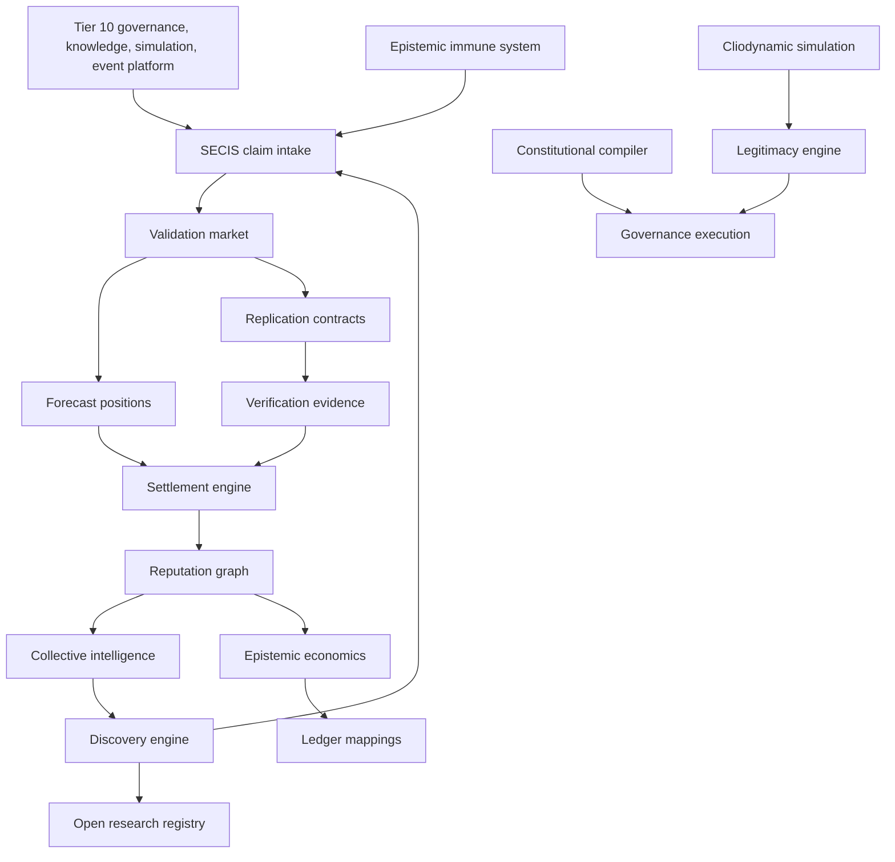
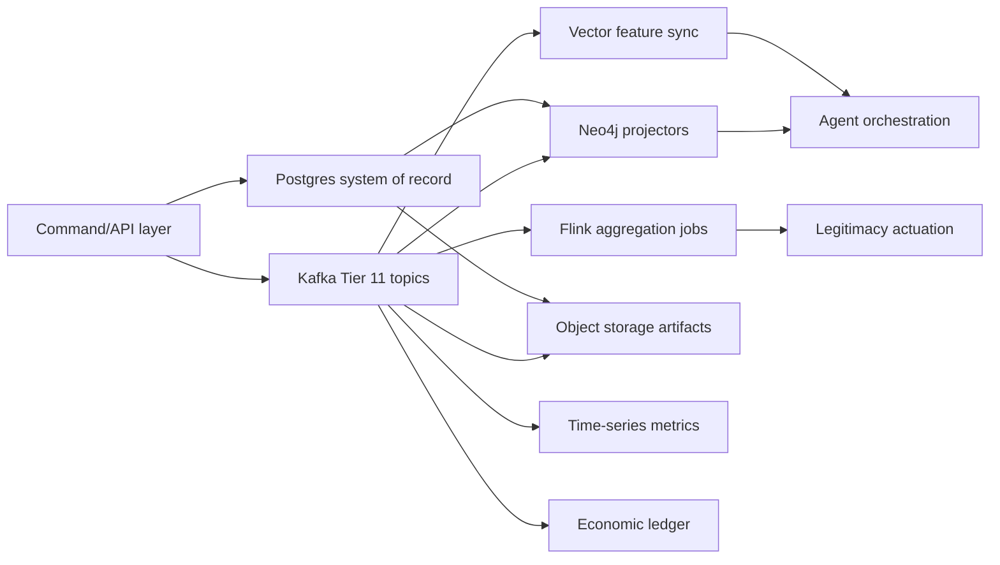

# Tier 11 SECIS Implementation Specification

## 1. Dependency Graph



## 2. Architecture Graph



## 3. Domain Models

Validation markets use `scientific_claim`, `replication_contract`, `validation_market`, `market_participant`, `forecast_position`, `verification_evidence`, `claim_settlement`, and `reputation_adjustment`.

Collective intelligence uses `consensus_session`, `consensus_round`, `swarm_node`, `swarm_vote`, `peer_prediction`, and `consensus_outcome`.

Reputation uses `reputation_node`, `reputation_edge`, `accuracy_metric`, `slashing_event`, and `trust_snapshot`.

Epistemic economics uses `knowledge_asset`, `knowledge_owner`, `fact_dependency`, `lineage_royalty`, and `citation_revenue`.

Cliodynamics uses `simulation_world`, `simulation_tick`, `population_state`, `elite_state`, `institution_state`, `governance_state`, and `economic_state`.

Discovery uses `hypothesis`, `experiment`, `experiment_plan`, `execution_run`, `observation`, and `symbolic_model`.

Constitutional compilation uses `policy_manifest`, `compiled_policy`, `policy_version`, and `verification_proof`.

Immune system uses `claim`, `claim_edge`, `contradiction`, `quarantine_record`, and `verification_record`.

Legitimacy uses `legitimacy_policy` and `legitimacy_signal`.

Open registry uses `research_problem`, `research_dependency`, `research_status`, `research_priority`, and `research_outcome`.

## 4. Entity Models

The executable Postgres entity model is [20260530050000_tier_11_secis_implementation.sql](/C:/Users/AKILA/OneDrive/Pictures/KARTEX/supabase/migrations/20260530050000_tier_11_secis_implementation.sql). Every entity has a stable text primary key, checked lifecycle/status values, evidence or replay identifiers where required, and indexes for lifecycle, market, reputation, simulation, immune, and registry access paths.

The executable TypeScript model and calculation contracts are [types.ts](/C:/Users/AKILA/OneDrive/Pictures/KARTEX/lib/tier11/types.ts) and [index.ts](/C:/Users/AKILA/OneDrive/Pictures/KARTEX/lib/tier11/index.ts).

## 5. State Machines

Validation market lifecycle:

`CLAIM_SUBMITTED -> MARKET_CREATED -> FORECASTING -> REPLICATION_RUNNING -> EVIDENCE_COLLECTION -> SETTLEMENT -> REPUTATION_UPDATE -> ARCHIVED`

Replication contract lifecycle:

`draft -> funded -> running -> evidence_locked -> settled`

Consensus lifecycle:

`created -> round_open -> round_closed -> converged -> archived`, with `round_closed -> escalated` when quorum or convergence fails.

Discovery lifecycle:

`generated -> planned -> scheduled -> running -> validated -> archived`, with `running -> rejected` when verification fails.

Policy deployment lifecycle:

`draft -> parsed -> validated -> compiled -> verified -> deployed`, with `deployed -> revoked`.

Immune lifecycle:

`detected -> quarantined -> adjudicating -> resolved`, with `quarantined -> accepted_paraconsistent` for explicitly retained contradictions.

Registry lifecycle:

`open -> scoping -> active -> validated -> closed`, with `active -> blocked` and `blocked -> active`.

## 6. Event Contracts

Kafka topology is [tier11-topics.yaml](/C:/Users/AKILA/OneDrive/Pictures/KARTEX/infrastructure/kafka/tier11-topics.yaml). Protobuf payloads are [tier11.proto](/C:/Users/AKILA/OneDrive/Pictures/KARTEX/proto/kmos/v1/tier11.proto).

Required event keys:

| Topic | Key | Replay source |
|---|---|---|
| `secis.claim.events` | `claim_id` | `scientific_claim.replay_key` |
| `secis.market.events` | `market_id` | `validation_market.replay_key` |
| `secis.forecast.events` | `market_id` | `forecast_position.position_id` |
| `secis.evidence.events` | `claim_id` | `verification_evidence.content_hash` |
| `secis.consensus.events` | `session_id` | `consensus_outcome.replay_key` |
| `secis.reputation.events` | `subject_id` | `reputation_adjustment.audit_hash` |
| `secis.economics.events` | `asset_id` | `citation_revenue.ledger_txn_ref` |
| `secis.simulation.events` | `world_id` | `simulation_tick.checkpoint_hash` |
| `secis.discovery.events` | `hypothesis_id` | `hypothesis.hypothesis_id` |
| `secis.policy.events` | `policy_key` | `compiled_policy.artifact_hash` |
| `secis.immune.events` | `claim_id` | `verification_record.evidence_digest` |
| `secis.legitimacy.events` | `scope` | `legitimacy_signal.signal_id` |
| `secis.registry.events` | `problem_id` | `research_status.status_id` |

## 7. Database Schemas

Postgres schema: [20260530050000_tier_11_secis_implementation.sql](/C:/Users/AKILA/OneDrive/Pictures/KARTEX/supabase/migrations/20260530050000_tier_11_secis_implementation.sql).

Indexes:

`idx_scientific_claim_lifecycle`, `idx_validation_market_state`, `idx_forecast_position_market`, `idx_verification_evidence_claim`, `idx_reputation_node_subject`, `idx_simulation_tick_world`, `idx_claim_truth_state`, and `idx_research_problem_status`.

Constraints:

Lifecycle/status check constraints, probability bounds, share bounds, replay key uniqueness, market time ordering, consensus round uniqueness, lineage uniqueness, and simulation tick uniqueness are enforced in the migration.

## 8. Graph Ontology

Neo4j schema: [neo4j-tier11-schema.cypher](/C:/Users/AKILA/OneDrive/Pictures/KARTEX/docs/tier11/neo4j-tier11-schema.cypher).

RDF/Turtle ontology with PROV-O and EVI mappings: [secis-ontology.ttl](/C:/Users/AKILA/OneDrive/Pictures/KARTEX/docs/tier11/secis-ontology.ttl).

Primary relationships:

`HAS_REPLICATION_CONTRACT`, `VALIDATED_BY_MARKET`, `ACCEPTS_POSITION`, `SUBMITTED_POSITION`, `SETTLED_BY`, `SUPPORTS`, `CONTRADICTS`, `ADJUSTS_REPUTATION`, `CONTRIBUTED_TO`, `VERIFIED`, `CITED`, `WAS_DERIVED_FROM`, `WAS_ATTRIBUTED_TO`, `HAS_TICK`, `HAS_EXPERIMENT`, `COMPILED_TO`, `SUPPORTED_BY_PROOF`, `QUARANTINES`, `TRIGGERS`, and `DEPENDS_ON`.

## 9. Simulation Specifications

Executable primitives are in [index.ts](/C:/Users/AKILA/OneDrive/Pictures/KARTEX/lib/tier11/index.ts).

Formulas:

`MMP = subsistence_wage / median_wage + youth_share + mass_mobilization`

`EMP = elite_population / elite_positions + top_wealth_share`

`SFD = fiscal_distress + (1 - institutional_trust) + public_debt_to_gdp`

`PSI = MMP * EMP * SFD`

`Gini = clamp(top_wealth_share * 1.18, 0, 1)`

`Trust = clamp(institutional_trust, 0, 1)`

`Debt = public_debt_to_gdp`

`Elite Density = elite_population / elite_positions`

Tick persistence is `simulation_tick`; layer states are persisted in `population_state`, `elite_state`, `institution_state`, `governance_state`, and `economic_state`; checkpoint hashes support replay.

## 10. Verification Specifications

TLA+ specifications:

| Surface | Spec |
|---|---|
| Validation Markets | [Tier11ValidationMarket.tla](/C:/Users/AKILA/OneDrive/Pictures/KARTEX/contracts/formal/Tier11ValidationMarket.tla) |
| Constitutional Compiler | [Tier11ConstitutionalCompiler.tla](/C:/Users/AKILA/OneDrive/Pictures/KARTEX/contracts/formal/Tier11ConstitutionalCompiler.tla) |
| Discovery Engine | [Tier11DiscoveryEngine.tla](/C:/Users/AKILA/OneDrive/Pictures/KARTEX/contracts/formal/Tier11DiscoveryEngine.tla) |
| Legitimacy Engine | [Tier11LegitimacyEngine.tla](/C:/Users/AKILA/OneDrive/Pictures/KARTEX/contracts/formal/Tier11LegitimacyEngine.tla) |
| Epistemic Immune System | [Tier11EpistemicImmuneSystem.tla](/C:/Users/AKILA/OneDrive/Pictures/KARTEX/contracts/formal/Tier11EpistemicImmuneSystem.tla) |

State invariants include type bounds, no settlement without forecast, no deployment without proof, no validation without observation, no stable actuation, redistribution threshold enforcement, bounded reputation, and quarantine release verification.

Liveness properties require submitted claims to reach archive, draft policies to deploy or revoke, generated hypotheses to validate or reject, redistribution triggers to actuate, and contradictions to quarantine or resolve.

## 11. Migration Plan

1. Apply `20260530050000_tier_11_secis_implementation.sql` after Tier 10 migrations.
2. Register `proto/kmos/v1/tier11.proto` in schema registry with backward compatibility.
3. Create Kafka topics from `infrastructure/kafka/tier11-topics.yaml`.
4. Apply Neo4j constraints from `docs/tier11/neo4j-tier11-schema.cypher`.
5. Load RDF ontology `docs/tier11/secis-ontology.ttl` into the ontology catalog.
6. Deploy Flink job `infrastructure/flink/tier11-pipelines.sql`.
7. Enable `lib/tier11` calculation engine in service workers and agent orchestration.
8. Run `npm run test -- tests/unit/tier11-implementation.test.ts`.

## 12. Seed Data Design

The migration seeds:

`legitimacy_policy` global thresholds for `stress_watch`, `adaptive_policy_review`, and `redistribution_required`.

`research_problem` records for SECIS replication calibration and cliodynamic primitive baselines.

Operational seed producers must emit matching `secis.registry.events` and `secis.legitimacy.events` with the inserted identifiers after migration.

## 13. Rollout Plan

Phase 1: migrate storage and graph constraints with topic creation paused.

Phase 2: deploy schema registry contracts, projectors, and Flink legitimacy job.

Phase 3: enable claim intake, market creation, and forecast submission for allowlisted governance scopes.

Phase 4: enable replication evidence ingestion, settlement, and reputation adjustment.

Phase 5: enable discovery-to-market creation, constitutional compiler deployment, immune quarantine actuation, and legitimacy policy actuation.

Phase 6: remove allowlist after replay validation and observability thresholds pass for seven consecutive daily windows.

## 14. Testing Strategy

Unit tests: [tier11-implementation.test.ts](/C:/Users/AKILA/OneDrive/Pictures/KARTEX/tests/unit/tier11-implementation.test.ts).

Migration tests: run Supabase migration audit and verify every Tier 11 table exists with all check constraints and indexes.

Contract tests: serialize every `Tier11EventEnvelope` oneof payload and validate schema registry compatibility.

Graph tests: apply Cypher constraints idempotently, project one full validation market lifecycle, and verify path queries return claim, market, settlement, evidence, and reputation nodes.

Formal tests: model-check each TLA+ spec with finite sets of two claims, two markets, two participants, two policies, two hypotheses, and two scopes.

Replay tests: replay events from each Tier 11 topic into an empty Postgres/Neo4j projection and compare replay keys with source rows.

## 15. Observability Plan

Metrics:

`secis_claims_submitted_total`, `secis_market_lifecycle_duration_seconds`, `secis_forecast_settlement_error_total`, `secis_evidence_integrity_score`, `secis_reputation_adjustment_total`, `secis_consensus_convergence_rounds`, `secis_royalty_route_amount`, `secis_simulation_tick_lag_seconds`, `secis_policy_verification_fail_total`, `secis_quarantine_open_total`, `secis_legitimacy_stress_score`, and `secis_research_problem_age_seconds`.

Logs:

Every command and event carries `correlation_id`, `causation_id`, `replay_key`, `constitution_version`, `aggregate_id`, and `sequence`.

Traces:

Claim intake, market creation, forecast submission, replication evidence ingestion, settlement, reputation update, discovery validation, policy compilation, quarantine, and legitimacy actuation each start a root span and propagate through Kafka headers.

Alerts:

Critical alerts fire for settlement replay divergence, evidence integrity below `0.8`, open critical contradiction older than one hour, policy deployment without proof, legitimacy stress above `0.78`, and Flink lag over five minutes.

## 16. Completion Matrix

| Section | Artifact |
|---|---|
| Scientific validation market engine | Postgres migration, TypeScript lifecycle/scoring, protobuf events, Kafka topics, Neo4j ontology |
| Replication market economics | `scoreForecast`, `settlePredictionMarket`, settlement tables, audit hashes |
| Collective intelligence engine | Consensus tables, Delphi, Fortytwo swarm, peer prediction, Bradley-Terry |
| Reputation system | Reputation tables, graph relationships, vector features, event topic |
| Epistemic economics engine | Knowledge asset, owner, dependency, royalty, citation revenue tables and ledger routes |
| Cliodynamic simulation engine | Simulation tables, primitive formulas, Flink legitimacy stream |
| Discovery engine | Hypothesis, experiment, plan, run, observation, symbolic model tables and validation function |
| Constitutional compiler | Policy tables, DSL grammar target, TLA+ compiler lifecycle |
| Epistemic immune system | Claim graph, contradiction, quarantine, verification tables and audit function |
| Legitimacy engine | Policy/signal tables, monitor function, event stream, actuation thresholds |
| SECIS knowledge graph | Neo4j schema and RDF/Turtle ontology |
| Open research registry | Research problem/dependency/status/priority/outcome tables |
| Formal verification | Five TLA+ specifications with safety and liveness properties |
| Event architecture | Kafka topology, protobuf contracts, replay and DLQ strategy |
| Storage architecture | Postgres, Neo4j, vector, object, time-series, ledger mappings in this spec and migration |
| Verification | Unit test suite and formal/model-check contract |

## Policy DSL Grammar

```ebnf
policy        = "policy", identifier, version, scope, "{", { rule }, "}" ;
version       = "version", string ;
scope         = "scope", string ;
rule          = "rule", identifier, "when", expression, "then", action, [ "unless", expression ], ";" ;
expression    = term, { ("and" | "or"), term } ;
term          = identifier, operator, value ;
operator      = "==" | "!=" | ">" | ">=" | "<" | "<=" | "in" ;
action        = identifier, "(", [ argument, { ",", argument } ], ")" ;
argument      = identifier, "=", value ;
value         = string | number | boolean | list ;
list          = "[", [ value, { ",", value } ], "]" ;
identifier    = letter, { letter | digit | "_" | "." | "-" } ;
```

## AST Schema

```json
{
  "policyKey": "string",
  "version": "string",
  "scope": "string",
  "rules": [
    {
      "ruleKey": "string",
      "condition": { "op": "and|or|comparison", "children": [] },
      "action": { "name": "string", "arguments": {} },
      "unless": { "op": "comparison", "children": [] }
    }
  ],
  "sourceHash": "sha256"
}
```

## Storage Architecture

| Store | System of record | Retention | Partitioning | Replication | Backup |
|---|---|---|---|---|---|
| Postgres | All Tier 11 entities and audit records | Indefinite for governance, 7 years for operational projections | by lifecycle date and aggregate id | primary plus read replicas | daily full, hourly WAL |
| Neo4j | Relationship ontology and graph projections | Rebuildable from Postgres/Kafka | label plus aggregate id | causal cluster | nightly dump |
| Vector DB | expertise, trust, evidence, and policy embeddings | rebuildable from object artifacts and Postgres refs | namespace by subsystem | multi-zone | snapshot after sync |
| Object Storage | source artifacts, proofs, datasets, checkpoints | content-addressed indefinite | bucket prefix by subsystem/date | cross-region | immutable versioning |
| Time Series | metrics, SLOs, simulation lag, stress signals | 18 months hot, archived after | metric name plus scope | HA pair | block snapshots |
| Ledger | royalty and settlement financial entries | statutory indefinite | asset id and ledger period | ledger-native consensus | signed export |
