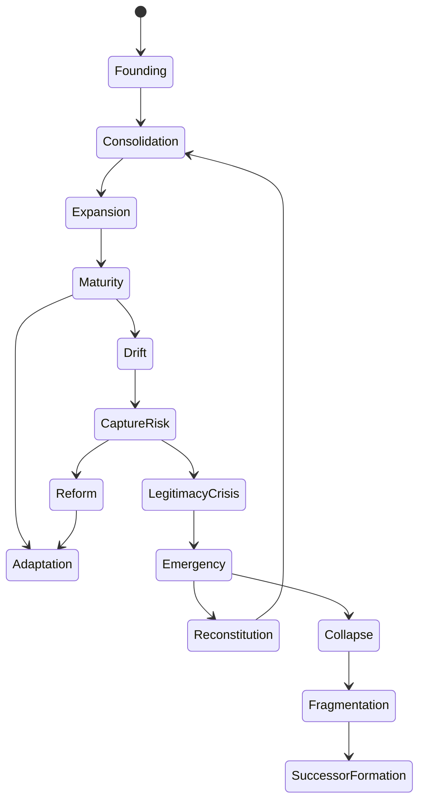
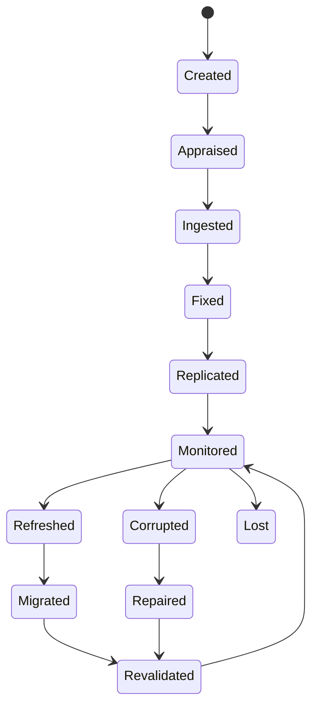
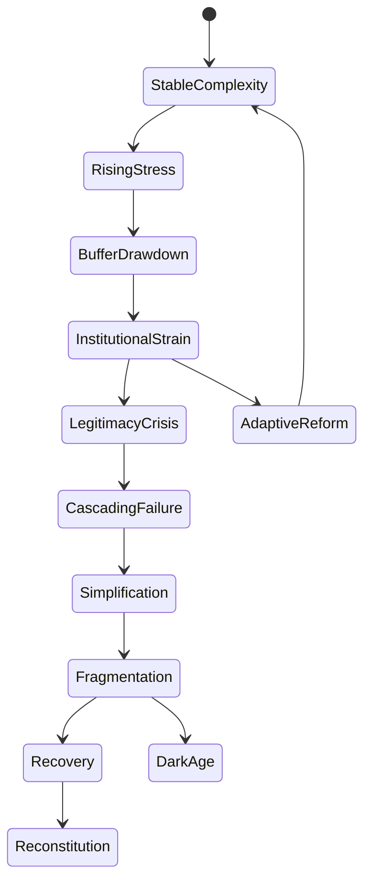
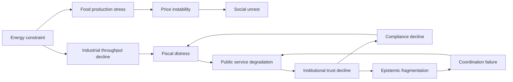
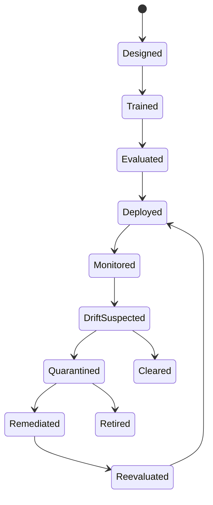
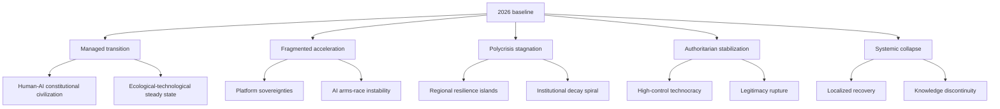
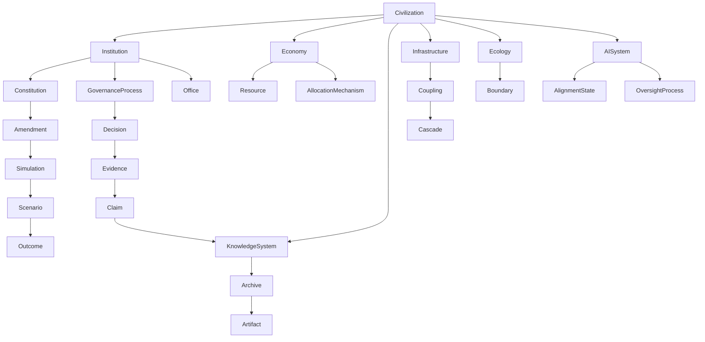

# KARTEX Tier 12 Research Compendium

Civilizational resilience, epistemic continuity, long-horizon governance, human-AI co-evolution, and KMOS meta-operating system research program.

## 0. Research Operating Doctrine

Tier 12 is the research-corpus layer above Tier 10 executable models and Tier 11 SECIS validation markets. Its purpose is not to summarize literature. Its purpose is to maintain a continuously extensible body of claims, models, ontologies, state machines, metrics, open problems, and design hypotheses that can be promoted into KMOS schemas, simulations, formal specifications, governance policies, and long-horizon operating procedures.

Evidence classes:

| Class | Meaning | KMOS handling |
| --- | --- | --- |
| Established | Supported by broad empirical, historical, or formal consensus; residual uncertainty remains in boundary conditions. | Eligible for implementation defaults. |
| Strongly Supported | Multiple independent lines of evidence support the claim, but scope or transferability remains contested. | Eligible for guarded policy and simulation assumptions. |
| Moderately Supported | Plausible and evidenced, but mixed findings, limited sample size, or weak operationalization remain. | Eligible for scenario branches and research backlog. |
| Weakly Supported | Some evidence or expert argument exists, but causal validity is uncertain. | Use only with explicit uncertainty. |
| Speculative | Forward-looking, synthetic, or not yet empirically validated. | Use only as hypothesis, never as policy fact. |

Core methodological commitments:

- Separate evidence from design hypothesis.
- Preserve competing theories rather than collapsing them into a false consensus.
- Attach every operational claim to measurable variables, failure modes, and governance implications.
- Treat institutions, knowledge systems, economies, AI systems, and simulations as co-evolving adaptive systems.
- Promote only versioned and falsifiable components into Tier 10/11 executable layers.

Primary source anchors used by this compendium include Ostrom's commons and polycentric governance research as recognized by the Nobel committee, ISO/CCSDS OAIS archival reference modeling, LOCKSS distributed digital preservation, IARPA ACE / Good Judgment forecasting, NIST AI RMF 1.0, and Regulation (EU) 2024/1689, the EU AI Act. See the source register at the end of this file.

## 1. Claim Ledger

| Claim | Evidence class | Notes for KMOS |
| --- | --- | --- |
| Institutions tend to accumulate rules, offices, routines, and exceptions over time, increasing coordination cost and creating drift from original purpose. | Strongly Supported | Model as institutional entropy: rule count, exception rate, process latency, mission-output distance. |
| Polycentric governance can outperform monocentric control under local heterogeneity when monitoring, conflict resolution, and nested authority are present. | Strongly Supported | Use as default architecture for KMOS governance scopes; test failure under extreme capture or emergency conditions. |
| Complex societies can become vulnerable when marginal returns to complexity decline while maintenance costs rise. | Moderately Supported | Tainter-inspired model is useful, but collapse causation is multi-factor and disputed. |
| Durable knowledge preservation requires both bit preservation and semantic/intelligibility preservation. | Established | Archive design must store content, provenance, decoding instructions, language bridges, and institutional custodianship. |
| Distributed redundancy reduces archive loss risk, but governance and synchronization failures can still destroy or corrupt archives. | Established | LOCKSS-like replication must be paired with adversarial auditing and diversity of jurisdiction/control. |
| Prediction aggregation, forecasting tournaments, and calibrated forecasters can improve probabilistic judgment over unaided expert judgment in some domains. | Strongly Supported | Tier 11 validation markets should include calibration, track records, and adversarial question design. |
| Epistemic systems fail through both falsehood propagation and ontology corruption: the categories used to interpret evidence can drift or be captured. | Moderately Supported | Requires ontology versioning, semantic diffing, and paraconsistent contradiction handling. |
| Human-AI alignment is not a one-time training property; it is a lifecycle and governance property subject to drift. | Strongly Supported | Treat alignment as monitored institutional state, not static model score. |
| Long-horizon forecasting cannot assign precise probabilities at deep-time scales without model humility. | Established | Use scenario families, conditional probabilities, early-warning indicators, and uncertainty budgets. |
| Civilizational resilience is multi-layered: no single metric can substitute for institutional legitimacy, resource buffers, epistemic quality, infrastructure robustness, and adaptive capacity. | Established | Use composite dashboards with anti-Goodharting safeguards. |

## 2. Part 1: Institutional Evolution Models

### 2.1 Dominant Theories

| Theory | Core mechanism | Evidence class | KMOS translation |
| --- | --- | --- | --- |
| Historical institutionalism | Path dependence, critical junctures, increasing returns, institutional layering. | Strongly Supported | Store institutional lineage, amendment sequence, lock-in risks. |
| New institutional economics | Transaction costs, property rights, principal-agent constraints. | Strongly Supported | Model incentives, delegation chains, monitoring cost, enforcement cost. |
| Bureaucratic politics | Agencies preserve autonomy, budgets, status, and routines. | Strongly Supported | Track mandate drift, office survival rate, budget-output elasticity. |
| Polycentric governance | Multiple semi-autonomous centers coordinate through rules, monitoring, and nested conflict resolution. | Strongly Supported | Default KMOS governance topology. |
| Cultural evolution | Norms, rituals, and legitimacy signals evolve through selection, imitation, drift, and group competition. | Moderately Supported | Model institutional norm propagation and mutation. |
| Cybernetic governance | Feedback loops, variety matching, algedonic alerts, and adaptive control. | Moderately Supported | Link observability, incident response, and constitutional amendment. |

Competing theories:

- Centralized state-capacity theory argues resilience depends on coherent command, fiscal extraction, monopoly on violence, and administrative penetration.
- Libertarian and market-order theories emphasize spontaneous order, exit rights, competition, and limits on centralized knowledge.
- Elite theory emphasizes organized minorities, resource concentration, and ideological control.
- Commons theory emphasizes community monitoring, boundaries, graduated sanctions, and legitimacy.
- Constitutional political economy emphasizes binding rule systems that constrain short-term majorities and officeholders.

### 2.2 Historical Evidence

| Case | Durable mechanisms | Failure mechanisms | KMOS lessons |
| --- | --- | --- | --- |
| Roman Empire | Law, roads, fiscal-administrative integration, military professionalization, urban networks. | Succession instability, military-fiscal pressure, elite competition, frontier shocks, currency debasement. | Separate operational command from succession legitimacy; stress-test fiscal-military commitments. |
| Byzantine Empire | Administrative continuity, diplomacy, Orthodox legitimacy, tax capacity, adaptive military themes. | Territorial contraction, court factionalism, external pressure, crusader disruption. | Institutional adaptation can sustain continuity after severe contraction. |
| Han Dynasty | Bureaucracy, examination precursors, Confucian legitimacy, agrarian tax base. | Court factionalism, eunuch/elite conflict, peasant rebellion, frontier costs. | Ideological legitimacy and administrative capacity are coupled but brittle under elite fracture. |
| Tang/Song/Ming | Civil service, fiscal innovation, literati governance, hydraulic and agrarian systems. | Regional military power, court capture, fiscal stress, corruption, external conquest. | Meritocratic selection helps but does not eliminate capture or fiscal fragility. |
| Ottoman Empire | Millet pluralism, military-administrative integration, legal pluralism. | Janissary entrenchment, succession politics, fiscal/military modernization lag. | Legacy privileges become veto points unless adaptation pathways exist. |
| British Empire | Naval power, finance, legal institutions, delegated local governance. | Imperial overextension, nationalist legitimacy collapse, war costs. | Exit legitimacy and local autonomy matter for federated systems. |
| Catholic Church | Canon law, hierarchy, ritual continuity, monastic archives, doctrinal councils. | Schism, corruption, reform backlash, legitimacy crises. | Deep institutional memory needs councils, archives, and periodic doctrinal repair. |
| Medieval universities | Corporate autonomy, credentialing, curriculum continuity, translocal scholarly networks. | Patronage, orthodoxy enforcement, resource dependency. | Knowledge institutions need autonomy and stable patronage without epistemic capture. |
| Open-source communities | Forkability, modular contribution, maintainers, issue tracking, transparent history. | Maintainer burnout, governance ambiguity, dependency capture, toxic coordination. | Exit/fork rights are resilience mechanisms but can fragment legitimacy. |
| Internet governance | RFCs, multi-stakeholder bodies, standards, rough consensus, running code. | Platform capture, geopolitical fragmentation, security externalities. | Protocol governance works best when standards, implementation, and legitimacy co-evolve. |

### 2.3 Institutional Ontology

Core entities:

- `Institution`: bounded rule-bearing organization or regime.
- `Mandate`: declared purpose and scope of legitimate action.
- `Constitution`: meta-rule set governing authority creation, amendment, rights, constraints, emergency powers, and dispute resolution.
- `Office`: role with authority, obligations, term, selection, removal, and audit procedures.
- `Rule`: prescriptive constraint with scope, activation condition, enforcement pathway, and exception handling.
- `Routine`: repeated procedure that carries tacit knowledge.
- `Memory`: records, precedents, trained personnel, rituals, technical systems, and narratives.
- `LegitimacySignal`: consent, compliance, participation, trust, output performance, fairness perception, sacred authority, legal validity.
- `CaptureVector`: concentrated influence over decisions, appointments, resources, enforcement, information, or constitutional amendment.
- `Mutation`: rule addition, rule deletion, role reallocation, boundary shift, authority delegation, enforcement change.

### 2.4 Institutional Lifecycle State Machine



### 2.5 Metrics

Institutional entropy:

```text
IE = w1*rule_accumulation_rate
   + w2*exception_density
   + w3*process_latency_growth
   + w4*mandate_output_distance
   + w5*role_overlap_index
   + w6*unreviewed_rule_age
```

Resilience metrics:

| Metric | Definition | Failure threshold |
| --- | --- | --- |
| Amendment viability | Share of necessary reforms that can pass without emergency override. | Below 0.4. |
| Succession legitimacy | Probability of peaceful authority transfer under stress. | Below 0.7. |
| Capture threat index | `1 - max_control_share` adjusted by coalition opacity. | Below 0.67. |
| Memory continuity | Share of critical routines with documented, trained, and redundant custodians. | Below 0.8. |
| Adaptive latency | Time from anomaly detection to validated institutional response. | Above domain recovery budget. |

### 2.6 Failure and Adaptation Taxonomies

Failure modes:

- Capture: elite, regulatory, bureaucratic, ideological, informational, financial, technological.
- Drift: mission drift, rule drift, semantic drift, enforcement drift, incentive drift.
- Overload: administrative overload, judicial backlog, legislative congestion, monitoring saturation.
- Fragility: single point of authority, non-redundant knowledge, brittle succession, fiscal dependence.
- Legitimacy erosion: perceived unfairness, corruption, output failure, exclusion, coercive overreach.

Adaptation mechanisms:

- Constitutional amendment with simulation and proof gates.
- Sunset clauses and periodic rule review.
- Polycentric delegation with monitoring and escalation.
- Institutional forking, charter renewal, and reconstitution.
- Rotating audit councils and conflict-of-interest registries.
- Ritualized dissent: protected opposition, red teams, citizen assemblies, scientific adversarial review.

## 3. Part 2: Governance Architectures

### 3.1 Architecture Families

| Architecture | Strength | Failure mode | KMOS use |
| --- | --- | --- | --- |
| Monocentric command | Fast coordinated response. | Catastrophic capture, local ignorance, bottleneck. | Emergency only, time-limited. |
| Federal/nested governance | Local adaptation plus shared standards. | Jurisdictional conflict, uneven capacity. | Default civilizational topology. |
| Polycentric governance | Redundancy, experimentation, local knowledge. | Coordination overhead, fragmented accountability. | Default KMOS governance layer. |
| Market governance | Discovery, price signals, decentralized allocation. | Externalities, inequality, manipulation. | Economic coordination under floor/rights constraints. |
| Commons governance | Stewardship of shared resources. | Boundary failure, free riding, local elite capture. | Knowledge, data, ecological, and protocol commons. |
| Technocratic governance | Expertise-driven decisions. | Epistemic capture, legitimacy deficit. | Advisory layer with transparent evidence. |
| Algorithmic governance | Scale, consistency, auditability when well designed. | Automation bias, opaque control, adversarial manipulation. | Decision support, never unbounded sovereignty. |

### 3.2 Meta-Governance Model

Meta-governance governs governance: it specifies how rule systems are created, audited, amended, suspended, and retired.

KMOS meta-governance primitives:

- `GovernanceScope`: domain, population, territory, platform, model, archive, market, or simulation.
- `AuthoritySource`: constitution, delegation, expertise, consent, emergency, treaty, protocol.
- `DecisionProcedure`: vote, sortition, market signal, expert panel, court, automated rule, deliberation.
- `ReviewGate`: legality, rights, epistemic quality, economic feasibility, alignment, reversibility, sunset.
- `Override`: emergency deviation with narrow scope, explicit expiry, audit, and restoration plan.
- `Appeal`: path for affected actors to challenge decisions.

## 4. Part 3: Constitutional Systems

### 4.1 Constitutional Resilience

Dominant theory: constitutions stabilize authority by specifying rights, powers, procedures, amendment pathways, and legitimacy narratives.

Competing theory: constitutions often encode elite bargains and become symbolic when power realities diverge from text.

KMOS synthesis: constitutional resilience requires both formal validity and operational viability.

Constitutional health dimensions:

| Dimension | Observable variable |
| --- | --- |
| Legality | Decisions trace to valid authority paths. |
| Amendability | Legitimate reforms are possible before crisis. |
| Rights protection | Emergency and majority actions are constrained. |
| Separation of powers | No actor controls appointment, enforcement, adjudication, and amendment simultaneously. |
| Reviewability | Decisions can be audited and appealed. |
| Simulatability | Amendments are tested before activation. |
| Rollbackability | Failed policy changes can be reversed without institutional rupture. |

### 4.2 Constitutional Failure Modes

- Dead constitution: text persists but no longer constrains power.
- Frozen constitution: amendment impossible despite environmental change.
- Hypermutable constitution: rules change too easily, destroying predictability.
- Emergency normalization: temporary powers become permanent.
- Court capture: constitutional interpretation monopolized by aligned faction.
- Ambiguous sovereignty: multiple actors claim final authority.
- Rights erosion: security, crisis, or efficiency arguments override basic protections.

## 5. Part 4: Knowledge Preservation Systems

### 5.1 Knowledge Ontology

| Entity | Description |
| --- | --- |
| `Artifact` | Physical or digital knowledge carrier. |
| `Content` | The encoded information payload. |
| `RepresentationInformation` | Instructions required to interpret the content. |
| `Provenance` | Origin, custody, transformation, authenticity, and fixity history. |
| `SemanticContext` | Language, ontology, units, assumptions, and disciplinary frame. |
| `Custodian` | Institution, community, protocol, or autonomous system responsible for preservation. |
| `AccessPath` | Retrieval, decoding, rights, and educational pathway. |
| `ContinuityRitual` | Repeated human practice that keeps knowledge alive. |

### 5.2 Archive Taxonomy

| Medium | Longevity potential | Failure modes | Recovery difficulty | Best use |
| --- | --- | --- | --- | --- |
| Stone | Millennia | Erosion, vandalism, semantic loss. | Low for visible text, high for unknown script. | Civilizational markers, minimal canonical knowledge. |
| Clay tablets | Millennia if fired/dry | Breakage, dispersal, script loss. | Moderate. | Durable administrative/scientific fragments. |
| Metal | Centuries to millennia | Corrosion, theft, melting. | Low to moderate. | Critical inscriptions, identifiers. |
| Paper | Decades to centuries | Fire, water, acid decay, pests. | Low if language known. | Books, manuals, distributed education. |
| Film/microfilm | Centuries under controlled storage | Vinegar syndrome, reader dependence. | Moderate. | Dense analog archives. |
| Sapphire/quartz/glass | Very high physical durability | High encoding/decoding dependence, cost. | High without readers. | Deep-time canonical archives. |
| Synthetic DNA | High density, long cold-storage potential | Sequencing dependence, mutation, contamination. | High. | Dense redundancy, not sole archive. |
| Magnetic storage | Years to decades | Bit rot, magnetic decay, interface obsolescence. | Moderate to high. | Active operational storage. |
| Optical storage | Decades to centuries for archival media | Layer degradation, reader obsolescence. | Moderate. | Cold archives. |
| Distributed storage | Depends on replication incentives | Churn, governance failure, coordinated deletion. | Variable. | Active redundant preservation. |
| Blockchain archives | Tamper-evident references | Cost, scale, governance, chain abandonment. | Moderate. | Provenance anchors, not bulk knowledge. |
| Content-addressable/WORM | Strong fixity | Key loss, format obsolescence. | Moderate. | Evidence bundles and immutable records. |

### 5.3 Preservation State Machine



### 5.4 Knowledge Continuity Framework

Knowledge survives through five coupled channels:

- Physical durability: carrier persists.
- Bit durability: exact encoding persists.
- Semantic durability: future readers can interpret it.
- Institutional durability: custodians preserve, refresh, teach, and fund it.
- Practical durability: people continue to know why it matters and how to use it.

Risk model:

```text
KnowledgeLossRisk =
  carrier_decay
  + bit_corruption
  + format_obsolescence
  + semantic_drift
  + custodian_failure
  + access_suppression
  + educational_discontinuity
  - redundancy
  - fixity_audit
  - translation_bridges
  - distributed_custody
```

## 6. Part 5: Epistemic Resilience Systems

### 6.1 Dominant Mechanisms

| Mechanism | Strength | Failure mode |
| --- | --- | --- |
| Peer review | Expert scrutiny before publication. | Gatekeeping, conservatism, fraud misses, prestige bias. |
| Replication | Tests robustness and generalizability. | Underfunding, publication bias, contextual mismatch. |
| Prediction markets | Incentivizes calibrated forecasts. | Thin markets, manipulation, ambiguous resolution. |
| Forecasting tournaments | Measures track record and calibration. | Question selection bias, tournament-specific skill. |
| Bayesian updating | Formal belief revision. | Prior manipulation, model misspecification. |
| Truth maintenance systems | Track support/contradiction among claims. | Ontology errors, computational complexity. |
| Deliberative democracy | Legitimacy and perspective diversity. | Polarization, framing effects, unequal participation. |
| Open data/code | Auditability and reuse. | Privacy, misuse, context loss. |

### 6.2 Epistemic Attack Taxonomy

- Content attack: false claims, fabricated evidence, deepfakes, forged documents.
- Source attack: impersonation, credential capture, reputational laundering.
- Process attack: peer-review rings, citation cartels, market manipulation.
- Distribution attack: bot amplification, search ranking capture, platform suppression.
- Ontology attack: category manipulation, definition drift, false equivalence, semantic poisoning.
- Memory attack: deletion, revisionism, archive tampering, link rot.
- Incentive attack: funding bias, career pressure, political coercion, advertiser pressure.
- AI-mediated attack: synthetic consensus, automated persuasion, model poisoning, retrieval poisoning.

### 6.3 Truth Maintenance Architecture

```text
claim intake
  -> provenance and source authentication
  -> evidence graph linking
  -> contradiction detection
  -> confidence assignment
  -> replication or adversarial review routing
  -> belief-state update
  -> dependent-policy impact analysis
  -> public audit trail
```

Belief states:

- `unsupported`
- `supported`
- `contested`
- `replication_pending`
- `validated`
- `deprecated`
- `fraudulent`
- `paraconsistent_retained`

### 6.4 Epistemic Metrics

| Metric | Definition |
| --- | --- |
| Provenance completeness | Share of claims with source, method, timestamp, custody, and evidence links. |
| Contradiction half-life | Time from contradiction detection to adjudication or explicit paraconsistent retention. |
| Calibration score | Brier/log score of forecasters, markets, and model predictions. |
| Replication coverage | Share of high-impact claims with independent replication attempts. |
| Ontology drift rate | Semantic diff between ontology versions weighted by dependent claims. |
| Adversarial robustness | Claim acceptance degradation under simulated misinformation campaigns. |

## 7. Part 6: Civilizational Collapse Models

### 7.1 Theory Map

| Theory | Mechanism | Evidence class | Caveat |
| --- | --- | --- | --- |
| Tainter complexity collapse | Complexity solves problems until marginal returns decline. | Moderately Supported | Often hard to measure complexity returns across cases. |
| Structural-demographic theory | Elite overproduction, popular immiseration, fiscal distress create instability. | Moderately Supported | Stronger for some agrarian/imperial cases than modern systems. |
| Ecological overshoot | Resource extraction exceeds regenerative capacity. | Strongly Supported in ecological systems; moderate for societal collapse causality. | Human adaptation and trade complicate direct mapping. |
| Network cascade | Interdependent systems propagate shocks. | Strongly Supported in infrastructure/finance. | Macro-civilizational thresholds uncertain. |
| Institutional legitimacy collapse | Compliance falls when institutions lose perceived legitimacy. | Strongly Supported | Legitimacy measurement is context dependent. |
| External shock/conquest | War, disease, climate, invasion, trade disruption. | Established | Usually interacts with internal fragility. |

### 7.2 Collapse Ontology

| Entity | Description |
| --- | --- |
| `Stress` | External or internal load: war, climate, debt, disease, legitimacy loss, resource depletion. |
| `Buffer` | Reserve capacity: fiscal, food, energy, trust, knowledge, infrastructure redundancy. |
| `Coupling` | Dependency link between subsystems. |
| `Cascade` | Failure propagation through coupling. |
| `Threshold` | Nonlinear point where recovery dynamics change. |
| `Simplification` | Loss of organizational complexity, specialization, trade, population, or information flow. |
| `RecoveryPathway` | Reconstitution, localization, migration, technological substitution, institutional reform. |

### 7.3 Collapse State Machine



### 7.4 Failure Propagation Graph



## 8. Part 7: Civilizational Recovery Models

Recovery pathways:

| Pathway | Mechanism | Risks |
| --- | --- | --- |
| Reform without rupture | Amend rules, rebalance incentives, restore legitimacy. | Veto capture, insufficient speed. |
| Reconstitution | Replace failing constitutional order with new legitimacy settlement. | Violence, loss of continuity. |
| Localization | Smaller units maintain essential services. | Fragmentation, inequality, knowledge loss. |
| External subsidy | Trade, aid, energy, finance, migration. | Dependency, geopolitical capture. |
| Technological substitution | New energy, automation, medicine, logistics, information systems. | New fragilities, rebound effects. |
| Cultural renewal | Norms of trust, sacrifice, learning, and stewardship. | Mythic distortion, exclusion. |

KMOS recovery design requirements:

- Archive enough institutional memory for reconstitution.
- Preserve minimal viable scientific, medical, agricultural, engineering, and governance knowledge.
- Maintain fallback governance at local, regional, and network levels.
- Predefine emergency powers with expiry and audit.
- Keep cross-domain recovery simulation playbooks.

## 9. Part 8: Human-AI Co-Evolution Frameworks

### 9.1 Alignment Ontology

| Entity | Description |
| --- | --- |
| `HumanValueSource` | Individual, community, constitution, rights charter, expert standard, future generation proxy. |
| `AIObjective` | Explicit or learned optimization target. |
| `OversightProcess` | Human, institutional, market, formal, adversarial, or automated review. |
| `AlignmentEvidence` | Evaluation, interpretability result, incident history, refusal behavior, red-team result. |
| `DriftEvent` | Change in behavior, incentives, environment, model, tool access, or user population. |
| `Intervention` | Shutdown, restriction, retraining, prompt update, policy patch, rollback, monitoring escalation. |

### 9.2 Alignment State Machine



### 9.3 Governance Mechanisms

- Capability registration and model cards.
- Risk tiering by autonomy, access, scale, reversibility, and domain criticality.
- Constitutional constraints compiled into policy engines.
- Human oversight for irreversible or rights-affecting actions.
- Distributed red-team networks and incident disclosure.
- Audit logs with replay keys and evidence hashes.
- Alignment drift dashboards.
- Model rollback and output invalidation mechanisms.

### 9.4 AI Implications

Established:

- AI governance requires risk management, monitoring, documentation, and human accountability.

Strongly Supported:

- Frontier models introduce systemic risks that cannot be handled only at application level.
- Oversight must include adversarial testing and post-deployment monitoring.

Speculative:

- Long-term human-AI co-evolution may require constitutional rights or duties for advanced AI systems if agency, welfare, or social dependence thresholds are met.
- Alignment persistence across centuries may require machine-readable constitutional memory, institutional succession, and value-change protocols.

## 10. Part 9: Alignment Persistence Models

Alignment persistence is the ability of human-AI systems to maintain acceptable value, safety, and legitimacy properties across model generations, institutional turnover, environmental change, and cultural evolution.

Persistence variables:

| Variable | Description |
| --- | --- |
| Objective stability | Distance between current operational objective and approved constitutional objective. |
| Oversight coverage | Share of critical actions reviewed by competent, independent oversight. |
| Interpretability depth | Degree to which internal causal mechanisms are understood for critical behaviors. |
| Incident recurrence | Rate of repeated safety failures after remediation. |
| Value update legitimacy | Whether changes to values follow accepted amendment rules. |
| Dependency lock-in | Degree of social reliance that prevents safe shutdown. |

Drift detection:

```text
alignment_drift =
  behavior_distribution_shift
  + objective_distance
  + tool_use_risk_delta
  + user_population_shift
  + oversight_gap
  + incident_recurrence
  - remediation_effectiveness
```

## 11. Part 10: Civilizational Economics

### 11.1 Economic Ontology

| Entity | Description |
| --- | --- |
| `Resource` | Energy, food, water, land, labor, compute, knowledge, trust, attention. |
| `AllocationMechanism` | Market, plan, commons, queue, lottery, ration, platform, gift, household, algorithm. |
| `Constraint` | Ecological boundary, rights floor, budget, technology, legitimacy, infrastructure. |
| `Externality` | Cost or benefit not reflected in local decision price. |
| `Commons` | Shared resource governed by collective rules. |
| `ScarcityState` | Abundant, constrained, rationed, crisis, exhausted. |

### 11.2 Comparative Systems

| System | Strength | Failure mode | KMOS implication |
| --- | --- | --- | --- |
| Capitalism/markets | Innovation, decentralized discovery, incentives. | Inequality, externalities, cycles, capture. | Use with floor constraints, anti-monopoly, externality pricing. |
| Central planning | Strategic coordination, public goods, crisis mobilization. | Information bottleneck, coercion, low adaptability. | Use for emergency priorities and infrastructure, bounded by feedback. |
| Mixed economies | Balance public goods and markets. | Policy complexity, lobbying, incoherence. | Default practical design. |
| Commons systems | Stewardship and local knowledge. | Boundary and monitoring failures. | Knowledge, ecological, and protocol layers. |
| Platform coordination | Scale, matching, data-rich optimization. | Surveillance, lock-in, algorithmic capture. | Require interoperability, audit, portability, and contestability. |
| Cybernetic economics | Feedback-driven allocation. | Measurement abuse, central control risk. | Use for simulations and constrained operational loops. |

### 11.3 Sustainability Metrics

- Energy return on energy invested.
- Material throughput per unit welfare.
- Ecological boundary pressure.
- Basic needs coverage.
- Inequality and elite overproduction.
- Fiscal sustainability.
- Commons regeneration rate.
- Compute-energy-water footprint.
- Innovation rate adjusted by risk externalities.

## 12. Part 11: Multi-Agent Civilizational Simulations

### 12.1 Simulation Ontology

| Entity | Description |
| --- | --- |
| `Agent` | Individual, institution, firm, AI system, adversary, state, community, ecosystem proxy. |
| `StateVariable` | Measured property of agent/system. |
| `RuleSet` | Behavioral, institutional, economic, ecological, or epistemic transition rules. |
| `Event` | Shock, policy, innovation, conflict, migration, failure, discovery. |
| `World` | Scenario configuration and environment. |
| `CalibrationCase` | Historical or empirical case used to fit/validate model. |
| `Invariant` | Constraint that should hold in valid simulation. |
| `Outcome` | Welfare, resilience, collapse, recovery, alignment, legitimacy, knowledge continuity. |

### 12.2 Agent Taxonomy

- Households: survival, identity, reproduction, learning, trust.
- Elites: status, resource control, coalition formation, institutional influence.
- Bureaucrats: compliance, career incentives, rule execution.
- Political entrepreneurs: mobilization, framing, coalition competition.
- Firms/platforms: profit, market share, regulatory influence.
- Commons stewards: resource regeneration and rule compliance.
- Scientists/epistemic actors: claim production, validation, reputation.
- AI agents: objective pursuit under policy and tool constraints.
- Adversaries: capture, sabotage, misinformation, exploitation.
- Future-generation proxies: long-term welfare constraints.

### 12.3 Simulation Architecture

```text
scenario registry
  -> parameter uncertainty model
  -> historical calibration set
  -> agent initializer
  -> institutional rule engine
  -> economy/resource engine
  -> epistemic network engine
  -> AI alignment engine
  -> shock generator
  -> invariant checker
  -> Monte Carlo runner
  -> result certifier
  -> governance evidence bundle
```

Transition model:

```text
S(t+1) = F(
  S(t),
  agent_actions(t),
  institutional_rules(t),
  resource_constraints(t),
  knowledge_state(t),
  AI_system_state(t),
  shocks(t),
  adaptation_rules(t)
)
```

## 13. Part 12: Deep-Time Foresight Models

### 13.1 Time Horizons

| Horizon | Useful methods | Probability posture |
| --- | --- | --- |
| 10 years | Forecasting tournaments, trend analysis, policy modeling. | Quantified ranges plausible. |
| 25 years | Scenario planning, technology roadmaps, demographic models. | Conditional probabilities only. |
| 50 years | Structural scenarios, ecological and infrastructure models. | Wide uncertainty bands. |
| 100 years | Civilizational scenario trees and stressors. | Ordinal likelihoods. |
| 250 years | Institutional continuity modeling, knowledge preservation. | Deep uncertainty. |
| 500 years | Archive, governance succession, ecological stability. | Scenario families. |
| 1000 years | Deep-time preservation and post-current-civilization continuity. | Plausibility mapping. |
| 5000 years | Archeological survivability, linguistic drift, species trajectory. | Speculative. |
| 10000 years | Geological-scale markers, durable archives, existential survival. | Speculative with physical constraints. |

### 13.2 Scenario Tree



Critical uncertainties:

- AI capability trajectory and governance success.
- Energy transition speed and net energy availability.
- Climate/ecological damage and adaptation capacity.
- Institutional legitimacy and capture resistance.
- Knowledge preservation and educational continuity.
- Biosecurity and engineered-risk governance.
- Geopolitical coordination versus conflict.
- Economic inequality and elite overproduction.

## 14. Part 13: Unified Ontology

Top-level KMOS ontology:



Universal state variables:

- Legitimacy
- Capacity
- Complexity
- Adaptability
- Memory
- Trust
- Resource adequacy
- Epistemic integrity
- Alignment integrity
- Coupling risk
- Redundancy
- Recovery time

## 15. Part 14: Unified Knowledge Graph

Canonical node labels:

- `Civilization`
- `Institution`
- `Constitution`
- `Office`
- `Rule`
- `Decision`
- `Claim`
- `Evidence`
- `Archive`
- `Artifact`
- `Resource`
- `Market`
- `Commons`
- `AISystem`
- `AlignmentEvaluation`
- `Scenario`
- `SimulationRun`
- `FailureMode`
- `RecoveryPathway`
- `ResearchProblem`

Canonical relationships:

- `GOVERNS`
- `AUTHORIZES`
- `AMENDS`
- `DELEGATES_TO`
- `CONSTRAINS`
- `PRODUCES`
- `SUPPORTS`
- `CONTRADICTS`
- `DEPENDS_ON`
- `PRESERVED_BY`
- `VALIDATED_BY`
- `SIMULATED_IN`
- `FAILS_BY`
- `RECOVERS_THROUGH`
- `CAPTURED_BY`
- `DRIFTS_FROM`
- `ALIGNED_WITH`
- `RISKS`
- `MITIGATES`

Graph invariant candidates:

- Every governance decision must trace to a valid authority path.
- Every high-impact claim must have evidence, provenance, confidence, and review state.
- Every constitutional amendment must link to simulation and verification artifacts.
- Every critical archive must have at least three custody-diverse replicas and decoding metadata.
- Every deployed AI system must link to risk classification, oversight process, evaluations, and incident history.

## 16. Part 15: Open Problems Registry

Scoring: impact, urgency, tractability, and maturity use 1-5 scales. Priority is a heuristic weighted score: `0.35*impact + 0.25*urgency + 0.2*tractability + 0.2*(6-maturity)`.

| Rank | Problem | Impact | Urgency | Tractability | Maturity | Time horizon | Dependencies |
| --- | --- | --- | --- | --- | --- | --- | --- |
| 1 | Alignment persistence under institutional turnover | 5 | 5 | 2 | 1 | 10-100y | AI evals, governance, constitutional DSL |
| 2 | Epistemic immune systems against AI-scale misinformation | 5 | 5 | 3 | 2 | 0-25y | SECIS, provenance, reputation |
| 3 | Constitutional amendment systems with simulation/proof gates | 5 | 4 | 4 | 2 | 0-50y | TLA+/Alloy/SMT, simulation |
| 4 | Knowledge preservation with semantic continuity for 1000+ years | 5 | 3 | 3 | 2 | 100-10000y | OAIS, LOCKSS, language bridges |
| 5 | Capture-resistant polycentric AI governance | 5 | 5 | 2 | 2 | 0-50y | identity, legitimacy, audit |
| 6 | Institutional entropy metrics validated across historical cases | 4 | 4 | 3 | 1 | 0-25y | historical datasets, ontology |
| 7 | Civilizational cascade simulation with calibrated uncertainty | 5 | 4 | 2 | 2 | 10-250y | ABM, cliodynamics, infrastructure data |
| 8 | Long-horizon economic sustainability under compute/energy constraints | 5 | 4 | 3 | 2 | 10-100y | ecological economics, AI compute data |
| 9 | Legitimacy measurement without surveillance or manipulation | 5 | 4 | 2 | 1 | 0-50y | privacy, deliberation, statistics |
| 10 | Ontology drift detection and repair in governance knowledge graphs | 4 | 4 | 4 | 2 | 0-25y | semantic versioning, graph diff |
| 11 | Emergency powers that remain effective but self-expiring | 4 | 4 | 3 | 3 | 0-50y | constitutional design, audits |
| 12 | Replication-market design resistant to manipulation | 4 | 3 | 3 | 2 | 0-25y | market design, SECIS |
| 13 | Future-generation representation in present governance | 5 | 3 | 2 | 2 | 25-500y | ethics, law, institutions |
| 14 | Archive custody diversity across jurisdictions and political regimes | 4 | 3 | 4 | 3 | 10-1000y | treaties, storage, funding |
| 15 | AI-assisted institutional red teaming and reform discovery | 4 | 4 | 4 | 2 | 0-25y | simulations, constitutional DSL |
| 16 | Measuring adaptive capacity without Goodhart collapse | 4 | 4 | 3 | 2 | 0-50y | metrics, audits, adversarial tests |
| 17 | Commons governance for data/model/compute resources | 4 | 4 | 3 | 2 | 0-50y | property rights, protocols |
| 18 | Cross-civilizational historical dataset for institutional lifecycle states | 4 | 3 | 3 | 2 | 0-25y | historians, data modeling |
| 19 | Deep-time education protocols after institutional collapse | 5 | 2 | 2 | 1 | 100-10000y | archives, pedagogy, language |
| 20 | AI value update legitimacy under cultural evolution | 5 | 3 | 1 | 1 | 25-500y | alignment theory, ethics |

## 17. Research Gap Analysis

Missing literature/data:

- Cross-civilizational datasets linking institutional rules, fiscal stress, elite structure, epistemic quality, and collapse/recovery outcomes.
- Operational metrics for institutional entropy validated against historical cases.
- Empirical studies of ontology corruption and semantic drift in governance systems.
- Longitudinal studies of AI alignment drift after deployment across user populations and tool integrations.
- Practical deep-time semantic preservation methods beyond bit preservation.
- Capture-resistant governance designs for AI model ecosystems and compute infrastructure.

Contradictory findings:

- Centralization can increase crisis response speed but also increases capture and single-point failure risk.
- Markets improve allocation in many domains but can destroy commons and amplify externalities.
- Expert institutions improve knowledge quality but can be captured by prestige, funding, ideology, or bureaucracy.
- Polycentric systems improve local fit but may fail under high-speed global coordination demands.
- Archives benefit from central standards and from distributed custody; either extreme can fail.

Emerging domains:

- AI-mediated epistemic security.
- Machine-readable constitutions and executable law.
- Long-horizon alignment institutions.
- Compute governance and AI resource economics.
- Synthetic media provenance and authenticity infrastructure.
- Civilizational digital twins.
- Deep-time human-AI archival co-custody.

High-leverage opportunities:

- Build a Tier 12 claim registry with evidence classes and source provenance.
- Encode the unified ontology as RDF/Neo4j schema and link it to Tier 10/Tier 11.
- Add simulation scenario seeds for each collapse/recovery theory.
- Create institutional entropy benchmark datasets from historical and modern cases.
- Implement semantic archive bundles: content + decoding + ontology + language bridge + teaching path.
- Develop adversarial epistemic drills using AI-generated misinformation and ontology poisoning attacks.

## 18. Part 16: KMOS Meta-Operating Framework

### 18.1 Layer Model

| Layer | Function |
| --- | --- |
| L0 Physical substrate | Energy, compute, storage, infrastructure, ecology. |
| L1 Identity and authority | Actors, credentials, delegations, rights, duties. |
| L2 Knowledge and archives | Claims, evidence, provenance, memory, semantic continuity. |
| L3 Epistemic validation | Replication, forecasting, peer review, markets, immune systems. |
| L4 Governance | Decisions, constitutions, councils, policies, dispute resolution. |
| L5 Economy | Resource allocation, commons, markets, fiscal systems, sustainability. |
| L6 AI alignment | Model registry, risk management, oversight, drift detection. |
| L7 Simulation and foresight | Scenarios, ABMs, cliodynamics, Monte Carlo, stress tests. |
| L8 Resilience and recovery | Incidents, rollback, reconstitution, civilizational continuity. |
| L9 Evolution | Fitness functions, institutional mutation, selection, adaptation. |

### 18.2 Operating Loop

```text
observe -> validate -> simulate -> deliberate -> decide -> execute -> monitor -> repair -> learn -> amend
```

Each loop requires:

- Evidence class assignment.
- Governance authority trace.
- Simulation when stakes exceed threshold.
- Audit and appeal path.
- Rollback/recovery path.
- Post-action learning update.

### 18.3 Promotion Pipeline

```text
Tier 12 research claim
  -> SECIS validation market / review
  -> ontology/schema candidate
  -> simulation model
  -> formal invariant
  -> governance policy proposal
  -> limited deployment
  -> monitored operational primitive
```

### 18.4 Minimum Viable KMOS Research System

The first executable Tier 12 implementation should include:

- `tier12_claims`: claim, confidence, evidence, domain, dependencies.
- `tier12_theories`: theory, mechanism, competing theories, variables.
- `tier12_cases`: historical case evidence and coding schema.
- `tier12_metrics`: metric definitions and known validity concerns.
- `tier12_open_problems`: ranked registry from this document.
- `tier12_scenarios`: deep-time scenario branches.
- `tier12_sources`: source metadata and provenance.

## 19. Source Register

Primary and high-relevance sources consulted for this version:

- Ostrom/common governance: Nobel Prize advanced information for the 2009 economic sciences prize discusses Ostrom's work on commons governance and design principles. Source: [Nobel Prize PDF](https://www.nobelprize.org/uploads/2018/06/advanced-economicsciences2009.pdf).
- Digital archives/OAIS: ISO describes ISO 14721:2025 as the reference model for an Open Archival Information System. Source: [ISO 14721:2025](https://www.iso.org/standard/87471.html).
- Distributed preservation/LOCKSS: Library of Congress describes LOCKSS and its distributed preservation purpose. Source: [Library of Congress LOCKSS](https://www.digitalpreservation.gov/series/pioneers/lockss.html).
- Forecasting tournaments: IARPA describes the ACE program goal of improving accuracy, precision, and timeliness of intelligence forecasts and has released Good Judgment Project data. Sources: [IARPA ACE](https://www.iarpa.gov/research-programs/ace), [IARPA Good Judgment data announcement](https://www.iarpa.gov/newsroom/article/iarpa-announces-publication-of-data-from-the-good-judgment-project).
- AI risk management: NIST AI RMF 1.0 provides a risk-management framework for trustworthy and responsible AI. Source: [NIST AI RMF 1.0](https://www.nist.gov/publications/artificial-intelligence-risk-management-framework-ai-rmf-10).
- AI regulation: Regulation (EU) 2024/1689 sets harmonized EU rules for AI systems and risk governance. Source: [EUR-Lex EU AI Act](https://eur-lex.europa.eu/eli/reg/2024/1689/oj?locale=en).
- EU implementation timeline: European Commission notes the AI Act entered into force on August 1, 2024 and is generally fully applicable on August 2, 2026 with exceptions. Source: [European Commission AI Act overview](https://digital-strategy.ec.europa.eu/en/policies/regulatory-framework-ai).

## 20. Next Research Promotions

Recommended next artifacts:

1. `docs/tier12/neo4j-tier12-schema.cypher`
2. `docs/tier12/tier12-ontology.ttl`
3. `supabase/migrations/*_tier_12_research_corpus.sql`
4. `lib/tier12/types.ts`
5. `lib/tier12/index.ts`
6. `tests/unit/tier12-research-corpus.test.ts`
7. `contracts/formal/Tier12ResearchPromotion.tla`

